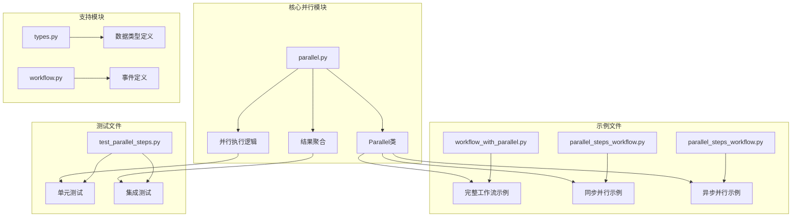
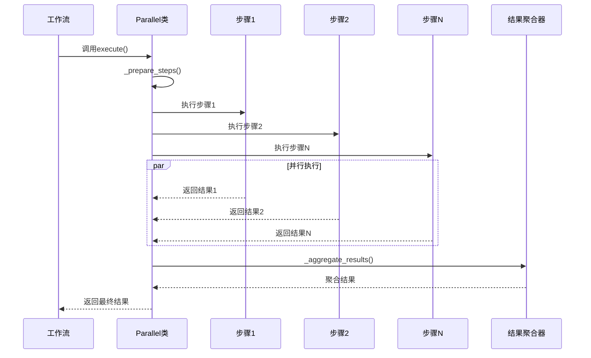
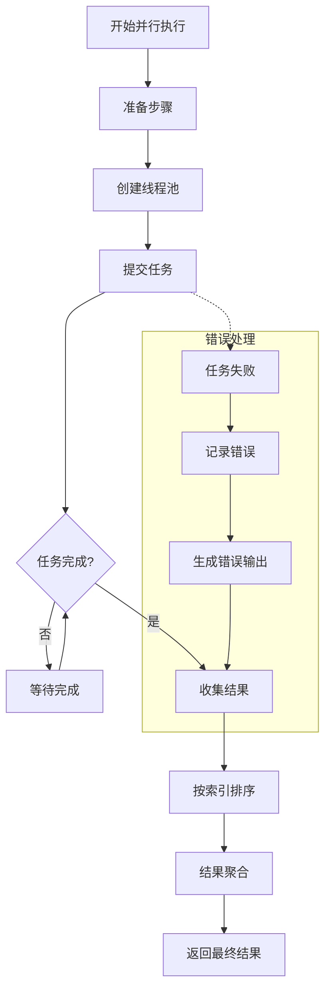
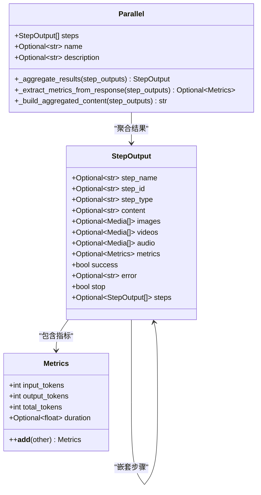
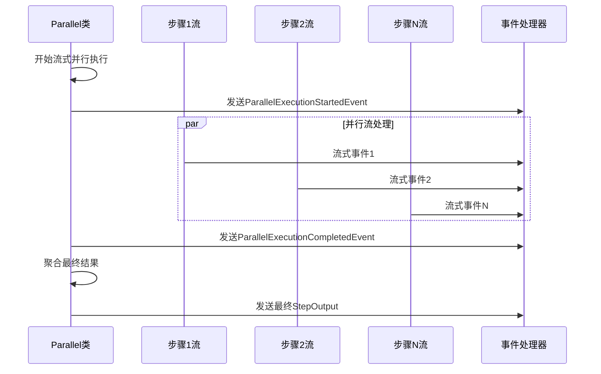
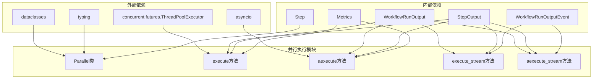

# 并行执行

<cite>
**本文档中引用的文件**
- [parallel.py](file://libs/agno/agno/workflow/parallel.py)
- [workflow_with_parallel.py](file://cookbook/agent_os/workflow/workflow_with_parallel.py)
- [parallel_steps_workflow.py](file://cookbook/workflows/_04_workflows_parallel_execution/sync/parallel_steps_workflow.py)
- [parallel_steps_workflow.py](file://cookbook/workflows/_04_workflows_parallel_execution/async/parallel_steps_workflow.py)
- [test_parallel_steps.py](file://libs/agno/tests/integration/workflows/test_parallel_steps.py)
- [types.py](file://libs/agno/agno/workflow/types.py)
- [workflow.py](file://libs/agno/agno/run/workflow.py)
</cite>

## 目录
1. [简介](#简介)
2. [项目结构](#项目结构)
3. [核心组件](#核心组件)
4. [架构概览](#架构概览)
5. [详细组件分析](#详细组件分析)
6. [依赖关系分析](#依赖关系分析)
7. [性能考虑](#性能考虑)
8. [故障排除指南](#故障排除指南)
9. [结论](#结论)

## 简介

Agno工作流中的并行执行功能是一个强大的特性，允许在单个工作流中同时执行多个步骤，从而显著提高整体执行效率。通过`Parallel`类，开发者可以轻松地将多个独立的任务并行化，实现真正的并发处理。

并行执行的核心优势在于：
- **时间节省**：多个任务同时运行，减少总执行时间
- **资源优化**：充分利用系统资源，避免等待时间
- **灵活性**：支持同步和异步两种执行模式
- **可扩展性**：支持流式处理和事件驱动架构

## 项目结构

并行执行功能主要分布在以下关键文件中：



**图表来源**
- [parallel.py](file://libs/agno/agno/workflow/parallel.py#L1-L690)
- [workflow_with_parallel.py](file://cookbook/agent_os/workflow/workflow_with_parallel.py#L1-L46)

## 核心组件

### Parallel类

`Parallel`类是并行执行的核心组件，负责协调多个步骤的同时执行：

```python
@dataclass
class Parallel:
    """并行执行多个步骤的列表"""
    
    steps: WorkflowSteps
    name: Optional[str] = None
    description: Optional[str] = None
```

该类提供了三种主要的执行方法：
- `execute()` - 同步执行所有步骤
- `execute_stream()` - 带流式支持的同步执行
- `aexecute()` - 异步执行所有步骤
- `aexecute_stream()` - 带流式支持的异步执行

**章节来源**
- [parallel.py](file://libs/agno/agno/workflow/parallel.py#L25-L40)

## 架构概览

并行执行的整体架构采用事件驱动的设计模式，确保高效的任务调度和结果聚合：



**图表来源**
- [parallel.py](file://libs/agno/agno/workflow/parallel.py#L205-L241)
- [parallel.py](file://libs/agno/agno/workflow/parallel.py#L243-L271)

## 详细组件分析

### 并行执行引擎

并行执行引擎使用线程池来管理并发任务：



**图表来源**
- [parallel.py](file://libs/agno/agno/workflow/parallel.py#L205-L241)

### 结果聚合机制

并行执行的结果聚合是一个复杂的过程，需要处理多种情况：



**图表来源**
- [parallel.py](file://libs/agno/agno/workflow/parallel.py#L85-L130)
- [types.py](file://libs/agno/agno/workflow/types.py#L280-L320)

### 错误处理和恢复

并行执行具备完善的错误处理机制：

```python
def execute_step_with_index(step_with_index):
    """执行单个步骤并保留原始索引"""
    idx, step = step_with_index
    try:
        step_result = step.execute(...)
        return idx, step_result
    except Exception as exc:
        parallel_step_name = getattr(step, "name", f"step_{idx}")
        logger.error(f"Parallel step {parallel_step_name} failed: {exc}")
        return (
            idx,
            StepOutput(
                step_name=parallel_step_name,
                content=f"Step {parallel_step_name} failed: {str(exc)}",
                success=False,
                error=str(exc),
            ),
        )
```

**章节来源**
- [parallel.py](file://libs/agno/agno/workflow/parallel.py#L205-L225)

### 流式处理支持

并行执行支持流式处理，提供实时的进度反馈：



**图表来源**
- [parallel.py](file://libs/agno/agno/workflow/parallel.py#L308-L333)
- [parallel.py](file://libs/agno/agno/workflow/parallel.py#L557-L582)

**章节来源**
- [parallel.py](file://libs/agno/agno/workflow/parallel.py#L243-L271)
- [parallel.py](file://libs/agno/agno/workflow/parallel.py#L302-L367)

### 异步并行执行

对于高并发场景，Parallel类还提供了完整的异步支持：

```python
async def aexecute_stream(
    self,
    step_input: StepInput,
    session_id: Optional[str] = None,
    user_id: Optional[str] = None,
    stream_intermediate_steps: bool = False,
    workflow_run_response: Optional[WorkflowRunOutput] = None,
    step_index: Optional[Union[int, tuple]] = None,
    store_executor_outputs: bool = True,
    session_state: Optional[Dict[str, Any]] = None,
    parent_step_id: Optional[str] = None,
) -> AsyncIterator[Union[WorkflowRunOutputEvent, TeamRunOutputEvent, RunOutputEvent, StepOutput]]:
```

**章节来源**
- [parallel.py](file://libs/agno/agno/workflow/parallel.py#L520-L553)
- [parallel.py](file://libs/agno/agno/workflow/parallel.py#L584-L644)

## 依赖关系分析

并行执行模块与Agno生态系统中的多个组件紧密集成：



**图表来源**
- [parallel.py](file://libs/agno/agno/workflow/parallel.py#L1-L20)

**章节来源**
- [parallel.py](file://libs/agno/agno/workflow/parallel.py#L1-L20)

## 性能考虑

### 线程池配置

并行执行使用ThreadPoolExecutor，默认最大工作线程数等于步骤数量：

```python
with ThreadPoolExecutor(max_workers=len(self.steps)) as executor:
    # 提交所有任务
    future_to_index = {
        executor.submit(execute_step_with_index, indexed_step): indexed_step[0]
        for indexed_step in indexed_steps
    }
```

### 内存管理

并行执行会为每个步骤创建独立的内存空间，需要注意：

1. **内存占用**：每个步骤都会有自己的输入输出缓冲区
2. **资源限制**：根据系统资源合理设置最大并行度
3. **垃圾回收**：及时清理不再需要的中间结果

### 性能优化建议

1. **合理设计并行粒度**：避免过度细分或过于粗放
2. **监控资源使用**：定期检查CPU和内存使用情况
3. **错误隔离**：确保一个步骤的失败不会影响其他步骤
4. **超时控制**：为长时间运行的步骤设置合理的超时时间

## 故障排除指南

### 常见问题及解决方案

#### 1. 死锁问题
**症状**：并行执行卡住，无法继续
**原因**：某些步骤之间存在循环依赖
**解决方案**：
- 检查步骤之间的依赖关系
- 使用`_prepare_steps()`方法验证步骤类型
- 避免在并行步骤中访问共享资源

#### 2. 内存溢出
**症状**：系统内存不足，程序崩溃
**原因**：并行步骤产生的中间结果过多
**解决方案**：
- 减少并行步骤的数量
- 实现结果流式处理
- 及时清理临时数据

#### 3. 异常传播
**症状**：部分步骤失败但不影响整体执行
**原因**：异常处理机制不完善
**解决方案**：
- 使用`try-except`块捕获异常
- 记录详细的错误信息
- 提供降级处理方案

### 调试技巧

1. **启用日志记录**：
```python
log_debug(f"Parallel Start: {self.name} ({len(self.steps)} steps)", center=True, symbol="=")
```

2. **监控执行状态**：
```python
log_debug(f"Parallel step {step_name} completed")
```

3. **验证结果完整性**：
```python
assert len(result.steps) == len(self.steps)
```

**章节来源**
- [parallel.py](file://libs/agno/agno/workflow/parallel.py#L205-L241)
- [test_parallel_steps.py](file://libs/agno/tests/integration/workflows/test_parallel_steps.py#L10-L20)

## 结论

Agno工作流的并行执行功能是一个设计精良、功能完备的并发处理系统。它不仅提供了简单易用的API，还具备强大的错误处理能力和灵活的扩展性。

### 主要优势

1. **高性能**：通过真正的并发执行显著提升性能
2. **易用性**：简洁的API设计，易于集成到现有工作流中
3. **可靠性**：完善的错误处理和恢复机制
4. **可扩展性**：支持同步、异步和流式等多种执行模式

### 最佳实践建议

1. **合理规划并行粒度**：根据任务特性和系统资源确定合适的并行度
2. **实施监控机制**：建立完善的性能监控和告警系统
3. **编写健壮的错误处理**：确保系统的稳定性和可靠性
4. **持续优化配置**：根据实际使用情况调整线程池大小等参数

通过合理使用并行执行功能，开发者可以构建高效、可靠的AI应用系统，充分发挥多核处理器的优势，实现真正的并发计算。