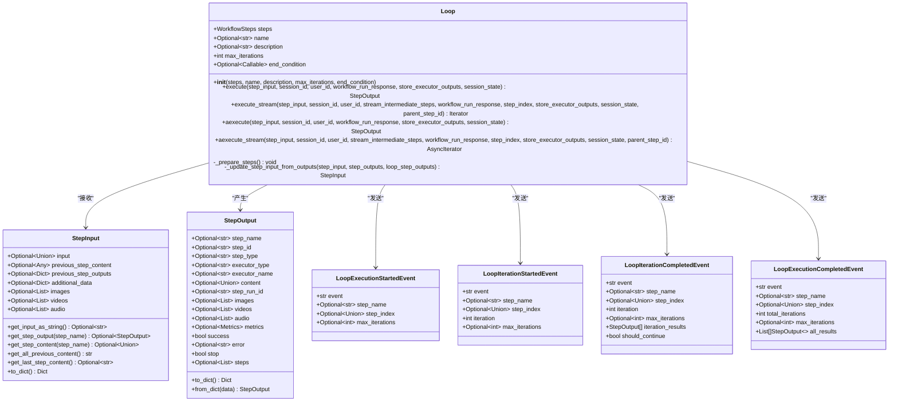
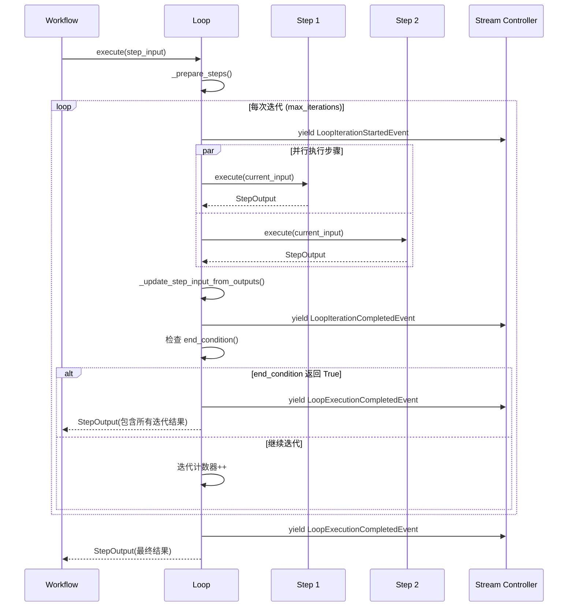
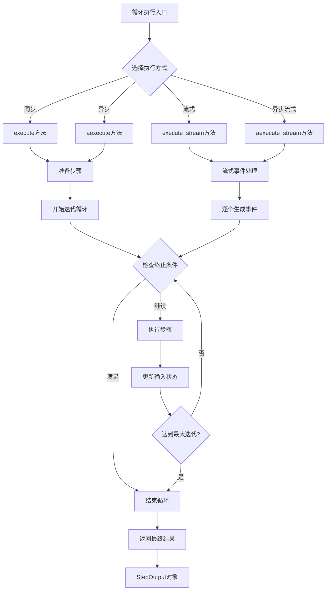
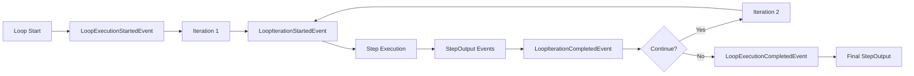

# Agno工作流中的循环执行

<cite>
**本文档引用的文件**
- [loop.py](file://libs/agno/agno/workflow/loop.py)
- [workflow_with_loop.py](file://cookbook/agent_os/workflow/workflow_with_loop.py)
- [early_stop_workflow_with_loop.py](file://cookbook/workflows/_06_advanced_concepts/_02_early_stopping/early_stop_workflow_with_loop.py)
- [test_loop_steps.py](file://libs/agno/tests/integration/workflows/test_loop_steps.py)
- [types.py](file://libs/agno/agno/workflow/types.py)
- [workflow.py](file://libs/agno/agno/run/workflow.py)
</cite>

## 目录
1. [简介](#简介)
2. [循环架构设计](#循环架构设计)
3. [核心组件分析](#核心组件分析)
4. [循环执行流程](#循环执行流程)
5. [示例应用](#示例应用)
6. [高级特性](#高级特性)
7. [性能考量](#性能考量)
8. [故障排除指南](#故障排除指南)
9. [最佳实践](#最佳实践)
10. [总结](#总结)

## 简介

Agno工作流系统提供了强大的循环执行功能，允许开发者创建需要重复执行步骤的工作流。循环执行支持基于计数（最大迭代次数）和条件（自定义结束条件函数）两种模式，为数据批处理、重试机制等场景提供了灵活的解决方案。

循环执行的核心优势包括：
- **灵活的终止控制**：支持基于内容的动态终止和固定次数的迭代
- **异步支持**：提供同步和异步执行选项
- **流式处理**：支持实时事件流和中间步骤输出
- **嵌套支持**：可以在循环中包含其他复杂步骤类型
- **状态管理**：自动管理循环内的状态传递和媒体文件处理

## 循环架构设计

### 核心类结构



**图表来源**
- [loop.py](file://libs/agno/agno/workflow/loop.py#L35-L60)
- [types.py](file://libs/agno/agno/workflow/types.py#L100-L200)
- [workflow.py](file://libs/agno/agno/run/workflow.py#L210-L250)

### 工作流集成



**图表来源**
- [loop.py](file://libs/agno/agno/workflow/loop.py#L126-L200)
- [workflow.py](file://libs/agno/agno/run/workflow.py#L210-L250)

**章节来源**
- [loop.py](file://libs/agno/agno/workflow/loop.py#L35-L60)
- [types.py](file://libs/agno/agno/workflow/types.py#L100-L200)

## 核心组件分析

### Loop类详解

Loop类是循环执行的核心组件，提供了完整的循环控制逻辑：

```python
@dataclass
class Loop:
    """A loop of steps that execute in order"""

    steps: WorkflowSteps
    name: Optional[str] = None
    description: Optional[str] = None
    max_iterations: int = 3  # 默认最大3次迭代
    end_condition: Optional[Callable[[List[StepOutput]], bool]] = None
```

#### 关键属性说明

- **steps**: 包含要循环执行的步骤列表，可以是任何有效的工作流步骤类型
- **name**: 循环的名称，用于日志记录和调试
- **description**: 循环的描述信息
- **max_iterations**: 最大迭代次数，默认为3次
- **end_condition**: 自定义结束条件函数，接受当前迭代的所有输出并返回布尔值

#### 执行方法对比



**图表来源**
- [loop.py](file://libs/agno/agno/workflow/loop.py#L126-L200)
- [loop.py](file://libs/agno/agno/workflow/loop.py#L400-L500)

**章节来源**
- [loop.py](file://libs/agno/agno/workflow/loop.py#L35-L60)
- [loop.py](file://libs/agno/agno/workflow/loop.py#L126-L200)

## 循环执行流程

### 基本执行逻辑

循环执行遵循以下基本流程：

1. **步骤准备阶段**：将原始步骤转换为标准化的Step对象
2. **迭代初始化**：设置迭代计数器和结果存储
3. **迭代循环**：重复执行步骤直到满足终止条件
4. **结果聚合**：将所有迭代的结果合并为最终输出

### 终止条件机制

循环支持两种终止方式：

#### 1. 基于计数的终止

```python
# 设置最大迭代次数
loop = Loop(
    name="Count-based Loop",
    steps=[step1, step2],
    max_iterations=5  # 最多执行5次
)
```

#### 2. 基于条件的终止

```python
def content_quality_check(outputs: List[StepOutput]) -> bool:
    """检查内容质量是否满足要求"""
    if not outputs:
        return False
    
    # 检查是否有足够长的内容
    for output in outputs:
        if output.content and len(output.content) > 500:
            return True
    return False

loop = Loop(
    name="Condition-based Loop",
    steps=[research_step, analysis_step],
    end_condition=content_quality_check,
    max_iterations=10
)
```

### 流式执行流程

```mermaid
sequenceDiagram
participant Client as 客户端
participant Loop as 循环执行器
participant Step as 步骤执行器
participant Event as 事件控制器
Client->>Loop : execute_stream(input)
Loop->>Event : yield LoopExecutionStartedEvent
loop 每次迭代
Loop->>Event : yield LoopIterationStartedEvent
Loop->>Step : 执行步骤1
Step-->>Loop : StepOutput
Loop->>Event : yield StepOutput
Loop->>Step : 执行步骤2
Step-->>Loop : StepOutput
Loop->>Event : yield StepOutput
alt 检查结束条件
Loop->>Loop : end_condition(iteration_results)
alt 条件满足
Loop->>Event : yield LoopIterationCompletedEvent(should_continue=False)
Loop->>Event : yield LoopExecutionCompletedEvent
Loop-->>Client : 最终StepOutput
else 继续迭代
Loop->>Event : yield LoopIterationCompletedEvent(should_continue=True)
Loop->>Loop : 迭代计数器++
end
end
end
```

**图表来源**
- [loop.py](file://libs/agno/agno/workflow/loop.py#L216-L350)

**章节来源**
- [loop.py](file://libs/agno/agno/workflow/loop.py#L126-L200)
- [loop.py](file://libs/agno/agno/workflow/loop.py#L216-L350)

## 示例应用

### 基础研究工作流

以下是一个典型的研究工作流示例，展示了如何使用循环进行持续的研究和分析：

```python
from agno.agent.agent import Agent
from agno.tools.duckduckgo import DuckDuckGoTools
from agno.tools.hackernews import HackerNewsTools
from agno.workflow.loop import Loop
from agno.workflow.step import Step
from agno.workflow.workflow import Workflow

# 创建研究代理
research_agent = Agent(
    name="Research Agent",
    role="Research specialist",
    tools=[HackerNewsTools(), DuckDuckGoTools()],
    instructions="You are a research specialist. Research the given topic thoroughly.",
    markdown=True,
)

# 创建内容生成代理
content_agent = Agent(
    name="Content Agent",
    role="Content creator",
    instructions="You are a content creator. Create engaging content based on research.",
    markdown=True,
)

# 创建研究步骤
research_hackernews_step = Step(
    name="Research HackerNews",
    agent=research_agent,
    description="Research trending topics on HackerNews",
)

research_web_step = Step(
    name="Research Web",
    agent=research_agent,
    description="Research additional information from web sources",
)

content_step = Step(
    name="Create Content",
    agent=content_agent,
    description="Create content based on research findings",
)

# 结束条件函数
def research_evaluator(outputs: List[StepOutput]) -> bool:
    """评估研究结果是否充分"""
    if not outputs:
        return False
    
    # 检查是否找到实质性内容
    for output in outputs:
        if output.content and len(output.content) > 200:
            print(f"✅ Research evaluation passed - found substantial content ({len(output.content)} chars)")
            return True
    
    print("❌ Research evaluation failed - need more substantial research")
    return False

# 创建包含循环的工作流
workflow = Workflow(
    name="research-and-content-workflow",
    description="Research topics in a loop until conditions are met, then create content",
    steps=[
        Loop(
            name="Research Loop",
            steps=[research_hackernews_step, research_web_step],
            end_condition=research_evaluator,
            max_iterations=3,  # 最多3次迭代
        ),
        content_step,
    ],
)
```

### 高级安全检查工作流

这个示例展示了如何在循环中集成安全检查机制：

```python
def safety_checker(step_input: StepInput) -> StepOutput:
    """安全检查器，在检测到敏感关键词时停止循环"""
    content = step_input.previous_step_content or ""
    
    # 模拟发现需要审查的敏感内容
    if "AI" in content or "machine learning" in content:
        return StepOutput(
            step_name="Safety Checker",
            content="🚨 SAFETY CONCERN DETECTED! Content contains sensitive AI-related information. Stopping research loop for review.",
            stop=True,  # 请求提前终止
        )
    else:
        return StepOutput(
            step_name="Safety Checker",
            content="✅ Safety check passed. Content is safe to continue.",
            stop=False,
        )

# 包含安全检查的循环
workflow = Workflow(
    name="Research with Safety Check Workflow",
    steps=[
        Loop(
            name="Research Loop with Safety",
            steps=[
                research_hackernews_step,  # 第1步：研究
                safety_check_step,  # 第2步：安全检查（可能在此处停止）
                research_web_step,  # 第3步：更多研究（仅当安全检查通过时）
            ],
            end_condition=research_evaluator,
            max_iterations=3,
        ),
        content_agent,
    ],
)
```

**章节来源**
- [workflow_with_loop.py](file://cookbook/agent_os/workflow/workflow_with_loop.py#L1-L104)
- [early_stop_workflow_with_loop.py](file://cookbook/workflows/_06_advanced_concepts/_02_early_stopping/early_stop_workflow_with_loop.py#L1-L119)

## 高级特性

### 异步循环执行

Agno支持完全异步的循环执行，适用于I/O密集型任务：

```python
async def async_research_step(step_input: StepInput) -> StepOutput:
    """异步研究步骤"""
    # 模拟异步网络请求
    await asyncio.sleep(1)
    return StepOutput(
        step_name="Async Research",
        content=f"Async research results for: {step_input.input}",
        success=True,
    )

# 异步循环
async_loop = Loop(
    name="Async Research Loop",
    steps=[async_research_step],
    end_condition=lambda outputs: len(outputs) >= 3,
    max_iterations=5,
)

# 异步执行
result = await async_loop.aexecute(step_input)
```

### 并行步骤支持

循环可以包含并行步骤，提高执行效率：

```python
from agno.workflow.parallel import Parallel

workflow = Workflow(
    name="Parallel Research Loop",
    steps=[
        Loop(
            name="Parallel Research Loop",
            steps=[
                Parallel(
                    research_hackernews_step,
                    research_web_step,
                    name="Parallel Research Steps"
                ),
                analysis_step,
            ],
            end_condition=content_quality_check,
            max_iterations=3,
        ),
    ],
)
```

### 嵌套循环支持

循环可以嵌套在其他复杂步骤中：

```python
nested_workflow = Workflow(
    name="Nested Loop Workflow",
    steps=[
        Condition(
            name="Conditional Research",
            evaluator=needs_more_research,
            steps=[
                Loop(
                    name="Deep Research Loop",
                    steps=[research_step, analysis_step],
                    end_condition=lambda outputs: len(outputs) >= 2,
                    max_iterations=3,
                )
            ],
        ),
    ],
)
```

### 流式事件处理



**图表来源**
- [loop.py](file://libs/agno/agno/workflow/loop.py#L216-L350)

**章节来源**
- [loop.py](file://libs/agno/agno/workflow/loop.py#L400-L500)
- [loop.py](file://libs/agno/agno/workflow/loop.py#L500-L600)

## 性能考量

### 内存管理

循环执行会累积所有迭代的结果，需要注意内存使用：

```python
# 对于大量迭代，考虑限制结果存储
def memory_efficient_condition(outputs: List[StepOutput]) -> bool:
    """高效的结束条件，避免累积过多结果"""
    if len(outputs) > 10:  # 限制最多10个结果
        return True
    
    # 检查最近几个结果的质量
    recent_outputs = outputs[-3:] if len(outputs) >= 3 else outputs
    return any(len(o.content or '') > 100 for o in recent_outputs)
```

### 迭代优化

```python
# 使用早期终止减少不必要的迭代
def optimized_research_condition(outputs: List[StepOutput]) -> bool:
    """优化的研究条件，优先检查最有可能成功的步骤"""
    if not outputs:
        return False
    
    # 先检查最新结果
    latest_output = outputs[-1]
    if latest_output.content and len(latest_output.content) > 500:
        return True
    
    # 如果有多个输出，快速检查
    if len(outputs) >= 3:
        return any(len(o.content or '') > 300 for o in outputs[-3:])
    
    return False
```

### 并发控制

对于高并发场景，建议使用外部锁机制：

```python
import asyncio
from threading import Lock

class ThreadSafeLoop(Loop):
    def __init__(self, *args, **kwargs):
        super().__init__(*args, **kwargs)
        self._lock = Lock()
    
    def execute(self, step_input, **kwargs):
        with self._lock:
            return super().execute(step_input, **kwargs)
```

## 故障排除指南

### 常见问题及解决方案

#### 1. 循环未按预期终止

**问题**：循环总是运行到最大迭代次数，即使满足结束条件

**解决方案**：
```python
def debug_end_condition(outputs: List[StepOutput]) -> bool:
    """调试用的结束条件，打印详细信息"""
    print(f"Debug - Current outputs count: {len(outputs)}")
    if not outputs:
        print("No outputs yet")
        return False
    
    for i, output in enumerate(outputs):
        print(f"Output {i}: length={len(output.content or '')}, stop={output.stop}")
    
    # 实际的结束条件逻辑
    result = any(len(o.content or '') > 200 for o in outputs)
    print(f"End condition result: {result}")
    return result
```

#### 2. 内存泄漏问题

**问题**：长时间运行的循环导致内存占用持续增长

**解决方案**：
```python
def memory_safe_loop(steps, max_iterations=10):
    """创建内存安全的循环"""
    return Loop(
        name="Memory Safe Loop",
        steps=steps,
        max_iterations=max_iterations,
        end_condition=lambda outputs: len(outputs) >= min(5, max_iterations)  # 限制结果数量
    )
```

#### 3. 异步循环超时

**问题**：异步循环执行时间过长

**解决方案**：
```python
import asyncio

async def timeout_loop(loop_instance, step_input, timeout=30):
    """带超时的异步循环执行"""
    try:
        return await asyncio.wait_for(
            loop_instance.aexecute(step_input),
            timeout=timeout
        )
    except asyncio.TimeoutError:
        raise TimeoutError(f"Loop execution timed out after {timeout} seconds")
```

### 调试技巧

#### 启用详细日志

```python
import logging
from agno.utils.log import logger

# 设置日志级别
logger.setLevel(logging.DEBUG)

# 在循环中添加调试信息
def debug_loop_condition(outputs: List[StepOutput]) -> bool:
    logger.debug(f"Loop iteration - outputs count: {len(outputs)}")
    if outputs:
        logger.debug(f"Last output length: {len(outputs[-1].content or '')}")
    return len(outputs) >= 3
```

#### 使用事件监控

```python
def monitor_loop_execution(workflow, input_data):
    """监控循环执行过程"""
    events = list(workflow.run(input=input_data, stream=True))
    
    for event in events:
        if hasattr(event, 'step_name'):
            print(f"Event: {event.event} - Step: {event.step_name}")
        elif hasattr(event, 'total_iterations'):
            print(f"Loop completed: {event.total_iterations} iterations")
```

**章节来源**
- [test_loop_steps.py](file://libs/agno/tests/integration/workflows/test_loop_steps.py#L1-L100)
- [loop.py](file://libs/agno/agno/workflow/loop.py#L126-L200)

## 最佳实践

### 设计原则

#### 1. 清晰的结束条件

```python
# 好的做法：明确的结束条件
def clear_end_condition(outputs: List[StepOutput]) -> bool:
    """清晰的结束条件，易于理解和维护"""
    if not outputs:
        return False
    
    # 明确的业务逻辑
    return any(
        len(output.content or '') > 300 and 
        "final result" in (output.content or "").lower()
        for output in outputs
    )

# 避免的做法：模糊的结束条件
def unclear_condition(outputs: List[StepOutput]) -> bool:
    """不推荐：难以理解的结束条件"""
    return len(outputs) > 0 and len(outputs) % 2 == 0
```

#### 2. 合理的迭代次数

```python
# 根据任务复杂度设置合理的最大迭代次数
class ResearchWorkflow:
    def __init__(self):
        self.research_loop = Loop(
            name="Research Loop",
            steps=[self.research_step, self.analysis_step],
            max_iterations=5,  # 根据经验设置
            end_condition=self.quality_check
        )
    
    def quality_check(self, outputs: List[StepOutput]) -> bool:
        """基于内容质量和长度的质量检查"""
        if len(outputs) < 2:  # 至少两个步骤才能判断质量
            return False
            
        # 检查最后两个步骤的质量
        recent_outputs = outputs[-2:]
        return all(len(o.content or '') > 200 for o in recent_outputs)
```

#### 3. 错误处理策略

```python
def robust_end_condition(outputs: List[StepOutput]) -> bool:
    """健壮的结束条件，包含错误处理"""
    try:
        if not outputs:
            return False
            
        # 检查每个输出的有效性
        valid_outputs = [o for o in outputs if o.success and o.content]
        if not valid_outputs:
            return False
            
        # 只检查有效输出的质量
        return any(len(o.content) > 100 for o in valid_outputs)
        
    except Exception as e:
        logger.warning(f"End condition evaluation failed: {e}")
        return False  # 失败时继续循环而不是终止
```

### 性能优化

#### 1. 缓存机制

```python
from functools import lru_cache

class CachedLoop(Loop):
    def __init__(self, *args, cache_size=100, **kwargs):
        super().__init__(*args, **kwargs)
        self._cache_size = cache_size
        self._condition_cache = {}
    
    def end_condition(self, outputs: List[StepOutput]) -> bool:
        """带缓存的结束条件"""
        # 使用输出的字符串表示作为缓存键
        output_key = hash(tuple(sorted(str(o.content)[:100]) for o in outputs))
        
        if output_key in self._condition_cache:
            return self._condition_cache[output_key]
        
        result = super().end_condition(outputs)
        self._condition_cache[output_key] = result
        
        # 保持缓存大小
        if len(self._condition_cache) > self._cache_size:
            # 删除最旧的条目
            oldest_key = next(iter(self._condition_cache))
            del self._condition_cache[oldest_key]
        
        return result
```

#### 2. 并行优化

```python
def optimize_parallel_loop(steps, max_iterations=3):
    """优化的并行循环配置"""
    return Loop(
        name="Optimized Parallel Loop",
        steps=[
            Parallel(*steps, name="Parallel Steps"),
            # 添加一个汇总步骤来减少结果数量
            lambda input: StepOutput(step_name="Summary", content="Results summarized")
        ],
        max_iterations=max_iterations,
        end_condition=lambda outputs: len(outputs) >= 2  # 减少结果数量
    )
```

### 安全考虑

#### 1. 输入验证

```python
def secure_end_condition(outputs: List[StepOutput]) -> bool:
    """安全的结束条件，验证所有输入"""
    try:
        # 验证输出格式
        for output in outputs:
            if not isinstance(output, StepOutput):
                raise ValueError(f"Invalid output type: {type(output)}")
            
            if not isinstance(output.content, (str, type(None))):
                raise ValueError(f"Invalid content type: {type(output.content)}")
        
        # 执行实际的结束条件逻辑
        return any(len(o.content or '') > 100 for o in outputs)
        
    except Exception as e:
        logger.error(f"Security validation failed: {e}")
        return False  # 安全第一，失败时继续循环
```

#### 2. 资源限制

```python
class ResourceLimitedLoop(Loop):
    def __init__(self, *args, max_memory_mb=100, **kwargs):
        super().__init__(*args, **kwargs)
        self.max_memory_mb = max_memory_mb
    
    def execute(self, step_input, **kwargs):
        """执行前检查内存使用"""
        import psutil
        process = psutil.Process()
        memory_usage_mb = process.memory_info().rss / 1024 / 1024
        
        if memory_usage_mb > self.max_memory_mb:
            raise MemoryError(f"Memory limit exceeded: {memory_usage_mb:.2f}MB > {self.max_memory_mb}MB")
        
        return super().execute(step_input, **kwargs)
```

## 总结

Agno工作流中的循环执行功能提供了强大而灵活的重复执行能力。通过合理的设计和实现，开发者可以构建出高效、可靠的数据处理和自动化工作流。

### 主要优势

1. **灵活性**：支持多种终止条件和执行模式
2. **可扩展性**：可以嵌套在复杂的步骤结构中
3. **可观测性**：提供完整的事件流和调试支持
4. **性能优化**：支持异步执行和流式处理

### 关键要点

- **结束条件设计**：清晰、可靠的结束条件是循环成功的关键
- **资源管理**：注意内存使用和并发控制
- **错误处理**：实现健壮的异常处理机制
- **监控调试**：充分利用事件流进行监控和调试

通过遵循最佳实践和合理的设计原则，Agno的循环执行功能可以成为构建复杂工作流的强大工具。