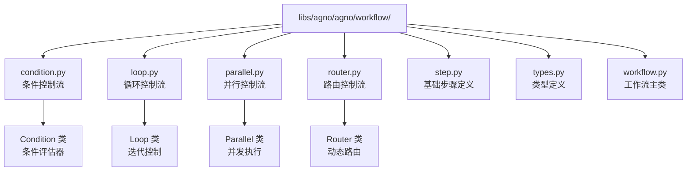
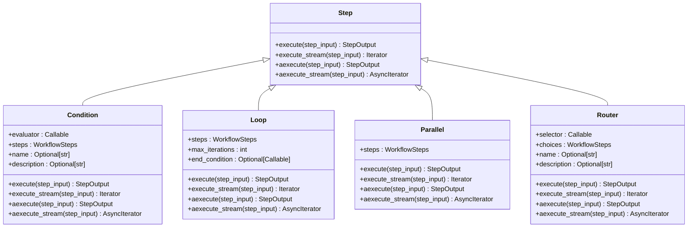
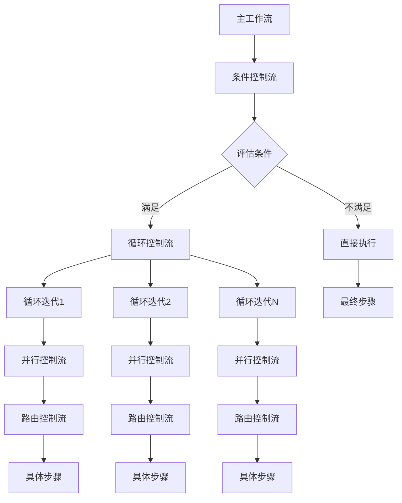

# Agno 工作流控制流

<cite>
**本文档中引用的文件**
- [condition.py](file://libs/agno/agno/workflow/condition.py)
- [loop.py](file://libs/agno/agno/workflow/loop.py)
- [parallel.py](file://libs/agno/agno/workflow/parallel.py)
- [router.py](file://libs/agno/agno/workflow/router.py)
- [workflow_with_conditional.py](file://cookbook/agent_os/workflow/workflow_with_conditional.py)
- [workflow_with_loop.py](file://cookbook/agent_os/workflow/workflow_with_loop.py)
- [workflow_with_parallel.py](file://cookbook/agent_os/workflow/workflow_with_parallel.py)
- [workflow_with_router.py](file://cookbook/agent_os/workflow/workflow_with_router.py)
- [test_mixed_steps.py](file://libs/agno/tests/integration/workflows/test_mixed_steps.py)
</cite>

## 目录
1. [简介](#简介)
2. [项目结构](#项目结构)
3. [核心控制流组件](#核心控制流组件)
4. [架构概览](#架构概览)
5. [详细组件分析](#详细组件分析)
6. [控制流组合使用](#控制流组合使用)
7. [性能考虑](#性能考虑)
8. [故障排除指南](#故障排除指南)
9. [结论](#结论)

## 简介

Agno 工作流控制系统提供了四种核心控制流机制：条件（Condition）、循环（Loop）、并行（Parallel）和路由（Router）。这些控制流允许开发者构建复杂的、动态的工作流程，能够根据输入数据、状态变化或外部条件自动调整执行路径。

每种控制流都有其独特的设计目的：
- **条件控制流**：基于布尔表达式决定是否执行特定步骤
- **循环控制流**：重复执行一组步骤直到满足终止条件
- **并行控制流**：同时执行多个独立的任务
- **路由控制流**：根据输入或状态动态选择执行路径

## 项目结构

Agno 工作流控制流的核心实现位于 `libs/agno/agno/workflow/` 目录下：



**图表来源**
- [condition.py](file://libs/agno/agno/workflow/condition.py#L1-L50)
- [loop.py](file://libs/agno/agno/workflow/loop.py#L1-L50)
- [parallel.py](file://libs/agno/agno/workflow/parallel.py#L1-L50)
- [router.py](file://libs/agno/agno/workflow/router.py#L1-L50)

## 核心控制流组件

### 控制流类型定义

所有控制流都遵循统一的接口规范，支持同步和异步执行，并提供完整的事件流支持：

```python
WorkflowSteps = List[
    Union[
        Callable[[StepInput], StepOutput],
        Step,
        "Steps",
        "Loop",
        "Parallel",
        "Condition",
        "Router",
    ]
]
```

这种灵活的设计允许任何控制流嵌套在其他控制流中，创建复杂的执行逻辑。

**章节来源**
- [condition.py](file://libs/agno/agno/workflow/condition.py#L18-L35)
- [loop.py](file://libs/agno/agno/workflow/loop.py#L18-L35)
- [parallel.py](file://libs/agno/agno/workflow/parallel.py#L18-L35)
- [router.py](file://libs/agno/agno/workflow/router.py#L18-L35)

## 架构概览

Agno 工作流控制流采用分层架构设计，每种控制流都继承自统一的基础执行模型：



**图表来源**
- [condition.py](file://libs/agno/agno/workflow/condition.py#L37-L50)
- [loop.py](file://libs/agno/agno/workflow/loop.py#L37-L50)
- [parallel.py](file://libs/agno/agno/workflow/parallel.py#L37-L50)
- [router.py](file://libs/agno/agno/workflow/router.py#L37-L50)

## 详细组件分析

### 条件控制流（Condition）

条件控制流是最基础的决策控制结构，它根据提供的评估函数决定是否执行一组步骤。

#### 设计目的

条件控制流用于实现基于布尔条件的分支逻辑，当评估结果为真时执行指定的步骤序列，否则跳过这些步骤。

#### 实现方式

```python
@dataclass
class Condition:
    evaluator: Union[Callable[[StepInput], bool], bool]
    steps: WorkflowSteps
    name: Optional[str] = None
    description: Optional[str] = None
```

#### 使用场景

1. **可选功能执行**：只有在满足特定条件时才执行某些步骤
2. **错误处理**：在检测到错误状态时执行恢复步骤
3. **资源检查**：验证系统状态后再执行操作

#### 代码示例

```python
def needs_fact_checking(step_input: StepInput) -> bool:
    """判断研究内容是否需要事实核查"""
    summary = step_input.previous_step_content or ""
    fact_indicators = ["study shows", "research indicates", "according to"]
    return any(indicator in summary.lower() for indicator in fact_indicators)

# 条件控制流使用
fact_check_condition = Condition(
    name="fact_check_condition",
    description="检查是否需要事实核查",
    evaluator=needs_fact_checking,
    steps=[fact_check_step],
)
```

**章节来源**
- [workflow_with_conditional.py](file://cookbook/agent_os/workflow/workflow_with_conditional.py#L40-L50)
- [condition.py](file://libs/agno/agno/workflow/condition.py#L37-L50)

### 循环控制流（Loop）

循环控制流实现了重复执行一组步骤的功能，支持最大迭代次数限制和自定义结束条件。

#### 设计目的

循环控制流用于处理需要多次尝试或迭代的场景，如数据收集、批量处理、持续监控等。

#### 实现方式

```python
@dataclass
class Loop:
    steps: WorkflowSteps
    name: Optional[str] = None
    description: Optional[str] = None
    max_iterations: int = 3
    end_condition: Optional[Callable[[List[StepOutput]], bool]] = None
```

#### 使用场景

1. **数据收集循环**：从多个来源收集数据直到满足质量标准
2. **重试机制**：对失败的操作进行多次重试
3. **进度监控**：定期检查状态直到达到目标

#### 代码示例

```python
def research_evaluator(outputs: List[StepOutput]) -> bool:
    """评估研究结果是否充分"""
    if not outputs:
        return False
    
    # 检查是否有实质性内容
    for output in outputs:
        if output.content and len(output.content) > 200:
            return True
    return False

# 循环控制流使用
research_loop = Loop(
    name="Research Loop",
    steps=[research_hackernews_step, research_web_step],
    end_condition=research_evaluator,
    max_iterations=3,
)
```

**章节来源**
- [workflow_with_loop.py](file://cookbook/agent_os/workflow/workflow_with_loop.py#L45-L60)
- [loop.py](file://libs/agno/agno/workflow/loop.py#L37-L50)

### 并行控制流（Parallel）

并行控制流允许同时执行多个独立的步骤，利用多线程或异步执行提高效率。

#### 设计目的

并行控制流用于处理可以独立完成且互不依赖的任务，最大化资源利用率。

#### 实现方式

```python
@dataclass
class Parallel:
    steps: WorkflowSteps
    name: Optional[str] = None
    description: Optional[str] = None
```

#### 使用场景

1. **多源数据收集**：同时从多个数据源获取信息
2. **并行计算**：同时执行多个计算密集型任务
3. **负载均衡**：将任务分配给多个处理单元

#### 代码示例

```python
# 并行控制流使用
parallel_research = Parallel(
    research_hn_step,
    research_web_step,
    name="Research Phase"
)

workflow = Workflow(
    name="content-creation-workflow",
    steps=[
        parallel_research,  # 并行执行两个研究步骤
        write_step,
        review_step,
    ],
)
```

**章节来源**
- [workflow_with_parallel.py](file://cookbook/agent_os/workflow/workflow_with_parallel.py#L25-L35)
- [parallel.py](file://libs/agno/agno/workflow/parallel.py#L37-L50)

### 路由控制流（Router）

路由控制流根据输入数据或状态动态选择要执行的步骤，实现真正的动态工作流。

#### 设计目的

路由控制流用于实现智能决策逻辑，根据不同的输入条件选择最优的执行路径。

#### 实现方式

```python
@dataclass
class Router:
    selector: Union[Callable[[StepInput], WorkflowSteps], Callable[[StepInput], Awaitable[WorkflowSteps]]]
    choices: WorkflowSteps
    name: Optional[str] = None
    description: Optional[str] = None
```

#### 使用场景

1. **智能路由**：根据主题类型选择不同的处理策略
2. **A/B 测试**：动态选择不同的算法或方法
3. **个性化服务**：根据用户特征提供定制化处理

#### 代码示例

```python
def research_router(step_input: StepInput) -> List[Step]:
    """根据主题类型选择研究方法"""
    topic = step_input.input.lower()
    tech_keywords = ["startup", "programming", "ai", "machine learning"]
    
    if any(keyword in topic for keyword in tech_keywords):
        return [research_hackernews]
    else:
        return [research_web]

# 路由控制流使用
intelligent_router = Router(
    name="research_strategy_router",
    selector=research_router,
    choices=[research_hackernews, research_web],
    description="根据主题智能选择研究方法",
)
```

**章节来源**
- [workflow_with_router.py](file://cookbook/agent_os/workflow/workflow_with_router.py#L55-L80)
- [router.py](file://libs/agno/agno/workflow/router.py#L37-L50)

## 控制流组合使用

Agno 的强大之处在于不同控制流可以无缝组合使用，创建复杂的执行逻辑。

### 嵌套组合示例



### 复杂工作流示例

```python
# 组合使用示例
workflow = Workflow(
    name="advanced-intelligent-workflow",
    steps=[
        # 主路由：根据输入类型选择处理策略
        Router(
            name="strategy_router",
            selector=strategy_selector,
            choices=[
                # 技术主题：使用 HackerNews 和深度分析
                Parallel(
                    Router(
                        name="tech_research_router",
                        selector=tech_research_selector,
                        choices=[hn_research, web_research],
                    ),
                    Loop(
                        name="deep_analysis_loop",
                        steps=[analysis_step, fact_check_step],
                        end_condition=quality_evaluator,
                        max_iterations=3,
                    ),
                    name="tech_research_phase",
                ),
                
                # 通用主题：使用综合网络研究
                Parallel(
                    web_research,
                    content_analysis,
                    name="general_research_phase",
                ),
            ],
        ),
        
        # 最终处理阶段
        Condition(
            name="final_review_condition",
            evaluator=needs_final_review,
            steps=[review_step, publish_step],
        ),
    ],
)
```

### 测试用例分析

通过测试用例可以看到各种组合的实际应用：

```python
def test_complex_combinations(shared_db):
    """测试复杂组合场景"""
    # 条件内含循环
    condition_with_loop = Condition(
        name="research_condition",
        evaluator=needs_more_research,
        steps=[
            Loop(
                name="deep_research",
                steps=[research_step, analysis_step],
                end_condition=lambda outputs: len(outputs) >= 2,
                max_iterations=3,
            )
        ],
    )
    
    # 循环内含并行
    loop_with_parallel = Loop(
        name="research_loop",
        steps=[
            Parallel(research_step, analysis_step, name="parallel_research"),
            summary_step,
        ],
        end_condition=lambda outputs: len(outputs) >= 2,
        max_iterations=3,
    )
```

**章节来源**
- [test_mixed_steps.py](file://libs/agno/tests/integration/workflows/test_mixed_steps.py#L100-L200)

## 性能考虑

### 执行效率优化

1. **异步执行**：所有控制流都支持异步执行，避免阻塞
2. **并发控制**：并行控制流使用线程池管理并发任务
3. **内存管理**：及时清理中间结果，避免内存泄漏

### 资源使用建议

1. **循环控制流**：设置合理的最大迭代次数，防止无限循环
2. **并行控制流**：根据系统资源调整并发数量
3. **条件控制流**：确保评估函数高效，避免复杂计算

### 监控和调试

```python
# 启用详细日志记录
import logging
logging.getLogger('agno.workflow').setLevel(logging.DEBUG)

# 使用事件流监控执行过程
for event in workflow.execute_stream(input_data):
    if isinstance(event, WorkflowRunOutputEvent):
        print(f"事件: {event}")
    elif isinstance(event, StepOutput):
        print(f"步骤输出: {event.content}")
```

## 故障排除指南

### 常见问题及解决方案

1. **死锁问题**
   - 检查循环控制流的结束条件
   - 避免并行步骤间的资源竞争

2. **性能问题**
   - 优化评估函数的计算复杂度
   - 合理设置并发数量

3. **内存泄漏**
   - 及时清理大型中间结果
   - 使用流式处理大数据集

### 调试技巧

```python
# 启用详细跟踪
workflow = Workflow(
    name="debug-workflow",
    steps=[...],
    debug=True,  # 启用调试模式
)

# 使用事件监听器
def event_listener(event):
    print(f"工作流事件: {type(event).__name__}")

workflow.add_event_listener(event_listener)
```

**章节来源**
- [condition.py](file://libs/agno/agno/workflow/condition.py#L600-L658)
- [loop.py](file://libs/agno/agno/workflow/loop.py#L600-L690)
- [parallel.py](file://libs/agno/agno/workflow/parallel.py#L600-L690)
- [router.py](file://libs/agno/agno/workflow/router.py#L550-L623)

## 结论

Agno 工作流控制流系统提供了强大而灵活的控制结构，支持从简单的条件判断到复杂的动态路由的各种需求。通过合理使用这四种核心控制流及其组合，开发者可以构建出适应性强、性能优异的工作流程系统。

关键优势包括：
- **模块化设计**：每个控制流都是独立的模块
- **高度可组合**：支持任意层级的嵌套组合
- **异步支持**：全面支持同步和异步执行
- **事件驱动**：提供完整的事件流支持
- **易于扩展**：遵循统一接口，便于添加新的控制流类型

通过深入理解这些控制流的设计原理和使用方法，开发者可以充分利用 Agno 的能力，构建出满足复杂业务需求的工作流程系统。