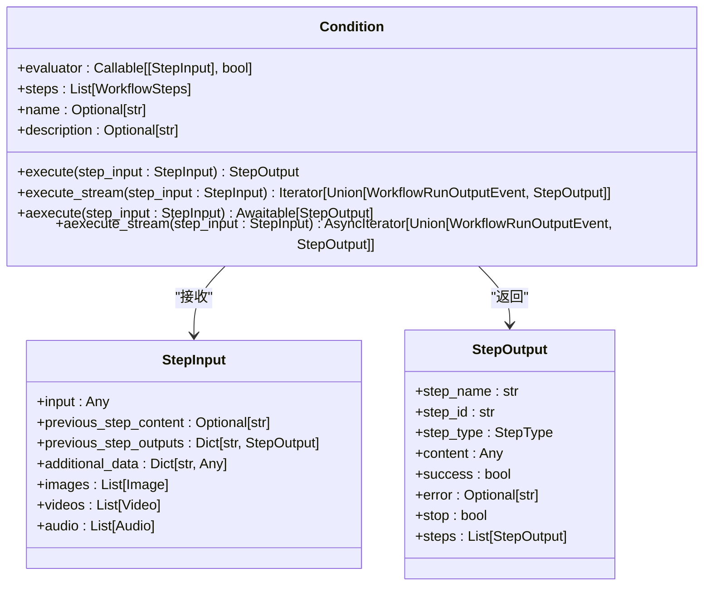
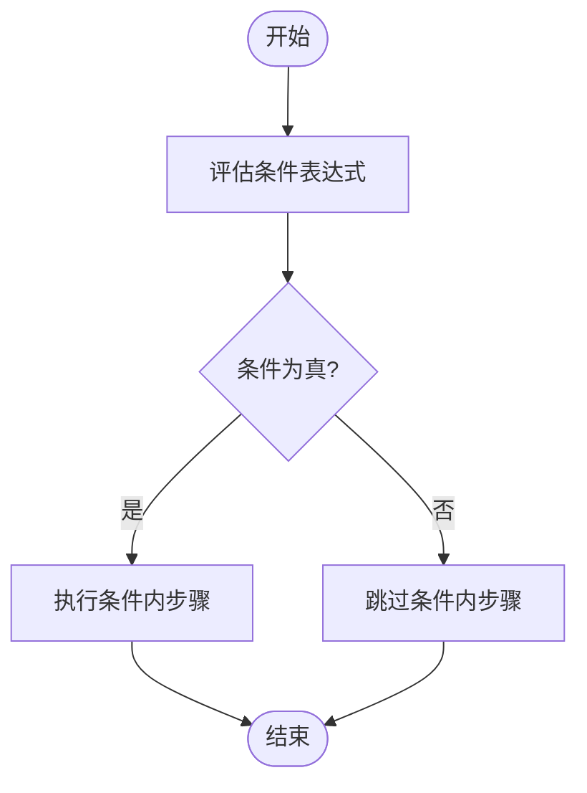
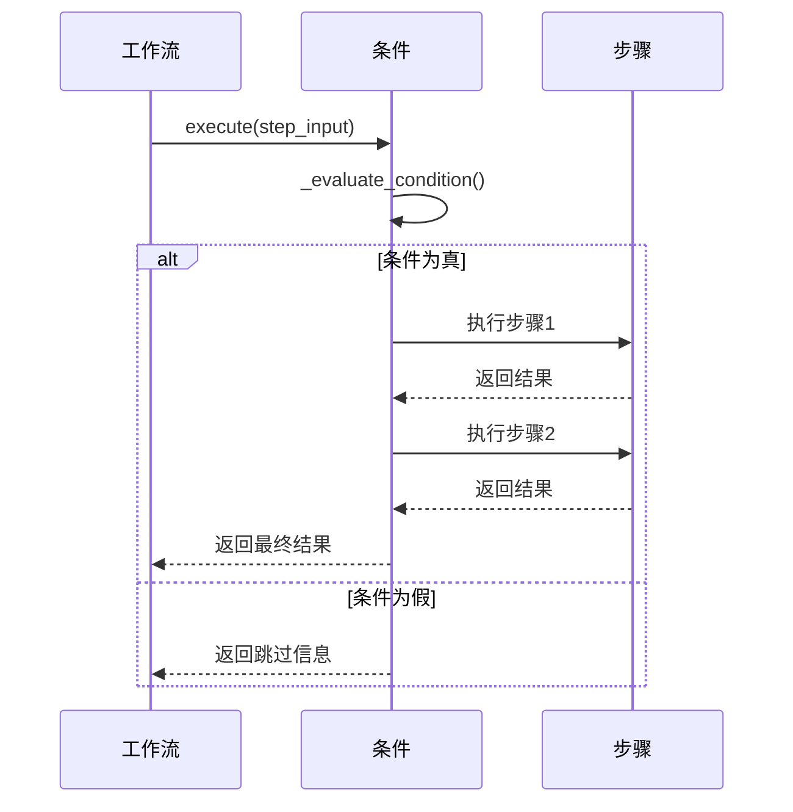
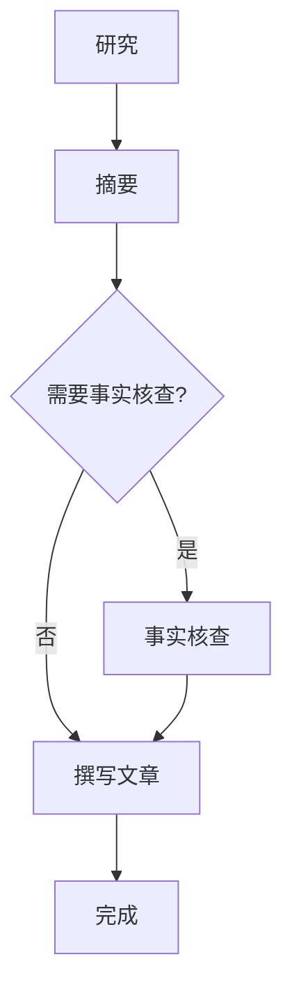
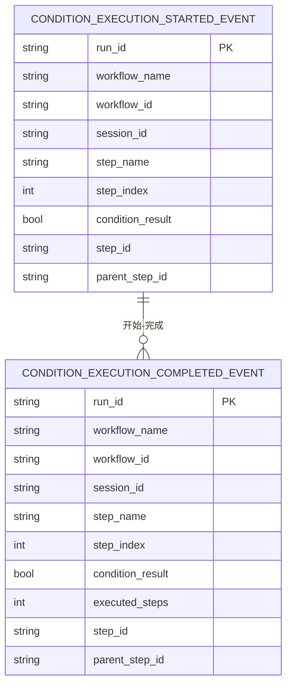

# 条件执行

<cite>
**本文档中引用的文件**  
- [condition.py](file://libs/agno/agno/workflow/condition.py)
- [workflow_with_conditional.py](file://cookbook/agent_os/workflow/workflow_with_conditional.py)
- [types.py](file://libs/agno/agno/workflow/types.py)
- [workflow.py](file://libs/agno/agno/workflow/workflow.py)
- [run/workflow.py](file://libs/agno/agno/run/workflow.py)
</cite>

## 目录
1. [简介](#简介)
2. [核心机制](#核心机制)
3. [条件判断实现](#条件判断实现)
4. [条件执行流程](#条件执行流程)
5. [实际应用示例](#实际应用示例)
6. [事件流与监控](#事件流与监控)
7. [最佳实践](#最佳实践)
8. [常见陷阱与解决方案](#常见陷阱与解决方案)
9. [总结](#总结)

## 简介
Agno工作流系统中的条件执行机制允许根据运行时数据动态决定是否执行特定步骤或步骤序列。这种机制在实现决策逻辑、错误处理和功能开关等场景中具有重要作用。通过`Condition`类和相关的评估器函数，开发者可以构建灵活的工作流，使其能够根据输入内容、上下文状态或其他运行时因素做出智能决策。

**Section sources**
- [workflow_with_conditional.py](file://cookbook/agent_os/workflow/workflow_with_conditional.py#L1-L117)

## 核心机制
条件执行的核心是`Condition`类，它封装了一个条件评估器和一组待执行的步骤。当条件评估为真时，这些步骤将按顺序执行；否则，它们将被跳过。这种设计模式使得工作流能够根据实际需求动态调整执行路径。

**Diagram sources**
- [condition.py](file://libs/agno/agno/workflow/condition.py#L1-L658)
- [types.py](file://libs/agno/agno/workflow/types.py#L470-L482)

**Section sources**
- [condition.py](file://libs/agno/agno/workflow/condition.py#L1-L658)

## 条件判断实现
条件判断通过`evaluator`属性实现，它可以是布尔值、同步函数或异步函数。评估器接收`StepInput`对象作为参数，该对象包含了当前工作流的输入数据和之前步骤的输出结果。评估器必须返回布尔值，以决定是否执行条件内的步骤。

**Diagram sources**
- [condition.py](file://libs/agno/agno/workflow/condition.py#L139-L175)
- [condition.py](file://libs/agno/agno/workflow/condition.py#L233-L267)

**Section sources**
- [condition.py](file://libs/agno/agno/workflow/condition.py#L139-L267)

## 条件执行流程
条件执行流程包括同步和异步两种模式，每种模式又支持流式和非流式处理。执行流程首先评估条件，然后根据评估结果决定是否执行内部步骤。所有步骤按顺序执行，并且每个步骤的输出可以作为下一个步骤的输入。

**Diagram sources**
- [condition.py](file://libs/agno/agno/workflow/condition.py#L139-L658)

**Section sources**
- [condition.py](file://libs/agno/agno/workflow/condition.py#L139-L658)

## 实际应用示例
在`workflow_with_conditional.py`示例中，展示了如何使用条件执行来实现智能事实核查。工作流首先进行研究和摘要，然后根据摘要内容判断是否需要事实核查。如果摘要中包含特定关键词（如"study shows"、"research indicates"等），则触发事实核查步骤。

**Diagram sources**
- [workflow_with_conditional.py](file://cookbook/agent_os/workflow/workflow_with_conditional.py#L1-L117)

**Section sources**
- [workflow_with_conditional.py](file://cookbook/agent_os/workflow/workflow_with_conditional.py#L1-L117)

## 事件流与监控
条件执行支持详细的事件流监控，包括开始和完成事件。这些事件可以帮助开发者跟踪工作流的执行状态，进行调试和性能分析。事件系统提供了丰富的上下文信息，如运行ID、工作流名称、步骤索引等。

**Diagram sources**
- [run/workflow.py](file://libs/agno/agno/run/workflow.py#L270-L469)

**Section sources**
- [run/workflow.py](file://libs/agno/agno/run/workflow.py#L270-L469)

## 最佳实践
1. **保持评估器简单高效**：条件评估器应该快速执行，避免复杂的计算或外部调用。
2. **使用有意义的名称**：为条件和步骤提供清晰的名称，便于调试和维护。
3. **处理异常情况**：确保评估器能够正确处理各种输入情况，避免意外错误。
4. **利用流式处理**：对于长时间运行的步骤，使用流式处理以提供更好的用户体验。
5. **监控执行状态**：利用事件系统监控条件执行的全过程，及时发现和解决问题。

**Section sources**
- [condition.py](file://libs/agno/agno/workflow/condition.py#L1-L658)
- [workflow_with_conditional.py](file://cookbook/agent_os/workflow/workflow_with_conditional.py#L1-L117)

## 常见陷阱与解决方案
1. **评估器返回非布尔值**：确保评估器始终返回布尔值，否则可能导致意外行为。
   - 解决方案：在评估器中添加类型检查和默认返回值。

2. **步骤间数据传递问题**：内部步骤的输出可能无法正确传递给后续步骤。
   - 解决方案：使用`_update_step_input_from_outputs`方法确保数据正确传递。

3. **异步执行的复杂性**：异步条件执行可能增加代码复杂性。
   - 解决方案：合理使用`async`和`await`关键字，确保异步操作的正确性。

4. **错误处理不充分**：单个步骤的失败可能导致整个条件执行中断。
   - 解决方案：在执行循环中添加异常处理，确保错误不会中断整个流程。

**Section sources**
- [condition.py](file://libs/agno/agno/workflow/condition.py#L1-L658)

## 总结
Agno工作流中的条件执行机制提供了一种强大而灵活的方式来控制工作流的执行路径。通过结合条件评估器和步骤序列，开发者可以构建智能、自适应的工作流系统。正确使用这一机制可以显著提高工作流的效率和可靠性，同时为复杂业务逻辑的实现提供了坚实的基础。