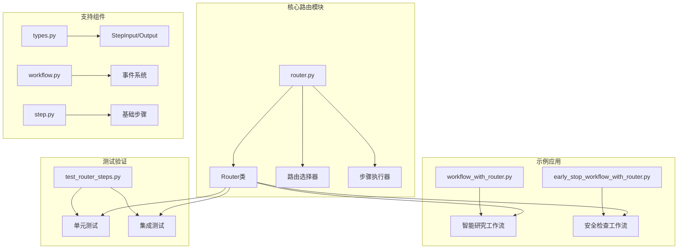
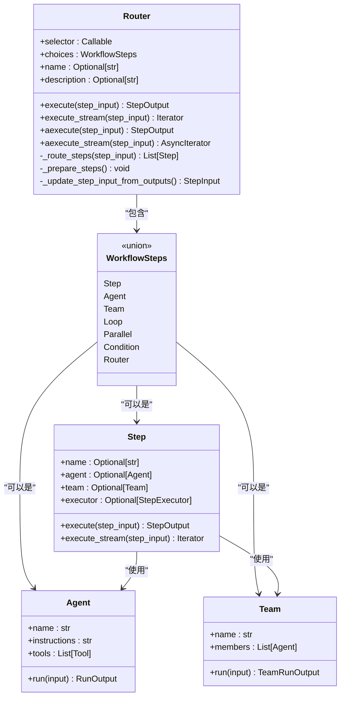
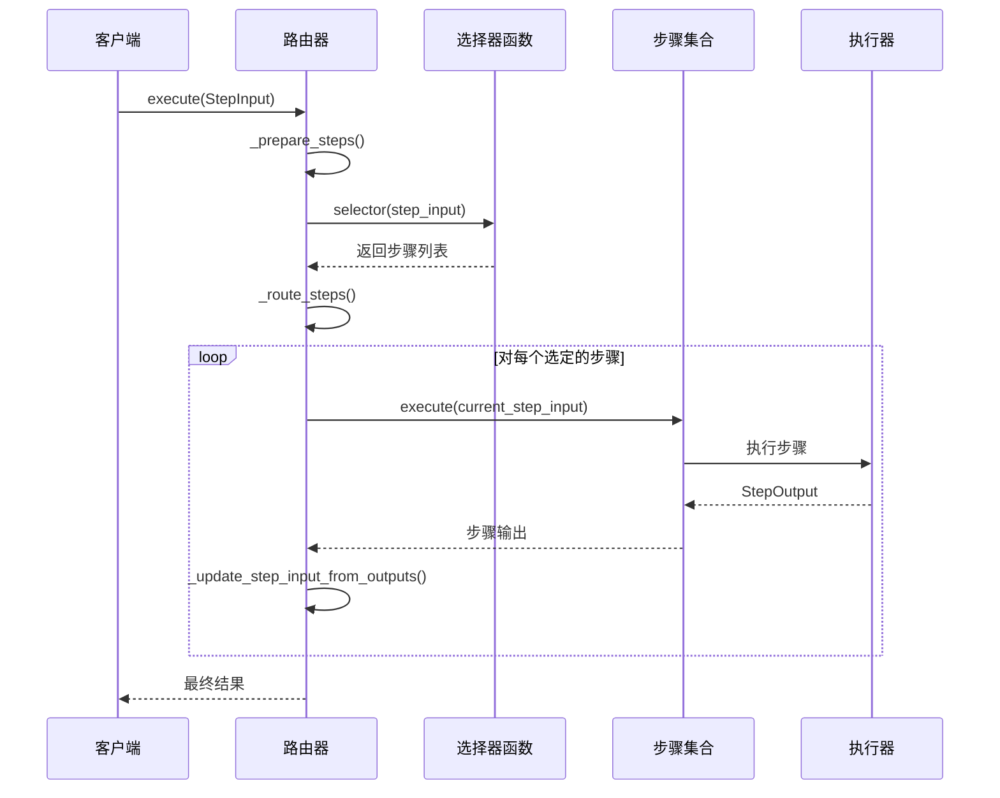
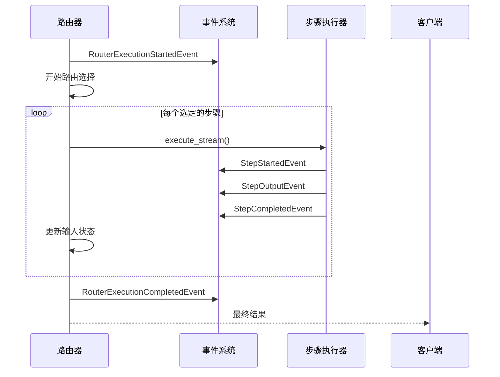
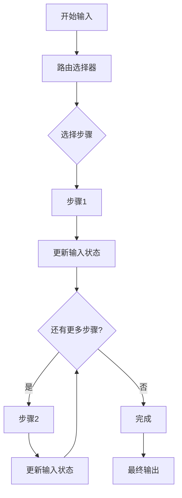
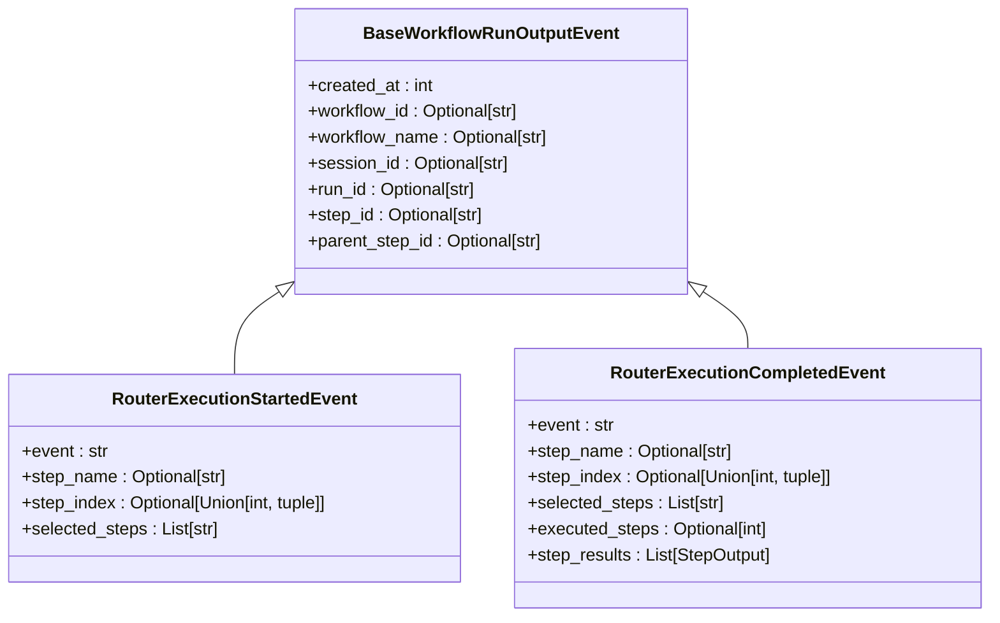
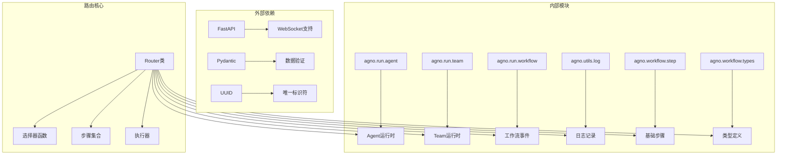

# 路由执行

<cite>
**本文档引用的文件**
- [router.py](file://libs/agno/agno/workflow/router.py)
- [workflow_with_router.py](file://cookbook/agent_os/workflow/workflow_with_router.py)
- [early_stop_workflow_with_router.py](file://cookbook/workflows/_06_advanced_concepts/_02_early_stopping/early_stop_workflow_with_router.py)
- [test_router_steps.py](file://libs/agno/tests/integration/workflows/test_router_steps.py)
- [types.py](file://libs/agno/agno/workflow/types.py)
- [workflow.py](file://libs/agno/agno/run/workflow.py)
- [step.py](file://libs/agno/agno/workflow/step.py)
</cite>

## 目录
1. [简介](#简介)
2. [项目结构](#项目结构)
3. [核心组件](#核心组件)
4. [架构概览](#架构概览)
5. [详细组件分析](#详细组件分析)
6. [依赖关系分析](#依赖关系分析)
7. [性能考虑](#性能考虑)
8. [故障排除指南](#故障排除指南)
9. [结论](#结论)

## 简介

Agno框架中的路由执行系统是一个强大的动态路由机制，它允许工作流根据输入数据或上下文信息智能地选择和执行不同的处理路径。路由执行的核心是`Router`类，它提供了灵活的条件路由功能，可以根据复杂的业务逻辑将执行流导向不同的步骤组合。

路由执行的主要优势包括：
- **动态决策能力**：根据输入内容自动选择最适合的处理路径
- **可扩展性**：支持多种类型的步骤（Agent、Team、自定义函数等）
- **早期终止**：支持在特定条件下提前终止工作流执行
- **流式处理**：提供完整的异步和流式执行支持
- **事件驱动**：完整的事件系统支持监控和调试

## 项目结构

路由执行功能主要分布在以下关键文件中：



**图表来源**
- [router.py](file://libs/agno/agno/workflow/router.py#L1-L623)
- [workflow_with_router.py](file://cookbook/agent_os/workflow/workflow_with_router.py#L1-L116)
- [early_stop_workflow_with_router.py](file://cookbook/workflows/_06_advanced_concepts/_02_early_stopping/early_stop_workflow_with_router.py#L1-L148)

## 核心组件

### Router类设计

`Router`类是路由执行系统的核心，它实现了以下关键功能：

```python
@dataclass
class Router:
    """动态选择要执行的步骤的路由器"""
    
    # 返回要执行的步骤的路由器函数
    selector: Union[
        Callable[[StepInput], Union[WorkflowSteps, List[WorkflowSteps]]],
        Callable[[StepInput], Awaitable[Union[WorkflowSteps, List[WorkflowSteps]]]],
    ]
    choices: WorkflowSteps  # 可选步骤列表
    
    name: Optional[str] = None
    description: Optional[str] = None
```

### 步骤类型系统

路由系统支持多种类型的步骤，通过统一的接口进行管理：



**图表来源**
- [router.py](file://libs/agno/agno/workflow/router.py#L25-L40)
- [step.py](file://libs/agno/agno/workflow/step.py#L25-L100)

**章节来源**
- [router.py](file://libs/agno/agno/workflow/router.py#L25-L40)
- [step.py](file://libs/agno/agno/workflow/step.py#L25-L100)

## 架构概览

路由执行系统采用事件驱动的架构模式，支持同步和异步两种执行方式：



**图表来源**
- [router.py](file://libs/agno/agno/workflow/router.py#L133-L200)
- [router.py](file://libs/agno/agno/workflow/router.py#L234-L300)

## 详细组件分析

### 路由选择器机制

路由选择器是路由系统的核心，它决定了哪些步骤应该被执行：

```python
def _route_steps(self, step_input: StepInput) -> List[Step]:
    """基于输入路由到适当的步骤"""
    if callable(self.selector):
        result = self.selector(step_input)
        
        # 根据返回类型处理结果
        if isinstance(result, Step):
            return [result]
        elif isinstance(result, list):
            return result
        else:
            logger.warning(f"Router function returned unexpected type: {type(result)}")
            return []
    
    return []
```

### 智能路由示例

以下是一个典型的智能路由实现：

```python
def research_router(step_input: StepInput) -> List[Step]:
    """基于输入主题智能选择研究方法"""
    topic = step_input.previous_step_content or step_input.input or ""
    topic = topic.lower()
    
    # 技术/创业关键词检测
    tech_keywords = [
        "startup", "programming", "ai", "machine learning",
        "software", "developer", "coding", "tech"
    ]
    
    if any(keyword in topic for keyword in tech_keywords):
        print(f"🔍 技术主题检测: 使用HackerNews研究 '{topic}'")
        return [research_hackernews]
    else:
        print(f"🌐 通用主题检测: 使用网络研究 '{topic}'")
        return [research_web]
```

### 流式执行支持

路由系统提供了完整的流式执行支持，包括事件驱动的进度跟踪：



**图表来源**
- [router.py](file://libs/agno/agno/workflow/router.py#L259-L275)
- [router.py](file://libs/agno/agno/workflow/router.py#L510-L520)

### 早期终止机制

路由系统支持在特定条件下提前终止整个工作流：

```python
def content_safety_checker(step_input: StepInput) -> StepOutput:
    """安全检查器，在检测到不当内容时停止路由器"""
    content = step_input.previous_step_content or ""
    
    # 检测不当内容
    if "controversial" in content.lower() or "sensitive" in content.lower():
        return StepOutput(
            step_name="Content Safety Checker",
            content="🚨 内容安全违规！研究包含争议或敏感材料。停止工作流以进行人工审查。",
            stop=True,  # 请求提前终止
        )
    else:
        return StepOutput(
            step_name="Content Safety Checker",
            content="✅ 内容安全检查通过。材料适合发布。",
            stop=False,
        )
```

### 步骤链式执行

路由系统支持步骤间的链式执行，前一个步骤的输出会自动传递给下一个步骤：



**图表来源**
- [router.py](file://libs/agno/agno/workflow/router.py#L172-L200)
- [router.py](file://libs/agno/agno/workflow/router.py#L520-L550)

**章节来源**
- [router.py](file://libs/agno/agno/workflow/router.py#L133-L200)
- [early_stop_workflow_with_router.py](file://cookbook/workflows/_06_advanced_concepts/_02_early_stopping/early_stop_workflow_with_router.py#L30-L80)

### 异步路由执行

路由系统完全支持异步执行，适用于高并发场景：

```python
async def aexecute(
    self,
    step_input: StepInput,
    session_id: Optional[str] = None,
    user_id: Optional[str] = None,
    workflow_run_response: Optional[WorkflowRunOutput] = None,
    session_state: Optional[Dict[str, Any]] = None,
    store_executor_outputs: bool = True,
) -> StepOutput:
    """异步执行路由器及其选定的步骤"""
    # 异步路由选择
    steps_to_execute = await self._aroute_steps(step_input)
    
    # 顺序执行步骤
    for step in steps_to_execute:
        step_output = await step.aexecute(...)
        # 处理输出...
```

### 事件系统集成

路由执行与Agno的完整事件系统集成，提供详细的执行跟踪：



**图表来源**
- [workflow.py](file://libs/agno/agno/run/workflow.py#L304-L320)

**章节来源**
- [router.py](file://libs/agno/agno/workflow/router.py#L400-L500)
- [workflow.py](file://libs/agno/agno/run/workflow.py#L304-L320)

## 依赖关系分析

路由执行系统的依赖关系展现了清晰的层次结构：



**图表来源**
- [router.py](file://libs/agno/agno/workflow/router.py#L1-L20)

**章节来源**
- [router.py](file://libs/agno/agno/workflow/router.py#L1-L20)

## 性能考虑

### 内存管理

路由系统采用了高效的内存管理策略：

1. **惰性加载**：步骤只在需要时才被准备和执行
2. **流式处理**：支持大容量数据的流式处理
3. **资源清理**：及时释放不再需要的资源

### 并发处理

路由系统支持多种并发模式：

- **异步执行**：完全异步的步骤执行
- **流式处理**：实时响应的流式输出
- **并行步骤**：支持并行执行多个步骤

### 错误处理

系统提供了完善的错误处理机制：

```python
try:
    step_output = step.execute(...)
except Exception as e:
    step_name = getattr(step, "name", f"step_{i}")
    logger.error(f"Router step {step_name} failed: {e}")
    error_output = StepOutput(
        step_name=step_name,
        content=f"Step {step_name} failed: {str(e)}",
        success=False,
        error=str(e),
    )
    all_results.append(error_output)
    break
```

## 故障排除指南

### 常见问题及解决方案

1. **路由选择器返回无效类型**
   - 确保选择器函数返回`Step`对象或`Step`对象列表
   - 检查选择器函数的返回值类型

2. **步骤执行失败**
   - 检查步骤配置是否正确
   - 验证步骤依赖项是否存在

3. **流式执行中断**
   - 确保所有步骤都支持流式执行
   - 检查事件系统的配置

### 调试技巧

1. **启用详细日志**：设置日志级别为DEBUG
2. **使用事件监听**：监听路由执行事件
3. **检查中间状态**：验证步骤间的数据传递

**章节来源**
- [router.py](file://libs/agno/agno/workflow/router.py#L172-L200)
- [test_router_steps.py](file://libs/agno/tests/integration/workflows/test_router_steps.py#L80-L120)

## 结论

Agno框架的路由执行系统提供了一个强大而灵活的动态路由解决方案。通过`Router`类，开发者可以创建智能的工作流，根据输入内容或上下文信息自动选择最适合的处理路径。

### 主要优势

1. **灵活性**：支持多种类型的步骤和复杂的路由逻辑
2. **可扩展性**：易于添加新的步骤类型和路由策略
3. **可靠性**：完善的错误处理和恢复机制
4. **可观测性**：完整的事件系统支持监控和调试
5. **性能**：支持异步和流式执行，适应高并发场景

### 最佳实践建议

1. **设计简洁的选择器**：保持路由逻辑简单明了
2. **合理使用早期终止**：在适当的地方实现安全检查
3. **充分利用事件系统**：使用事件进行监控和调试
4. **优化步骤链**：合理安排步骤顺序以提高效率
5. **实施错误处理**：为每个步骤配置适当的错误处理策略

路由执行系统为Agno框架提供了强大的工作流编排能力，使得构建复杂、智能的应用程序变得更加简单和高效。