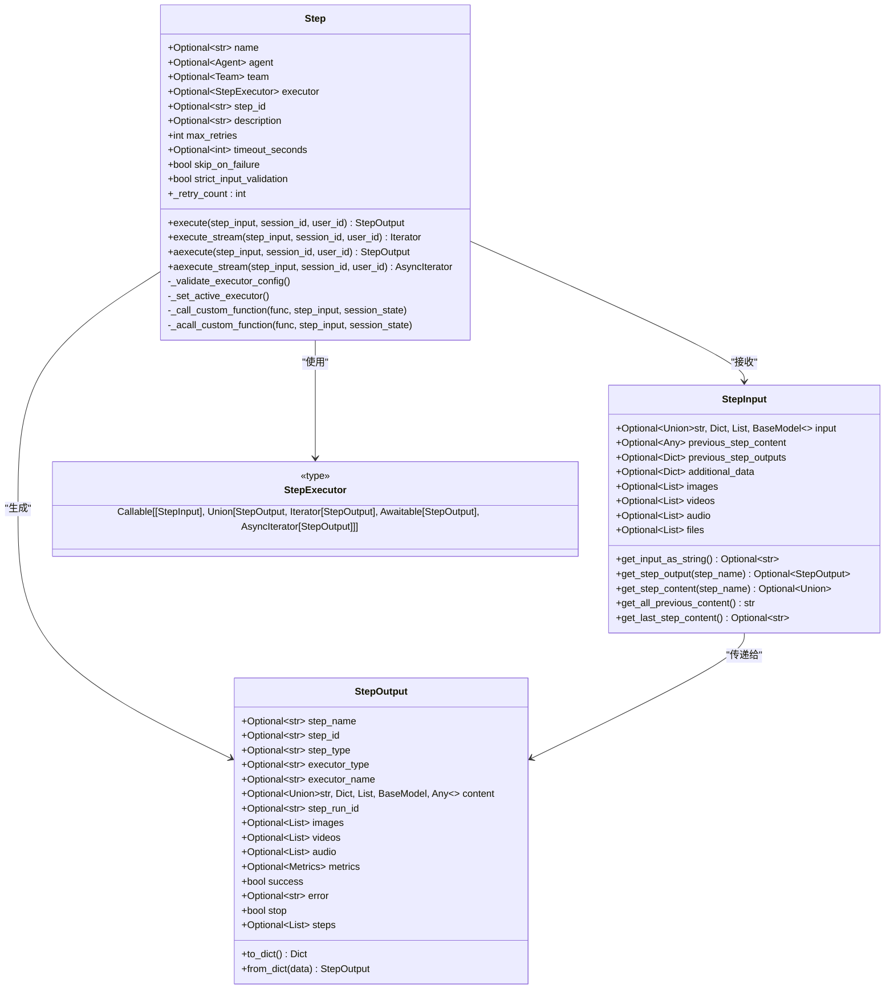

# 步骤定义

<cite>
**本文档引用的文件**
- [step.py](file://libs/agno/agno/workflow/step.py)
- [types.py](file://libs/agno/agno/workflow/types.py)
- [steps.py](file://libs/agno/agno/workflow/steps.py)
- [workflow.py](file://libs/agno/agno/workflow/workflow.py)
- [workflow_with_steps.py](file://cookbook/agent_os/workflow/workflow_with_steps.py)
- [workflow_with_custom_function.py](file://cookbook/agent_os/workflow/workflow_with_custom_function.py)
- [workflow_with_input_schema.py](file://cookbook/agent_os/workflow/workflow_with_input_schema.py)
- [workflow_with_nested_steps.py](file://cookbook/agent_os/workflow/workflow_with_nested_steps.py)
- [workflow_with_conditional.py](file://cookbook/agent_os/workflow/workflow_with_conditional.py)
- [workflow_with_parallel.py](file://cookbook/agent_os/workflow/workflow_with_parallel.py)
</cite>

## 目录
1. [简介](#简介)
2. [Step 类概述](#step-类概述)
3. [核心组件分析](#核心组件分析)
4. [输入和输出模式](#输入和输出模式)
5. [步骤配置选项](#步骤配置选项)
6. [执行器类型](#执行器类型)
7. [实际代码示例](#实际代码示例)
8. [高级用法](#高级用法)
9. [错误处理和重试机制](#错误处理和重试机制)
10. [性能考虑](#性能考虑)
11. [故障排除指南](#故障排除指南)
12. [总结](#总结)

## 简介

在 Agno 工作流系统中，`Step` 类是构建工作流程的基本单元。它提供了一种灵活且强大的方式来封装函数、智能体（Agent）或团队（Team）作为工作流中的独立步骤。每个步骤都可以配置不同的执行器、输入输出模式、重试策略和超时设置，从而实现复杂的工作流程自动化。

## Step 类概述

`Step` 类是一个数据类，代表工作流中的单个执行单元。它支持三种主要的执行器类型：智能体、团队和自定义函数。这种设计使得开发者可以轻松地将各种类型的计算逻辑集成到工作流中。



**图表来源**
- [step.py](file://libs/agno/agno/workflow/step.py#L30-L100)
- [types.py](file://libs/agno/agno/workflow/types.py#L20-L150)

**章节来源**
- [step.py](file://libs/agno/agno/workflow/step.py#L30-L100)
- [types.py](file://libs/agno/agno/workflow/types.py#L20-L150)

## 核心组件分析

### Step 类初始化

`Step` 类的构造函数提供了灵活的配置选项，允许开发者根据需要选择不同的执行器类型：

```python
def __init__(
    self,
    name: Optional[str] = None,
    agent: Optional[Agent] = None,
    team: Optional[Team] = None,
    executor: Optional[StepExecutor] = None,
    step_id: Optional[str] = None,
    description: Optional[str] = None,
    max_retries: int = 3,
    timeout_seconds: Optional[int] = None,
    skip_on_failure: bool = False,
    strict_input_validation: bool = False,
):
```

### 执行器验证

`Step` 类确保每次只能配置一种执行器类型，这通过 `_validate_executor_config()` 方法实现：

```python
def _validate_executor_config(self):
    """验证只提供了一个执行器类型"""
    executor_count = sum([
        self.agent is not None,
        self.team is not None,
        self.executor is not None,
    ])

    if executor_count == 0:
        raise ValueError(f"Step '{self.name}' 必须有一个执行器: agent=, team=, 或 executor=")

    if executor_count > 1:
        raise ValueError(f"Step '{self.name}' 只能有一个执行器类型")
```

**章节来源**
- [step.py](file://libs/agno/agno/workflow/step.py#L52-L100)

## 输入和输出模式

### StepInput 结构

`StepInput` 类定义了步骤执行所需的所有输入数据，支持多种数据格式和媒体类型：

```python
@dataclass
class StepInput:
    """步骤执行的输入数据"""

    input: Optional[Union[str, Dict[str, Any], List[Any], BaseModel]] = None
    previous_step_content: Optional[Any] = None
    previous_step_outputs: Optional[Dict[str, "StepOutput"]] = None
    additional_data: Optional[Dict[str, Any]] = None
    images: Optional[List[Image]] = None
    videos: Optional[List[Video]] = None
    audio: Optional[List[Audio]] = None
    files: Optional[List[File]] = None
```

### StepOutput 结构

`StepOutput` 类封装了步骤执行的结果，支持丰富的输出格式：

```python
@dataclass
class StepOutput:
    """步骤执行的输出数据"""

    step_name: Optional[str] = None
    step_id: Optional[str] = None
    step_type: Optional[str] = None
    executor_type: Optional[str] = None
    executor_name: Optional[str] = None
    content: Optional[Union[str, Dict[str, Any], List[Any], BaseModel, Any]] = None
    step_run_id: Optional[str] = None
    images: Optional[List[Image]] = None
    videos: Optional[List[Video]] = None
    audio: Optional[List[Audio]] = None
    files: Optional[List[File]] = None
    metrics: Optional[Metrics] = None
    success: bool = True
    error: Optional[str] = None
    stop: bool = False
    steps: Optional[List["StepOutput"]] = None
```

### Pydantic 模型支持

`StepInput` 支持 Pydantic 模型作为输入，提供了强类型的结构化输入：

```python
def get_input_as_string(self) -> Optional[str]:
    """将输入转换为字符串表示"""
    if self.input is None:
        return None

    if isinstance(self.input, str):
        return self.input
    elif isinstance(self.input, BaseModel):
        return self.input.model_dump_json(indent=2, exclude_none=True)
    elif isinstance(self.input, (dict, list)):
        import json
        return json.dumps(self.input, indent=2, default=str)
    else:
        return str(self.input)
```

**章节来源**
- [types.py](file://libs/agno/agno/workflow/types.py#L20-L200)

## 步骤配置选项

### 基本配置

每个 `Step` 实例都支持以下基本配置选项：

- **名称和描述**：为步骤提供可读的标识和说明
- **唯一标识符**：自动或手动指定的步骤 ID
- **重试次数**：默认 3 次失败重试
- **超时设置**：可选的执行超时限制
- **失败处理**：是否跳过失败而不中断整个工作流

### 高级配置

```python
# 创建具有高级配置的步骤
advanced_step = Step(
    name="advanced_step",
    agent=smart_agent,
    max_retries=5,  # 增加重试次数
    timeout_seconds=300,  # 设置超时时间为 5 分钟
    skip_on_failure=True,  # 失败时跳过而不是中断
    strict_input_validation=True,  # 启用严格输入验证
    description="这是一个高级配置的步骤"
)
```

### 输入验证模式

`strict_input_validation` 参数控制输入验证的严格程度：

- **False（默认）**：仅发出警告但继续执行
- **True**：严格验证，输入缺失时抛出异常

**章节来源**
- [step.py](file://libs/agno/agno/workflow/step.py#L52-L100)

## 执行器类型

### 1. 智能体执行器

使用预定义的智能体作为步骤执行器：

```python
research_agent = Agent(
    name="Research Agent",
    model=OpenAIChat(id="gpt-4o-mini"),
    tools=[DuckDuckGoTools()],
    instructions="研究给定主题并提供关键事实和洞察。",
)

research_step = Step(
    name="research",
    agent=research_agent,
    description="研究主题并收集信息",
)
```

### 2. 团队执行器

使用团队协作完成复杂任务：

```python
research_team = Team(
    name="Research Team",
    members=[research_agent, web_agent],
    instructions="分析内容并创建全面的社交媒体策略",
)

team_step = Step(
    name="team_analysis",
    team=research_team,
    description="团队协作分析",
)
```

### 3. 自定义函数执行器

使用 Python 函数作为步骤执行器，支持同步和异步执行：

```python
def custom_content_planning_function(step_input: StepInput) -> StepOutput:
    """
    带上下文感知的智能内容规划自定义函数
    """
    message = step_input.input
    previous_step_content = step_input.previous_step_content

    # 创建智能规划提示
    planning_prompt = f"""
        战略内容规划请求：
        
        核心主题: {message}
        
        研究结果: {previous_step_content[:500] if previous_step_content else "无研究结果"}
        
        规划要求:
        1. 基于研究创建全面的内容策略
        2. 有效利用研究发现
        3. 识别内容格式和渠道
        4. 提供时间线和优先级建议
        
        请创建详细、可操作的内容计划。
    """

    try:
        response = content_planner.run(planning_prompt)
        
        enhanced_content = f"""
            ## 战略内容计划
            
            **规划主题:** {message}
            
            **研究整合:** {"✓ 基于研究" if previous_step_content else "✗ 无研究基础"}
            
            **内容策略:**
            {response.content}
            
            **自定义规划增强:**
            - 研究整合: {"高" if previous_step_content else "基线"}
            - 战略对齐: 针对多渠道分发优化
            - 执行就绪: 包含详细行动项
        """.strip()

        return StepOutput(content=enhanced_content)

    except Exception as e:
        return StepOutput(
            content=f"自定义内容规划失败: {str(e)}",
            success=False,
        )
```

### 4. 异步执行器

支持异步函数执行，适用于 I/O 密集型任务：

```python
async def async_data_processor(step_input: StepInput) -> StepOutput:
    """异步数据处理函数"""
    # 异步数据库查询
    results = await database.query_async(step_input.input)
    
    # 异步文件处理
    processed_data = await process_files_async(results)
    
    return StepOutput(content=processed_data)
```

**章节来源**
- [workflow_with_steps.py](file://cookbook/agent_os/workflow/workflow_with_steps.py#L15-L50)
- [workflow_with_custom_function.py](file://cookbook/agent_os/workflow/workflow_with_custom_function.py#L40-L100)

## 实际代码示例

### 基础步骤定义

```python
from agno.agent.agent import Agent
from agno.workflow.step import Step
from agno.models.openai.chat import OpenAIChat

# 定义智能体
researcher = Agent(
    name="Research Agent",
    model=OpenAIChat(id="gpt-4o-mini"),
    instructions="研究给定主题并提供关键事实和洞察。",
)

# 创建基础步骤
research_step = Step(
    name="research",
    agent=researcher,
    description="研究主题并收集信息",
)
```

### 使用输入模式的步骤

```python
from pydantic import BaseModel, Field
from typing import List

class ResearchTopic(BaseModel):
    """结构化的研究主题，包含特定要求"""

    topic: str
    focus_areas: List[str] = Field(description="要关注的具体领域")
    target_audience: str = Field(description="这是为谁准备的研究")
    sources_required: int = Field(description="需要的资料数量", default=5)

# 使用输入模式的步骤
research_step = Step(
    name="research",
    agent=researcher,
)

content_planning_step = Step(
    name="content_planning",
    agent=content_planner,
)

# 在工作流中使用输入模式
workflow = Workflow(
    name="Content Creation Workflow",
    steps=[research_step, content_planning_step],
    input_schema=ResearchTopic,  # 设置输入模式
)
```

### 复杂函数步骤

```python
def intelligent_content_analysis(step_input: StepInput) -> StepOutput:
    """
    智能内容分析函数
    
    接收前一步骤的输出，并基于上下文进行深度分析
    """
    previous_content = step_input.get_last_step_content()
    current_input = step_input.input
    
    # 分析内容质量
    quality_score = analyze_content_quality(previous_content)
    
    # 生成分析报告
    analysis_report = f"""
    内容分析报告：
    
    输入内容：{current_input}
    上一步输出：{previous_content[:200] if previous_content else "无"}
    
    质量评分：{quality_score}/100
    
    分析结论：
    {'内容丰富且相关' if quality_score > 70 else '需要改进'}
    {'适合目标受众' if quality_score > 60 else '需要调整'}
    """
    
    return StepOutput(
        content=analysis_report,
        success=True,
        metrics=Metrics(
            quality=quality_score,
            processing_time=analyze_content_quality.__name__
        )
    )
```

**章节来源**
- [workflow_with_steps.py](file://cookbook/agent_os/workflow/workflow_with_steps.py#L15-L77)
- [workflow_with_input_schema.py](file://cookbook/agent_os/workflow/workflow_with_input_schema.py#L15-L88)

## 高级用法

### 条件执行步骤

```python
def needs_fact_checking(step_input: StepInput) -> bool:
    """确定研究是否包含需要事实核查的声明"""
    summary = step_input.previous_step_content or ""
    
    # 查找暗示事实声明的关键字
    fact_indicators = [
        "研究表明",
        "研究显示",
        "根据",
        "统计数据",
        "调查",
        "报告",
        "百万",
        "十亿",
        "百分比",
        "%",
        "增加",
        "减少",
    ]
    
    return any(indicator in summary.lower() for indicator in fact_indicators)

# 条件执行步骤
fact_check_step = Step(
    name="fact_check",
    description="验证事实和声明",
    agent=fact_checker,
)

conditional_step = Condition(
    name="fact_check_condition",
    description="检查是否需要事实核查",
    evaluator=needs_fact_checking,
    steps=[fact_check_step],
)
```

### 并行执行步骤

```python
# 创建多个并行步骤
research_hn_step = Step(name="Research HackerNews", agent=researcher)
research_web_step = Step(name="Research Web", agent=researcher)
write_step = Step(name="Write Article", agent=writer)

# 并行执行
parallel_workflow = Workflow(
    name="parallel_research",
    steps=[
        Parallel(
            research_hn_step, 
            research_web_step, 
            name="Research Phase"
        ),
        write_step,
    ],
)
```

### 嵌套步骤结构

```python
# 循环步骤 - 迭代深度技术研究
deep_tech_research_loop = Loop(
    name="Deep Tech Research Loop",
    steps=[research_hn_step],
    end_condition=research_quality_check,
    max_iterations=3,
    description="对技术主题进行迭代深度研究",
)

# 路由步骤 - 根据输入主题选择策略
def research_strategy_router(step_input: StepInput) -> List[Step]:
    """根据输入主题决定简单网络研究还是深度技术研究循环"""
    return [deep_tech_research_loop]

adaptive_workflow = Workflow(
    name="Adaptive Research Workflow",
    steps=[
        Router(
            name="research_strategy_router",
            selector=research_strategy_router,
            choices=[research_web_step, deep_tech_research_loop],
            description="在简单网络研究和深度技术研究循环之间选择",
        ),
        publish_content_step,
    ],
)
```

**章节来源**
- [workflow_with_conditional.py](file://cookbook/agent_os/workflow/workflow_with_conditional.py#L40-L118)
- [workflow_with_parallel.py](file://cookbook/agent_os/workflow/workflow_with_parallel.py#L15-L46)
- [workflow_with_nested_steps.py](file://cookbook/agent_os/workflow/workflow_with_nested_steps.py#L50-L122)

## 错误处理和重试机制

### 重试策略

`Step` 类内置了强大的重试机制：

```python
def execute(
    self,
    step_input: StepInput,
    session_id: Optional[str] = None,
    user_id: Optional[str] = None,
    workflow_run_response: Optional["WorkflowRunOutput"] = None,
    session_state: Optional[Dict[str, Any]] = None,
    store_executor_outputs: bool = True,
) -> StepOutput:
    """执行步骤，返回最终的 StepOutput（非流式）"""
    
    # 执行带重试
    for attempt in range(self.max_retries + 1):
        try:
            # 执行步骤逻辑...
            response = self._execute_step_logic(step_input, session_state)
            return self._process_step_output(response)
            
        except Exception as e:
            self.retry_count = attempt + 1
            logger.warning(f"步骤 {self.name} 失败 (尝试 {attempt + 1}): {e}")
            
            if attempt == self.max_retries:
                if self.skip_on_failure:
                    log_debug(f"步骤 {self.name} 失败但因 skip_on_failure=True 继续")
                    return StepOutput(
                        content=f"步骤 {self.name} 失败但已跳过", 
                        success=False, 
                        error=str(e)
                    )
                else:
                    raise e
```

### 超时处理

```python
# 设置超时的步骤
timed_step = Step(
    name="timed_step",
    agent=long_running_agent,
    timeout_seconds=180,  # 3分钟超时
    max_retries=2,  # 较少重试次数
    skip_on_failure=True,  # 超时时跳过
)
```

### 错误恢复

```python
def robust_content_processor(step_input: StepInput) -> StepOutput:
    """健壮的内容处理函数，包含错误恢复"""
    try:
        # 尝试主要处理逻辑
        result = primary_processing(step_input)
        
        if not result.success:
            # 如果主要处理失败，尝试备用方案
            backup_result = backup_processing(step_input)
            return StepOutput(
                content=backup_result,
                success=True,
                error="主要处理失败，使用备用方案"
            )
        
        return result
        
    except MemoryError:
        # 内存不足时的特殊处理
        return StepOutput(
            content="内存不足，处理被简化",
            success=True,
            error="MemoryError"
        )
    except Exception as e:
        # 其他异常的通用处理
        return StepOutput(
            content=f"处理失败: {str(e)}",
            success=False,
            error=str(e)
        )
```

**章节来源**
- [step.py](file://libs/agno/agno/workflow/step.py#L180-L250)

## 性能考虑

### 流式执行 vs 非流式执行

`Step` 类支持两种执行模式：

1. **非流式执行**（execute）：等待完整结果后返回
2. **流式执行**（execute_stream）：实时返回中间结果

```python
# 非流式执行 - 更快但不提供实时反馈
result = step.execute(step_input)

# 流式执行 - 提供实时反馈但可能稍慢
for event in step.execute_stream(step_input):
    if isinstance(event, StepOutput):
        final_result = event
    else:
        # 处理中间事件
        handle_intermediate_event(event)
```

### 异步执行优化

对于 I/O 密集型任务，推荐使用异步执行：

```python
async def async_optimized_step(step_input: StepInput) -> StepOutput:
    """异步优化的步骤执行"""
    # 并行执行多个 I/O 操作
    async with asyncio.TaskGroup() as tg:
        task1 = tg.create_task(fetch_data_async(url1))
        task2 = tg.create_task(fetch_data_async(url2))
        task3 = tg.create_task(process_data_async(step_input))
    
    # 合并结果
    results = await asyncio.gather(task1, task2, task3)
    combined_result = combine_results(results)
    
    return StepOutput(content=combined_result)
```

### 内存管理

```python
def memory_efficient_step(step_input: StepInput) -> StepOutput:
    """内存高效的步骤执行"""
    # 使用生成器避免大量数据加载到内存
    def process_large_dataset():
        for batch in get_data_batches():
            processed_batch = process_batch(batch)
            yield processed_batch
    
    # 流式处理大数据集
    content = ""
    for batch_result in process_large_dataset():
        content += batch_result
    
    return StepOutput(content=content)
```

## 故障排除指南

### 常见问题和解决方案

1. **执行器配置错误**
```python
# 错误：同时设置了多个执行器
step = Step(
    name="bad_step",
    agent=agent1,
    team=team1,  # 错误！不能同时设置 agent 和 team
    executor=function1
)

# 正确：只能设置一个执行器
step = Step(
    name="good_step",
    agent=agent1,  # 只设置一个执行器
)
```

2. **输入验证问题**
```python
# 启用严格输入验证以捕获配置错误
step = Step(
    name="validated_step",
    agent=agent1,
    strict_input_validation=True,  # 启用严格验证
)
```

3. **重试策略调试**
```python
# 添加调试日志了解重试行为
def debug_retry_step(step_input: StepInput) -> StepOutput:
    logger.debug(f"开始执行步骤，重试计数: {getattr(debug_retry_step, 'retry_count', 0)}")
    
    try:
        result = perform_expensive_operation(step_input)
        return StepOutput(content=result)
    except Exception as e:
        debug_retry_step.retry_count = getattr(debug_retry_step, 'retry_count', 0) + 1
        logger.warning(f"步骤失败，重试 {debug_retry_step.retry_count}: {e}")
        raise
```

### 调试工具

```python
def debug_step_execution(step_input: StepInput) -> StepOutput:
    """调试步骤执行的辅助函数"""
    print(f"步骤输入: {step_input.get_input_as_string()}")
    print(f"前一步骤内容: {step_input.previous_step_content}")
    print(f"前一步骤输出: {step_input.previous_step_outputs}")
    
    # 执行步骤
    result = step.execute(step_input)
    
    print(f"步骤结果: {result.content}")
    print(f"成功: {result.success}")
    print(f"错误: {result.error}")
    
    return result
```

**章节来源**
- [step.py](file://libs/agno/agno/workflow/step.py#L100-L180)

## 总结

Agno 工作流中的 `Step` 类提供了一个强大而灵活的框架来定义工作流程中的各个步骤。通过支持多种执行器类型、丰富的输入输出模式、完善的错误处理机制和配置选项，开发者可以构建复杂而可靠的工作流程。

### 主要优势

1. **灵活性**：支持智能体、团队和自定义函数作为执行器
2. **强类型支持**：通过 Pydantic 模型提供结构化输入
3. **容错性**：内置重试机制和超时处理
4. **扩展性**：支持条件执行、并行执行和嵌套步骤
5. **可观测性**：详细的日志记录和指标收集

### 最佳实践

1. **合理配置重试次数**：根据任务性质设置合适的重试策略
2. **使用流式执行**：对于长时间运行的任务提供更好的用户体验
3. **实施输入验证**：启用严格输入验证以捕获配置错误
4. **监控执行指标**：利用内置的 Metrics 收集执行性能数据
5. **设计优雅的错误处理**：实现有意义的错误恢复和用户反馈

通过深入理解 `Step` 类的设计原理和使用方法，开发者可以充分利用 Agno 工作流系统的强大功能，构建高效、可靠的自动化工作流程。