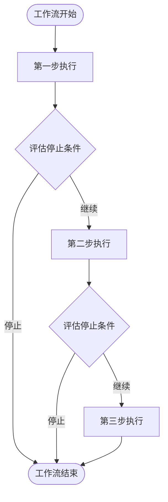
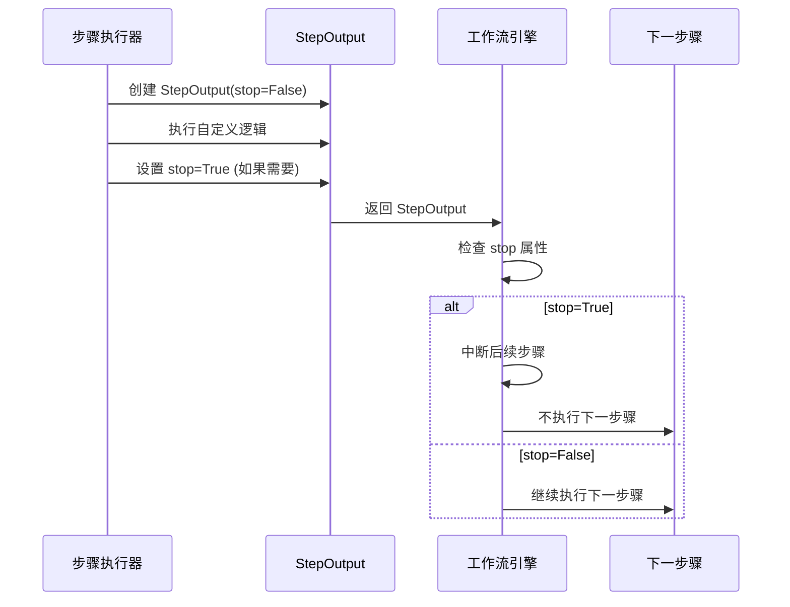
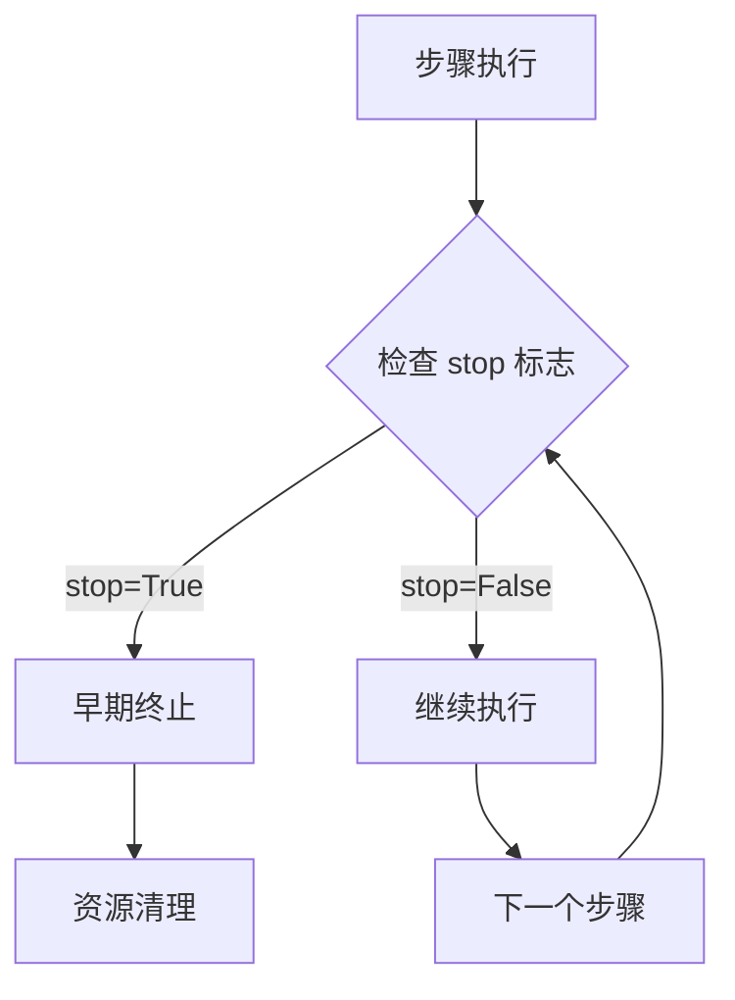

# Agno 工作流早期停止机制详细指南

<cite>
**本文档引用的文件**
- [early_stop_workflow_with_steps.py](file://cookbook/workflows/_06_advanced_concepts/_02_early_stopping/early_stop_workflow_with_steps.py)
- [early_stop_workflow_with_loop.py](file://cookbook/workflows/_06_advanced_concepts/_02_early_stopping/early_stop_workflow_with_loop.py)
- [early_stop_workflow_with_router.py](file://cookbook/workflows/_06_advanced_concepts/_02_early_stopping/early_stop_workflow_with_router.py)
- [workflow.py](file://libs/agno/agno/workflow/workflow.py)
- [types.py](file://libs/agno/agno/workflow/types.py)
- [step.py](file://libs/agno/agno/workflow/step.py)
- [workflow_cancel_a_run.py](file://cookbook/workflows/_06_advanced_concepts/_06_other/workflow_cancel_a_run.py)
- [workflow.py](file://libs/agno/agno/run/workflow.py)
</cite>

## 目录
1. [简介](#简介)
2. [早期停止机制概述](#早期停止机制概述)
3. [核心组件分析](#核心组件分析)
4. [工作原理详解](#工作原理详解)
5. [配置和使用方法](#配置和使用方法)
6. [实际应用场景](#实际应用场景)
7. [高级用法和最佳实践](#高级用法和最佳实践)
8. [错误处理和故障排除](#错误处理和故障排除)
9. [性能考虑](#性能考虑)
10. [总结](#总结)

## 简介

Agno 工作流系统提供了强大的早期停止机制，允许在工作流执行过程中根据特定条件提前终止后续步骤的执行。这种机制对于资源优化、质量控制和错误处理至关重要，能够显著提高工作效率并减少不必要的计算开销。

早期停止机制的核心思想是在检测到满足特定条件时立即终止工作流的执行，而不是继续执行后续步骤。这在多种场景中都非常有用，例如：
- 内容质量检查失败时停止后续处理
- 安全性问题检测时立即终止
- 条件判断不满足时跳过冗余步骤
- 循环执行中达到目标时提前退出

## 早期停止机制概述

### 核心概念

早期停止机制通过以下关键组件实现：

1. **StepOutput 对象的 stop 属性**：这是触发早期停止的关键标志
2. **条件评估**：在每个步骤执行后评估是否需要停止
3. **状态传播**：确保早期停止信号正确传递给整个工作流
4. **资源清理**：及时释放已分配的资源

### 工作流程图



## 核心组件分析

### StepOutput 类

`StepOutput` 是早期停止机制的核心数据结构，包含以下关键字段：

```python
@dataclass
class StepOutput:
    # 其他字段...
    stop: bool = False  # 控制早期停止的关键标志
    steps: Optional[List["StepOutput"]] = None  # 嵌套步骤输出
```

### 早期停止触发机制



**章节来源**
- [types.py](file://libs/agno/agno/workflow/types.py#L280-L320)

## 工作原理详解

### 早期停止的触发时机

早期停止可以在以下情况下触发：

1. **步骤执行完成后**：在每个步骤完成后检查 `stop` 标志
2. **循环迭代中**：在循环的每次迭代后检查
3. **条件分支中**：在条件判断后决定是否继续
4. **路由选择中**：在路由决策后确定执行路径

### 实现机制



### 状态管理

工作流引擎维护以下状态信息：

- **previous_step_outputs**：存储所有已完成步骤的输出
- **shared_media**：跨步骤共享的媒体资源
- **collected_step_outputs**：收集的所有步骤输出
- **early_termination**：全局早期终止标志

**章节来源**
- [workflow.py](file://libs/agno/agno/workflow/workflow.py#L1370-L1396)

## 配置和使用方法

### 基本配置

#### 1. 自定义函数中的早期停止

```python
def content_quality_gate(step_input: StepInput) -> StepOutput:
    """质量门禁检查函数"""
    content = step_input.previous_step_content or ""
    
    # 检查内容长度
    if len(content) < 100:
        return StepOutput(
            step_name="quality_gate",
            content="内容太短，不符合质量标准。",
            stop=True,  # 触发早期停止
        )
    
    # 检查敏感关键词
    problematic_keywords = ["fake", "misinformation", "unverified"]
    if any(keyword in content.lower() for keyword in problematic_keywords):
        return StepOutput(
            step_name="quality_gate",
            content="检测到不当内容，停止工作流。",
            stop=True,  # 触发早期停止
        )
    
    return StepOutput(
        step_name="quality_gate",
        content="内容质量检查通过。",
        stop=False,  # 继续执行
    )
```

#### 2. 在 Steps 序列中使用

```python
content_pipeline = Steps(
    name="content_pipeline",
    description="带质量门禁的内容创建流水线",
    steps=[
        Step(name="create_content", agent=content_creator),
        Step(name="quality_gate", executor=content_quality_gate),  # 可以停止工作流
        Step(name="fact_check", agent=fact_checker),  # 如果被停止则不会执行
        Step(name="edit_content", agent=editor),     # 如果被停止则不会执行
        Step(name="publish", agent=publisher),       # 如果被停止则不会执行
    ],
)
```

### 高级配置选项

#### 3. 在循环中使用早期停止

```python
def safety_checker(step_input: StepInput) -> StepOutput:
    """安全检查函数"""
    content = step_input.previous_step_content or ""
    
    # 检测敏感内容
    if "AI" in content or "machine learning" in content:
        return StepOutput(
            step_name="Safety Checker",
            content="发现敏感AI相关内容，停止研究循环进行审查。",
            stop=True,  # 请求早期终止
        )
    else:
        return StepOutput(
            step_name="Safety Checker",
            content="安全检查通过，内容安全。",
            stop=False,
        )

# 包含安全检查的循环
workflow = Workflow(
    name="带安全检查的研究工作流",
    steps=[
        Loop(
            name="Research Loop with Safety",
            steps=[
                research_hackernews_step,  # 研究步骤1
                safety_check_step,         # 安全检查（可能停止）
                research_web_step,         # 研究步骤2（仅当安全检查通过）
            ],
            end_condition=research_evaluator,
            max_iterations=3,
        ),
        content_agent,  # 如果安全检查停止，则不会执行
    ],
)
```

#### 4. 在路由器中使用早期停止

```python
def content_safety_checker(step_input: StepInput) -> StepOutput:
    """内容安全检查函数"""
    content = step_input.previous_step_content or ""
    
    # 检测争议性内容
    if "controversial" in content.lower() or "sensitive" in content.lower():
        return StepOutput(
            step_name="Content Safety Checker",
            content="检测到争议性或敏感内容，停止工作流进行人工审查。",
            stop=True,  # 请求早期终止
        )
    else:
        return StepOutput(
            step_name="Content Safety Checker",
            content="内容安全检查通过。",
            stop=False,
        )

# 路由器配置
workflow = Workflow(
    name="带安全检查的智能路由工作流",
    steps=[
        Router(
            name="research_safety_router",
            selector=research_router,
            choices=[research_hackernews, safety_check, research_web],
        ),
        publish_content,  # 如果安全检查停止，则不会执行
    ],
)
```

**章节来源**
- [early_stop_workflow_with_steps.py](file://cookbook/workflows/_06_advanced_concepts/_02_early_stopping/early_stop_workflow_with_steps.py#L35-L65)
- [early_stop_workflow_with_loop.py](file://cookbook/workflows/_06_advanced_concepts/_02_early_stopping/early_stop_workflow_with_loop.py#L25-L55)
- [early_stop_workflow_with_router.py](file://cookbook/workflows/_06_advanced_concepts/_02_early_stopping/early_stop_workflow_with_router.py#L25-L55)

## 实际应用场景

### 场景1：内容质量控制

```python
# 内容质量检查流水线
content_workflow = Workflow(
    name="内容质量控制工作流",
    steps=[
        Step(name="research", agent=research_agent),
        Step(name="draft", agent=draft_agent),
        Step(name="quality_check", executor=quality_checker),  # 可以停止
        Step(name="fact_check", agent=fact_checker),           # 如果被停止则不会执行
        Step(name="edit", agent=editor),                       # 如果被停止则不会执行
        Step(name="publish", agent=publisher),                 # 如果被停止则不会执行
    ],
)
```

### 场景2：安全合规检查

```python
# 安全合规工作流
security_workflow = Workflow(
    name="安全合规检查工作流",
    steps=[
        Step(name="data_collection", agent=data_collector),
        Step(name="security_scan", executor=safety_scanner),   # 可以停止
        Step(name="risk_assessment", agent=risk_assessor),     # 如果被停止则不会执行
        Step(name="approval", agent=approver),                 # 如果被停止则不会执行
    ],
)
```

### 场景3：条件驱动的决策

```python
# 条件决策工作流
decision_workflow = Workflow(
    name="条件决策工作流",
    steps=[
        Step(name="analyze", agent=analyzer),
        Condition(
            name="decision_condition",
            evaluator=decision_evaluator,
            steps=[
                Step(name="action_a", agent=agent_a),
                Step(name="action_b", agent=agent_b),
            ],
        ),
        Step(name="review", agent=reviewer),                   # 如果条件满足则不会执行
    ],
)
```

## 高级用法和最佳实践

### 1. 多层次早期停止

```python
def hierarchical_quality_check(step_input: StepInput) -> StepOutput:
    """多层次质量检查"""
    content = step_input.previous_step_content or ""
    
    # 第一层：基本格式检查
    if not is_properly_formatted(content):
        return StepOutput(
            step_name="format_check",
            content="格式错误，无法继续处理。",
            stop=True,
        )
    
    # 第二层：内容完整性检查
    if not has_sufficient_information(content):
        return StepOutput(
            step_name="integrity_check",
            content="信息不完整，停止处理。",
            stop=True,
        )
    
    # 第三层：深度内容分析
    if has_low_quality_patterns(content):
        return StepOutput(
            step_name="depth_check",
            content="内容质量不足，停止进一步处理。",
            stop=True,
        )
    
    return StepOutput(
        step_name="quality_check",
        content="多层质量检查通过。",
        stop=False,
    )
```

### 2. 带有回滚机制的早期停止

```python
def robust_quality_check(step_input: StepInput) -> StepOutput:
    """带有回滚机制的质量检查"""
    try:
        # 执行质量检查
        result = perform_quality_check(step_input)
        
        if result.quality_score < MINIMUM_QUALITY_THRESHOLD:
            # 记录失败原因
            failure_reason = f"质量分数 {result.quality_score} 低于阈值 {MINIMUM_QUALITY_THRESHOLD}"
            
            # 尝试自动修复
            if can_auto_fix(result):
                fixed_content = auto_fix_content(result)
                return StepOutput(
                    step_name="quality_check",
                    content=f"尝试自动修复: {failure_reason}",
                    stop=False,  # 继续执行以应用修复
                )
            else:
                # 无法修复，停止工作流
                return StepOutput(
                    step_name="quality_check",
                    content=f"无法修复质量问题: {failure_reason}",
                    stop=True,  # 停止工作流
                )
        
        return StepOutput(
            step_name="quality_check",
            content="质量检查通过。",
            stop=False,
        )
        
    except Exception as e:
        return StepOutput(
            step_name="quality_check",
            content=f"质量检查失败: {str(e)}",
            stop=True,  # 异常情况下停止
        )
```

### 3. 动态条件评估

```python
def adaptive_early_stop(step_input: StepInput) -> StepOutput:
    """动态适应性的早期停止"""
    content = step_input.previous_step_content or ""
    
    # 获取当前工作流状态
    workflow_state = get_workflow_state(step_input)
    
    # 动态调整停止条件
    if workflow_state.current_iteration > MAX_ITERATIONS:
        return StepOutput(
            step_name="adaptive_stop",
            content=f"超过最大迭代次数 {MAX_ITERATIONS}，停止工作流。",
            stop=True,
        )
    
    # 基于历史成功率的动态停止
    historical_success_rate = calculate_success_rate(workflow_state)
    if historical_success_rate < SUCCESS_RATE_THRESHOLD:
        return StepOutput(
            step_name="adaptive_stop",
            content=f"历史成功率 {historical_success_rate:.2%} 低于阈值 {SUCCESS_RATE_THRESHOLD:.2%}，停止工作流。",
            stop=True,
        )
    
    # 基于内容相似度的停止
    similarity_score = calculate_similarity(content, workflow_state.previous_content)
    if similarity_score > SIMILARITY_THRESHOLD:
        return StepOutput(
            step_name="adaptive_stop",
            content=f"内容相似度过高 {similarity_score:.2%}，停止重复处理。",
            stop=True,
        )
    
    return StepOutput(
        step_name="adaptive_stop",
        content="动态条件评估通过。",
        stop=False,
    )
```

### 4. 并行执行中的早期停止

```python
def parallel_early_stop(step_input: StepInput) -> StepOutput:
    """并行执行中的早期停止策略"""
    content = step_input.previous_step_content or ""
    
    # 检查并行任务的状态
    parallel_tasks = get_parallel_tasks(step_input)
    
    # 如果任何任务失败，停止所有后续任务
    failed_tasks = [task for task in parallel_tasks if task.status == "failed"]
    if failed_tasks:
        return StepOutput(
            step_name="parallel_stop",
            content=f"检测到 {len(failed_tasks)} 个失败的并行任务，停止所有后续任务。",
            stop=True,
        )
    
    # 如果大部分任务成功，可以继续
    success_rate = sum(1 for task in parallel_tasks if task.status == "completed") / len(parallel_tasks)
    if success_rate < PARALLEL_SUCCESS_THRESHOLD:
        return StepOutput(
            step_name="parallel_stop",
            content=f"并行任务成功率 {success_rate:.2%} 低于阈值 {PARALLEL_SUCCESS_THRESHOLD:.2%}，停止工作流。",
            stop=True,
        )
    
    return StepOutput(
        step_name="parallel_stop",
        content="并行任务状态良好，继续执行。",
        stop=False,
    )
```

## 错误处理和故障排除

### 常见问题和解决方案

#### 1. 早期停止信号未正确传播

**问题**：设置了 `stop=True` 但后续步骤仍然执行

**解决方案**：
```python
# 确保正确检查 stop 标志
def debug_early_stop(step_input: StepInput) -> StepOutput:
    content = step_input.previous_step_content or ""
    
    # 添加调试信息
    print(f"Debug - Previous content length: {len(content)}")
    
    if len(content) < 100:
        return StepOutput(
            step_name="debug_stop",
            content="内容太短，应该停止。",
            stop=True,
        )
    
    return StepOutput(
        step_name="debug_stop",
        content="内容正常，继续执行。",
        stop=False,
    )
```

#### 2. 资源泄漏问题

**问题**：早期停止后资源未正确释放

**解决方案**：
```python
def resource_safe_early_stop(step_input: StepInput) -> StepOutput:
    try:
        # 执行检查逻辑
        result = perform_expensive_operation(step_input)
        
        if result.needs_cleanup:
            # 注册清理回调
            register_cleanup_callback(lambda: cleanup_resources(result))
        
        if result.should_stop:
            return StepOutput(
                step_name="resource_safe_stop",
                content="需要清理资源，停止工作流。",
                stop=True,
            )
        
        return StepOutput(
            step_name="resource_safe_stop",
            content="操作完成，继续执行。",
            stop=False,
        )
        
    finally:
        # 确保即使异常也能清理资源
        cleanup_resources()
```

#### 3. 条件竞争问题

**问题**：多个步骤同时检查停止条件导致不一致

**解决方案**：
```python
def synchronized_early_stop(step_input: StepInput) -> StepOutput:
    """同步化的早期停止检查"""
    content = step_input.previous_step_content or ""
    
    # 使用原子操作检查和设置状态
    with acquire_workflow_lock(step_input.workflow_run_id):
        workflow_state = get_workflow_state(step_input.workflow_run_id)
        
        if workflow_state.early_stop_requested:
            return StepOutput(
                step_name="synchronized_stop",
                content="工作流已被标记为早期停止，跳过此步骤。",
                stop=False,  # 不再请求停止
            )
        
        # 执行当前步骤的检查
        needs_stop = check_current_step_conditions(content)
        
        if needs_stop:
            workflow_state.early_stop_requested = True
            return StepOutput(
                step_name="synchronized_stop",
                content="检测到需要早期停止的条件。",
                stop=True,
            )
        
        return StepOutput(
            step_name="synchronized_stop",
            content="当前步骤条件正常。",
            stop=False,
        )
```

### 调试技巧

#### 1. 启用详细日志记录

```python
import logging

# 配置日志级别
logging.getLogger('agno.workflow').setLevel(logging.DEBUG)

def debug_early_stop(step_input: StepInput) -> StepOutput:
    logger = logging.getLogger(__name__)
    
    logger.debug(f"开始早期停止检查，输入内容长度: {len(step_input.previous_step_content or '')}")
    
    # 检查逻辑...
    
    logger.debug(f"早期停止检查结果: {'需要停止' if should_stop else '继续执行'}")
    
    return StepOutput(
        step_name="debug_stop",
        content="调试信息已记录。",
        stop=should_stop,
    )
```

#### 2. 使用事件监控

```python
def monitored_early_stop(step_input: StepInput) -> StepOutput:
    """带有事件监控的早期停止"""
    content = step_input.previous_step_content or ""
    
    # 发送开始事件
    emit_workflow_event(
        event_type="early_stop_check_start",
        step_name="monitored_stop",
        content_length=len(content),
    )
    
    try:
        # 执行检查逻辑
        result = perform_check(content)
        
        if result.should_stop:
            # 发送停止事件
            emit_workflow_event(
                event_type="early_stop_triggered",
                step_name="monitored_stop",
                reason=result.reason,
            )
            
            return StepOutput(
                step_name="monitored_stop",
                content=f"触发早期停止: {result.reason}",
                stop=True,
            )
        
        return StepOutput(
            step_name="monitored_stop",
            content="检查通过，继续执行。",
            stop=False,
        )
        
    finally:
        # 发送完成事件
        emit_workflow_event(
            event_type="early_stop_check_complete",
            step_name="monitored_stop",
        )
```

**章节来源**
- [workflow.py](file://libs/agno/agno/workflow/workflow.py#L1370-L1396)

## 性能考虑

### 1. 早期停止对性能的影响

早期停止机制对性能有以下影响：

- **正面影响**：减少不必要的计算和资源消耗
- **负面影响**：增加条件检查的开销
- **平衡点**：合理设计检查逻辑，避免过度检查

### 2. 性能优化策略

```python
def optimized_early_stop(step_input: StepInput) -> StepOutput:
    """性能优化的早期停止"""
    content = step_input.previous_step_content or ""
    
    # 快速预检查（低成本）
    if not content or len(content) < MIN_CONTENT_LENGTH:
        return StepOutput(
            step_name="optimized_stop",
            content="内容过短，快速跳过。",
            stop=True,
        )
    
    # 缓存检查结果
    cache_key = f"early_stop_{hash(content[:100])}"
    cached_result = get_from_cache(cache_key)
    
    if cached_result is not None:
        return StepOutput(
            step_name="optimized_stop",
            content="从缓存获取结果。",
            stop=cached_result,
        )
    
    # 执行昂贵的检查（仅在必要时）
    expensive_result = perform_expensive_check(content)
    
    # 缓存结果
    set_cache(cache_key, expensive_result.should_stop)
    
    return StepOutput(
        step_name="optimized_stop",
        content="执行昂贵检查。",
        stop=expensive_result.should_stop,
    )
```

### 3. 内存管理

```python
def memory_efficient_early_stop(step_input: StepInput) -> StepOutput:
    """内存高效的早期停止"""
    content = step_input.previous_step_content or ""
    
    # 使用生成器避免大量内存占用
    def content_chunks():
        chunk_size = 1024
        for i in range(0, len(content), chunk_size):
            yield content[i:i+chunk_size]
    
    # 流式检查内容
    for chunk in content_chunks():
        if contains_problematic_pattern(chunk):
            return StepOutput(
                step_name="memory_efficient_stop",
                content="检测到问题模式，停止处理。",
                stop=True,
            )
    
    return StepOutput(
        step_name="memory_efficient_stop",
        content="内容检查通过。",
        stop=False,
    )
```

## 总结

Agno 工作流的早期停止机制是一个强大而灵活的功能，它允许开发者在工作流执行过程中根据各种条件提前终止后续步骤。通过合理配置和使用，可以实现：

### 主要优势

1. **资源优化**：避免不必要的计算和资源消耗
2. **质量保证**：及时发现和处理质量问题
3. **安全性增强**：快速响应安全威胁和违规内容
4. **用户体验提升**：减少等待时间和提高响应速度

### 最佳实践要点

1. **合理设计停止条件**：确保条件明确且可预测
2. **适当的错误处理**：在早期停止时正确清理资源
3. **充分的测试**：验证各种停止场景的行为
4. **性能监控**：跟踪早期停止对整体性能的影响
5. **清晰的日志记录**：记录停止原因和过程以便调试

### 适用场景

- **内容审核和质量控制**
- **安全合规检查**
- **条件驱动的决策流程**
- **资源受限环境下的优化**
- **实时响应系统**

通过掌握这些概念和技术，开发者可以充分利用 Agno 工作流的早期停止机制，构建更加高效、可靠和用户友好的工作流系统。