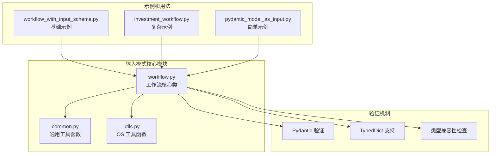
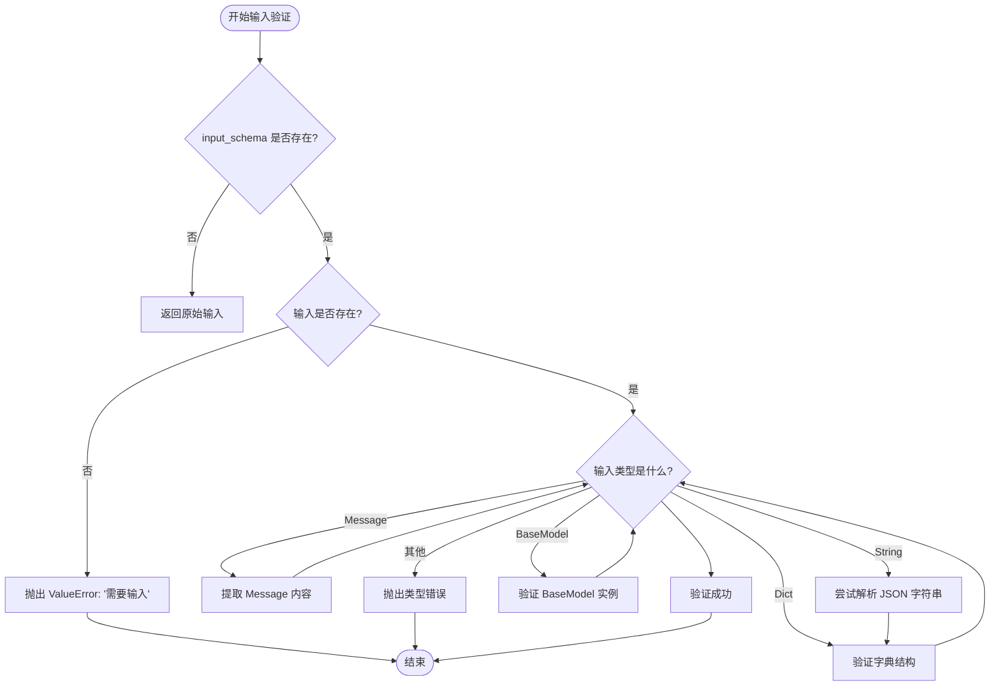
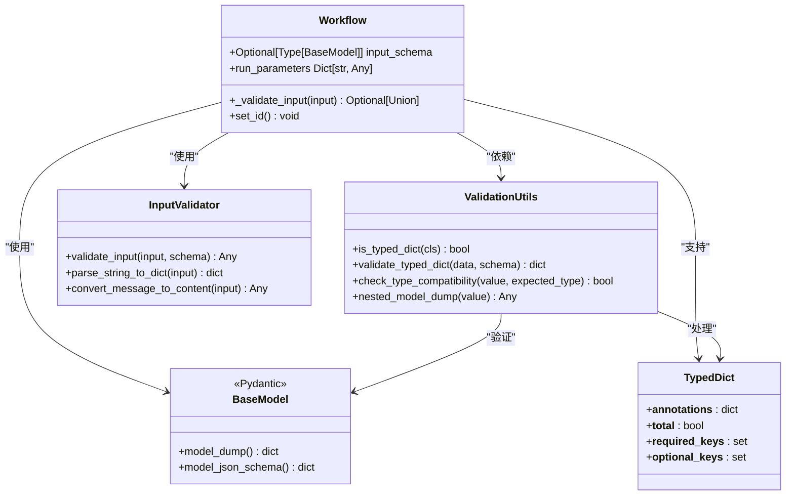
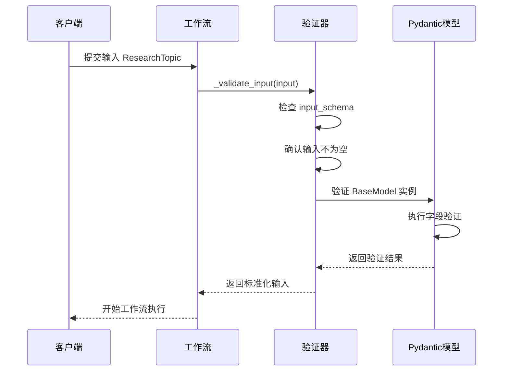
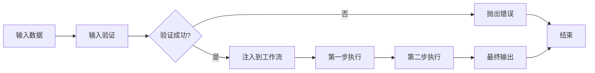
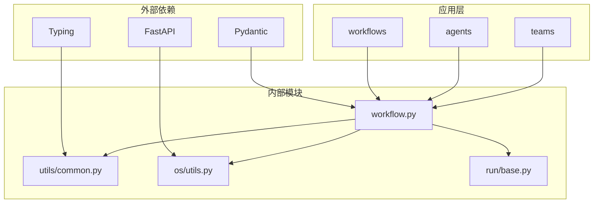

# 输入模式

<cite>
**本文档引用的文件**
- [workflow_with_input_schema.py](file://cookbook/agent_os/workflow/workflow_with_input_schema.py)
- [workflow.py](file://libs/agno/agno/workflow/workflow.py)
- [common.py](file://libs/agno/agno/utils/common.py)
- [pydantic_model_as_input.py](file://cookbook/examples/agents/pydantic_model_as_input.py)
- [investment_workflow.py](file://cookbook/demo/workflows/investment_workflow.py)
- [workflow_with_input_schema.py](file://cookbook/workflows/_06_advanced_concepts/_01_structured_io_at_each_level/workflow_with_input_schema.py)
- [utils.py](file://libs/agno/agno/os/utils.py)
</cite>

## 目录
1. [简介](#简介)
2. [项目结构](#项目结构)
3. [核心组件](#核心组件)
4. [架构概览](#架构概览)
5. [详细组件分析](#详细组件分析)
6. [依赖关系分析](#依赖关系分析)
7. [性能考虑](#性能考虑)
8. [故障排除指南](#故障排除指南)
9. [结论](#结论)

## 简介

Agno 工作流中的输入模式（Input Schema）是一个强大的功能，它允许开发者使用 Pydantic 模型或其他类型定义来为工作流定义结构化的输入。这个系统确保了数据的类型安全和完整性，提供了自动验证机制，并在工作流执行前进行错误处理。

输入模式的核心价值在于：
- **类型安全**：通过 Pydantic 模型确保输入数据的类型正确性
- **结构化验证**：自动验证输入数据是否符合预定义的结构
- **错误处理**：在工作流执行前捕获并报告输入错误
- **API 友好**：生成清晰的 JSON Schema 用于 API 文档
- **可维护性**：通过明确的数据结构提高代码的可维护性

## 项目结构

Agno 的输入模式功能分布在多个模块中，形成了一个完整的验证和处理系统：



**图表来源**
- [workflow.py](file://libs/agno/agno/workflow/workflow.py#L1-L50)
- [common.py](file://libs/agno/agno/utils/common.py#L1-L30)

**章节来源**
- [workflow.py](file://libs/agno/agno/workflow/workflow.py#L1-L100)
- [workflow_with_input_schema.py](file://cookbook/agent_os/workflow/workflow_with_input_schema.py#L1-L50)

## 核心组件

### 工作流类中的输入模式支持

工作流类是输入模式功能的核心，它包含了完整的输入验证逻辑：

```python
class Workflow:
    # 输入模式属性
    input_schema: Optional[Type[BaseModel]] = None
    
    def _validate_input(
        self, input: Optional[Union[str, Dict[str, Any], List[Any], BaseModel, List[Message]]]
    ) -> Optional[Union[str, List, Dict, Message, BaseModel]]:
        """解析并验证输入 against input_schema（如果提供）"""
        if self.input_schema is None:
            return input  # 如果没有设置模式，则返回输入不变
        
        # 处理各种输入类型...
```

### 输入验证流程

输入验证系统支持多种输入格式，并根据不同的情况执行相应的验证策略：



**图表来源**
- [workflow.py](file://libs/agno/agno/workflow/workflow.py#L215-L283)

**章节来源**
- [workflow.py](file://libs/agno/agno/workflow/workflow.py#L215-L283)

## 架构概览

输入模式系统采用分层架构设计，从底层的类型检查到高层的完整验证流程：



**图表来源**
- [workflow.py](file://libs/agno/agno/workflow/workflow.py#L100-L150)
- [common.py](file://libs/agno/agno/utils/common.py#L40-L80)

## 详细组件分析

### 基础输入模式示例

让我们从一个简单的研究主题输入模式开始：

```python
class ResearchTopic(BaseModel):
    """带有特定要求的结构化研究主题"""
    
    topic: str
    focus_areas: List[str] = Field(description="具体关注领域")
    target_audience: str = Field(description="目标受众")
    sources_required: int = Field(description="所需资料数量", default=5)
```

这个简单的 Pydantic 模型定义了：
- 必需字段：`topic` 和 `target_audience`
- 可选字段：`focus_areas` 和 `sources_required`
- 类型约束：字符串、列表、整数
- 字段描述：提供清晰的用途说明

### 复杂输入模式示例

在投资分析工作流中，我们看到更复杂的输入模式：

```python
class InvestmentWorkflowInput(BaseModel):
    companies: List[str]

class StockAnalysisResult(BaseModel):
    company_symbols: str
    market_analysis: str
    financial_metrics: str
    risk_assessment: str
    recommendations: str

class InvestmentRanking(BaseModel):
    ranked_companies: str
    investment_rationale: str
    risk_evaluation: str
    growth_potential: str

class PortfolioAllocation(BaseModel):
    allocation_strategy: str
    investment_thesis: str
    risk_management: str
    final_recommendations: str
```

这些模式展示了：
- **嵌套结构**：多个相关的输出模型
- **类型多样性**：字符串、列表等不同类型的组合
- **业务相关性**：与金融分析直接相关的字段

### 输入验证机制详解

#### 1. 基本类型验证



**图表来源**
- [workflow.py](file://libs/agno/agno/workflow/workflow.py#L241-L283)

#### 2. TypedDict 支持

对于更灵活的结构，系统支持 TypedDict：

```python
def validate_typed_dict(data: dict, schema_cls) -> dict:
    """使用 TypedDict 模式验证输入数据"""
    # 获取类型提示
    type_hints = get_type_hints(schema_cls)
    
    # 检查必需字段
    required_keys = getattr(schema_cls, "__required_keys__", set())
    missing_required = required_keys - set(data.keys())
    
    # 检查意外字段
    all_keys = required_keys | getattr(schema_cls, "__optional_keys__", set())
    unexpected_fields = set(data.keys()) - all_keys
    
    # 基本类型检查
    for field_name, value in data.items():
        if field_name in type_hints:
            expected_type = type_hints[field_name]
            if not check_type_compatibility(value, expected_type):
                raise ValueError(f"字段 '{field_name}' 期望类型 {expected_type}")
```

#### 3. 类型兼容性检查

系统实现了智能的类型检查机制：

```python
def check_type_compatibility(value: Any, expected_type: Type) -> bool:
    """基本类型兼容性检查"""
    from typing import get_args, get_origin
    
    # 处理 None/Optional 类型
    if value is None:
        return type(None) in get_args(expected_type) if hasattr(expected_type, "__args__") else expected_type is type(None)
    
    # 处理 Union 类型（包括 Optional）
    origin = get_origin(expected_type)
    if origin is Union:
        return any(check_type_compatibility(value, arg) for arg in get_args(expected_type))
    
    # 处理 List 类型
    if origin is list or expected_type is list:
        if not isinstance(value, list):
            return False
        if origin is list and get_args(expected_type):
            element_type = get_args(expected_type)[0]
            return all(check_type_compatibility(item, element_type) for item in value)
        return True
    
    # 基本类型检查
    if expected_type in (str, int, float, bool):
        return isinstance(value, expected_type)
    
    return isinstance(value, expected_type)
```

**章节来源**
- [workflow.py](file://libs/agno/agno/workflow/workflow.py#L215-L283)
- [common.py](file://libs/agno/agno/utils/common.py#L40-L132)

### 输入模式的注入机制

当验证通过后，输入数据会被注入到工作流的初始步骤中：



**图表来源**
- [workflow.py](file://libs/agno/agno/workflow/workflow.py#L215-L283)

### API 集成和文档生成

系统自动生成 JSON Schema 用于 API 文档：

```python
def get_workflow_input_schema_dict(workflow: Workflow) -> Optional[Dict[str, Any]]:
    """获取输入模式作为 API 响应的字典"""
    
    # 优先级 1：显式的 input_schema（Pydantic 模型）
    if workflow.input_schema is not None:
        try:
            return workflow.input_schema.model_json_schema()
        except Exception:
            return None
    
    # 优先级 2：从自定义参数自动生成
    if workflow.steps and callable(workflow.steps):
        custom_params = workflow.run_parameters
        if custom_params and len(custom_params) > 1:  # 超过 'message' 的参数
            return _generate_schema_from_params(custom_params)
    
    # 优先级 3：无模式（期望字符串消息）
    return None
```

**章节来源**
- [utils.py](file://libs/agno/agno/os/utils.py#L188-L227)

## 依赖关系分析

输入模式系统的依赖关系展现了清晰的层次结构：



**图表来源**
- [workflow.py](file://libs/agno/agno/workflow/workflow.py#L1-L30)
- [common.py](file://libs/agno/agno/utils/common.py#L1-L10)

**章节来源**
- [workflow.py](file://libs/agno/agno/workflow/workflow.py#L1-L50)
- [common.py](file://libs/agno/agno/utils/common.py#L1-L30)

## 性能考虑

输入模式系统在设计时考虑了以下性能因素：

### 1. 延迟优化
- **缓存机制**：验证结果可以被缓存以避免重复计算
- **早期退出**：在发现错误时立即停止验证过程
- **异步支持**：支持异步验证以提高并发性能

### 2. 内存效率
- **惰性加载**：只在需要时才加载和验证输入
- **对象复用**：重用验证器实例以减少内存分配
- **流式处理**：支持大文件和大数据集的流式验证

### 3. 扩展性
- **插件架构**：支持自定义验证器扩展
- **配置驱动**：通过配置控制验证行为
- **多格式支持**：支持多种输入格式以适应不同场景

## 故障排除指南

### 常见问题和解决方案

#### 1. 输入验证失败

**问题**：输入数据无法通过验证
```
ValueError: Failed to parse dict into ResearchTopic: field 'topic' is required
```

**解决方案**：
```python
# 确保所有必需字段都已提供
research_topic = ResearchTopic(
    topic="AI trends in 2024",
    focus_areas=["Machine Learning", "Computer Vision"],
    target_audience="Tech professionals",
    sources_required=5  # 确保提供所有必需字段
)
```

#### 2. 类型不匹配

**问题**：提供的数据类型与预期不符
```
ValueError: Field 'sources_required' expected type int, got str with value "5"
```

**解决方案**：
```python
# 确保数据类型正确
research_topic = ResearchTopic(
    topic="AI trends in 2024",
    focus_areas=["Machine Learning", "Computer Vision"],
    target_audience="Tech professionals",
    sources_required=5  # 使用整数而不是字符串
)
```

#### 3. TypedDict 验证错误

**问题**：TypedDict 中有意外字段
```
ValueError: Unexpected fields in TypedDict ResearchTopic: {'extra_field'}
```

**解决方案**：
```python
# 移除意外字段或更新 TypedDict 定义
research_topic = {
    "topic": "AI trends in 2024",
    "focus_areas": ["Machine Learning", "Computer Vision"],
    "target_audience": "Tech professionals",
    # 移除额外字段
}
```

### 调试技巧

#### 启用调试模式
```python
workflow = Workflow(
    name="My Workflow",
    input_schema=ResearchTopic,
    debug_mode=True  # 启用详细日志记录
)
```

#### 检查验证结果
```python
try:
    validated_input = workflow._validate_input(input_data)
    print("验证成功:", validated_input)
except ValueError as e:
    print("验证失败:", str(e))
```

**章节来源**
- [workflow.py](file://libs/agno/agno/workflow/workflow.py#L215-L283)
- [common.py](file://libs/agno/agno/utils/common.py#L80-L132)

## 结论

Agno 工作流中的输入模式系统提供了一个强大而灵活的框架，用于确保数据的类型安全和完整性。通过 Pydantic 模型和 TypedDict 的支持，开发者可以轻松地定义复杂的输入结构，并获得自动验证和错误处理功能。

### 主要优势

1. **类型安全**：通过 Pydantic 模型确保输入数据的类型正确性
2. **结构化验证**：自动验证输入数据是否符合预定义的结构
3. **错误处理**：在工作流执行前捕获并报告输入错误
4. **API 友好**：生成清晰的 JSON Schema 用于 API 文档
5. **可维护性**：通过明确的数据结构提高代码的可维护性

### 最佳实践建议

1. **使用明确的字段描述**：为每个字段提供清晰的描述信息
2. **合理设置默认值**：为可选字段提供合理的默认值
3. **分层验证**：在不同层级使用适当的验证策略
4. **错误处理**：实现完善的错误处理和用户反馈机制
5. **文档维护**：保持输入模式文档与实际实现同步

输入模式系统为构建健壮、可维护的工作流 API 提供了坚实的基础，是现代 AI 应用开发中不可或缺的重要组件。