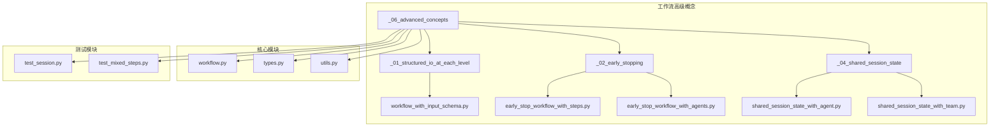
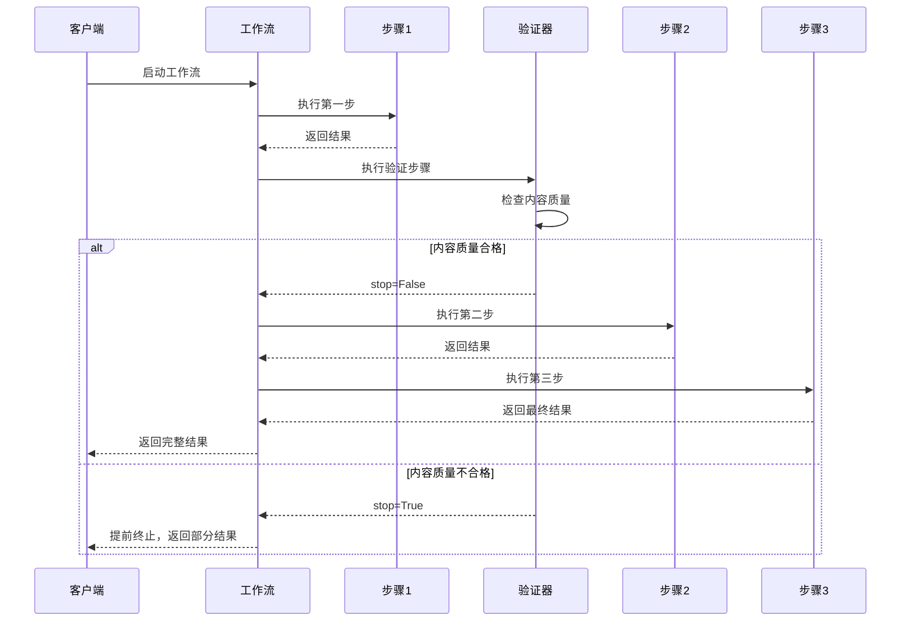
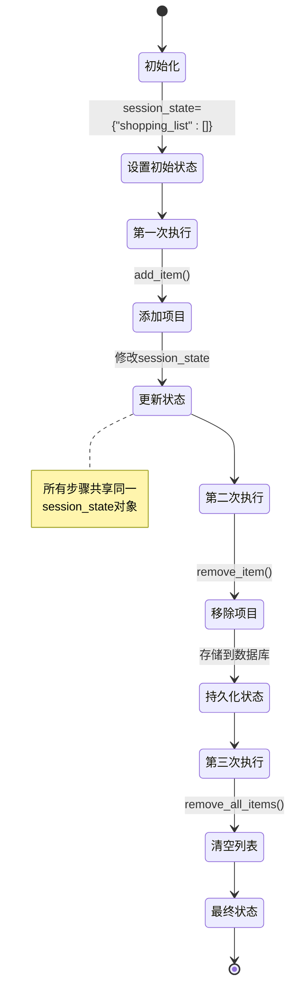
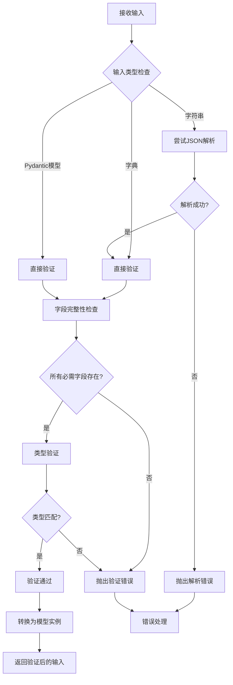
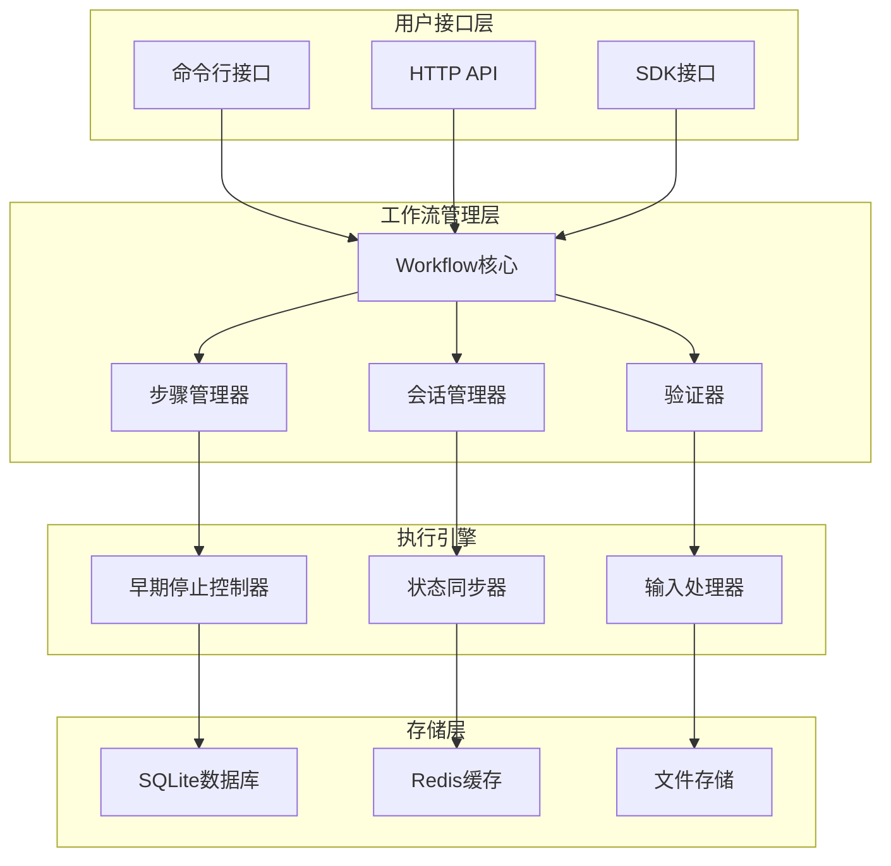
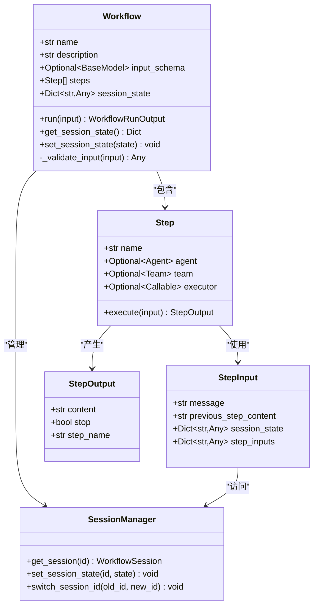

# Agno 工作流高级概念

<cite>
**本文档中引用的文件**
- [early_stop_workflow_with_steps.py](file://cookbook/workflows/_06_advanced_concepts/_02_early_stopping/early_stop_workflow_with_steps.py)
- [early_stop_workflow_with_agents.py](file://cookbook/workflows/_06_advanced_concepts/_02_early_stopping/early_stop_workflow_with_agents.py)
- [shared_session_state_with_agent.py](file://cookbook/workflows/_06_advanced_concepts/_04_shared_session_state/shared_session_state_with_agent.py)
- [shared_session_state_with_team.py](file://cookbook/workflows/_06_advanced_concepts/_04_shared_session_state/shared_session_state_with_team.py)
- [workflow_with_input_schema.py](file://cookbook/workflows/_06_advanced_concepts/_01_structured_io_at_each_level/workflow_with_input_schema.py)
- [test_session.py](file://libs/agno/tests/integration/workflows/test_session.py)
- [workflow.py](file://libs/agno/agno/workflow/workflow.py)
- [utils.py](file://libs/agno/agno/os/utils.py)
</cite>

## 目录
1. [简介](#简介)
2. [项目结构概览](#项目结构概览)
3. [早期停止机制](#早期停止机制)
4. [共享会话状态](#共享会话状态)
5. [输入模式验证](#输入模式验证)
6. [架构设计](#架构设计)
7. [最佳实践](#最佳实践)
8. [故障排除指南](#故障排除指南)
9. [总结](#总结)

## 简介

Agno 工作流系统提供了三个核心的高级概念：早期停止机制、共享会话状态和输入模式验证。这些功能共同构成了一个强大而灵活的工作流处理框架，能够有效管理复杂业务流程，确保数据完整性，并优化资源使用。

本文档将深入探讨这些高级概念的实现原理、应用场景以及最佳实践，帮助开发者充分利用 Agno 的强大功能。

## 项目结构概览

Agno 工作流的高级概念主要集中在以下目录结构中：



**图表来源**
- [workflow.py](file://libs/agno/agno/workflow/workflow.py#L1-L50)
- [utils.py](file://libs/agno/agno/os/utils.py#L1-L30)

## 早期停止机制

早期停止机制是 Agno 工作流系统中的一个重要特性，它允许在满足特定条件时提前终止工作流执行，从而节省计算资源并提高效率。

### 核心原理

早期停止机制通过 `StepOutput` 对象中的 `stop` 属性来控制工作流的执行流程。当某个步骤返回 `StepOutput(stop=True)` 时，整个工作流会立即终止，后续步骤不会被执行。

### 实现方式

#### 1. 基于自定义函数的早期停止

```python
def content_quality_gate(step_input: StepInput) -> StepOutput:
    """质量检查函数，可在发现问题时提前终止工作流"""
    content = step_input.previous_step_content or ""
    
    # 检查内容长度
    if len(content) < 100:
        return StepOutput(
            step_name="content_quality_gate",
            content="❌ 质量检查失败：内容太短。提前终止工作流。",
            stop=True,  # ✅ 提前终止
        )
    
    # 检查问题内容
    problematic_keywords = ["fake", "misinformation", "unverified", "conspiracy"]
    if any(keyword in content.lower() for keyword in problematic_keywords):
        return StepOutput(
            step_name="content_quality_gate",
            content="❌ 质量检查失败：检测到问题内容。提前终止工作流。",
            stop=True,  # ✅ 提前终止
        )
    
    return StepOutput(
        step_name="content_quality_gate",
        content="✅ 质量检查通过：内容符合质量标准。",
        stop=False,  # 继续正常流程
    )
```

#### 2. 基于代理的早期停止

```python
def early_exit_validator(step_input: StepInput) -> StepOutput:
    """
    自定义函数检查数据质量并在无效时提前终止工作流
    """
    # 获取前一步骤的验证结果
    validation_result = step_input.previous_step_content or ""
    
    if "INVALID" in validation_result.upper():
        return StepOutput(
            content="❌ 数据验证失败。提前终止工作流以防止处理无效数据。",
            stop=True,  # 在这里停止整个工作流
        )
    else:
        return StepOutput(
            content="✅ 数据验证通过。继续处理...",
            stop=False,  # 正常继续
        )
```

### 应用场景

1. **质量控制**：在内容生成流程中，如果内容不符合质量标准，立即停止后续处理
2. **数据验证**：在数据处理流程中，如果输入数据格式不正确，避免浪费计算资源
3. **安全检查**：在涉及敏感信息的流程中，及时发现并阻止潜在的安全风险
4. **成本控制**：在长时间运行的任务中，根据初步结果决定是否继续执行

### 架构图



**图表来源**
- [early_stop_workflow_with_steps.py](file://cookbook/workflows/_06_advanced_concepts/_02_early_stopping/early_stop_workflow_with_steps.py#L35-L60)
- [early_stop_workflow_with_agents.py](file://cookbook/workflows/_06_advanced_concepts/_02_early_stopping/early_stop_workflow_with_agents.py#L35-L55)

**章节来源**
- [early_stop_workflow_with_steps.py](file://cookbook/workflows/_06_advanced_concepts/_02_early_stopping/early_stop_workflow_with_steps.py#L1-L100)
- [early_stop_workflow_with_agents.py](file://cookbook/workflows/_06_advanced_concepts/_02_early_stopping/early_stop_workflow_with_agents.py#L1-L77)

## 共享会话状态

共享会话状态是 Agno 工作流系统的核心功能之一，它允许在工作流的不同步骤之间传递和共享数据，实现状态的持久化和跨步骤的数据访问。

### 核心概念

共享会话状态通过 `session_state` 参数在工作流初始化时设置，并在整个工作流执行过程中保持不变。所有步骤都可以访问和修改这个共享状态。

### 实现方式

#### 1. 基于代理的会话状态管理

```python
# 定义工具来管理购物列表在工作流会话状态中
def add_item(session_state, item: str) -> str:
    """向工作流会话状态中的购物列表添加项目
    
    Args:
        item (str): 要添加到购物列表的项目
    """
    # 检查项目是否已存在（不区分大小写）
    existing_items = [
        existing_item.lower() for existing_item in session_state["shopping_list"]
    ]
    if item.lower() not in existing_items:
        session_state["shopping_list"].append(item)
        return f"已将 '{item}' 添加到购物列表。"
    else:
        return f"'{item}' 已在购物列表中。"

def remove_item(session_state, item: str) -> str:
    """从工作流会话状态中的购物列表移除项目
    
    Args:
        item (str): 要从购物列表移除的项目
    """
    if len(session_state["shopping_list"]) == 0:
        return f"购物列表为空。无法移除 '{item}'。"
    
    # 查找并移除项目（不区分大小写）
    shopping_list = session_state["shopping_list"]
    for i, existing_item in enumerate(shopping_list):
        if existing_item.lower() == item.lower():
            removed_item = shopping_list.pop(i)
            return f"已从购物列表移除 '{removed_item}'。"
    
    return f"'{item}' 未在购物列表中找到。"

# 创建具有使用工作流会话状态的工具的代理
shopping_assistant = Agent(
    name="Shopping Assistant",
    model=OpenAIChat(id="gpt-4o-mini"),
    tools=[add_item, remove_item, list_items],
    instructions=[
        "您是一个有用的购物助手。",
        "您可以帮助用户通过添加、移除和列出项目来管理他们的购物列表。",
        "始终使用提供的工具与购物列表交互。",
        "在您的回复中要友好和乐于助人。",
    ],
)
```

#### 2. 基于团队的会话状态管理

```python
# 团队工具用于步骤管理
def add_step(session_state, step_name: str, assignee: str, priority: str = "medium") -> str:
    """向团队的工作流会话状态添加步骤"""
    if session_state is None:
        session_state = {}
    
    if "steps" not in session_state:
        session_state["steps"] = []
    
    step = {
        "name": step_name,
        "assignee": assignee,
        "status": "pending",
        "priority": priority,
        "created_at": "now",
    }
    session_state["steps"].append(step)
    
    result = f"✅ 成功添加步骤 '{step_name}' 分配给 {assignee}（优先级：{priority}）。总步骤数：{len(session_state['steps'])}"
    return result

def update_step_status(session_state, step_name: str, new_status: str, notes: str = "") -> str:
    """更新工作流会话状态中步骤的状态"""
    if session_state is None or "steps" not in session_state:
        return "❌ 未在工作流会话状态中找到步骤"
    
    steps = session_state["steps"]
    for step in steps:
        if step["name"] == step_name:
            old_status = step["status"]
            step["status"] = new_status
            if notes:
                step["notes"] = notes
            step["last_updated"] = "now"
            
            result = f"✅ 更新步骤 '{step_name}' 状态从 '{old_status}' 到 '{new_status}'"
            if notes:
                result += f" 带备注：{notes}"
            
            return result
    
    result = f"❌ 未在列表中找到步骤 '{step_name}'"
    return result
```

### 会话状态的生命周期



**图表来源**
- [shared_session_state_with_agent.py](file://cookbook/workflows/_06_advanced_concepts/_04_shared_session_state/shared_session_state_with_agent.py#L15-L45)
- [shared_session_state_with_team.py](file://cookbook/workflows/_06_advanced_concepts/_04_shared_session_state/shared_session_state_with_team.py#L20-L50)

### 应用场景

1. **购物列表管理**：在多步骤的购物流程中维护用户的购物清单
2. **项目管理**：跟踪任务的状态、分配和进度
3. **用户偏好设置**：保存用户的个性化配置和历史选择
4. **多轮对话上下文**：在复杂的对话流程中保持上下文信息
5. **临时数据存储**：在步骤间传递中间结果而不依赖外部存储

### 最佳实践

1. **数据结构设计**：使用清晰的键名和合理的数据结构
2. **类型安全**：确保会话状态中的数据类型一致
3. **并发访问**：注意多个步骤同时访问和修改会话状态的情况
4. **数据清理**：定期清理不再需要的历史数据
5. **错误处理**：为会话状态操作添加适当的错误处理

**章节来源**
- [shared_session_state_with_agent.py](file://cookbook/workflows/_06_advanced_concepts/_04_shared_session_state/shared_session_state_with_agent.py#L1-L137)
- [shared_session_state_with_team.py](file://cookbook/workflows/_06_advanced_concepts/_04_shared_session_state/shared_session_state_with_team.py#L1-L266)
- [test_session.py](file://libs/agno/tests/integration/workflows/test_session.py#L76-L132)

## 输入模式验证

输入模式验证功能确保工作流接收的数据符合预定义的结构和约束，提供强类型的输入验证和自动转换功能。

### 核心原理

输入模式验证基于 Pydantic 模型或 TypedDict 来定义输入数据的结构。工作流在接收到输入时会自动验证数据是否符合指定的模式。

### 实现方式

#### 1. 使用 Pydantic 模型定义输入模式

```python
from pydantic import BaseModel, Field
from typing import List

class ResearchTopic(BaseModel):
    """带有特定要求的结构化研究主题"""
    
    topic: str
    focus_areas: List[str] = Field(description="要关注的具体领域")
    target_audience: str = Field(description="此研究的目标受众")
    sources_required: int = Field(description="所需来源数量", default=5)

# 创建使用输入模式的工作流
content_creation_workflow = Workflow(
    name="内容创作工作流",
    description="从博客文章到社交媒体的自动化内容创作",
    db=SqliteDb(db_file="tmp/workflow.db"),
    steps=[research_step, content_planning_step],
    input_schema=ResearchTopic,  # ✅ 应用输入模式
)
```

#### 2. 输入验证流程



**图表来源**
- [workflow.py](file://libs/agno/agno/workflow/workflow.py#L209-L283)

### 支持的输入类型

1. **Pydantic 模型实例**：直接传入 Pydantic 模型的实例
2. **字典**：Python 字典会被自动转换为指定的 Pydantic 模型
3. **TypedDict**：支持 Python 的 TypedDict 类型
4. **JSON 字符串**：自动解析为字典后进行验证

### 验证规则

```python
def _validate_input(
    self, input: Optional[Union[str, Dict[str, Any], List[Any], BaseModel, List[Message]]]
) -> Optional[Union[str, List, Dict, Message, BaseModel]]:
    """根据输入模式解析和验证输入"""
    if self.input_schema is None:
        return input  # 如果没有设置模式，则原样返回输入
    
    if input is None:
        raise ValueError("当设置了input_schema时需要输入")
    
    # 处理消息对象 - 提取内容
    if isinstance(input, Message):
        input = input.content
    
    # 如果输入是字符串，将其转换为字典
    if isinstance(input, str):
        import json
        try:
            input = json.loads(input)
        except Exception as e:
            raise ValueError(f"无法解析输入。它是有效的JSON字符串吗？: {e}")
    
    # 处理字典输入
    elif isinstance(input, dict):
        try:
            # 检查模式是否为TypedDict
            if is_typed_dict(self.input_schema):
                validated_dict = validate_typed_dict(input, self.input_schema)
                return validated_dict
            else:
                validated_model = self.input_schema(**input)
                return validated_model
        except Exception as e:
            raise ValueError(f"无法将字典解析为{self.input_schema.__name__}: {str(e)}")
    
    # 处理 BaseModel 实例
    elif isinstance(input, BaseModel):
        if isinstance(input, self.input_schema):
            try:
                return input
            except Exception as e:
                raise ValueError(f"BaseModel验证失败: {str(e)}")
        else:
            # 不同的BaseModel类型
            raise ValueError(f"期望 {self.input_schema.__name__} 但得到 {type(input).__name__}")
    
    # 处理其他不支持的类型
    else:
        raise ValueError(
            f"无法将 {type(input)} 验证为input_schema。期望字典或 {self.input_schema.__name__} 实例。"
        )
```

### 应用场景

1. **API 接口**：确保传入参数符合预期格式
2. **批量处理**：验证批量数据的结构完整性
3. **配置管理**：确保配置参数的有效性
4. **数据导入**：验证导入数据的格式和内容
5. **用户输入**：确保用户提交的数据符合业务规则

### 错误处理

```python
# 示例：应该正常工作，因为它与输入模式同步
research_topic = ResearchTopic(
    topic="2024年人工智能趋势",
    focus_areas=[
        "机器学习",
        "自然语言处理",
        "计算机视觉",
        "人工智能伦理",
    ],
    target_audience="技术专业人士和商业领袖",
)

# 1. 应该正常工作，因为它与输入模式同步
content_creation_workflow.print_response(
    input=research_topic,
    markdown=True,
)

# 2. 应该失败，因为输入模式中缺少某些字段
# content_creation_workflow.print_response(
#     input=ResearchTopic(
#         topic="2024年人工智能趋势",
#         focus_areas=["机器学习", "自然语言处理", "计算机视觉", "人工智能伦理"],
#     ),
#     markdown=True,
# )

# 3. 应该失败，因为它与输入模式不同步，提供了不同的Pydantic模型
# content_creation_workflow.print_response(
#     input=DifferentModel(name="test"),
#     markdown=True,
# )
```

**章节来源**
- [workflow_with_input_schema.py](file://cookbook/workflows/_06_advanced_concepts/_01_structured_io_at_each_level/workflow_with_input_schema.py#L1-L129)
- [workflow.py](file://libs/agno/agno/workflow/workflow.py#L209-L283)
- [utils.py](file://libs/agno/agno/os/utils.py#L188-L227)

## 架构设计

Agno 工作流的高级概念采用了分层架构设计，确保了功能的模块化和可扩展性。

### 整体架构



### 关键组件关系



**图表来源**
- [workflow.py](file://libs/agno/agno/workflow/workflow.py#L1-L100)
- [test_session.py](file://libs/agno/tests/integration/workflows/test_session.py#L1-L50)

## 最佳实践

### 早期停止最佳实践

1. **明确的停止条件**：确保停止条件清晰且易于理解
2. **优雅的错误处理**：在停止时提供有意义的错误信息
3. **性能考虑**：在关键路径上使用早期停止来节省资源
4. **调试支持**：保留足够的上下文信息以便调试

### 共享会话状态最佳实践

1. **数据结构设计**：使用清晰的键名和合理的数据结构
2. **类型安全**：确保会话状态中的数据类型一致
3. **并发访问**：注意多个步骤同时访问和修改会话状态的情况
4. **数据清理**：定期清理不再需要的历史数据
5. **错误处理**：为会话状态操作添加适当的错误处理

### 输入模式验证最佳实践

1. **完整的字段定义**：为所有字段提供描述和默认值
2. **合理的验证规则**：设置适当的验证约束
3. **错误信息友好**：提供清晰的错误提示
4. **向前兼容**：设计可扩展的输入模式

## 故障排除指南

### 常见问题及解决方案

#### 1. 早期停止不生效

**问题**：设置了 `stop=True` 但工作流仍在继续执行

**解决方案**：
- 检查 `StepOutput` 的 `stop` 属性是否正确设置
- 确保早期停止逻辑在正确的步骤中
- 验证工作流配置是否正确

#### 2. 会话状态丢失

**问题**：会话状态在步骤间不一致或丢失

**解决方案**：
- 检查数据库连接是否正常
- 验证会话ID是否正确传递
- 确保会话状态序列化/反序列化正确

#### 3. 输入验证失败

**问题**：输入模式验证抛出异常

**解决方案**：
- 检查输入数据是否符合模式定义
- 验证 Pydantic 模型的字段类型
- 确保必要字段都已提供

**章节来源**
- [test_session.py](file://libs/agno/tests/integration/workflows/test_session.py#L1-L133)

## 总结

Agno 工作流的高级概念为构建复杂、可靠的工作流系统提供了强大的基础：

1. **早期停止机制**：通过智能的条件判断，能够在发现问题时及时终止工作流，节省计算资源并提高效率
2. **共享会话状态**：实现了跨步骤的数据共享和状态持久化，支持复杂的状态管理和数据传递
3. **输入模式验证**：提供了强类型的输入验证和自动转换，确保数据的完整性和一致性

这些功能相互配合，形成了一个完整的、企业级的工作流处理解决方案。开发者可以根据具体需求选择合适的功能组合，构建高效、可靠的业务流程自动化系统。

通过遵循本文档中的最佳实践和故障排除指南，开发者可以充分发挥 Agno 工作流系统的潜力，构建出高质量的应用程序。