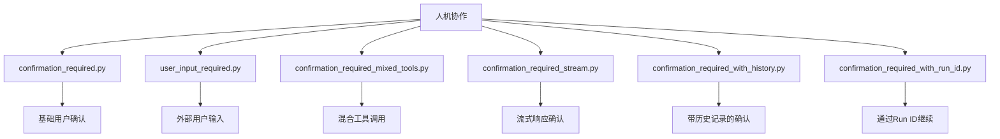
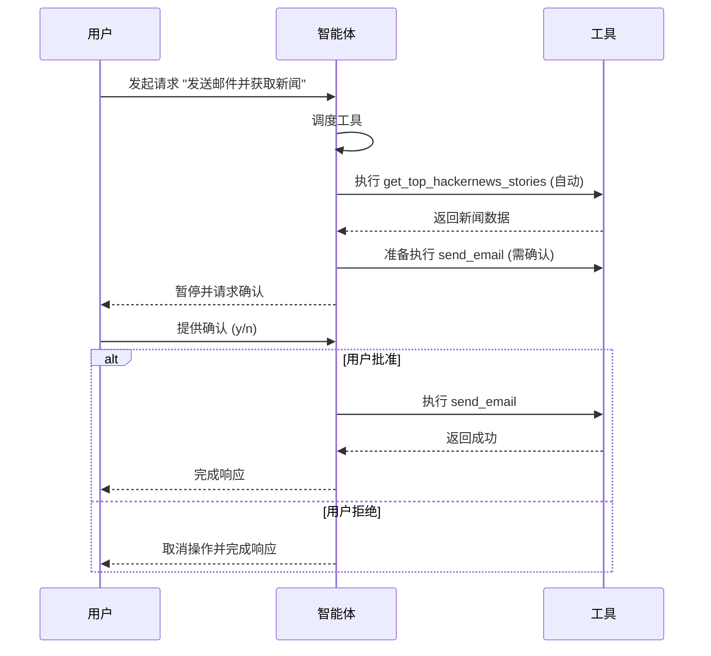
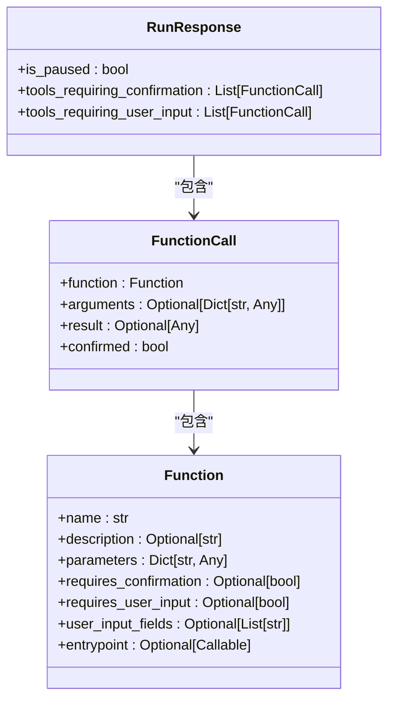
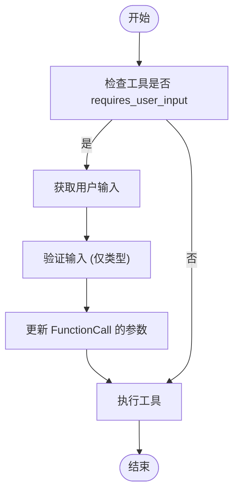
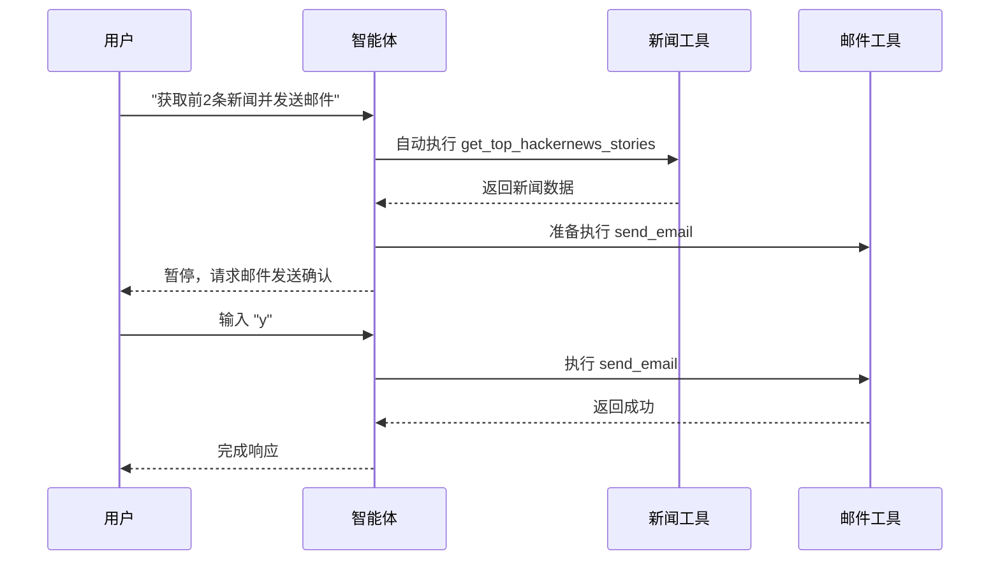
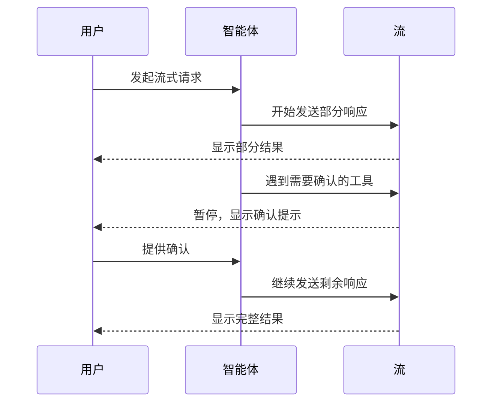
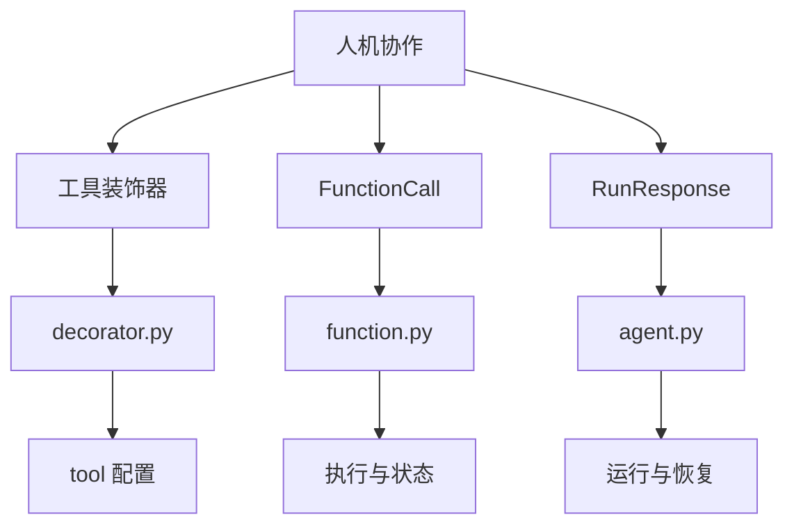

# 人机协作

<cite>
**本文档中引用的文件**  
- [confirmation_required.py](file://cookbook/agents/human_in_the_loop/confirmation_required.py)
- [user_input_required.py](file://cookbook/agents/human_in_the_loop/user_input_required.py)
- [confirmation_required_mixed_tools.py](file://cookbook/agents/human_in_the_loop/confirmation_required_mixed_tools.py)
- [confirmation_required_stream.py](file://cookbook/agents/human_in_the_loop/confirmation_required_stream.py)
- [user_control_flow.py](file://libs/agno/agno/tools/user_control_flow.py)
- [decorator.py](file://libs/agno/agno/tools/decorator.py)
- [function.py](file://libs/agno/agno/tools/function.py)
- [workflow_with_conditional.py](file://cookbook/agent_os/workflow/workflow_with_conditional.py)
- [email_tools.py](file://cookbook/tools/email_tools.py)
</cite>

## 目录
1. [引言](#引言)
2. [项目结构](#项目结构)
3. [核心组件](#核心组件)
4. [架构概述](#架构概述)
5. [详细组件分析](#详细组件分析)
6. [依赖分析](#依赖分析)
7. [性能考虑](#性能考虑)
8. [故障排除指南](#故障排除指南)
9. [结论](#结论)

## 引言
本文档详细阐述了 Agno 智能体中人机协作流程的实现机制。重点介绍如何在智能体执行关键操作（如发送邮件、进行支付）前暂停并等待人工确认。文档将深入解析 `confirmation_required` 和 `user_input_required` 等工具的使用方法，以及如何设计交互式对话流程。通过代码示例展示如何实现混合工具调用，其中部分操作自动执行，而高风险操作则需要用户批准。同时讨论如何在流式响应中集成人机协作，并提供关于用户体验设计和错误恢复的指导。

## 项目结构
Agno 项目的 `cookbook/agents/human_in_the_loop` 目录专门用于演示人机协作的各种场景。该目录下的文件展示了从基础的用户确认到复杂的流式处理和混合工具调用的完整实现。

**Diagram sources**
- [confirmation_required.py](file://cookbook/agents/human_in_the_loop/confirmation_required.py)
- [user_input_required.py](file://cookbook/agents/human_in_the_loop/user_input_required.py)
- [confirmation_required_mixed_tools.py](file://cookbook/agents/human_in_the_loop/confirmation_required_mixed_tools.py)
- [confirmation_required_stream.py](file://cookbook/agents/human_in_the_loop/confirmation_required_stream.py)

**Section sources**
- [cookbook/agents/human_in_the_loop](file://cookbook/agents/human_in_the_loop)

## 核心组件
本节分析实现人机协作的核心组件，包括需要确认的工具、需要用户输入的工具以及相关的控制流工具包。

**Section sources**
- [confirmation_required.py](file://cookbook/agents/human_in_the_loop/confirmation_required.py)
- [user_input_required.py](file://cookbook/agents/human_in_the_loop/user_input_required.py)
- [user_control_flow.py](file://libs/agno/agno/tools/user_control_flow.py)

## 架构概述
Agno 智能体的人机协作架构基于工具调用的生命周期管理。当一个工具被标记为需要确认或需要用户输入时，智能体的执行流程会在该工具调用前暂停，并返回一个 `is_paused` 为 `True` 的响应。开发者可以检查 `tools_requiring_confirmation` 或 `tools_requiring_user_input` 属性来获取待处理的工具列表，收集用户反馈后，再通过 `continue_run` 方法恢复执行。

**Diagram sources**
- [confirmation_required_mixed_tools.py](file://cookbook/agents/human_in_the_loop/confirmation_required_mixed_tools.py)
- [confirmation_required.py](file://cookbook/agents/human_in_the_loop/confirmation_required.py)

## 详细组件分析
本节将对人机协作的关键组件进行深入分析。

### 需要确认的工具分析
`confirmation_required` 机制允许在执行高风险操作前暂停智能体并请求用户批准。通过在工具装饰器中设置 `requires_confirmation=True` 来启用此功能。

**Diagram sources**
- [function.py](file://libs/agno/agno/tools/function.py)
- [confirmation_required.py](file://cookbook/agents/human_in_the_loop/confirmation_required.py)

**Section sources**
- [confirmation_required.py](file://cookbook/agents/human_in_the_loop/confirmation_required.py)
- [decorator.py](file://libs/agno/agno/tools/decorator.py)

### 需要用户输入的工具分析
`user_input_required` 机制允许智能体在执行工具前，从用户处获取必要的输入信息。这适用于智能体无法自行确定的参数。

**Diagram sources**
- [user_input_required.py](file://cookbook/agents/human_in_the_loop/user_input_required.py)
- [function.py](file://libs/agno/agno/tools/function.py)

**Section sources**
- [user_input_required.py](file://cookbook/agents/human_in_the_loop/user_input_required.py)
- [user_control_flow.py](file://libs/agno/agno/tools/user_control_flow.py)

### 混合工具调用分析
在实际应用中，一个任务可能涉及多个工具，其中只有部分工具需要用户确认。Agno 能够智能地自动执行不需要确认的工具，并在需要时暂停。

**Diagram sources**
- [confirmation_required_mixed_tools.py](file://cookbook/agents/human_in_the_loop/confirmation_required_mixed_tools.py)

**Section sources**
- [confirmation_required_mixed_tools.py](file://cookbook/agents/human_in_the_loop/confirmation_required_mixed_tools.py)

### 流式响应中的协作分析
对于流式响应，人机协作可以在数据流中无缝集成。当需要确认时，流会暂停，等待用户输入后再继续。

**Diagram sources**
- [confirmation_required_stream.py](file://cookbook/agents/human_in_the_loop/confirmation_required_stream.py)

**Section sources**
- [confirmation_required_stream.py](file://cookbook/agents/human_in_the_loop/confirmation_required_stream.py)

## 依赖分析
人机协作功能依赖于 Agno 框架的核心模块，包括工具系统、智能体运行时和响应处理机制。

**Diagram sources**
- [decorator.py](file://libs/agno/agno/tools/decorator.py)
- [function.py](file://libs/agno/agno/tools/function.py)

**Section sources**
- [decorator.py](file://libs/agno/agno/tools/decorator.py)
- [function.py](file://libs/agno/agno/tools/function.py)

## 性能考虑
在实现人机协作时，应考虑以下性能因素：
- **延迟**：用户确认会引入额外的延迟，应优化非关键路径的自动化。
- **状态管理**：暂停的运行需要在内存或数据库中维护状态，确保 `db` 配置正确。
- **流式处理**：在流式响应中，暂停和恢复应尽可能高效，避免阻塞。

## 故障排除指南
本节提供常见问题的解决方案。

**Section sources**
- [confirmation_required.py](file://cookbook/agents/human_in_the_loop/confirmation_required.py)
- [user_input_required.py](file://cookbook/agents/human_in_the_loop/user_input_required.py)

## 结论
Agno 智能体提供了强大且灵活的人机协作机制，通过 `confirmation_required` 和 `user_input_required` 等工具，开发者可以精确控制智能体在关键操作前的行为。这种设计既保证了自动化效率，又确保了对高风险操作的人工监督，是构建安全、可靠智能应用的关键。