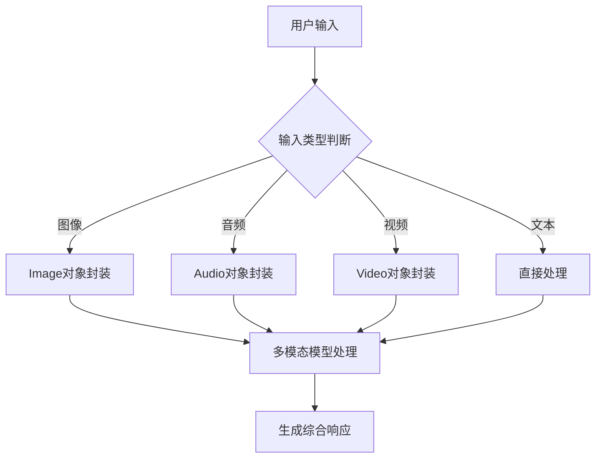
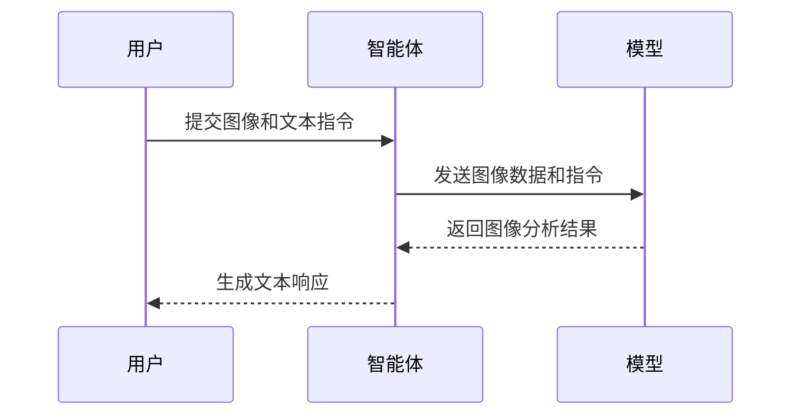
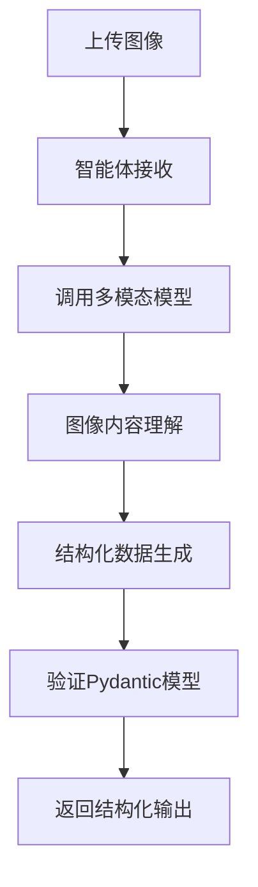
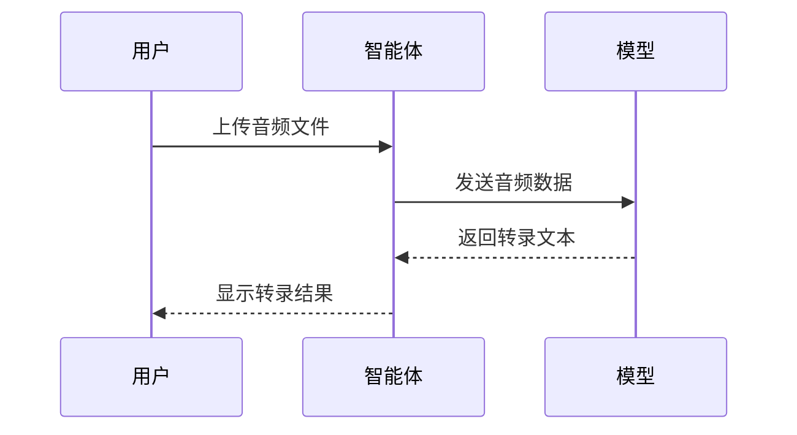
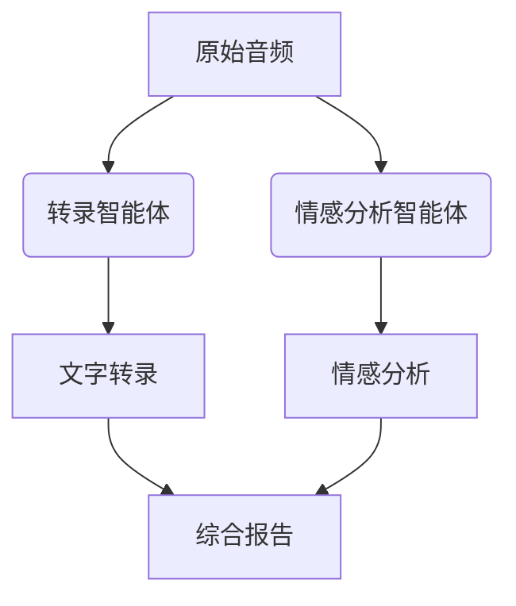
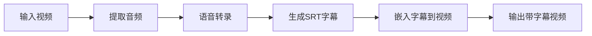
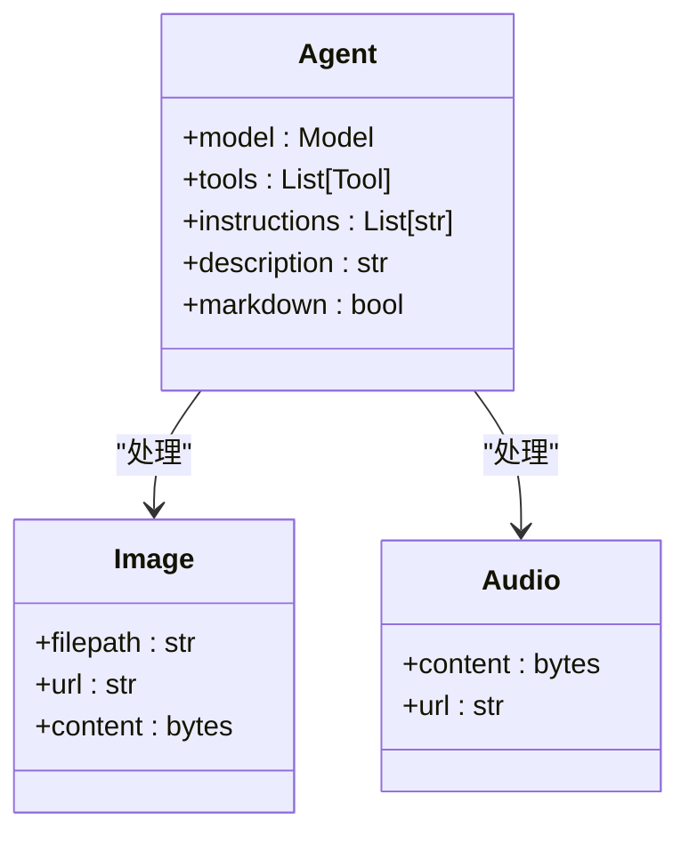
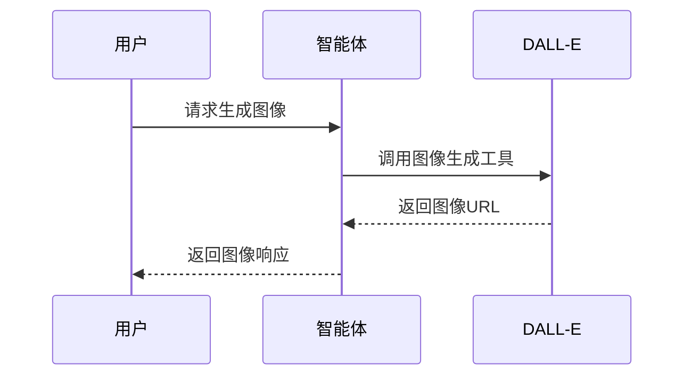

# 多模态处理

<cite>
**本文档中引用的文件**  
- [image_to_text.py](file://cookbook/agents/multimodal/image_to_text.py)
- [audio_to_text.py](file://cookbook/agents/multimodal/audio_to_text.py)
- [video_caption_agent.py](file://cookbook/agents/multimodal/video_caption_agent.py)
- [image_to_structured_output.py](file://cookbook/agents/multimodal/image_to_structured_output.py)
- [audio_sentiment_analysis.py](file://cookbook/teams/multimodal/audio_sentiment_analysis.py)
- [generate_image_with_intermediate_steps.py](file://cookbook/agents/multimodal/generate_image_with_intermediate_steps.py)
- [gemini/README.md](file://cookbook/models/google/gemini/README.md)
- [openai/__init__.py](file://cookbook/models/openai/__init__.py)
</cite>

## 目录
1. [简介](#简介)
2. [多模态输入处理](#多模态输入处理)
3. [图像处理能力](#图像处理能力)
4. [音频处理能力](#音频处理能力)
5. [视频处理能力](#视频处理能力)
6. [多模态模型支持差异](#多模态模型支持差异)
7. [配置与集成](#配置与集成)
8. [高级多模态工作流](#高级多模态工作流)
9. [结论](#结论)

## 简介
Agno 智能体具备强大的多模态处理能力，能够接收和处理文本、图像、音频和视频等多种输入形式。本文档详细说明智能体如何实现图像到文本转换、音频转录和视频分析等功能，通过代码示例展示多模态输入的配置方法、媒体文件处理流程以及多模态信息整合到响应中的机制。同时讨论不同大模型（如GPT-4o、Gemini）对多模态的支持差异，以及如何根据模型能力优化多模态交互流程。

## 多模态输入处理
Agno 智能体通过 `media` 模块统一处理各种媒体输入类型。系统支持将文本、图像、音频和视频等多种输入形式同时传递给智能体，由底层模型进行综合理解和响应生成。多模态输入通过特定的媒体对象（如 `Image`、`Audio`）封装后传递，确保不同类型的数据能够被正确识别和处理。

**多模态输入处理流程**

**图示来源**
- [image_to_text.py](file://cookbook/agents/multimodal/image_to_text.py#L1-L17)
- [audio_to_text.py](file://cookbook/agents/multimodal/audio_to_text.py#L1-L23)
- [video_caption_agent.py](file://cookbook/agents/multimodal/video_caption_agent.py#L1-L38)

## 图像处理能力
Agno 智能体提供全面的图像处理功能，包括图像描述生成、结构化数据提取和图像到图像转换等高级应用。

### 图像到文本转换
智能体能够分析上传的图像并生成详细的文本描述。通过使用支持多模态的模型（如GPT-4o），系统可以理解图像内容并根据指令生成故事、描述或分析。

**图像到文本转换示例**

**图示来源**
- [image_to_text.py](file://cookbook/agents/multimodal/image_to_text.py#L1-L17)

### 图像到结构化输出
系统支持将图像内容转换为结构化的数据格式。通过定义 Pydantic 模型作为输出模式，智能体可以从图像中提取特定信息并组织成预定义的数据结构。

**图像到结构化输出流程**

**图示来源**
- [image_to_structured_output.py](file://cookbook/agents/multimodal/image_to_structured_output.py#L1-L35)

## 音频处理能力
Agno 智能体具备先进的音频处理功能，支持音频转录、情感分析和多轮对话处理。

### 音频转录
系统能够接收音频文件并生成准确的文字转录。通过集成 Gemini 等支持音频输入的模型，智能体可以处理各种音频格式并识别说话人。

**音频转录实现方式**

**图示来源**
- [audio_to_text.py](file://cookbook/agents/multimodal/audio_to_text.py#L1-L23)

### 音频情感分析
通过团队协作模式，多个智能体可以协同工作完成复杂的音频分析任务。一个智能体负责转录，另一个智能体负责情感分析，实现更深入的音频内容理解。

**音频情感分析工作流**

**图示来源**
- [audio_sentiment_analysis.py](file://cookbook/teams/multimodal/audio_sentiment_analysis.py#L1-L62)

## 视频处理能力
Agno 智能体提供完整的视频分析解决方案，包括字幕生成、内容分析和视频编辑功能。

### 视频字幕生成
系统通过组合多个工具实现视频字幕的自动生成和嵌入。工作流程包括音频提取、语音转录、字幕文件生成和字幕嵌入等步骤。

**视频字幕生成流程**

**图示来源**
- [video_caption_agent.py](file://cookbook/agents/multimodal/video_caption_agent.py#L1-L38)

## 多模态模型支持差异
不同的大模型在多模态支持方面存在显著差异，需要根据具体需求选择合适的模型。

### GPT-4o 支持特性
GPT-4o 是 OpenAI 提供的多模态模型，支持图像、音频和文本的综合处理。该模型能够理解复杂的多模态输入并生成高质量的响应。

**GPT-4o 多模态特性**
- 支持图像分析和描述生成
- 支持结构化输出
- 支持工具调用与多模态输入结合
- 提供高保真度的图像理解

**图示来源**
- [openai/__init__.py](file://cookbook/models/openai/__init__.py)

### Gemini 支持特性
Gemini 是 Google 提供的多模态模型，特别擅长音频处理和实时分析。该模型支持多种输入格式，包括字节流和文件上传。

**Gemini 多模态特性**
- 强大的音频处理能力
- 支持视频分析
- 实时流式处理
- 与 Google 生态系统深度集成

**图示来源**
- [gemini/README.md](file://cookbook/models/google/gemini/README.md#L1-L142)

## 配置与集成
配置智能体以支持多模态输入需要正确设置模型和媒体对象。

### 多模态智能体配置

**图示来源**
- [image_to_text.py](file://cookbook/agents/multimodal/image_to_text.py#L1-L17)
- [audio_to_text.py](file://cookbook/agents/multimodal/audio_to_text.py#L1-L23)

## 高级多模态工作流
Agno 支持复杂的多模态工作流，包括生成图像的中间步骤展示和团队协作处理。

### 生成图像的中间步骤
系统可以展示图像生成过程中的中间步骤，提供更透明的处理流程。

**生成图像中间步骤流程**

**图示来源**
- [generate_image_with_intermediate_steps.py](file://cookbook/agents/multimodal/generate_image_with_intermediate_steps.py#L1-L29)

## 结论
Agno 智能体提供了全面的多模态处理能力，支持文本、图像、音频和视频等多种输入形式的综合处理。通过灵活的配置和强大的模型支持，系统能够满足各种复杂的多模态应用场景需求。根据具体任务选择合适的模型（GPT-4o 适合图像和结构化输出，Gemini 适合音频处理），并结合团队协作模式，可以实现更高级的多模态交互体验。