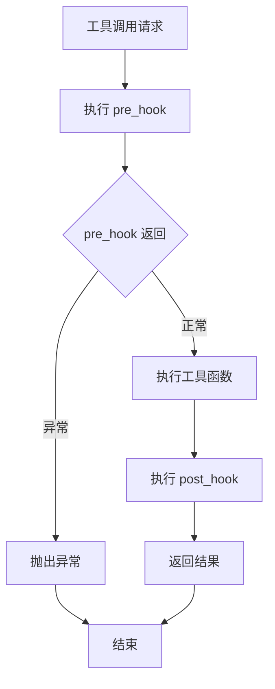
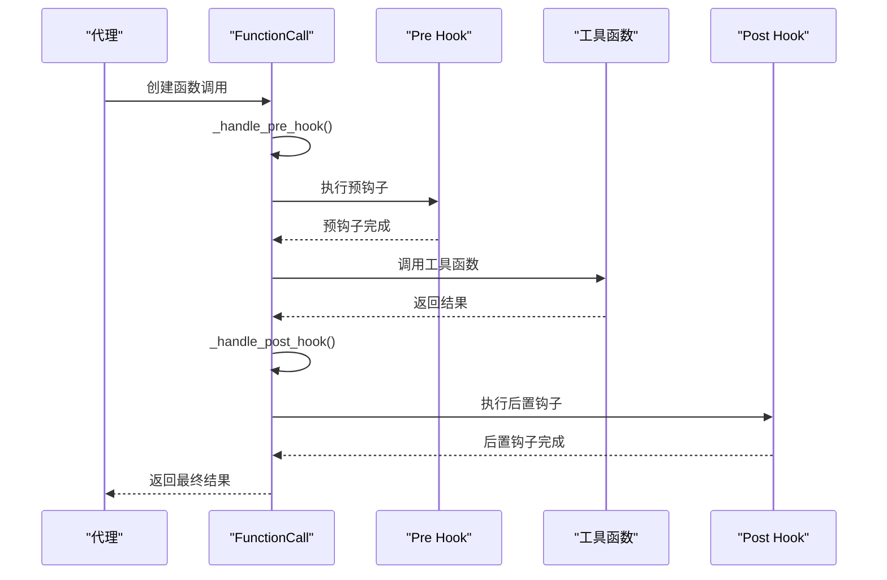
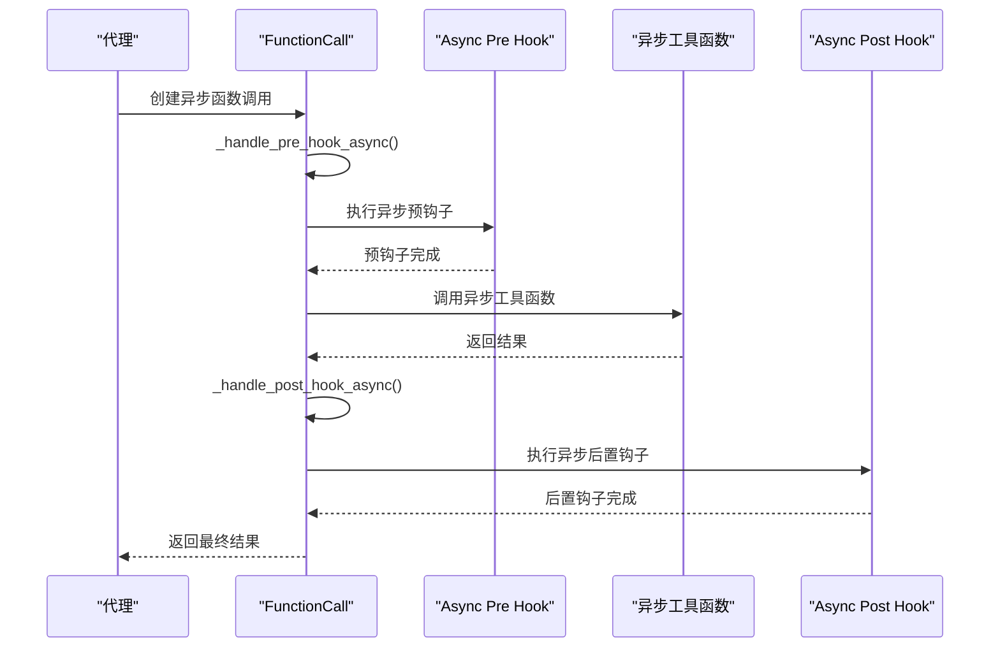
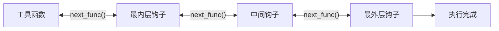
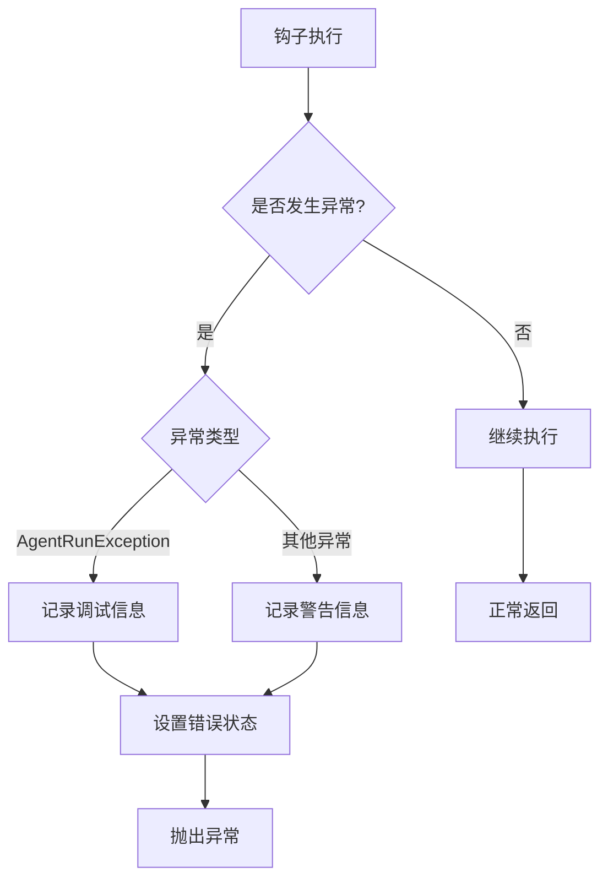

# 工具钩子

<cite>
**本文档引用的文件**
- [decorator.py](file://libs/agno/agno/tools/decorator.py)
- [function.py](file://libs/agno/agno/tools/function.py)
- [toolkit.py](file://libs/agno/agno/tools/toolkit.py)
- [test_tool_hooks.py](file://libs/agno/tests/integration/agent/test_tool_hooks.py)
- [tool_hooks_in_toolkit_nested.py](file://cookbook/tools/tool_hooks/tool_hooks_in_toolkit_nested.py)
- [tool_hooks_in_toolkit_nested_async.py](file://cookbook/tools/tool_hooks/tool_hooks_in_toolkit_nested_async.py)
</cite>

## 目录
1. [简介](#简介)
2. [核心概念](#核心概念)
3. [钩子类型详解](#钩子类型详解)
4. [钩子执行生命周期](#钩子执行生命周期)
5. [钩子参数和返回值](#钩子参数和返回值)
6. [钩子注册方式](#钩子注册方式)
7. [实际应用示例](#实际应用示例)
8. [异常处理机制](#异常处理机制)
9. [性能考虑](#性能考虑)
10. [最佳实践](#最佳实践)

## 简介

工具钩子（Tool Hooks）是 Agno 框架中一个强大的功能，允许开发者在工具调用的前后拦截和修改执行流程。钩子系统提供了三个主要的钩子类型：`pre_hook`（预钩子）、`post_hook`（后置钩子）和`tool_hooks`（工具级钩子）。这些钩子可以在工具执行的不同阶段插入自定义逻辑，实现诸如日志记录、性能监控、权限验证、输入预处理和结果缓存等功能。

## 核心概念

### 钩子的基本工作原理

钩子系统基于函数式编程的设计理念，通过在工具调用的关键节点插入回调函数来实现对执行流程的控制。每个钩子都可以访问当前的执行上下文，并可以选择性地修改参数、阻止执行或记录执行状态。

### 支持的钩子类型

1. **pre_hook**：在工具函数执行前运行
2. **post_hook**：在工具函数执行后运行
3. **tool_hooks**：工具级别的钩子列表，支持多个钩子按顺序执行



**图表来源**
- [function.py](file://libs/agno/agno/tools/function.py#L550-L600)

## 钩子类型详解

### Pre Hook（预钩子）

预钩子在工具函数执行之前运行，主要用于：
- 参数验证和预处理
- 权限检查
- 输入数据转换
- 执行前的日志记录

```python
def pre_hook(agent=None, team=None, session_state=None, fc=None):
    # 在这里进行预处理逻辑
    if agent:
        logger.info(f"Agent: {agent.name}")
    if fc:
        logger.info(f"Calling function: {fc.function.name}")
```

### Post Hook（后置钩子）

后置钩子在工具函数执行之后运行，无论成功还是失败都会执行，主要用于：
- 结果处理和转换
- 后续清理工作
- 执行后的日志记录
- 性能指标收集

```python
def post_hook(agent=None, team=None, session_state=None, fc=None):
    # 在这里进行后处理逻辑
    if fc and fc.result:
        logger.info(f"Function {fc.function.name} returned: {fc.result}")
```

### Tool Hooks（工具级钩子）

工具级钩子是一个钩子函数列表，支持多个钩子按顺序执行。这种设计允许复杂的钩子链，每个钩子可以专注于特定的功能领域。

```python
# 多个钩子按顺序执行
tool_hooks=[
    validation_hook,      # 第一个执行：验证逻辑
    logging_hook,         # 第二个执行：日志记录
    caching_hook          # 最后执行：缓存处理
]
```

**章节来源**
- [decorator.py](file://libs/agno/agno/tools/decorator.py#L100-L150)
- [function.py](file://libs/agno/agno/tools/function.py#L100-L150)

## 钩子执行生命周期

### 同步执行流程



**图表来源**
- [function.py](file://libs/agno/agno/tools/function.py#L550-L650)

### 异步执行流程

对于异步工具函数，钩子系统提供了相应的异步处理机制：



**图表来源**
- [function.py](file://libs/agno/agno/tools/function.py#L800-L900)

**章节来源**
- [function.py](file://libs/agno/agno/tools/function.py#L550-L700)
- [function.py](file://libs/agno/agno/tools/function.py#L800-L950)

## 钩子参数和返回值

### 可用的钩子参数

钩子函数可以根据需要接收以下参数：

| 参数名 | 类型 | 描述 |
|--------|------|------|
| `agent` | Agent实例 | 当前执行的代理对象 |
| `team` | Team实例 | 当前执行的团队对象 |
| `session_state` | Dict | 当前会话状态 |
| `dependencies` | Dict | 依赖项集合 |
| `fc` | FunctionCall | 函数调用实例 |
| `name` | str | 工具名称 |
| `function_name` | str | 工具名称（兼容别名） |
| `function` | Callable | 工具函数对象 |
| `func` | Callable | 工具函数对象（兼容别名） |
| `function_call` | Callable | 工具函数对象（兼容别名） |
| `args` | Dict | 参数字典（兼容别名） |
| `arguments` | Dict | 参数字典 |

### 参数自动检测机制

钩子系统会自动检测钩子函数的签名，并根据可用参数动态构建调用参数：

```python
def _build_hook_args(self, hook: Callable, name: str, func: Callable, args: Dict[str, Any]) -> Dict[str, Any]:
    """为钩子构建参数"""
    from inspect import signature
    
    hook_args = {}
    # 自动检测并添加可用参数
    if "agent" in signature(hook).parameters:
        hook_args["agent"] = self.function._agent
    if "team" in signature(hook).parameters:
        hook_args["team"] = self.function._team
    if "session_state" in signature(hook).parameters:
        hook_args["session_state"] = self.function._session_state
    # ... 其他参数检测
    return hook_args
```

### 返回值处理

钩子函数的返回值会被传递给下一个钩子或最终的工具函数：

```python
def create_hook_wrapper(inner_func, hook):
    """创建钩子包装器"""
    def wrapper(name, func, args):
        def next_func(**kwargs):
            return inner_func(name, func, kwargs)
        
        hook_args = self._build_hook_args(hook, name, next_func, args)
        return hook(**hook_args)
    return wrapper
```

**章节来源**
- [function.py](file://libs/agno/agno/tools/function.py#L650-L700)
- [function.py](file://libs/agno/agno/tools/function.py#L700-L750)

## 钩子注册方式

### 单个工具级别注册

可以通过工具装饰器直接注册钩子：

```python
@tool(pre_hook=my_pre_hook, post_hook=my_post_hook)
def my_tool(param1: str, param2: int) -> str:
    """我的工具函数"""
    return f"Processed {param1} with {param2}"
```

### 工具包级别注册

在工具包中统一配置钩子：

```python
class MyToolkit(Toolkit):
    def __init__(self):
        super().__init__(
            name="my_toolkit",
            tools=[self.my_tool],
            pre_hook=my_pre_hook,
            post_hook=my_post_hook
        )
```

### 多个工具钩子组合

支持多个工具钩子按顺序执行：

```python
@tool(tool_hooks=[validation_hook, logging_hook, caching_hook])
def my_tool(param1: str, param2: int) -> str:
    """带多个钩子的工具函数"""
    return f"Processed {param1} with {param2}"
```

### 钩子执行顺序

当使用多个工具钩子时，它们会按照注册的顺序从内到外执行：



**图表来源**
- [function.py](file://libs/agno/agno/tools/function.py#L700-L750)

**章节来源**
- [decorator.py](file://libs/agno/agno/tools/decorator.py#L100-L200)
- [toolkit.py](file://libs/agno/agno/tools/toolkit.py#L50-L100)

## 实际应用示例

### 日志记录钩子

```python
def logger_hook(function_name: str, function_call: Callable, arguments: Dict[str, Any]) -> Any:
    """日志记录钩子示例"""
    logger.info(f"HOOK PRE: Calling {function_name} with args {arguments}")
    
    # 执行工具函数
    result = function_call(**arguments)
    
    logger.info(f"HOOK POST: {function_name} returned {result}")
    return result
```

### 权限验证钩子

```python
def permission_check_hook(function_name: str, function_call: Callable, arguments: Dict[str, Any]) -> Any:
    """权限验证钩子示例"""
    # 检查用户是否有权限执行该操作
    if not has_permission(current_user, function_name):
        raise PermissionError(f"User {current_user.id} does not have permission to call {function_name}")
    
    return function_call(**arguments)
```

### 输入预处理钩子

```python
def input_validation_hook(function_name: str, function_call: Callable, arguments: Dict[str, Any]) -> Any:
    """输入验证钩子示例"""
    # 验证必需参数
    required_params = get_required_parameters(function_name)
    for param in required_params:
        if param not in arguments:
            raise ValueError(f"Missing required parameter: {param}")
    
    # 预处理参数
    processed_args = preprocess_arguments(arguments)
    
    return function_call(**processed_args)
```

### 性能监控钩子

```python
import time
from functools import wraps

def performance_monitor_hook(function_name: str, function_call: Callable, arguments: Dict[str, Any]) -> Any:
    """性能监控钩子示例"""
    start_time = time.time()
    
    try:
        result = function_call(**arguments)
        duration = time.time() - start_time
        
        logger.info(f"Function {function_name} executed in {duration:.3f}s")
        record_performance_metric(function_name, duration)
        
        return result
    except Exception as e:
        duration = time.time() - start_time
        logger.error(f"Function {function_name} failed after {duration:.3f}s: {e}")
        raise
```

### 结果缓存钩子

```python
import hashlib
import json
from pathlib import Path

def caching_hook(function_name: str, function_call: Callable, arguments: Dict[str, Any]) -> Any:
    """结果缓存钩子示例"""
    # 生成缓存键
    cache_key = generate_cache_key(function_name, arguments)
    cache_file = get_cache_file_path(cache_key)
    
    # 检查缓存
    if cache_file.exists():
        with open(cache_file, 'r') as f:
            cached_data = json.load(f)
            if time.time() - cached_data['timestamp'] < CACHE_TTL:
                return cached_data['result']
    
    # 执行函数并缓存结果
    result = function_call(**arguments)
    
    # 缓存结果
    cache_data = {
        'timestamp': time.time(),
        'result': result
    }
    with open(cache_file, 'w') as f:
        json.dump(cache_data, f)
    
    return result

def generate_cache_key(function_name: str, arguments: Dict[str, Any]) -> str:
    """生成缓存键"""
    arg_string = json.dumps(arguments, sort_keys=True)
    return hashlib.md5(f"{function_name}:{arg_string}".encode()).hexdigest()
```

### 组合钩子示例

```python
# 创建工具包并注册多个钩子
class BusinessToolkit(Toolkit):
    def __init__(self):
        super().__init__(
            name="business_tools",
            tools=[self.create_order, self.update_inventory, self.send_notification]
        )
    
    def create_order(self, order_data: dict) -> dict:
        """创建订单"""
        return {"status": "created", "order_id": "ORD-123"}
    
    def update_inventory(self, product_id: str, quantity: int) -> dict:
        """更新库存"""
        return {"status": "updated", "product_id": product_id}
    
    def send_notification(self, message: str) -> dict:
        """发送通知"""
        return {"status": "sent", "message": message}

# 注册钩子
agent = Agent(
    tools=[BusinessToolkit()],
    tool_hooks=[
        permission_check_hook,    # 权限检查
        input_validation_hook,    # 输入验证
        performance_monitor_hook, # 性能监控
        logger_hook               # 日志记录
    ]
)
```

**章节来源**
- [test_tool_hooks.py](file://libs/agno/tests/integration/agent/test_tool_hooks.py#L10-L50)
- [tool_hooks_in_toolkit_nested.py](file://cookbook/tools/tool_hooks/tool_hooks_in_toolkit_nested.py#L40-L80)

## 异常处理机制

### 钩子异常处理策略

钩子系统提供了完善的异常处理机制：



**图表来源**
- [function.py](file://libs/agno/agno/tools/function.py#L550-L600)

### 异常处理实现

```python
def _handle_pre_hook(self):
    """处理预钩子"""
    if self.function.pre_hook is not None:
        try:
            # 执行钩子逻辑
            self.function.pre_hook(**pre_hook_args)
        except AgentRunException as e:
            # 记录调试信息并重新抛出
            log_debug(f"{e.__class__.__name__}: {e}")
            self.error = str(e)
            raise
        except Exception as e:
            # 记录警告信息但不中断执行
            log_warning(f"Error in pre-hook callback: {e}")
            log_exception(e)

def _handle_post_hook(self):
    """处理后置钩子"""
    if self.function.post_hook is not None:
        try:
            # 执行钩子逻辑
            self.function.post_hook(**post_hook_args)
        except AgentRunException as e:
            # 记录调试信息并重新抛出
            log_debug(f"{e.__class__.__name__}: {e}")
            self.error = str(e)
            raise
        except Exception as e:
            # 记录警告信息但不中断执行
            log_warning(f"Error in post-hook callback: {e}")
            log_exception(e)
```

### 嵌套钩子的异常传播

当使用多个工具钩子时，异常会在钩子链中正确传播：

```python
try:
    # 执行第一个钩子
    result = hook1(next_func, args)
except Exception as e:
    # 如果第一个钩子失败，不会执行后续钩子
    raise
```

**章节来源**
- [function.py](file://libs/agno/agno/tools/function.py#L550-L650)
- [function.py](file://libs/agno/agno/tools/function.py#L800-L900)

## 性能考虑

### 钩子性能影响

钩子系统的设计考虑了性能影响：

1. **延迟最小化**：钩子只在必要时执行
2. **异步支持**：支持异步钩子以避免阻塞
3. **条件执行**：只有在钩子存在时才执行相应逻辑

### 性能优化建议

```python
# 避免在钩子中执行耗时操作
def efficient_hook(function_name: str, function_call: Callable, arguments: Dict[str, Any]) -> Any:
    # 快速检查而非复杂计算
    if not quick_validation(arguments):
        return function_call(**arguments)
    
    # 使用轻量级日志记录
    logger.debug(f"Fast hook execution for {function_name}")
    
    return function_call(**arguments)

# 对于复杂钩子，考虑异步实现
async def async_efficient_hook(function_name: str, function_call: Callable, arguments: Dict[str, Any]) -> Any:
    # 异步执行非关键任务
    await background_task(function_name, arguments)
    
    return function_call(**arguments)
```

### 内存管理

钩子系统会自动管理内存使用：

```python
def _build_entrypoint_args(self) -> Dict[str, Any]:
    """构建入口点参数，自动排除不必要的参数"""
    entrypoint_args = {}
    # 只添加钩子函数签名中存在的参数
    if "agent" in signature(self.function.entrypoint).parameters:
        entrypoint_args["agent"] = self.function._agent
    # ... 其他参数
    return entrypoint_args
```

## 最佳实践

### 钩子设计原则

1. **单一职责**：每个钩子应该专注于一个特定的功能
2. **幂等性**：钩子应该是幂等的，多次执行应产生相同的结果
3. **快速失败**：在发现问题时尽早返回错误
4. **无副作用**：钩子不应改变工具函数的预期行为

### 错误处理最佳实践

```python
def robust_hook(function_name: str, function_call: Callable, arguments: Dict[str, Any]) -> Any:
    """健壮的钩子实现示例"""
    try:
        # 参数验证
        validate_arguments(arguments)
        
        # 权限检查
        check_permissions(function_name, arguments)
        
        # 执行钩子逻辑
        result = function_call(**arguments)
        
        # 结果验证
        validate_result(result)
        
        return result
        
    except ValidationError as e:
        logger.error(f"Validation failed for {function_name}: {e}")
        raise ValueError(f"Invalid arguments for {function_name}")
    
    except PermissionError as e:
        logger.warning(f"Permission denied for {function_name}: {e}")
        raise
    
    except Exception as e:
        logger.exception(f"Unexpected error in hook for {function_name}")
        # 不要泄露敏感信息
        raise RuntimeError(f"Hook execution failed for {function_name}")
```

### 测试钩子的最佳实践

```python
import unittest
from unittest.mock import patch, MagicMock

class TestHooks(unittest.TestCase):
    def test_logger_hook(self):
        """测试日志钩子"""
        with patch('logging.Logger.info') as mock_logger:
            result = logger_hook("test_function", lambda **kwargs: "test_result", {"arg": "value"})
            
            mock_logger.assert_called_with("HOOK PRE: Calling test_function with args {'arg': 'value'}")
            self.assertEqual(result, "test_result")
    
    def test_permission_hook(self):
        """测试权限钩子"""
        with patch('has_permission', return_value=False):
            with self.assertRaises(PermissionError):
                permission_check_hook("restricted_function", lambda **kwargs: "result", {})
    
    def test_validation_hook(self):
        """测试验证钩子"""
        with self.assertRaises(ValueError):
            input_validation_hook("test_function", lambda **kwargs: "result", {})
```

### 生产环境部署建议

1. **配置管理**：使用配置文件管理钩子启用状态
2. **监控集成**：将钩子执行情况集成到监控系统
3. **日志分级**：合理使用不同级别的日志记录
4. **性能监控**：定期评估钩子对系统性能的影响

```python
# 生产环境配置示例
PRODUCTION_HOOK_CONFIG = {
    "permission_check": True,
    "input_validation": True,
    "performance_monitoring": True,
    "logging": True,
    "caching": True
}

def create_production_agent():
    hooks = []
    
    if PRODUCTION_HOOK_CONFIG["permission_check"]:
        hooks.append(permission_check_hook)
    
    if PRODUCTION_HOOK_CONFIG["input_validation"]:
        hooks.append(input_validation_hook)
    
    if PRODUCTION_HOOK_CONFIG["performance_monitoring"]:
        hooks.append(performance_monitor_hook)
    
    if PRODUCTION_HOOK_CONFIG["logging"]:
        hooks.append(logger_hook)
    
    if PRODUCTION_HOOK_CONFIG["caching"]:
        hooks.append(caching_hook)
    
    return Agent(tools=[MyToolkit()], tool_hooks=hooks)
```

通过遵循这些最佳实践，可以确保钩子系统的稳定性和可维护性，同时最大化其功能价值。