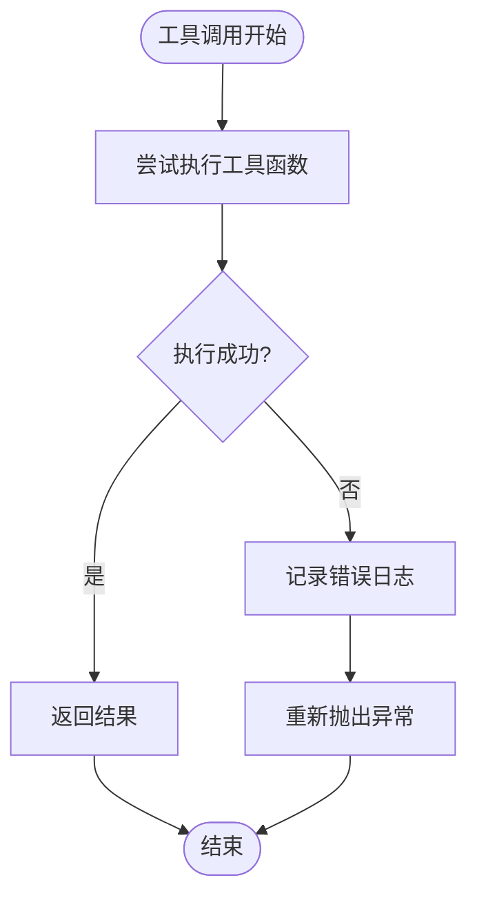
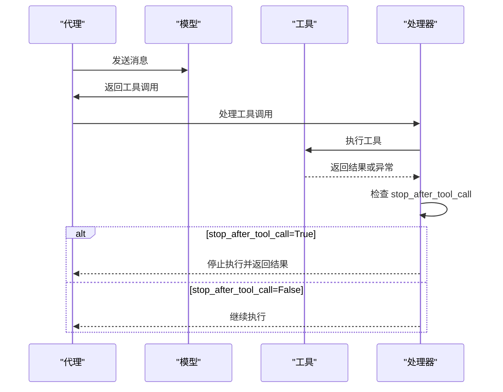

# 工具错误处理和重试机制

<cite>
**本文档中引用的文件**
- [exceptions.py](file://libs/agno/agno/exceptions.py)
- [decorator.py](file://libs/agno/agno/tools/decorator.py)
- [file.py](file://libs/agno/agno/tools/file.py)
- [base.py](file://libs/agno/agno/models/base.py)
- [agent.py](file://libs/agno/agno/agent/agent.py)
- [team.py](file://libs/agno/agno/team/team.py)
- [step.py](file://libs/agno/agno/workflow/step.py)
- [http.py](file://libs/agno/agno/utils/http.py)
</cite>

## 目录
1. [简介](#简介)
2. [核心异常类型](#核心异常类型)
3. [工具装饰器错误处理](#工具装饰器错误处理)
4. [内置重试策略](#内置重试策略)
5. [高级控制流工具](#高级控制流工具)
6. [文件操作工具示例](#文件操作工具示例)
7. [自定义错误处理](#自定义错误处理)
8. [最佳实践](#最佳实践)
9. [故障排除指南](#故障排除指南)
10. [总结](#总结)

## 简介

Agno 框架提供了一套完整的工具错误处理和重试机制，确保智能体在执行工具时能够优雅地处理各种异常情况。该系统包含多种异常类型、内置重试策略、以及高级控制流工具，为开发者提供了强大的错误恢复能力。

## 核心异常类型

Agno 定义了一系列专门的异常类型来处理不同级别的错误：

### AgentRunException 基础异常

所有运行时异常都继承自 `AgentRunException`，它提供了统一的错误处理接口：

```python
class AgentRunException(Exception):
    def __init__(
        self,
        exc,
        user_message: Optional[Union[str, Message]] = None,
        agent_message: Optional[Union[str, Message]] = None,
        messages: Optional[List[Union[dict, Message]]] = None,
        stop_execution: bool = False,
    ):
        super().__init__(exc)
        self.user_message = user_message
        self.agent_message = agent_message
        self.messages = messages
        self.stop_execution = stop_execution
```

### RetryAgentRun 异常

当需要重试某个工具调用时使用此异常：

```python
class RetryAgentRun(AgentRunException):
    """Exception raised when a tool call should be retried."""
    
    def __init__(
        self,
        exc,
        user_message: Optional[Union[str, Message]] = None,
        agent_message: Optional[Union[str, Message]] = None,
        messages: Optional[List[Union[dict, Message]]] = None,
    ):
        super().__init__(
            exc, user_message=user_message, agent_message=agent_message, 
            messages=messages, stop_execution=False
        )
```

### StopAgentRun 异常

当需要完全停止代理执行时使用此异常：

```python
class StopAgentRun(AgentRunException):
    """Exception raised when an agent should stop executing entirely."""
    
    def __init__(
        self,
        exc,
        user_message: Optional[Union[str, Message]] = None,
        agent_message: Optional[Union[str, Message]] = None,
        messages: Optional[List[Union[dict, Message]]] = None,
    ):
        super().__init__(
            exc, user_message=user_message, agent_message=agent_message, 
            messages=messages, stop_execution=True
        )
```

### 其他专用异常

框架还提供了其他专用异常：

- `RunCancelledException`: 运行被用户取消时抛出
- `AgnoError`: 内部错误的基础异常
- `ModelProviderError`: 模型提供商返回错误时抛出
- `ModelRateLimitError`: 模型速率限制错误

**章节来源**
- [exceptions.py](file://libs/agno/agno/exceptions.py#L1-L95)

## 工具装饰器错误处理

工具装饰器提供了自动化的错误处理机制，确保工具函数在执行过程中出现异常时能够正确处理：

### 同步工具包装器

```python
@wraps(func)
def sync_wrapper(*args: Any, **kwargs: Any) -> Any:
    try:
        return func(*args, **kwargs)
    except Exception as e:
        logger.error(
            f"Error in tool {func.__name__!r}: {e!r}",
            exc_info=True,
        )
        raise
```

### 异步工具包装器

```python
@wraps(func)
async def async_wrapper(*args: Any, **kwargs: Any) -> Any:
    try:
        return await func(*args, **kwargs)
    except Exception as e:
        logger.error(
            f"Error in async tool {func.__name__!r}: {e!r}",
            exc_info=True,
        )
        raise
```

### 错误处理流程



**图表来源**
- [decorator.py](file://libs/agno/agno/tools/decorator.py#L153-L189)

**章节来源**
- [decorator.py](file://libs/agno/agno/tools/decorator.py#L153-L200)

## 内置重试策略

Agno 提供了多层次的重试机制，支持指数退避和条件重试：

### 步骤级别重试

在工作流步骤中，可以配置最大重试次数：

```python
# Execute with retries
for attempt in range(self.max_retries + 1):
    try:
        response: Union[RunOutput, TeamRunOutput, StepOutput]
        # 执行步骤逻辑
        if self._executor_type == "function":
            if inspect.iscoroutinefunction(self.active_executor) or inspect.isasyncgenfunction(
                self.active_executor
            ):
                raise ValueError("Cannot use async function with synchronous execution")
            # 处理同步函数执行...
    except Exception as e:
        last_exception = e
        if attempt < num_attempts - 1:  # Don't sleep on the last attempt
            if self.exponential_backoff:
                delay = 2**attempt * self.delay_between_retries
            else:
                delay = self.delay_between_retries
            time.sleep(delay)
```

### 团队级别重试

团队级别的重试机制更加复杂，支持多种错误类型的处理：

```python
# 如果没有设置重试，则使用团队的默认重试
retries = retries if retries is not None else self.retries

# 初始化团队运行上下文
team_run_context: Dict[str, Any] = {}

# 执行重试循环
for attempt in range(num_attempts):
    try:
        # 执行团队逻辑
        pass
    except ModelProviderError as e:
        log_warning(f"Attempt {attempt + 1}/{num_attempts} failed: {str(e)}")
        last_exception = e
        if attempt < num_attempts - 1:  # 最后一次尝试不等待
            if self.exponential_backoff:
                delay = 2**attempt * self.delay_between_retries
            else:
                delay = self.delay_between_retries
            time.sleep(delay)
    except RunCancelledException as e:
        # 处理运行取消
        log_info(f"Team run {run_response.run_id} was cancelled")
        run_response.content = str(e)
        run_response.status = RunStatus.cancelled
        team_session.upsert_run(run_response=run_response)
        self.save_session(session=team_session)
        return run_response
```

### HTTP 请求重试

对于网络请求，框架提供了专门的重试机制：

```python
DEFAULT_MAX_RETRIES = 3
DEFAULT_BACKOFF_FACTOR = 2  # 指数退避：1, 2, 4, 8...

def fetch_with_retry(
    url: str,
    max_retries: int = DEFAULT_MAX_RETRIES,
    backoff_factor: int = DEFAULT_BACKOFF_FACTOR,
    proxy: Optional[str] = None,
) -> httpx.Response:
    """带重试逻辑的同步HTTP GET请求"""
    
    for attempt in range(max_retries):
        try:
            response = httpx.get(url, proxy=proxy) if proxy else httpx.get(url)
            response.raise_for_status()
            return response
        except httpx.RequestError as e:
            if attempt == max_retries - 1:
                logger.error(f"Failed to fetch {url} after {max_retries} attempts: {e}")
                raise
            wait_time = backoff_factor**attempt
            logger.warning(f"Request failed (attempt {attempt + 1}), retrying in {wait_time} seconds...")
            sleep(wait_time)
        except httpx.HTTPStatusError as e:
            logger.error(f"HTTP error for {url}: {e.response.status_code} - {e.response.text}")
            raise
```

**章节来源**
- [step.py](file://libs/agno/agno/workflow/step.py#L213-L239)
- [team.py](file://libs/agno/agno/team/team.py#L1219-L1333)
- [http.py](file://libs/agno/agno/utils/http.py#L1-L73)

## 高级控制流工具

### stop_after_tool_call 参数

`stop_after_tool_call` 是一个重要的控制流参数，允许工具在执行完成后立即停止代理：

```python
# 自动设置 show_result=True 如果 stop_after_tool_call=True（除非显式设置为 False）
if kwargs.get("stop_after_tool_call") is True:
    if "show_result" not in kwargs or kwargs.get("show_result") is None:
        tool_config["show_result"] = True
```

### 工具执行检查流程



**图表来源**
- [base.py](file://libs/agno/agno/models/base.py#L302-L330)
- [decorator.py](file://libs/agno/agno/tools/decorator.py#L220-L240)

### 条件重试机制

框架支持基于条件的重试决策：

```python
# 检查是否应该在工具调用后停止
if any(m.stop_after_tool_call for m in function_call_results):
    break

# 如果有需要确认的工具调用，中断循环
if any(tc.requires_confirmation for tc in model_response.tool_executions or []):
    break

# 如果有需要外部执行的工具调用，中断循环
if any(tc.external_execution_required for tc in model_response.tool_executions or []):
    break

# 如果有需要用户输入的工具调用，中断循环
if any(tc.requires_user_input for tc in model_response.tool_executions or []):
    break
```

**章节来源**
- [base.py](file://libs/agno/agno/models/base.py#L302-L330)
- [decorator.py](file://libs/agno/agno/tools/decorator.py#L220-L240)

## 文件操作工具示例

让我们通过一个健壮的文件操作工具示例来展示错误处理的实际应用：

### FileTools 类实现

```python
class FileTools(Toolkit):
    def __init__(
        self,
        base_dir: Optional[Path] = None,
        enable_save_file: bool = True,
        enable_read_file: bool = True,
        enable_list_files: bool = True,
        enable_search_files: bool = True,
        all: bool = False,
        **kwargs,
    ):
        self.base_dir: Path = base_dir or Path.cwd()
        
        tools: List[Any] = []
        if all or enable_save_file:
            tools.append(self.save_file)
        if all or enable_read_file:
            tools.append(self.read_file)
        if all or enable_list_files:
            tools.append(self.list_files)
        if all or enable_search_files:
            tools.append(self.search_files)
            
        super().__init__(name="file_tools", tools=tools, **kwargs)
```

### 保存文件功能的错误处理

```python
def save_file(self, contents: str, file_name: str, overwrite: bool = True) -> str:
    """将内容保存到名为 `file_name` 的文件中，并在成功时返回文件名。
    
    :param contents: 要保存的内容
    :param file_name: 要保存到的文件名
    :param overwrite: 如果文件已存在则覆盖
    :return: 成功时返回文件名，否则返回错误消息
    """
    try:
        file_path = self.base_dir.joinpath(file_name)
        log_debug(f"Saving contents to {file_path}")
        
        # 确保父目录存在
        if not file_path.parent.exists():
            file_path.parent.mkdir(parents=True, exist_ok=True)
            
        # 检查文件是否存在
        if file_path.exists() and not overwrite:
            return f"File {file_name} already exists"
            
        # 写入文件
        file_path.write_text(contents)
        log_info(f"Saved: {file_path}")
        return str(file_name)
    except Exception as e:
        log_error(f"Error saving to file: {e}")
        return f"Error saving to file: {e}"
```

### 读取文件功能的错误处理

```python
def read_file(self, file_name: str) -> str:
    """读取 `file_name` 文件的内容并返回内容（如果成功）。
    
    :param file_name: 要读取的文件名
    :return: 成功时返回文件内容，否则返回错误消息
    """
    try:
        log_info(f"Reading file: {file_name}")
        file_path = self.base_dir.joinpath(file_name)
        contents = file_path.read_text(encoding="utf-8")
        return str(contents)
    except FileNotFoundError:
        log_error(f"File not found: {file_name}")
        return f"Error: File '{file_name}' not found"
    except PermissionError:
        log_error(f"Permission denied: {file_name}")
        return f"Error: Permission denied for file '{file_name}'"
    except UnicodeDecodeError:
        log_error(f"Unicode decode error: {file_name}")
        return f"Error: Unable to decode file '{file_name}'"
    except Exception as e:
        log_error(f"Unexpected error reading file: {e}")
        return f"Error reading file: {e}"
```

### 文件搜索功能的错误处理

```python
def search_files(self, pattern: str) -> str:
    """在基础目录中搜索匹配模式的文件
    
    :param pattern: 要搜索的模式，例如 "*.txt", "file*.csv", "**/*.py"
    :return: 匹配文件路径的JSON格式列表，或错误消息
    """
    try:
        if not pattern or not pattern.strip():
            return "Error: Pattern cannot be empty"
            
        log_debug(f"Searching files in {self.base_dir} with pattern {pattern}")
        matching_files = list(self.base_dir.glob(pattern))
        
        file_paths = [str(file_path) for file_path in matching_files]
        
        result = {
            "pattern": pattern,
            "base_directory": str(self.base_dir),
            "matches_found": len(file_paths),
            "files": file_paths,
        }
        log_debug(f"Found {len(file_paths)} files matching pattern {pattern}")
        return json.dumps(result, indent=2)
        
    except Exception as e:
        error_msg = f"Error searching files with pattern '{pattern}': {e}"
        log_error(error_msg)
        return error_msg
```

**章节来源**
- [file.py](file://libs/agno/agno/tools/file.py#L1-L111)

## 自定义错误处理

### 创建自定义工具装饰器

```python
from agno.tools.decorator import tool
from agno.exceptions import RetryAgentRun, StopAgentRun

@tool(
    name="robust_file_operation",
    description="执行健壮的文件操作，包含错误处理和重试机制",
    stop_after_tool_call=True,
    requires_confirmation=True
)
def robust_file_operation(file_path: str, operation: str = "read") -> str:
    """执行健壮的文件操作
    
    Args:
        file_path: 文件路径
        operation: 操作类型 ('read', 'write', 'delete')
        
    Returns:
        操作结果或错误信息
    """
    try:
        path = Path(file_path)
        
        if operation == "read":
            if not path.exists():
                raise FileNotFoundError(f"File not found: {file_path}")
            if not path.is_file():
                raise IsADirectoryError(f"Not a file: {file_path}")
                
            content = path.read_text(encoding="utf-8")
            return f"Successfully read {file_path}: {content[:100]}..."
            
        elif operation == "write":
            # 实现写入逻辑
            pass
            
        elif operation == "delete":
            if not path.exists():
                raise FileNotFoundError(f"File not found: {file_path}")
            path.unlink()
            return f"Successfully deleted {file_path}"
            
        else:
            raise ValueError(f"Unsupported operation: {operation}")
            
    except FileNotFoundError as e:
        # 可以选择重试
        raise RetryAgentRun(e, stop_execution=False)
        
    except PermissionError as e:
        # 权限错误可能不需要重试
        raise StopAgentRun(e, stop_execution=True)
        
    except Exception as e:
        # 其他错误
        log_error(f"Unexpected error in file operation: {e}")
        return f"Error: {str(e)}"
```

### 实现自定义重试逻辑

```python
from agno.tools.decorator import tool
import time
from typing import Optional

@tool(
    name="delayed_file_operation",
    description="带有延迟重试的文件操作",
    stop_after_tool_call=True
)
def delayed_file_operation(file_path: str, max_retries: int = 3) -> str:
    """带有延迟重试的文件操作
    
    Args:
        file_path: 文件路径
        max_retries: 最大重试次数
        
    Returns:
        操作结果或错误信息
    """
    for attempt in range(max_retries + 1):
        try:
            path = Path(file_path)
            
            if not path.exists():
                if attempt < max_retries:
                    # 等待一段时间后重试
                    wait_time = 2 ** attempt
                    time.sleep(wait_time)
                    continue
                else:
                    return f"Error: File not found after {max_retries} retries"
                    
            # 执行文件操作
            content = path.read_text(encoding="utf-8")
            return f"Success: {len(content)} characters read"
            
        except Exception as e:
            if attempt < max_retries:
                wait_time = 2 ** attempt
                time.sleep(wait_time)
                continue
            else:
                return f"Error after {max_retries} retries: {str(e)}"
```

## 最佳实践

### 1. 错误分类和处理策略

```python
# 推荐的错误处理策略
def handle_tool_errors(exception: Exception, attempt: int, max_attempts: int) -> str:
    """根据错误类型决定处理策略"""
    
    if isinstance(exception, FileNotFoundError):
        # 文件不存在，可能是临时问题，可以重试
        if attempt < max_attempts:
            return f"File not found, retrying... (attempt {attempt + 1})"
        else:
            return "File not found, giving up"
            
    elif isinstance(exception, PermissionError):
        # 权限错误，通常不需要重试
        return "Permission denied, cannot retry"
        
    elif isinstance(exception, TimeoutError):
        # 超时错误，可以重试
        if attempt < max_attempts:
            return f"Timeout occurred, retrying... (attempt {attempt + 1})"
        else:
            return "Operation timed out, giving up"
            
    else:
        # 其他未知错误
        if attempt < max_attempts:
            return f"Unknown error occurred, retrying... (attempt {attempt + 1})"
        else:
            return f"Operation failed after {max_attempts} attempts"
```

### 2. 使用 stop_after_tool_call 的场景

```python
# 场景1：数据查询工具
@tool(
    name="database_query",
    description="执行数据库查询",
    stop_after_tool_call=True  # 查询完成后立即停止
)
def database_query(query: str) -> str:
    """执行数据库查询并返回结果"""

# 场景2：计算密集型任务
@tool(
    name="complex_calculation",
    description="执行复杂的计算任务",
    stop_after_tool_call=True  # 计算完成后立即停止
)
def complex_calculation(data: str) -> str:
    """执行复杂的计算任务"""

# 场景3：交互式工具
@tool(
    name="interactive_tool",
    description="需要用户交互的工具",
    stop_after_tool_call=False  # 需要继续对话
)
def interactive_tool(input_data: str) -> str:
    """需要用户交互的工具"""
```

### 3. 重试策略配置

```python
# 不同场景的重试策略配置
RETRY_CONFIGS = {
    "network_operations": {
        "max_retries": 3,
        "backoff_factor": 2,
        "exponential_backoff": True
    },
    "file_operations": {
        "max_retries": 2,
        "backoff_factor": 1,
        "exponential_backoff": False
    },
    "critical_operations": {
        "max_retries": 0,  # 不重试，直接失败
        "backoff_factor": 1,
        "exponential_backoff": False
    }
}

def configure_tool_retry(tool_name: str, operation_type: str = "network_operations"):
    """根据操作类型配置工具重试"""
    config = RETRY_CONFIGS.get(operation_type, RETRY_CONFIGS["network_operations"])
    
    return tool(
        name=tool_name,
        max_retries=config["max_retries"],
        exponential_backoff=config["exponential_backoff"]
    )
```

## 故障排除指南

### 常见错误类型和解决方案

#### 1. 文件操作错误

**问题**: 文件不存在
```python
# 解决方案：检查文件路径和权限
def safe_file_operation(file_path: str) -> str:
    path = Path(file_path)
    
    # 检查路径是否存在
    if not path.exists():
        return f"Error: File path '{file_path}' does not exist"
    
    # 检查是否为文件
    if not path.is_file():
        return f"Error: Path '{file_path}' is not a file"
    
    # 检查读取权限
    if not os.access(path, os.R_OK):
        return f"Error: No read permission for '{file_path}'"
```

**问题**: 权限不足
```python
# 解决方案：使用适当的权限处理
def write_with_permissions(file_path: str, content: str) -> str:
    try:
        with open(file_path, 'w') as f:
            f.write(content)
        return f"Successfully wrote to {file_path}"
    except PermissionError:
        # 尝试使用临时目录
        temp_dir = tempfile.gettempdir()
        temp_path = os.path.join(temp_dir, os.path.basename(file_path))
        try:
            with open(temp_path, 'w') as f:
                f.write(content)
            return f"Successfully wrote to temporary location: {temp_path}"
        except Exception as e:
            return f"Error writing to temporary location: {str(e)}"
```

#### 2. 网络请求错误

**问题**: 网络连接超时
```python
# 解决方案：实现指数退避重试
def network_request_with_retry(url: str, max_retries: int = 3) -> str:
    for attempt in range(max_retries):
        try:
            response = requests.get(url, timeout=10)
            response.raise_for_status()
            return response.text
        except requests.Timeout:
            if attempt < max_retries - 1:
                wait_time = 2 ** attempt
                time.sleep(wait_time)
                continue
            else:
                return f"Timeout after {max_retries} attempts"
        except requests.RequestException as e:
            return f"Network error: {str(e)}"
```

#### 3. 数据库连接错误

**问题**: 数据库连接失败
```python
# 解决方案：实现连接池和重试
class DatabaseConnection:
    def __init__(self, max_retries: int = 3):
        self.max_retries = max_retries
        self.connection_pool = []
        
    def execute_with_retry(self, query: str) -> str:
        for attempt in range(self.max_retries):
            try:
                conn = self.get_connection()
                cursor = conn.cursor()
                cursor.execute(query)
                result = cursor.fetchall()
                return str(result)
            except Exception as e:
                if attempt < self.max_retries - 1:
                    self.close_connection(conn)
                    time.sleep(2 ** attempt)
                    continue
                else:
                    return f"Database error after {self.max_retries} attempts: {str(e)}"
```

### 调试技巧

#### 1. 启用详细日志记录

```python
import logging

# 配置日志记录
logging.basicConfig(
    level=logging.DEBUG,
    format='%(asctime)s - %(name)s - %(levelname)s - %(message)s'
)

# 在工具中添加调试信息
@tool(name="debuggable_tool")
def debuggable_tool(input_data: str) -> str:
    logger.debug(f"Tool received input: {input_data}")
    
    try:
        # 工具逻辑
        result = process_data(input_data)
        logger.info(f"Tool completed successfully: {result}")
        return result
    except Exception as e:
        logger.error(f"Tool failed with error: {e}", exc_info=True)
        raise
```

#### 2. 使用断言进行验证

```python
@tool(name="validated_tool")
def validated_tool(data: str) -> str:
    """带断言验证的工具"""
    
    # 输入验证
    assert data is not None, "Input data cannot be None"
    assert isinstance(data, str), "Input data must be a string"
    assert len(data) > 0, "Input data cannot be empty"
    
    try:
        # 工具逻辑
        processed_data = data.upper()
        assert processed_data is not None, "Processing failed"
        return processed_data
    except AssertionError as e:
        logger.error(f"Validation failed: {e}")
        raise StopAgentRun(e, stop_execution=True)
    except Exception as e:
        logger.error(f"Unexpected error: {e}")
        raise RetryAgentRun(e, stop_execution=False)
```

## 总结

Agno 框架提供了全面的工具错误处理和重试机制，包括：

1. **分层异常体系**: 从基础的 `AgentRunException` 到专门的 `RetryAgentRun` 和 `StopAgentRun`
2. **自动化错误处理**: 工具装饰器自动捕获和记录异常
3. **灵活的重试策略**: 支持指数退避、条件重试和自定义重试逻辑
4. **高级控制流**: 通过 `stop_after_tool_call` 等参数实现精细的控制
5. **实用工具示例**: 提供了健壮的文件操作工具实现

通过合理使用这些机制，开发者可以构建出具有强大错误处理能力的智能体系统，提高系统的可靠性和用户体验。

关键要点：
- 使用适当的异常类型来表达不同的错误情况
- 合理配置重试策略，避免无限重试
- 利用 `stop_after_tool_call` 实现精确的控制流
- 为关键操作实现自定义的错误处理逻辑
- 始终记录详细的错误日志以便调试