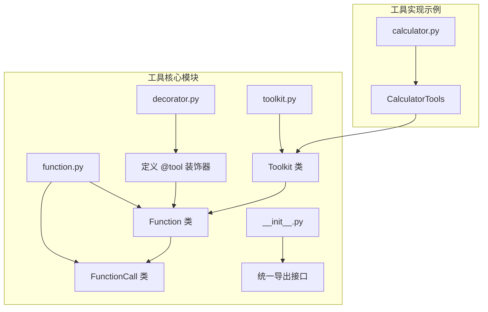
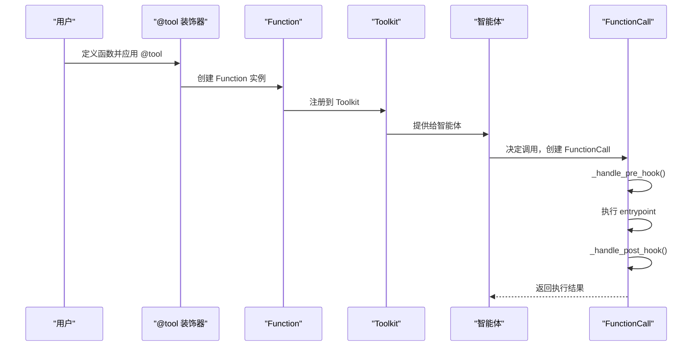
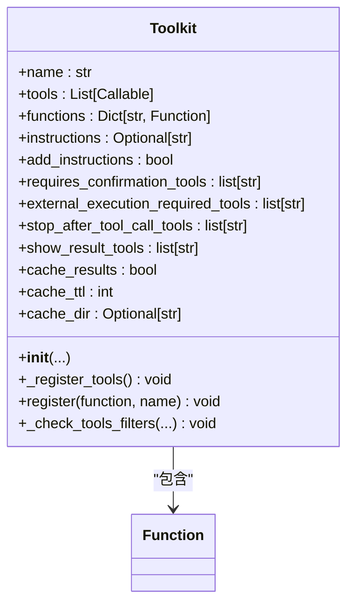
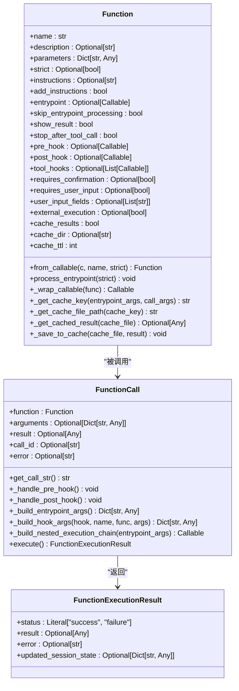
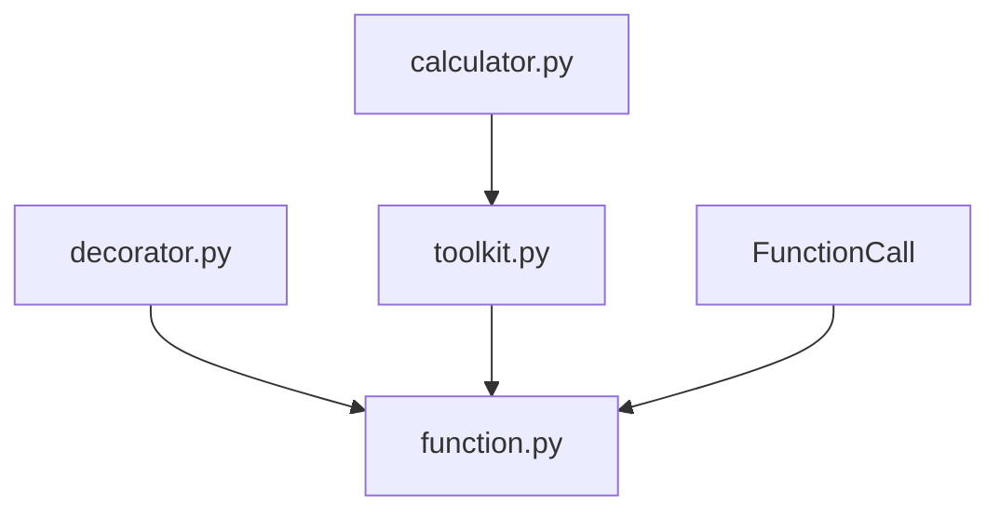

# 工具集成

<cite>
**本文档中引用的文件**
- [toolkit.py](file://libs/agno/agno/tools/toolkit.py)
- [function.py](file://libs/agno/agno/tools/function.py)
- [decorator.py](file://libs/agno/agno/tools/decorator.py)
- [calculator.py](file://libs/agno/agno/tools/calculator.py)
- [__init__.py](file://libs/agno/agno/tools/__init__.py)
</cite>

## 目录
1. [简介](#简介)
2. [项目结构](#项目结构)
3. [核心组件](#核心组件)
4. [架构概述](#架构概述)
5. [详细组件分析](#详细组件分析)
6. [依赖分析](#依赖分析)
7. [性能考虑](#性能考虑)
8. [故障排除指南](#故障排除指南)
9. [结论](#结论)
10. [附录](#附录)（如有必要）

## 简介
本文档深入探讨了 Agno 智能体框架中的工具集成机制，重点分析 `Tool` 和 `Toolkit` 类的实现原理。文档详细解释了如何定义、注册和调用工具，涵盖了同步与异步调用流程、错误处理与重试机制。通过具体示例，展示了如何将外部 API（如计算器、网络搜索）封装为工具并集成到智能体中。此外，还详细说明了工具钩子（pre_hook 和 post_hook）的使用方法，以及工具调用中的权限控制和安全考量。

## 项目结构
Agno 框架的工具系统主要位于 `libs/agno/agno/tools` 目录下，其核心组件包括用于定义工具的装饰器、表示工具的 `Function` 类、管理工具集合的 `Toolkit` 类，以及用于执行工具调用的 `FunctionCall` 类。工具的实现被组织在独立的模块中，如计算器工具，便于模块化管理和复用。



**图示来源**
- [toolkit.py](file://libs/agno/agno/tools/toolkit.py#L1-L146)
- [function.py](file://libs/agno/agno/tools/function.py#L1-L799)
- [decorator.py](file://libs/agno/agno/tools/decorator.py#L1-L262)
- [calculator.py](file://libs/agno/agno/tools/calculator.py#L1-L151)

**本节来源**
- [toolkit.py](file://libs/agno/agno/tools/toolkit.py#L1-L146)
- [function.py](file://libs/agno/agno/tools/function.py#L1-L799)

## 核心组件
本节深入分析 `Tool` 和 `Toolkit` 的核心实现机制。`Toolkit` 类作为工具的容器，负责注册、管理和配置一组相关的工具。`Function` 类是工具的内部表示，它封装了函数的元数据（如名称、描述、参数）和执行逻辑。`@tool` 装饰器是创建 `Function` 实例的便捷方式，它通过解析函数签名和文档字符串来自动构建工具的 JSON Schema。

**本节来源**
- [toolkit.py](file://libs/agno/agno/tools/toolkit.py#L1-L146)
- [function.py](file://libs/agno/agno/tools/function.py#L1-L799)
- [decorator.py](file://libs/agno/agno/tools/decorator.py#L1-L262)

## 架构概述
Agno 的工具集成架构采用分层设计。最上层是用户通过 `@tool` 装饰器定义的普通 Python 函数。装饰器将这些函数转换为 `Function` 对象，这些对象包含了模型调用所需的结构化信息。`Toolkit` 则负责将多个 `Function` 对象组织起来，并应用统一的配置（如缓存、确认要求）。当智能体决定调用一个工具时，会创建一个 `FunctionCall` 实例来执行该调用，该实例会处理参数验证、钩子执行、缓存和最终的函数调用。



**图示来源**
- [decorator.py](file://libs/agno/agno/tools/decorator.py#L1-L262)
- [function.py](file://libs/agno/agno/tools/function.py#L1-L799)
- [toolkit.py](file://libs/agno/agno/tools/toolkit.py#L1-L146)

## 详细组件分析
本节将对工具系统中的关键组件进行深入分析。

### Toolkit 类分析
`Toolkit` 类是管理一组相关工具的核心容器。它允许开发者将功能相关的工具打包，并对整个工具集应用统一的配置。

#### Toolkit 类图


**图示来源**
- [toolkit.py](file://libs/agno/agno/tools/toolkit.py#L1-L146)

**本节来源**
- [toolkit.py](file://libs/agno/agno/tools/toolkit.py#L1-L146)

### Function 类分析
`Function` 类是工具的内部表示，它将一个 Python 函数及其元数据转换为可以被 LLM 理解和调用的格式。

#### Function 类图


**图示来源**
- [function.py](file://libs/agno/agno/tools/function.py#L1-L799)

**本节来源**
- [function.py](file://libs/agno/agno/tools/function.py#L1-L799)

### 同步与异步工具调用流程
工具调用流程在 `FunctionCall.execute()` 方法中实现。对于同步工具，流程是线性的：执行 pre_hook -> 执行主函数 -> 执行 post_hook。对于异步工具，流程是异步的，使用 `async`/`await` 语法。`_build_nested_execution_chain` 方法支持 `tool_hooks`，它创建了一个嵌套的执行链，将每个钩子包装在下一个钩子或主函数周围，实现了类似中间件的模式。

**本节来源**
- [function.py](file://libs/agno/agno/tools/function.py#L1-L799)

### 错误处理与重试
工具调用中的错误处理主要在 `FunctionCall.execute()` 方法中完成。代码使用 `try`/`except` 块捕获执行过程中的异常。对于 `AgentRunException`，它会直接重新抛出；对于其他异常，会记录警告日志，并将错误信息封装在 `FunctionExecutionResult` 中返回给智能体。该框架本身不直接实现重试逻辑，但可以通过 `pre_hook` 或外部机制来实现。

**本节来源**
- [function.py](file://libs/agno/agno/tools/function.py#L1-L799)

### 创建自定义工具
创建自定义工具最简单的方法是使用 `@tool` 装饰器。开发者只需编写一个普通的 Python 函数，并添加 `@tool` 装饰器。装饰器会自动解析函数的参数和文档字符串，生成所需的 JSON Schema。

```python
from agno.tools import tool

@tool
def get_weather(city: str) -> str:
    """获取指定城市的天气。
    
    Args:
        city (str): 城市名称。
        
    Returns:
        str: 天气信息的 JSON 字符串。
    """
    # 实现获取天气的逻辑
    return json.dumps({"city": city, "temperature": "20°C", "condition": "Sunny"})
```

**本节来源**
- [decorator.py](file://libs/agno/agno/tools/decorator.py#L1-L262)

### 工具钩子使用方法
工具钩子 (`pre_hook` 和 `post_hook`) 是在工具执行前后运行的回调函数。它们可用于日志记录、性能监控或修改状态。例如，一个 `pre_hook` 可以记录工具调用的开始时间，而一个 `post_hook` 可以计算并记录执行耗时。

```python
def my_pre_hook(fc: FunctionCall):
    print(f"开始执行工具: {fc.function.name}")

def my_post_hook(fc: FunctionCall):
    print(f"工具执行完成: {fc.function.name}")

@tool(pre_hook=my_pre_hook, post_hook=my_post_hook)
def my_function():
    pass
```

**本节来源**
- [function.py](file://libs/agno/agno/tools/function.py#L1-L799)

### 权限控制与安全考虑
框架通过 `requires_confirmation`、`requires_user_input` 和 `external_execution` 等标志来实现权限控制。`requires_confirmation` 强制要求用户确认才能执行，适用于高风险操作。`external_execution` 表示该工具将在智能体的控制范围之外执行，增加了安全性。此外，`tool_hooks` 可以用于实现更复杂的权限检查逻辑。

**本节来源**
- [function.py](file://libs/agno/agno/tools/function.py#L1-L799)
- [decorator.py](file://libs/agno/agno/tools/decorator.py#L1-L262)

## 依赖分析
工具系统内部组件之间存在紧密的依赖关系。`Toolkit` 依赖于 `Function` 来表示其管理的工具。`FunctionCall` 依赖于 `Function` 来获取执行信息。`@tool` 装饰器依赖于 `Function` 来创建实例。外部工具（如 `CalculatorTools`）则依赖于 `Toolkit` 作为基类。



**图示来源**
- [toolkit.py](file://libs/agno/agno/tools/toolkit.py#L1-L146)
- [function.py](file://libs/agno/agno/tools/function.py#L1-L799)
- [decorator.py](file://libs/agno/agno/tools/decorator.py#L1-L262)
- [calculator.py](file://libs/agno/agno/tools/calculator.py#L1-L151)

**本节来源**
- [toolkit.py](file://libs/agno/agno/tools/toolkit.py#L1-L146)
- [function.py](file://libs/agno/agno/tools/function.py#L1-L799)

## 性能考虑
工具系统内置了缓存机制以提高性能。通过设置 `cache_results=True`，工具的执行结果可以被缓存。`_get_cache_key` 方法基于函数名和参数生成一个唯一的哈希值作为缓存键。`_get_cached_result` 和 `_save_to_cache` 方法分别负责读取和写入缓存，有效避免了重复计算，特别是在处理耗时的外部 API 调用时。

**本节来源**
- [function.py](file://libs/agno/agno/tools/function.py#L1-L799)

## 故障排除指南
常见的工具集成问题包括：工具未被正确注册、参数类型不匹配、异步函数处理不当。确保使用 `@tool` 装饰器或 `Toolkit.register()` 方法正确注册工具。检查函数的类型注解是否准确。对于异步工具，确保装饰器能正确识别。利用 `log_debug` 和 `log_warning` 等日志工具可以帮助定位问题。

**本节来源**
- [function.py](file://libs/agno/agno/tools/function.py#L1-L799)
- [decorator.py](file://libs/agno/agno/tools/decorator.py#L1-L262)

## 结论
Agno 的工具集成系统提供了一个强大而灵活的框架，用于扩展智能体的能力。通过 `@tool` 装饰器、`Function` 和 `Toolkit` 类，开发者可以轻松地将任何 Python 函数封装为智能体可调用的工具。该系统支持同步/异步调用、缓存、钩子和权限控制，为构建复杂、安全的智能体应用奠定了坚实的基础。