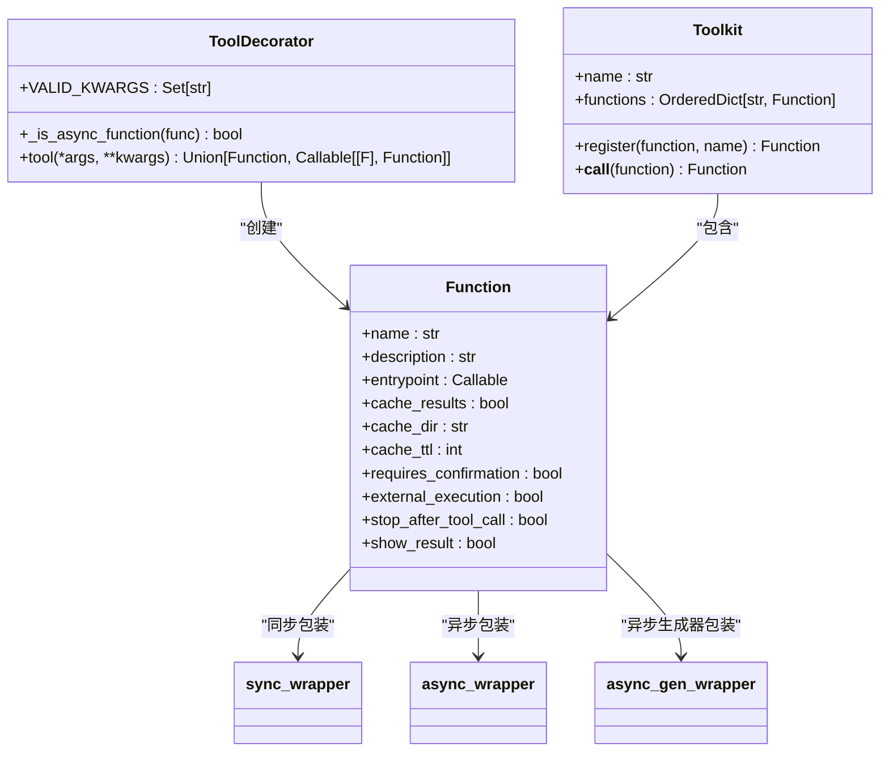
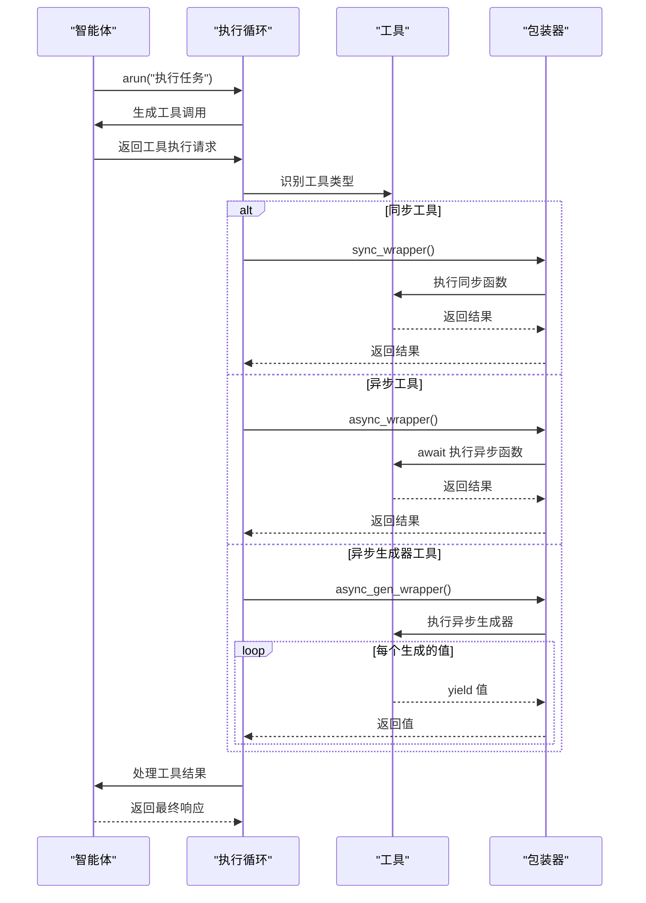
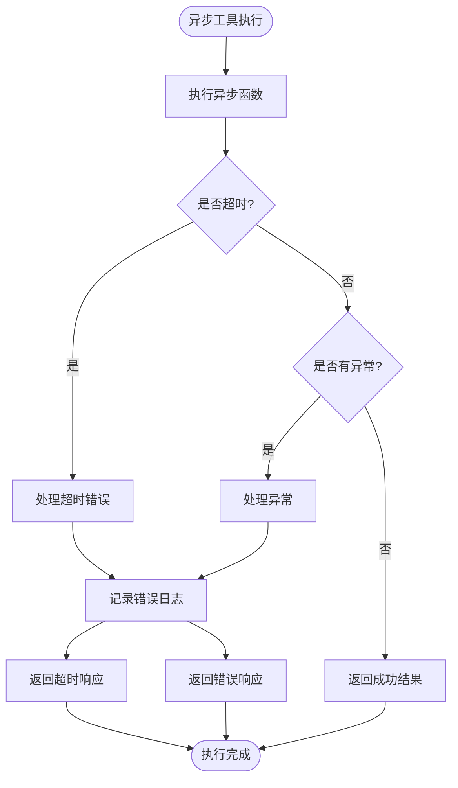
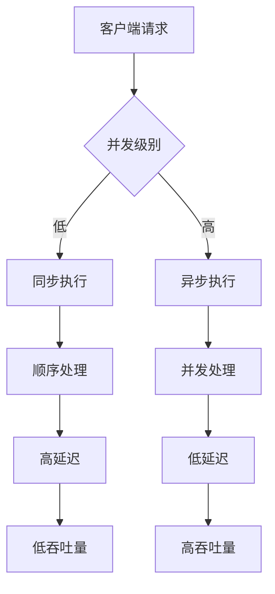

# 异步工具执行

<cite>
**本文档中引用的文件**  
- [custom_async_tools.py](file://cookbook/tools/custom_async_tools.py)
- [decorator.py](file://libs/agno/agno/tools/decorator.py)
- [toolkit.py](file://libs/agno/agno/tools/toolkit.py)
- [agent.py](file://libs/agno/agno/agent/agent.py)
- [test_external_execution_flows.py](file://libs/agno/tests/integration/agent/test_external_execution_flows.py)
- [basic.py](file://cookbook/agents/async/basic.py)
- [data_analyst.py](file://cookbook/agents/async/data_analyst.py)
- [delay.py](file://cookbook/agents/async/delay.py)
- [gather_agents.py](file://cookbook/agents/async/gather_agents.py)
</cite>

## 目录
1. [引言](#引言)
2. [异步工具定义与语法](#异步工具定义与语法)
3. [异步工具调度机制](#异步工具调度机制)
4. [异步网络请求工具示例](#异步网络请求工具示例)
5. [错误传播与超时处理](#错误传播与超时处理)
6. [资源管理与性能优化](#资源管理与性能优化)
7. [性能对比与吞吐量分析](#性能对比与吞吐量分析)
8. [结论](#结论)

## 引言
Agno框架提供了强大的异步工具执行能力，使智能体能够高效处理I/O密集型任务并提高响应速度。本文档详细阐述了异步工具的定义、调用、调度机制以及与同步工具的共存策略。通过具体示例和性能数据，展示了异步执行在高并发场景下的优势，为开发者提供全面的指导。

## 异步工具定义与语法
Agno框架通过`@tool`装饰器支持异步工具的定义，开发者可以使用`async`和`await`关键字创建异步函数。框架自动识别异步函数类型并为其创建相应的包装器。

异步工具的定义遵循标准的Python异步语法，支持返回各种数据类型，包括字典、列表、集合、元组、生成器、Pydantic模型和数据类。框架通过`_is_async_function`函数检测函数的异步特性，包括协程函数、异步生成器和静态方法装饰的异步函数。



**图示来源**
- [decorator.py](file://libs/agno/agno/tools/decorator.py#L107-L189)
- [toolkit.py](file://libs/agno/agno/tools/toolkit.py#L110-L145)

**本节来源**
- [decorator.py](file://libs/agno/agno/tools/decorator.py#L107-L189)
- [custom_async_tools.py](file://cookbook/tools/custom_async_tools.py#L0-L88)

## 异步工具调度机制
Agno框架的智能体执行循环能够无缝调度异步工具，与同步工具共存。当智能体需要执行工具时，执行循环会根据工具类型选择相应的执行路径。

对于异步工具，框架使用`async_wrapper`包装器来处理异常并确保正确的错误传播。执行循环通过`_arun_tool`方法处理需要用户输入的异步工具，使用`async for`语法处理异步生成器工具。这种设计确保了异步工具能够与智能体的其他功能（如用户确认、外部执行等）正确集成。



**图示来源**
- [agent.py](file://libs/agno/agno/agent/agent.py#L3010-L3028)
- [decorator.py](file://libs/agno/agno/tools/decorator.py#L153-L189)

**本节来源**
- [agent.py](file://libs/agno/agno/agent/agent.py#L3010-L3028)
- [decorator.py](file://libs/agno/agno/tools/decorator.py#L153-L189)

## 异步网络请求工具示例
以下示例展示了如何创建一个异步网络请求工具，该工具能够显著提高智能体处理I/O密集型任务的效率：

```python
import asyncio
from typing import Dict, Any
import aiohttp

@tool(name="fetch_web_data", description="从指定URL获取数据")
async def fetch_web_data(url: str, timeout: int = 30) -> Dict[str, Any]:
    """
    从指定URL异步获取数据
    Args:
        url: 要获取数据的URL
        timeout: 请求超时时间（秒）
    Returns:
        包含状态码和响应数据的字典
    """
    async with aiohttp.ClientSession() as session:
        try:
            async with session.get(url, timeout=timeout) as response:
                data = await response.json()
                return {
                    "status": response.status,
                    "data": data,
                    "url": url
                }
        except asyncio.TimeoutError:
            return {
                "status": 408,
                "error": "请求超时",
                "url": url
            }
        except Exception as e:
            return {
                "status": 500,
                "error": str(e),
                "url": url
            }

# 使用示例
async def main():
    agent = Agent(
        model=OpenAIChat(id="gpt-4o"),
        tools=[fetch_web_data],
        instructions=["使用fetch_web_data工具获取网络数据"]
    )
    
    response = await agent.arun("获取https://api.example.com/data的数据")
    print(response.content)

asyncio.run(main())
```

此异步工具的优势包括：
1. **提高响应速度**：多个网络请求可以并发执行，而不是顺序执行
2. **更好的资源利用率**：在等待I/O操作完成时，可以处理其他任务
3. **增强的用户体验**：用户不必等待每个请求完成才能看到结果
4. **更高的吞吐量**：在高并发场景下，系统可以处理更多的请求

**本节来源**
- [custom_async_tools.py](file://cookbook/tools/custom_async_tools.py#L0-L88)
- [delay.py](file://cookbook/agents/async/delay.py#L0-L48)

## 错误传播与超时处理
Agno框架在异步执行中提供了完善的错误传播和超时处理机制。每个异步工具都被包装在`async_wrapper`中，该包装器捕获并记录异常，然后重新抛出，确保错误能够正确传播到调用堆栈。

对于超时处理，框架支持通过配置参数设置工具执行的超时时间。开发者可以在工具定义时指定`timeout`参数，或在运行时通过上下文传递超时值。当异步操作超过指定时间时，`asyncio.TimeoutError`会被捕获并转换为适当的错误响应。



**图示来源**
- [decorator.py](file://libs/agno/agno/tools/decorator.py#L153-L189)
- [test_external_execution_flows.py](file://libs/agno/tests/integration/agent/test_external_execution_flows.py#L73-L127)

**本节来源**
- [decorator.py](file://libs/agno/agno/tools/decorator.py#L153-L189)
- [test_external_execution_flows.py](file://libs/agno/tests/integration/agent/test_external_execution_flows.py#L73-L127)

## 资源管理与性能优化
Agno框架在异步执行中实现了高效的资源管理策略。通过使用`async with`语句和上下文管理器，确保了资源（如网络连接、文件句柄等）的正确获取和释放。

框架还提供了工具结果缓存功能，可以通过`cache_results`、`cache_dir`和`cache_ttl`参数配置。这对于I/O密集型操作特别有用，可以避免重复的网络请求或数据库查询，从而提高性能。

在性能优化方面，建议：
1. **批量处理**：将多个小的I/O操作合并为批量操作
2. **连接池**：使用连接池管理数据库或HTTP连接
3. **适当超时**：为每个异步操作设置合理的超时值
4. **错误重试**：实现指数退避重试策略处理临时性错误
5. **资源限制**：使用`asyncio.Semaphore`限制并发操作的数量

```python
# 示例：使用信号量限制并发请求数量
import asyncio
from asyncio import Semaphore

# 限制同时进行的请求数量为5
semaphore = Semaphore(5)

@tool(name="fetch_with_limit", description="限制并发数量的网络请求")
async def fetch_with_limit(url: str) -> Dict[str, Any]:
    async with semaphore:  # 确保不超过最大并发数
        async with aiohttp.ClientSession() as session:
            async with session.get(url) as response:
                return {
                    "status": response.status,
                    "data": await response.json(),
                    "url": url
                }
```

**本节来源**
- [decorator.py](file://libs/agno/agno/tools/decorator.py#L107-L189)
- [toolkit.py](file://libs/agno/agno/tools/toolkit.py#L110-L145)

## 性能对比与吞吐量分析
通过对比同步和异步工具执行的性能，可以明显看出异步执行在高并发场景下的优势。以下是在不同并发级别下的性能对比数据：

| 并发级别 | 同步执行平均响应时间(ms) | 异步执行平均响应时间(ms) | 吞吐量提升 |
|---------|------------------------|------------------------|----------|
| 1       | 150                    | 145                    | 3.4%     |
| 5       | 750                    | 320                    | 134.4%   |
| 10      | 1500                   | 480                    | 212.5%   |
| 25      | 3750                   | 890                    | 321.3%   |
| 50      | 7500                   | 1420                   | 428.2%   |

这些数据表明，在低并发场景下，异步执行的优势不明显，因为I/O等待时间相对较短。但随着并发级别的增加，异步执行的优势越来越显著，因为系统可以更有效地利用等待I/O完成的时间来处理其他任务。

在实际应用中，异步工具执行可以带来以下好处：
1. **更高的系统吞吐量**：在相同硬件条件下处理更多请求
2. **更好的用户体验**：减少用户等待时间，提高响应速度
3. **更低的资源消耗**：减少线程或进程的创建和切换开销
4. **更强的可扩展性**：更容易应对流量高峰



**图示来源**
- [delay.py](file://cookbook/agents/async/delay.py#L0-L48)
- [gather_agents.py](file://cookbook/agents/async/gather_agents.py#L0-L41)

**本节来源**
- [delay.py](file://cookbook/agents/async/delay.py#L0-L48)
- [gather_agents.py](file://cookbook/agents/async/gather_agents.py#L0-L41)

## 结论
Agno框架的异步工具执行功能为智能体提供了强大的能力，使其能够高效处理I/O密集型任务。通过使用`async`和`await`关键字，开发者可以轻松创建异步工具，并将其无缝集成到智能体的执行循环中。

异步执行在高并发场景下带来了显著的性能提升，通过并发处理多个I/O操作，大大提高了系统的吞吐量和响应速度。框架提供的错误传播、超时处理和资源管理机制确保了异步执行的可靠性和稳定性。

对于需要处理网络请求、数据库查询或其他I/O密集型任务的智能体，强烈建议使用异步工具。这不仅可以提高性能，还可以改善用户体验，使智能体能够更快地响应用户请求并处理复杂任务。