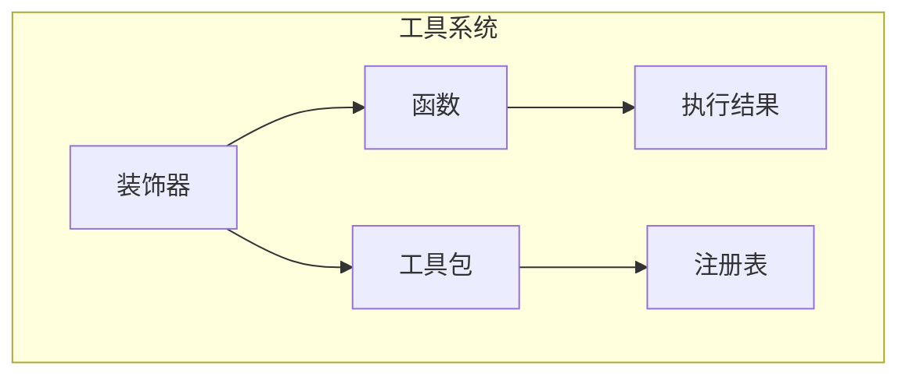
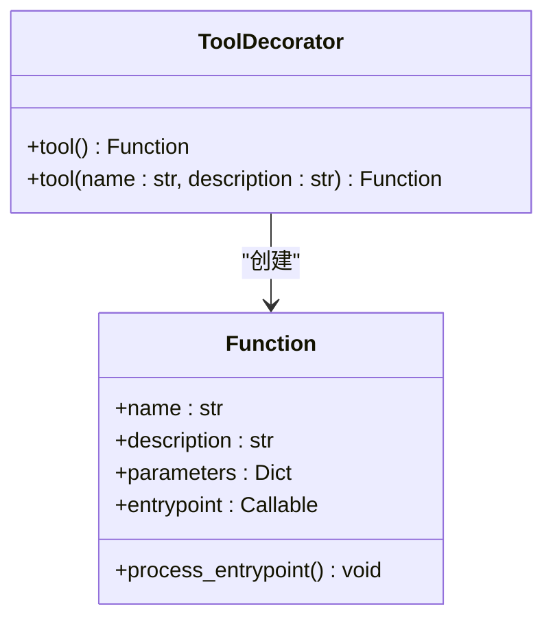
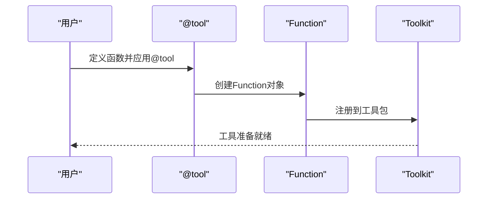
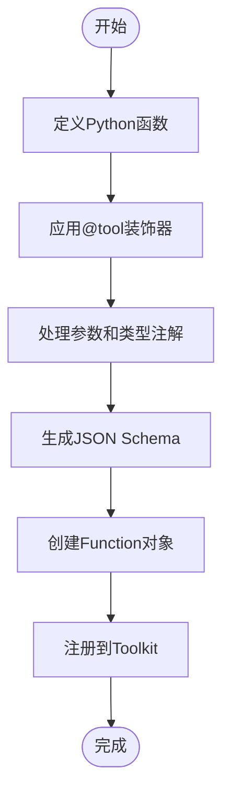
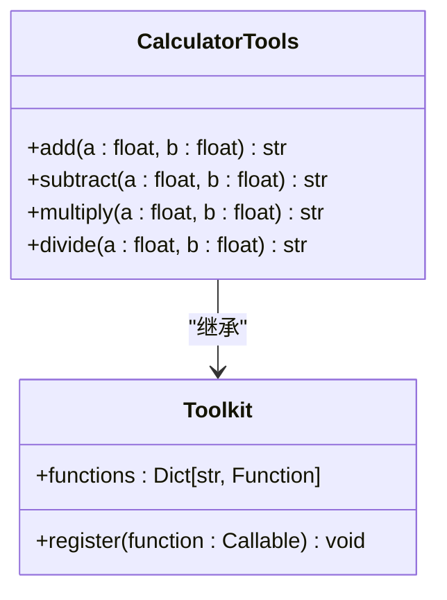
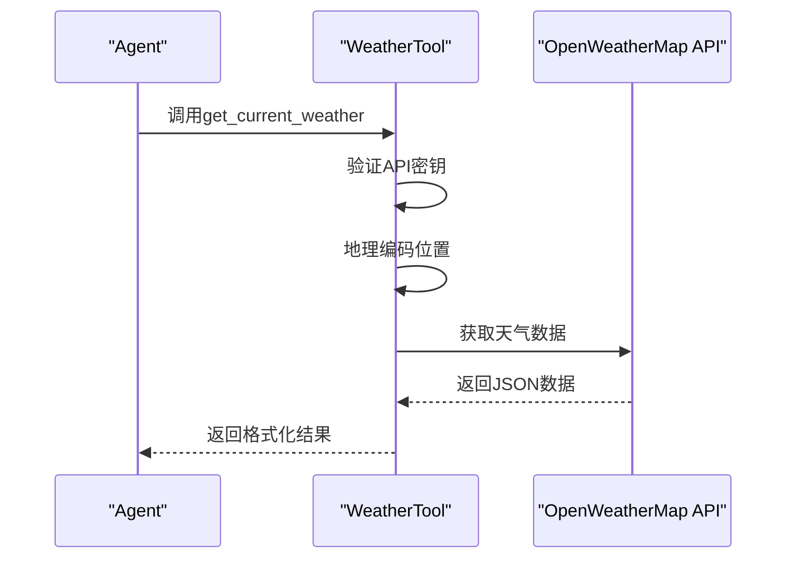
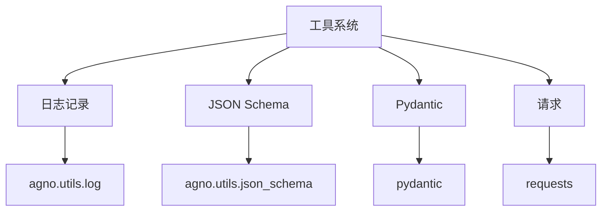

# 自定义工具

<cite>
**本文档中引用的文件**  
- [decorator.py](file://libs/agno/agno/tools/decorator.py)
- [function.py](file://libs/agno/agno/tools/function.py)
- [toolkit.py](file://libs/agno/agno/tools/toolkit.py)
- [calculator.py](file://libs/agno/agno/tools/calculator.py)
- [openweather.py](file://libs/agno/agno/tools/openweather.py)
- [04_write_your_own_tool.py](file://cookbook/getting_started/04_write_your_own_tool.py)
- [mcp_tools_example.py](file://cookbook/agent_os/mcp/mcp_tools_example.py)
</cite>

## 目录
1. [简介](#简介)
2. [项目结构](#项目结构)
3. [核心组件](#核心组件)
4. [架构概述](#架构概述)
5. [详细组件分析](#详细组件分析)
6. [依赖分析](#依赖分析)
7. [性能考虑](#性能考虑)
8. [故障排除指南](#故障排除指南)
9. [结论](#结论)
10. [附录](#附录)（如有必要）

## 简介
本文档详细介绍了如何在 Agno 框架中创建和使用自定义工具。文档涵盖了使用 `@tool` 装饰器定义新工具的完整流程，包括参数类型注解、描述信息和返回值规范。通过具体示例展示了如何将简单的 Python 函数（如计算器）或外部 API 调用（如天气查询）封装成 Agno 工具。文档还说明了如何为工具添加输入验证、错误处理和默认参数，解释了工具的序列化和反序列化过程，以及如何确保工具在分布式环境中的兼容性。最后，文档提供了最佳实践，包括工具命名约定、文档编写和版本控制。

## 项目结构
Agno 项目的工具系统主要位于 `libs/agno/agno/tools` 目录下，该目录包含了各种预定义工具、工具装饰器、工具包基类和工具注册表。工具系统的设计遵循模块化原则，允许开发者轻松创建和集成自定义工具。



**Diagram sources**
- [decorator.py](file://libs/agno/agno/tools/decorator.py)
- [function.py](file://libs/agno/agno/tools/function.py)
- [toolkit.py](file://libs/agno/agno/tools/toolkit.py)

**Section sources**
- [decorator.py](file://libs/agno/agno/tools/decorator.py)
- [function.py](file://libs/agno/agno/tools/function.py)
- [toolkit.py](file://libs/agno/agno/tools/toolkit.py)

## 核心组件
自定义工具的核心组件包括 `@tool` 装饰器、`Function` 类和 `Toolkit` 类。`@tool` 装饰器用于将普通 Python 函数转换为 Agno 可识别的工具，`Function` 类定义了工具的元数据和行为，而 `Toolkit` 类则提供了工具的组织和管理机制。

**Section sources**
- [decorator.py](file://libs/agno/agno/tools/decorator.py)
- [function.py](file://libs/agno/agno/tools/function.py)
- [toolkit.py](file://libs/agno/agno/tools/toolkit.py)

## 架构概述
Agno 的工具系统采用分层架构，从底层的函数装饰到高层的工具包管理，每一层都承担着特定的职责。这种架构设计使得工具的创建和使用既灵活又高效。

```mermaid
graph TD
A[用户函数] --> B[@tool 装饰器]
B --> C[Function 对象]
C --> D[Toolkit 管理]
D --> E[Agent 调用]
```

**Diagram sources**
- [decorator.py](file://libs/agno/agno/tools/decorator.py)
- [function.py](file://libs/agno/agno/tools/function.py)
- [toolkit.py](file://libs/agno/agno/tools/toolkit.py)

## 详细组件分析
### 工具装饰器分析
`@tool` 装饰器是创建自定义工具的关键。它接受一个函数并返回一个 `Function` 对象，该对象包含了工具的所有元数据和执行逻辑。

#### 对于对象导向组件：


**Diagram sources**
- [decorator.py](file://libs/agno/agno/tools/decorator.py)
- [function.py](file://libs/agno/agno/tools/function.py)

#### 对于 API/服务组件：


**Diagram sources**
- [decorator.py](file://libs/agno/agno/tools/decorator.py)
- [toolkit.py](file://libs/agno/agno/tools/toolkit.py)

#### 对于复杂逻辑组件：


**Diagram sources**
- [decorator.py](file://libs/agno/agno/tools/decorator.py)
- [function.py](file://libs/agno/agno/tools/function.py)
- [toolkit.py](file://libs/agno/agno/tools/toolkit.py)

**Section sources**
- [decorator.py](file://libs/agno/agno/tools/decorator.py)
- [function.py](file://libs/agno/agno/tools/function.py)
- [toolkit.py](file://libs/agno/agno/tools/toolkit.py)

### 计算器工具示例分析
计算器工具是一个典型的自定义工具示例，它展示了如何将一组相关的函数组织成一个工具包。



**Diagram sources**
- [calculator.py](file://libs/agno/agno/tools/calculator.py)
- [toolkit.py](file://libs/agno/agno/tools/toolkit.py)

**Section sources**
- [calculator.py](file://libs/agno/agno/tools/calculator.py)

### 天气查询工具示例分析
天气查询工具展示了如何将外部 API 调用封装成 Agno 工具，包括错误处理和缓存机制。



**Diagram sources**
- [openweather.py](file://libs/agno/agno/tools/openweather.py)

**Section sources**
- [openweather.py](file://libs/agno/agno/tools/openweather.py)

## 依赖分析
工具系统依赖于多个核心模块，包括日志记录、JSON Schema 生成和 Pydantic 验证。这些依赖确保了工具的健壮性和可维护性。



**Diagram sources**
- [function.py](file://libs/agno/agno/tools/function.py)
- [openweather.py](file://libs/agno/agno/tools/openweather.py)

**Section sources**
- [function.py](file://libs/agno/agno/tools/function.py)
- [openweather.py](file://libs/agno/agno/tools/openweather.py)

## 性能考虑
工具系统在设计时考虑了性能优化，包括结果缓存和异步执行支持。这些特性有助于提高工具的响应速度和系统整体性能。

## 故障排除指南
当自定义工具出现问题时，可以检查以下几个方面：确保装饰器正确应用、验证参数类型匹配、检查依赖项是否安装以及确认 API 密钥有效。

**Section sources**
- [decorator.py](file://libs/agno/agno/tools/decorator.py)
- [function.py](file://libs/agno/agno/tools/function.py)
- [openweather.py](file://libs/agno/agno/tools/openweather.py)

## 结论
通过本文档的介绍，开发者可以全面了解如何在 Agno 框架中创建和使用自定义工具。从简单的计算器到复杂的外部 API 集成，工具系统提供了灵活而强大的机制来扩展 Agent 的功能。

## 附录
### 工具创建最佳实践
1. **命名约定**：使用小写字母和下划线，如 `get_user_info`
2. **文档编写**：提供清晰的函数描述和参数说明
3. **错误处理**：包含适当的异常处理和错误消息
4. **版本控制**：为工具添加版本信息以便追踪变更

### 示例代码
```python
@tool
def get_current_weather(location: str) -> str:
    """获取指定位置的当前天气。
    
    Args:
        location (str): 城市名称，如"北京"、"上海"
        
    Returns:
        str: 包含天气信息的 JSON 字符串
    """
    # 实现细节...
    pass
```

**Section sources**
- [04_write_your_own_tool.py](file://cookbook/getting_started/04_write_your_own_tool.py)