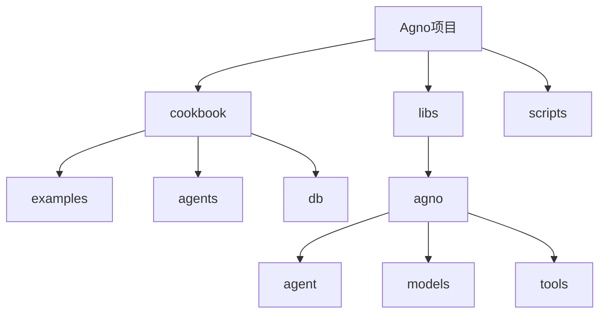
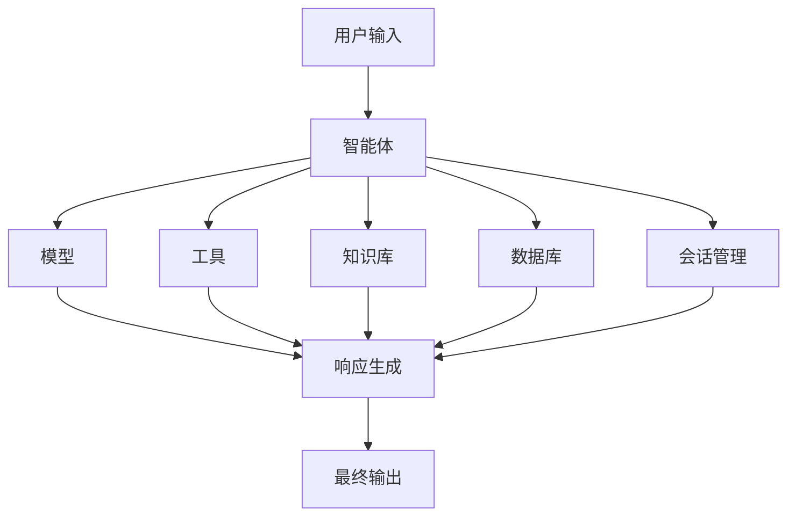
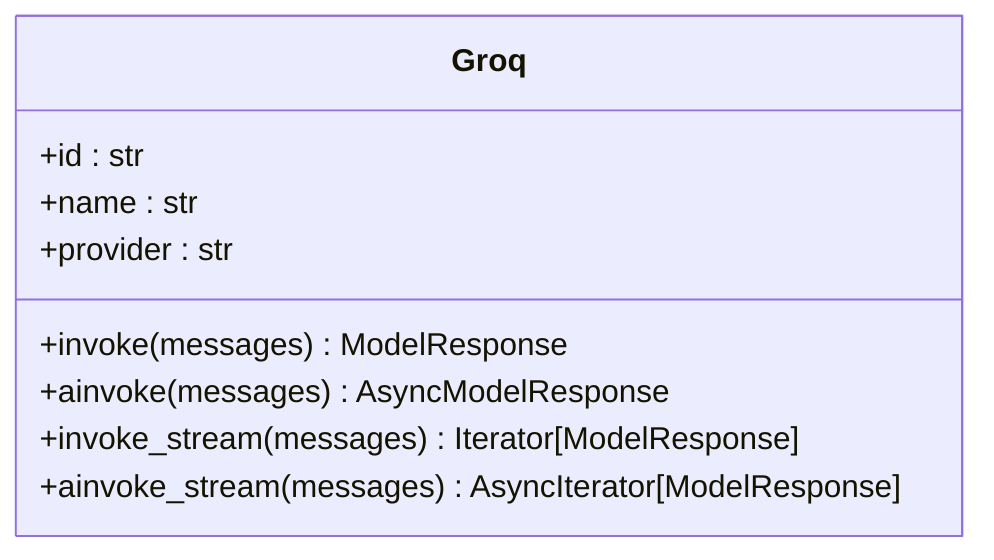
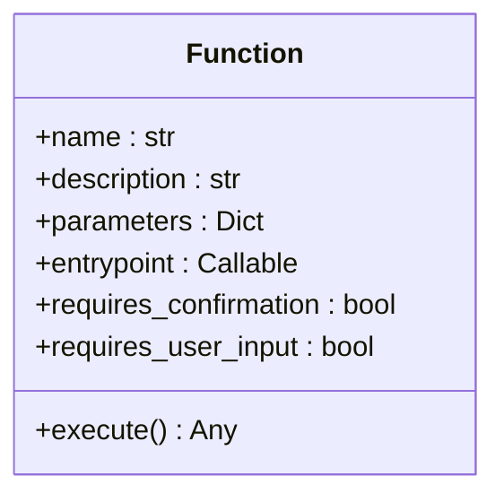
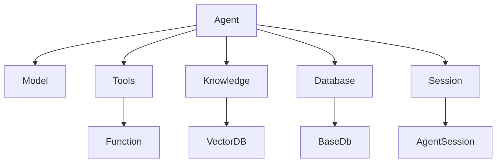

# 智能体

<cite>
**本文档中引用的文件**  
- [agent.py](file://libs/agno/agno/agent/agent.py)
- [function.py](file://libs/agno/agno/tools/function.py)
- [groq.py](file://libs/agno/agno/models/groq/groq.py)
- [basic_agent.py](file://cookbook/examples/agents/basic_agent.py)
- [agent_with_tools.py](file://cookbook/examples/agents/agent_with_tools.py)
- [agent_with_knowledge.py](file://cookbook/examples/agents/agent_with_knowledge.py)
- [basic.py](file://cookbook/agents/async/basic.py)
- [01_persistent_session.py](file://cookbook/agents/session/01_persistent_session.py)
</cite>

## 目录
1. [简介](#简介)
2. [项目结构](#项目结构)
3. [核心组件](#核心组件)
4. [架构概述](#架构概述)
5. [详细组件分析](#详细组件分析)
6. [依赖分析](#依赖分析)
7. [性能考虑](#性能考虑)
8. [故障排除指南](#故障排除指南)
9. [结论](#结论)

## 简介
Agno 是一个高性能的多智能体系统运行时环境，用于构建、运行和管理安全的多智能体系统。它提供了一个完整的解决方案，包括会话管理、记忆、知识库、人机协作和MCP支持。通过Agno，开发者可以在云环境中快速构建智能体系统，并获得前所未有的可见性和控制力。

## 项目结构
Agno 项目的结构清晰地分为多个模块，每个模块负责不同的功能领域。主要目录包括：
- `cookbook`：包含各种使用示例和教程
- `libs`：核心库代码
- `scripts`：辅助脚本
- `models`：支持的各种大模型集成



**图源**
- [README.md](file://README.md)

## 核心组件
Agno 智能体的核心组件包括模型、工具、知识库、数据库和会话管理等。这些组件共同协作，实现智能体的各项功能。

**节源**
- [agent.py](file://libs/agno/agno/agent/agent.py)

## 架构概述
Agno 智能体采用模块化架构设计，各组件之间通过明确定义的接口进行通信。这种设计使得系统具有良好的可扩展性和可维护性。



**图源**
- [agent.py](file://libs/agno/agno/agent/agent.py)

## 详细组件分析

### 智能体配置分析
Agno 智能体提供了丰富的配置选项，允许开发者根据具体需求定制智能体的行为。

#### 配置参数
| 参数 | 描述 | 默认值 |
|------|------|--------|
| model | 使用的大模型 | None |
| name | 智能体名称 | None |
| tools | 可用工具列表 | None |
| knowledge | 知识库配置 | None |
| db | 数据库配置 | None |

**节源**
- [agent.py](file://libs/agno/agno/agent/agent.py)

### 模型集成分析
Agno 支持多种大模型的集成，包括OpenAI、Anthropic、Groq等。每种模型都有对应的适配器类来处理特定的API调用。

#### Groq模型实现


**图源**
- [groq.py](file://libs/agno/agno/models/groq/groq.py)

### 工具系统分析
Agno 的工具系统允许智能体调用外部函数来完成特定任务。工具可以通过装饰器或直接实例化的方式定义。

#### 工具定义


**图源**
- [function.py](file://libs/agno/agno/tools/function.py)

### 会话管理分析
Agno 提供了强大的会话管理功能，支持持久化存储和跨会话状态共享。

#### 会话示例
```python
from agno.agent.agent import Agent
from agno.db.postgres import PostgresDb
from agno.models.openai import OpenAIChat

db_url = "postgresql+psycopg://ai:ai@localhost:5532/ai"

db = PostgresDb(db_url=db_url, session_table="sessions")

agent = Agent(
    model=OpenAIChat(id="gpt-4o-mini"),
    db=db,
    session_id="session_storage",
    add_history_to_context=True,
)
```

**节源**
- [01_persistent_session.py](file://cookbook/agents/session/01_persistent_session.py)

## 依赖分析
Agno 智能体的各个组件之间存在明确的依赖关系。理解这些依赖关系对于正确配置和使用智能体至关重要。



**图源**
- [agent.py](file://libs/agno/agno/agent/agent.py)
- [function.py](file://libs/agno/agno/tools/function.py)

## 性能考虑
Agno 在设计时充分考虑了性能因素，确保即使在大规模部署时也能保持高效运行。

- 智能体实例化时间：约3μs
- 内存占用：约6.5Kib
- 支持异步和流式处理
- 工具调用并行化

**节源**
- [README.md](file://README.md)

## 故障排除指南
### 常见问题及解决方案

#### 工具调用失败
**问题**：工具调用返回错误或超时  
**解决方案**：
1. 检查工具函数的参数类型是否匹配
2. 确认外部服务是否正常运行
3. 增加工具调用的重试次数和延迟时间

#### 响应延迟
**问题**：智能体响应时间过长  
**解决方案**：
1. 检查模型API的响应时间
2. 优化知识库检索性能
3. 减少工具调用的数量

**节源**
- [agent.py](file://libs/agno/agno/agent/agent.py)

## 结论
Agno 提供了一个强大而灵活的智能体开发框架，通过模块化设计和丰富的配置选项，能够满足各种复杂应用场景的需求。其高性能特性和完善的生态系统使其成为构建多智能体系统的理想选择。