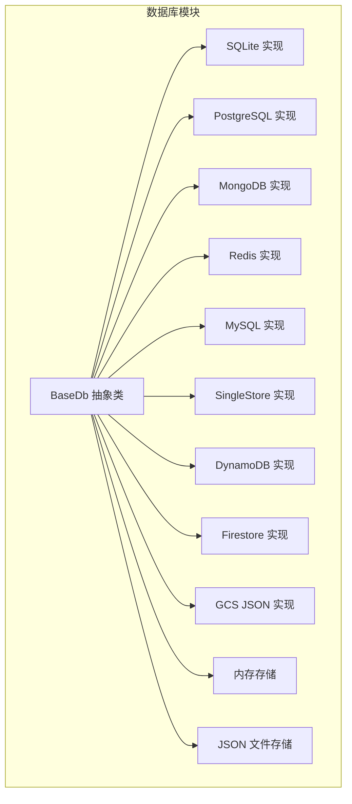
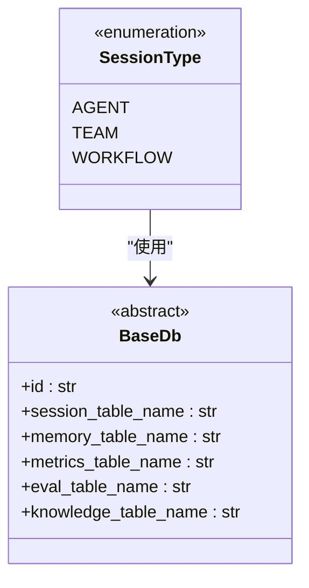
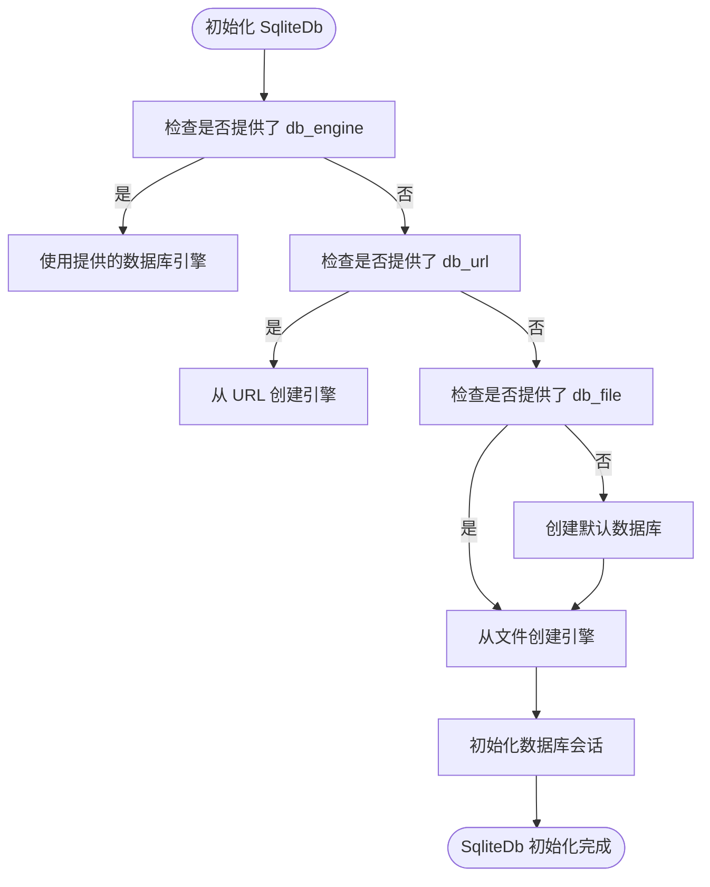
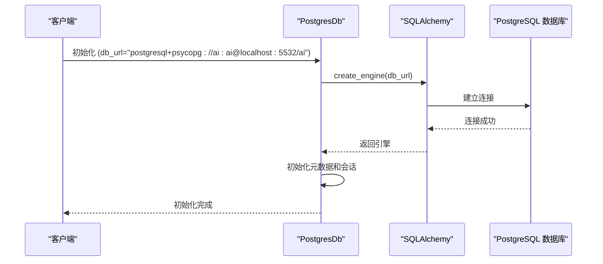
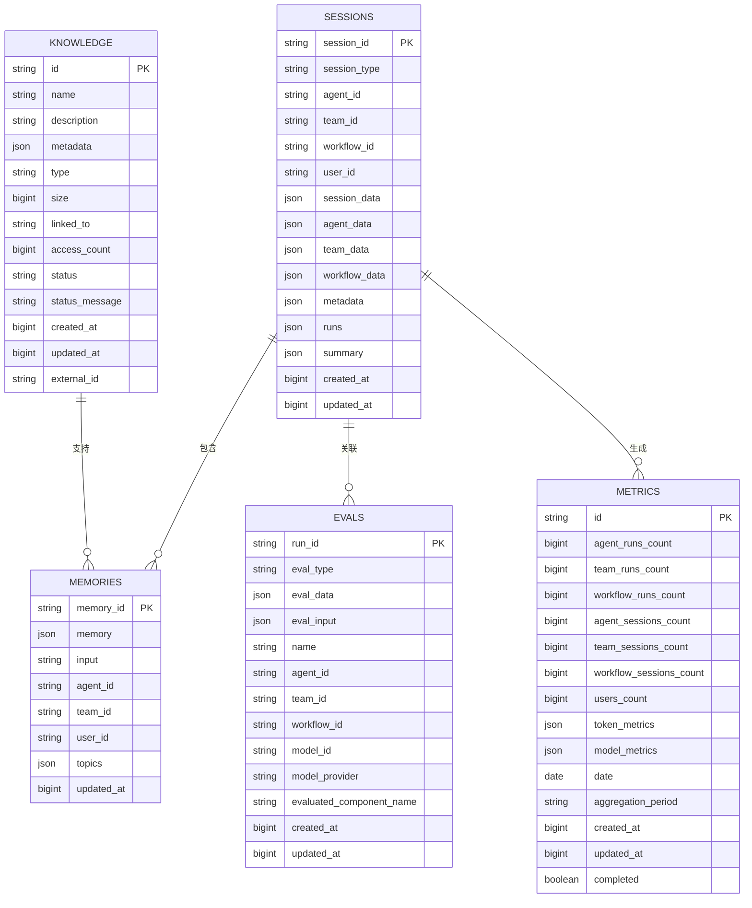
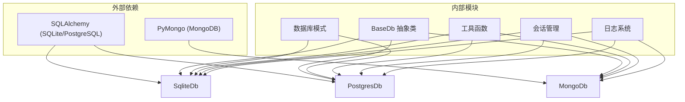

# 记忆存储后端

<cite>
**本文档引用的文件**
- [base.py](file://libs/agno/agno/db/base.py)
- [sqlite.py](file://libs/agno/agno/db/sqlite/sqlite.py)
- [postgres.py](file://libs/agno/agno/db/postgres/postgres.py)
- [mongo.py](file://libs/agno/agno/db/mongo/mongo.py)
- [schemas.py](file://libs/agno/agno/db/sqlite/schemas.py)
- [sqlite_for_agent.py](file://cookbook/db/sqllite/sqlite_for_agent.py)
- [postgres_for_agent.py](file://cookbook/db/postgres/postgres_for_agent.py)
</cite>

## 目录
1. [简介](#简介)
2. [项目结构](#项目结构)
3. [核心组件](#核心组件)
4. [架构概述](#架构概述)
5. [详细组件分析](#详细组件分析)
6. [依赖分析](#依赖分析)
7. [性能考虑](#性能考虑)
8. [故障排除指南](#故障排除指南)
9. [结论](#结论)

## 简介
Agno框架提供了一个灵活的记忆存储系统，支持多种数据库后端作为记忆数据的持久化存储。该系统通过抽象层设计，允许智能体将对话历史、用户记忆、会话数据等关键信息存储在不同类型的数据库中。本文档详细描述了`BaseDB`抽象类的设计原理，以及`SQLiteDB`、`PostgresDB`和`MongoDB`等具体实现如何处理数据的增删改查操作。同时，文档还展示了如何配置智能体连接到不同的数据库后端，讨论了各种后端的适用场景、性能特点和配置选项。

## 项目结构
Agno的记忆存储系统采用模块化设计，每个数据库后端都有独立的实现模块。系统位于`libs/agno/agno/db`目录下，包含多个子模块，每个子模块对应一种数据库后端。核心抽象类`BaseDb`定义了所有数据库实现必须遵循的接口，确保了不同后端之间的接口一致性。

**Diagram sources**
- [base.py](file://libs/agno/agno/db/base.py)
- [sqlite.py](file://libs/agno/agno/db/sqlite/sqlite.py)
- [postgres.py](file://libs/agno/agno/db/postgres/postgres.py)

**Section sources**
- [base.py](file://libs/agno/agno/db/base.py)
- [sqlite.py](file://libs/agno/agno/db/sqlite/sqlite.py)
- [postgres.py](file://libs/agno/agno/db/postgres/postgres.py)

## 核心组件
记忆存储系统的核心组件包括抽象基类`BaseDb`和各种具体数据库实现。`BaseDb`类定义了所有数据库操作的抽象方法，包括会话管理、记忆存储、指标计算、知识管理和评估运行等功能。每个具体实现都继承自`BaseDb`并提供特定数据库的实现细节。

**Section sources**
- [base.py](file://libs/agno/agno/db/base.py)
- [sqlite.py](file://libs/agno/agno/db/sqlite/sqlite.py)
- [postgres.py](file://libs/agno/agno/db/postgres/postgres.py)

## 架构概述
Agno的记忆存储架构采用抽象工厂模式，通过`BaseDb`抽象类定义统一的数据库接口，各个具体数据库实现类负责提供特定数据库的连接和操作实现。这种设计模式实现了数据库访问的解耦，使得应用程序可以轻松切换不同的数据库后端而无需修改业务逻辑代码。

```mermaid
classDiagram
class BaseDb {
<<abstract>>
+id : str
+session_table_name : str
+memory_table_name : str
+metrics_table_name : str
+eval_table_name : str
+knowledge_table_name : str
+delete_session(session_id : str) bool
+delete_sessions(session_ids : List[str]) None
+get_session(session_id : str, session_type : SessionType, user_id : Optional[str], deserialize : Optional[bool]) Optional[Union[Session, Dict[str, Any]]]
+get_sessions(session_type : SessionType, user_id : Optional[str], component_id : Optional[str], session_name : Optional[str], start_timestamp : Optional[int], end_timestamp : Optional[int], limit : Optional[int], page : Optional[int], sort_by : Optional[str], sort_order : Optional[str], deserialize : Optional[bool]) Union[List[Session], Tuple[List[Dict[str, Any]], int]]
+rename_session(session_id : str, session_type : SessionType, session_name : str, deserialize : Optional[bool]) Optional[Union[Session, Dict[str, Any]]]
+upsert_session(session : Session, deserialize : Optional[bool]) Optional[Union[Session, Dict[str, Any]]]
+clear_memories() None
+delete_user_memory(memory_id : str) None
+delete_user_memories(memory_ids : List[str]) None
+get_all_memory_topics() List[str]
+get_user_memory(memory_id : str, deserialize : Optional[bool]) Optional[Union[UserMemory, Dict[str, Any]]]
+get_user_memories(user_id : Optional[str], agent_id : Optional[str], team_id : Optional[str], topics : Optional[List[str]], search_content : Optional[str], limit : Optional[int], page : Optional[int], sort_by : Optional[str], sort_order : Optional[str], deserialize : Optional[bool]) Union[List[UserMemory], Tuple[List[Dict[str, Any]], int]]
+get_user_memory_stats(limit : Optional[int], page : Optional[int]) Tuple[List[Dict[str, Any]], int]
+upsert_user_memory(memory : UserMemory, deserialize : Optional[bool]) Optional[Union[UserMemory, Dict[str, Any]]]
+get_metrics(starting_date : Optional[date], ending_date : Optional[date]) Tuple[List[Dict[str, Any]], Optional[int]]
+calculate_metrics() Optional[Any]
+delete_knowledge_content(id : str) None
+get_knowledge_content(id : str) Optional[KnowledgeRow]
+get_knowledge_contents(limit : Optional[int], page : Optional[int], sort_by : Optional[str], sort_order : Optional[str]) Tuple[List[KnowledgeRow], int]
+upsert_knowledge_content(knowledge_row : KnowledgeRow) Optional[KnowledgeRow]
+create_eval_run(eval_run : EvalRunRecord) Optional[EvalRunRecord]
+delete_eval_runs(eval_run_ids : List[str]) None
+get_eval_run(eval_run_id : str, deserialize : Optional[bool]) Optional[Union[EvalRunRecord, Dict[str, Any]]]
+get_eval_runs(limit : Optional[int], page : Optional[int], sort_by : Optional[str], sort_order : Optional[str], agent_id : Optional[str], team_id : Optional[str], workflow_id : Optional[str], model_id : Optional[str], filter_type : Optional[EvalFilterType], eval_type : Optional[List[EvalType]], deserialize : Optional[bool]) Union[List[EvalRunRecord], Tuple[List[Dict[str, Any]], int]]
+rename_eval_run(eval_run_id : str, name : str, deserialize : Optional[bool]) Optional[Union[EvalRunRecord, Dict[str, Any]]]
}
class SqliteDb {
-db_engine : Engine
-db_url : Optional[str]
-db_file : Optional[str]
-metadata : MetaData
-Session : scoped_session
+__init__(db_engine : Optional[Engine], db_url : Optional[str], db_file : Optional[str], session_table : Optional[str], memory_table : Optional[str], metrics_table : Optional[str], eval_table : Optional[str], knowledge_table : Optional[str], id : Optional[str]) None
+_create_table(table_name : str, table_type : str) Table
+_get_table(table_type : str, create_table_if_not_found : Optional[bool]) Optional[Table]
+_get_or_create_table(table_name : str, table_type : str, create_table_if_not_found : Optional[bool]) Optional[Table]
}
class PostgresDb {
-db_url : Optional[str]
-db_engine : Engine
-db_schema : str
-metadata : MetaData
-Session : scoped_session
+__init__(db_url : Optional[str], db_engine : Optional[Engine], db_schema : Optional[str], session_table : Optional[str], memory_table : Optional[str], metrics_table : Optional[str], eval_table : Optional[str], knowledge_table : Optional[str], id : Optional[str]) None
+_create_table(table_name : str, table_type : str, db_schema : str) Table
+_get_table(table_type : str, create_table_if_not_found : Optional[bool]) Optional[Table]
+_get_or_create_table(table_name : str, table_type : str, db_schema : str, create_table_if_not_found : Optional[bool]) Optional[Table]
}
class MongoDb {
-db_url : Optional[str]
-db_client : MongoClient
-db_name : str
-_database : Optional[Database]
+__init__(db_client : Optional[MongoClient], db_name : Optional[str], db_url : Optional[str], session_collection : Optional[str], memory_collection : Optional[str], metrics_collection : Optional[str], eval_collection : Optional[str], knowledge_collection : Optional[str], id : Optional[str]) None
+_get_collection(table_type : str, create_collection_if_not_found : Optional[bool]) Optional[Collection]
+_get_or_create_collection(collection_name : str, collection_type : str, create_collection_if_not_found : Optional[bool]) Optional[Collection]
}
BaseDb <|-- SqliteDb
BaseDb <|-- PostgresDb
BaseDb <|-- MongoDb
```

**Diagram sources**
- [base.py](file://libs/agno/agno/db/base.py)
- [sqlite.py](file://libs/agno/agno/db/sqlite/sqlite.py)
- [postgres.py](file://libs/agno/agno/db/postgres/postgres.py)
- [mongo.py](file://libs/agno/agno/db/mongo/mongo.py)

## 详细组件分析

### BaseDB 抽象类分析
`BaseDb`抽象类是整个记忆存储系统的核心，它定义了所有数据库实现必须遵循的接口规范。该类采用抽象基类（ABC）模式，确保所有子类都必须实现指定的方法。`BaseDb`不仅定义了基本的CRUD操作，还包含了会话管理、记忆存储、指标计算、知识管理和评估运行等高级功能。

#### 类设计特点
- **抽象方法定义**：所有数据库操作方法都被声明为抽象方法，强制子类实现
- **表名配置**：允许在初始化时自定义各个功能模块对应的表名
- **ID生成**：提供唯一的数据库实例标识符
- **枚举类型**：使用`SessionType`枚举来区分不同类型的会话

**Diagram sources**
- [base.py](file://libs/agno/agno/db/base.py)

**Section sources**
- [base.py](file://libs/agno/agno/db/base.py)

### SQLiteDB 实现分析
`SqliteDb`类实现了基于SQLite数据库的记忆存储功能，利用SQLAlchemy作为ORM工具来简化数据库操作。该实现支持多种连接方式，包括直接提供数据库引擎、数据库URL或数据库文件路径。

#### 连接配置
`SqliteDb`的连接配置遵循优先级顺序：
1. 使用提供的`db_engine`
2. 使用`db_url`
3. 使用`db_file`
4. 在当前目录创建默认数据库

这种设计提供了极大的灵活性，既支持高级配置也支持快速入门。

#### 表结构管理
`SqliteDb`通过`_create_table`方法动态创建表结构，该方法根据表类型从`schemas.py`中获取相应的模式定义，并创建带有适当索引和唯一约束的表。

**Diagram sources**
- [sqlite.py](file://libs/agno/agno/db/sqlite/sqlite.py)

**Section sources**
- [sqlite.py](file://libs/agno/agno/db/sqlite/sqlite.py)

### PostgresDB 实现分析
`PostgresDb`类提供了对PostgreSQL数据库的支持，同样基于SQLAlchemy实现。与SQLite实现相比，PostgreSQL实现支持更高级的数据库特性，如模式（schema）隔离和更复杂的索引管理。

#### 模式管理
PostgreSQL实现的一个重要特性是支持数据库模式（schema）隔离，这使得多个应用或租户可以在同一个数据库实例中安全地共享数据，而不会相互干扰。

#### 连接配置
`PostgresDb`的连接配置要求必须提供`db_url`或`db_engine`，这反映了PostgreSQL通常用于生产环境的特点，需要明确的连接配置。

**Diagram sources**
- [postgres.py](file://libs/agno/agno/db/postgres/postgres.py)

**Section sources**
- [postgres.py](file://libs/agno/agno/db/postgres/postgres.py)

### MongoDB 实现分析
`MongoDb`类提供了对MongoDB文档数据库的支持，使用PyMongo作为驱动程序。与关系型数据库实现不同，MongoDB实现将数据存储为JSON文档，更适合存储非结构化或半结构化的记忆数据。

#### 集合管理
MongoDB实现使用集合（collection）而非表（table）来组织数据，每个功能模块对应一个集合。通过`_get_collection`方法获取或创建集合，并自动创建必要的索引。

#### 文档结构
MongoDB的文档结构天然适合存储复杂的嵌套数据，如会话数据、记忆内容等，无需预先定义严格的表结构。

**Diagram sources**
- [mongo.py](file://libs/agno/agno/db/mongo/mongo.py)
- [schemas.py](file://libs/agno/agno/db/sqlite/schemas.py)

**Section sources**
- [mongo.py](file://libs/agno/agno/db/mongo/mongo.py)

## 依赖分析
记忆存储系统的实现依赖于多个外部库和内部模块，形成了清晰的依赖关系。

**Diagram sources**
- [base.py](file://libs/agno/agno/db/base.py)
- [sqlite.py](file://libs/agno/agno/db/sqlite/sqlite.py)
- [postgres.py](file://libs/agno/agno/db/postgres/postgres.py)
- [mongo.py](file://libs/agno/agno/db/mongo/mongo.py)

**Section sources**
- [base.py](file://libs/agno/agno/db/base.py)
- [sqlite.py](file://libs/agno/agno/db/sqlite/sqlite.py)
- [postgres.py](file://libs/agno/agno/db/postgres/postgres.py)
- [mongo.py](file://libs/agno/agno/db/mongo/mongo.py)

## 性能考虑
不同的数据库后端具有不同的性能特点和适用场景：

- **SQLite**：轻量级，适合开发和小型应用，单文件存储，无需独立的数据库服务器
- **PostgreSQL**：功能强大，适合生产环境，支持复杂的查询和事务处理
- **MongoDB**：文档型数据库，适合存储非结构化数据，水平扩展能力强

在配置数据库连接时，应考虑连接池设置、索引优化等性能调优选项，以提高记忆检索速度。

## 故障排除指南
当遇到数据库连接问题时，应检查以下方面：
- 确保所需的数据库驱动已安装
- 检查数据库连接字符串是否正确
- 确认数据库服务器正在运行
- 验证数据库用户权限

对于性能问题，应检查索引是否正确创建，查询是否经过优化。

**Section sources**
- [sqlite.py](file://libs/agno/agno/db/sqlite/sqlite.py)
- [postgres.py](file://libs/agno/agno/db/postgres/postgres.py)
- [mongo.py](file://libs/agno/agno/db/mongo/mongo.py)

## 结论
Agno的记忆存储系统通过抽象层设计，提供了灵活且可扩展的数据库支持。`BaseDb`抽象类定义了统一的接口，而各种具体实现则针对不同数据库的特点进行了优化。开发者可以根据应用需求选择合适的数据库后端，从轻量级的SQLite到功能强大的PostgreSQL，再到灵活的MongoDB，系统都提供了相应的支持。这种设计不仅提高了系统的可维护性，也为未来的扩展留下了空间。