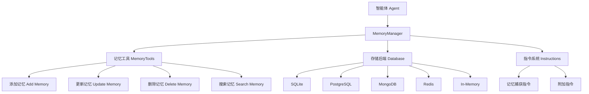

# 记忆管理

<cite>
**本文档中引用的文件**  
- [memory.py](file://libs/agno/agno/memory/manager.py)
- [memory.py](file://libs/agno/agno/db/schemas/memory.py)
- [sqlite.py](file://libs/agno/agno/db/sqlite/sqlite.py)
- [postgres.py](file://libs/agno/agno/db/postgres/postgres.py)
- [memory.py](file://libs/agno/agno/tools/memory.py)
- [01_agent_with_memory.py](file://cookbook/memory/01_agent_with_memory.py)
- [02_agentic_memory.py](file://cookbook/memory/02_agentic_memory.py)
- [08_memory_tools.py](file://cookbook/memory/08_memory_tools.py)
- [test_memory_manager.py](file://libs/agno/tests/integration/managers/test_memory_manager.py)
</cite>

## 目录
1. [引言](#引言)
2. [记忆管理架构](#记忆管理架构)
3. [MemoryManager 工作原理](#memorymanager-工作原理)
4. [记忆的持久化与恢复](#记忆的持久化与恢复)
5. [记忆工具与指令控制](#记忆工具与指令控制)
6. [跨会话记忆共享](#跨会话记忆共享)
7. [存储后端配置](#存储后端配置)
8. [记忆数据隐私与安全](#记忆数据隐私与安全)
9. [最佳实践](#最佳实践)

## 引言

Agno 智能体的记忆管理系统提供了一套完整的机制，用于持久化对话历史和用户记忆。该系统通过 `MemoryManager` 组件实现，能够自动捕获、存储和检索用户相关信息，从而实现个性化的持续对话体验。本文档将详细阐述该系统的架构、工作原理和使用方法。

## 记忆管理架构



**图示来源**
- [memory.py](file://libs/agno/agno/memory/manager.py)
- [memory.py](file://libs/agno/agno/tools/memory.py)

## MemoryManager 工作原理

`MemoryManager` 是 Agno 智能体记忆系统的核心组件，负责管理用户记忆的整个生命周期。它通过以下机制工作：

1. **记忆创建**：当智能体与用户交互时，`MemoryManager` 会分析对话内容，根据预设的指令自动识别需要记忆的关键信息。
2. **记忆存储**：识别出的记忆会被持久化存储到配置的数据库中。
3. **记忆检索**：在后续对话中，智能体可以查询相关记忆，以提供个性化的响应。
4. **记忆更新**：当用户信息发生变化时，系统可以更新或删除旧的记忆。

`MemoryManager` 通过 `create_user_memories` 和 `acreate_user_memories` 方法处理记忆的创建，这些方法会分析用户消息并决定是否需要创建新的记忆。

**代码示例路径**
- [memory.py](file://libs/agno/agno/memory/manager.py#L380-L408)

## 记忆的持久化与恢复

### 持久化机制

记忆的持久化是通过 `MemoryManager` 与数据库的集成实现的。当配置了数据库时，所有用户记忆都会被自动保存到数据库中，确保跨会话的持久性。

```python
# 示例：配置智能体使用数据库进行记忆持久化
agent = Agent(
    model=OpenAIChat(id="gpt-4o-mini"),
    db=db,
    enable_user_memories=True,
)
```

### 恢复机制

记忆的恢复是自动进行的。当智能体需要访问用户记忆时，`MemoryManager` 会从数据库中读取相关数据并加载到内存中。

```python
# 获取用户记忆
memories = agent.get_user_memories(user_id=john_doe_id)
```

**代码示例路径**
- [01_agent_with_memory.py](file://cookbook/memory/01_agent_with_memory.py#L35-L56)

## 记忆工具与指令控制

### 记忆工具

`MemoryTools` 提供了一套完整的 API 来控制和查询记忆：

- `add_memory`: 添加新的记忆片段
- `update_memory`: 更新现有记忆
- `delete_memory`: 删除记忆
- `get_memories`: 查询记忆

```python
# 示例：使用记忆工具
memory_tools = MemoryTools(db=db)
agent = Agent(
    tools=[memory_tools, DuckDuckGoTools()],
    instructions=[
        "You should use the MemoryTools to store information about the user for future reference.",
    ],
)
```

### 指令系统

`MemoryManager` 使用指令系统来控制记忆行为：

- `system_message`: 定义记忆管理的系统行为
- `memory_capture_instructions`: 定义哪些信息应该被记忆
- `additional_instructions`: 添加额外的自定义指令

**代码示例路径**
- [08_memory_tools.py](file://cookbook/memory/08_memory_tools.py#L35-L54)
- [memory.py](file://libs/agno/agno/memory/manager.py#L123-L157)

## 跨会话记忆共享

Agno 智能体支持跨会话的记忆共享，允许多个智能体或团队成员共享相同的记忆数据。

```python
# 示例：多个智能体共享记忆
agent1 = Agent(db=db, enable_user_memories=True)
agent2 = Agent(db=db, enable_user_memories=True)

# agent1 添加记忆
agent1.print_response("My name is John Doe", user_id=john_doe_id)

# agent2 可以访问相同记忆
memories = agent2.get_user_memories(user_id=john_doe_id)
```

**代码示例路径**
- [03_agents_share_memory.py](file://cookbook/memory/03_agents_share_memory.py)

## 存储后端配置

### 支持的存储后端

Agno 支持多种存储后端：

- **SQLite**: 轻量级文件数据库，适合开发和小型应用
- **PostgreSQL**: 功能完整的开源关系数据库
- **MongoDB**: NoSQL 文档数据库
- **Redis**: 内存数据结构存储
- **In-Memory**: 纯内存存储，适合临时会话

### 配置方法

#### SQLite 配置

```python
from agno.db.sqlite import SqliteDb

db = SqliteDb(db_file="tmp/memory.db")
```

#### PostgreSQL 配置

```python
from agno.db.postgres import PostgresDb

db_url = "postgresql+psycopg://ai:ai@localhost:5532/ai"
db = PostgresDb(db_url=db_url)
```

**代码示例路径**
- [sqlite.py](file://libs/agno/agno/db/sqlite/sqlite.py)
- [postgres.py](file://libs/agno/agno/db/postgres/postgres.py)

## 记忆数据隐私与安全

### 数据隐私

Agno 智能体记忆系统遵循以下隐私原则：

1. **用户标识**：所有记忆都与特定的 `user_id` 关联，确保数据隔离。
2. **数据最小化**：只存储必要的信息，避免过度收集。
3. **用户控制**：用户可以请求删除或更新其记忆。

### 安全措施

1. **数据加密**：建议在数据库层面启用加密。
2. **访问控制**：通过 `user_id` 限制数据访问。
3. **审计日志**：系统记录所有记忆操作。

```python
# 示例：删除用户记忆
agent.print_response("Remove all existing memories of me.", user_id=john_doe_id)
```

**代码示例路径**
- [02_agentic_memory.py](file://cookbook/memory/02_agentic_memory.py#L35-L45)

## 最佳实践

### 配置建议

1. **生产环境**：使用 PostgreSQL 或 MongoDB 等持久化数据库。
2. **开发环境**：可以使用 SQLite 或 In-Memory 存储。
3. **性能优化**：为记忆表创建适当的索引。

### 使用模式

1. **渐进式记忆**：从简单记忆开始，逐步增加复杂性。
2. **主题分类**：使用 `topics` 字段对记忆进行分类。
3. **定期清理**：实现记忆过期策略，避免数据膨胀。

### 故障排除

1. **检查数据库连接**：确保数据库服务正常运行。
2. **验证用户ID**：确保 `user_id` 一致。
3. **调试模式**：启用 `debug_mode` 查看详细日志。

**代码示例路径**
- [test_memory_manager.py](file://libs/agno/tests/integration/managers/test_memory_manager.py)