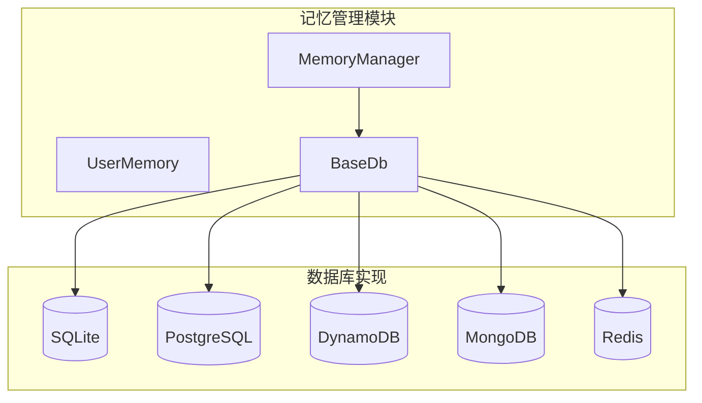
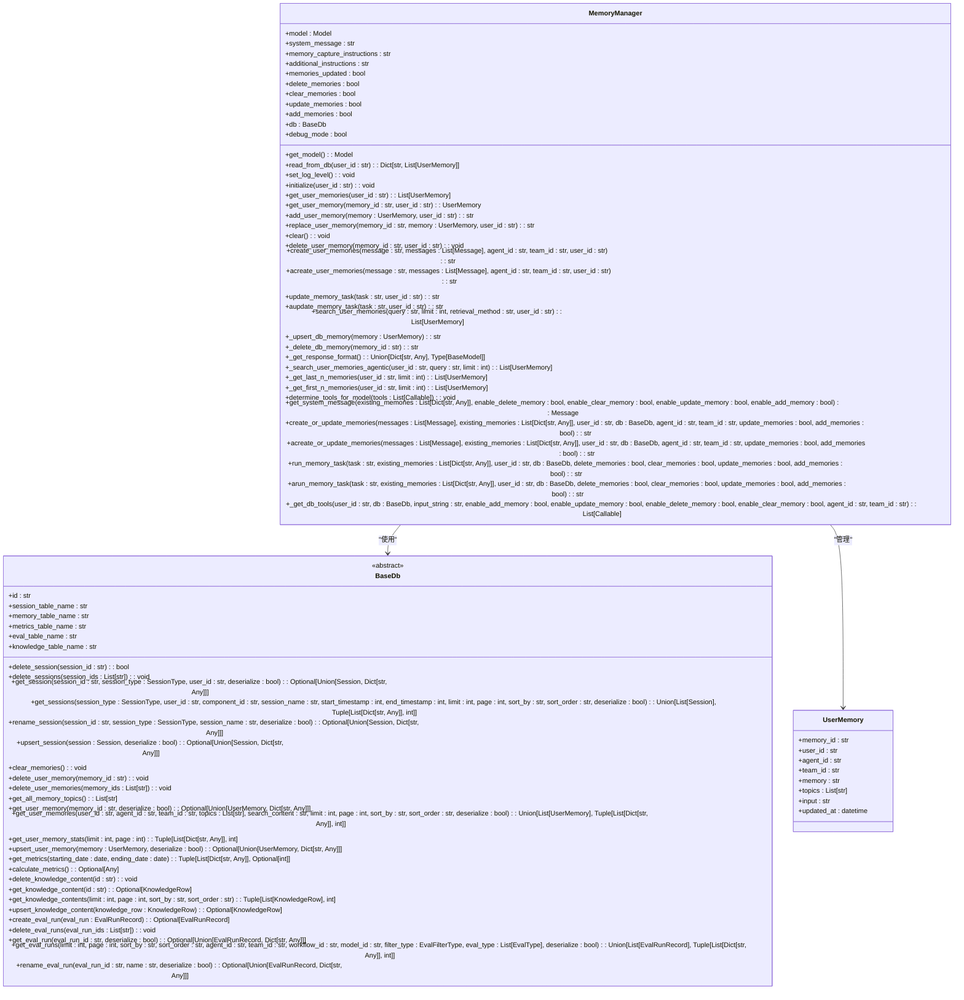
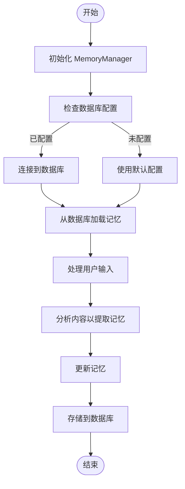
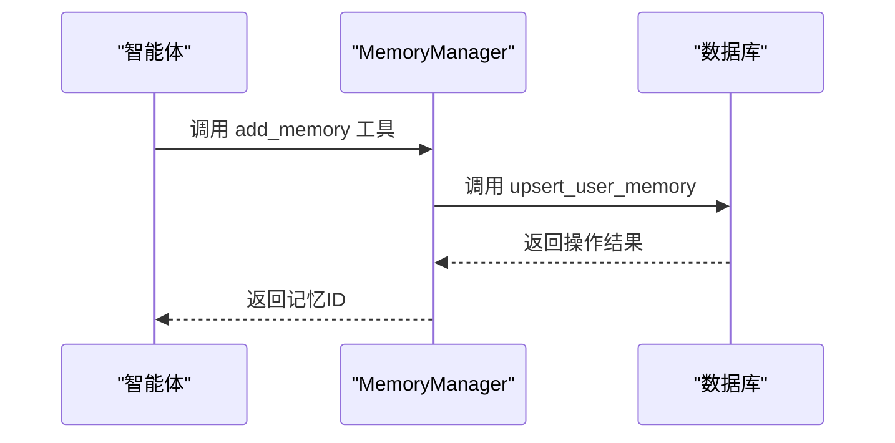
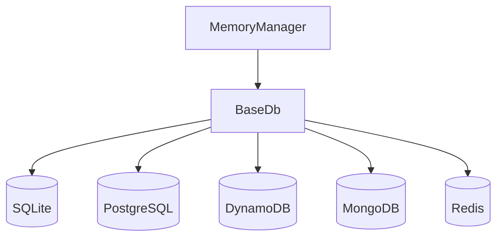

# 记忆管理器与工具

<cite>
**本文档中引用的文件**  
- [manager.py](file://libs/agno/agno/memory/manager.py)
- [base.py](file://libs/agno/agno/db/base.py)
- [test_memory_manager.py](file://libs/agno/tests/integration/managers/test_memory_manager.py)
</cite>

## 目录
1. [简介](#简介)
2. [项目结构](#项目结构)
3. [核心组件](#核心组件)
4. [架构概述](#架构概述)
5. [详细组件分析](#详细组件分析)
6. [依赖分析](#依赖分析)
7. [性能考虑](#性能考虑)
8. [故障排除指南](#故障排除指南)
9. [结论](#结论)

## 简介
本文档详细阐述了Agno框架中的记忆管理器（MemoryManager）及其相关工具的实现原理和使用方法。文档重点分析了`MemoryManager`类的架构设计、核心功能以及如何与智能体的推理过程集成。同时，文档还介绍了记忆工具的实现机制，包括如何配置不同的存储后端、如何在智能体指令中使用记忆工具，以及如何实现跨智能体或团队的记忆共享。

## 项目结构
Agno的记忆管理功能主要位于`libs/agno/agno/memory`目录下，其核心组件包括`MemoryManager`类和相关的数据库接口。记忆管理器通过与不同的数据库后端集成，实现了用户记忆片段的持久化存储和检索。

**Diagram sources**
- [manager.py](file://libs/agno/agno/memory/manager.py#L1-L50)
- [base.py](file://libs/agno/agno/db/base.py#L1-L30)

**Section sources**
- [manager.py](file://libs/agno/agno/memory/manager.py#L1-L100)
- [base.py](file://libs/agno/agno/db/base.py#L1-L50)

## 核心组件
`MemoryManager`是Agno框架中负责管理用户记忆的核心类。它提供了创建、读取、更新和删除用户记忆的功能，并通过与数据库后端的集成实现了记忆的持久化存储。`MemoryManager`还支持通过自然语言指令来更新记忆，使得智能体能够根据用户输入动态地管理记忆内容。

**Section sources**
- [manager.py](file://libs/agno/agno/memory/manager.py#L1-L100)

## 架构概述
`MemoryManager`的架构设计遵循了模块化和可扩展的原则。它通过抽象的`BaseDb`接口与不同的数据库后端进行交互，使得开发者可以轻松地切换或添加新的存储后端。记忆管理器的核心功能包括记忆的索引、存储和检索，这些功能通过一系列方法和工具函数来实现。

**Diagram sources**
- [manager.py](file://libs/agno/agno/memory/manager.py#L1-L1074)
- [base.py](file://libs/agno/agno/db/base.py#L1-L246)

## 详细组件分析

### MemoryManager 分析
`MemoryManager`类是Agno框架中负责管理用户记忆的核心组件。它通过与`BaseDb`接口的集成，实现了对用户记忆的持久化存储和检索。`MemoryManager`提供了多种方法来操作用户记忆，包括添加、更新、删除和搜索记忆。

#### 核心功能
`MemoryManager`的核心功能包括记忆的创建、读取、更新和删除。这些功能通过一系列公共方法来实现，如`add_user_memory`、`get_user_memories`、`replace_user_memory`和`delete_user_memory`。这些方法允许开发者以编程方式管理用户记忆。

**Diagram sources**
- [manager.py](file://libs/agno/agno/memory/manager.py#L1-L1074)

#### 记忆工具实现
`MemoryManager`通过`_get_db_tools`方法生成一系列工具函数，这些函数可以被智能体用来操作记忆。这些工具函数包括`add_memory`、`update_memory`、`delete_memory`和`clear_memory`，它们分别对应于记忆的添加、更新、删除和清空操作。

**Diagram sources**
- [manager.py](file://libs/agno/agno/memory/manager.py#L1000-L1073)

**Section sources**
- [manager.py](file://libs/agno/agno/memory/manager.py#L1-L1074)

## 依赖分析
`MemoryManager`依赖于`BaseDb`接口来实现与不同数据库后端的交互。这种设计使得`MemoryManager`可以轻松地与多种数据库集成，如SQLite、PostgreSQL、DynamoDB、MongoDB和Redis。通过这种抽象，开发者可以专注于记忆管理的逻辑，而不必关心底层数据库的具体实现。

**Diagram sources**
- [manager.py](file://libs/agno/agno/memory/manager.py#L1-L50)
- [base.py](file://libs/agno/agno/db/base.py#L1-L30)

**Section sources**
- [manager.py](file://libs/agno/agno/memory/manager.py#L1-L100)
- [base.py](file://libs/agno/agno/db/base.py#L1-L50)

## 性能考虑
在使用`MemoryManager`时，需要注意以下性能优化策略：
1. **向量搜索**：对于大规模记忆数据，可以使用向量搜索来提高检索效率。
2. **关键词过滤**：通过关键词过滤可以快速缩小搜索范围，提高检索速度。
3. **缓存机制**：对于频繁访问的记忆数据，可以使用缓存机制来减少数据库查询次数。

## 故障排除指南
在使用`MemoryManager`时，可能会遇到以下常见问题：
1. **数据库连接失败**：检查数据库配置是否正确，确保数据库服务正在运行。
2. **记忆更新失败**：检查输入数据是否符合预期格式，确保必要的字段已正确填充。
3. **检索结果不准确**：检查检索查询是否正确，确保关键词和过滤条件设置合理。

**Section sources**
- [test_memory_manager.py](file://libs/agno/tests/integration/managers/test_memory_manager.py#L54-L86)

## 结论
`MemoryManager`是Agno框架中一个强大且灵活的组件，它通过模块化的设计和丰富的功能，为智能体提供了高效的记忆管理能力。通过与不同数据库后端的集成，`MemoryManager`能够满足各种应用场景的需求，从简单的本地存储到复杂的分布式数据库系统。