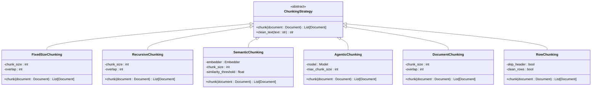

# 知识分块

<cite>
**本文档中引用的文件**   
- [fixed_size_chunking.py](file://cookbook/knowledge/chunking/fixed_size_chunking.py)
- [recursive_chunking.py](file://cookbook/knowledge/chunking/recursive_chunking.py)
- [semantic_chunking.py](file://cookbook/knowledge/chunking/semantic_chunking.py)
- [agentic_chunking.py](file://cookbook/knowledge/chunking/agentic_chunking.py)
- [document_chunking.py](file://cookbook/knowledge/chunking/document_chunking.py)
- [csv_row_chunking.py](file://cookbook/knowledge/chunking/csv_row_chunking.py)
- [custom_strategy_example.py](file://cookbook/knowledge/chunking/custom_strategy_example.py)
- [fixed.py](file://libs/agno/agno/knowledge/chunking/fixed.py)
- [recursive.py](file://libs/agno/agno/knowledge/chunking/recursive.py)
- [semantic.py](file://libs/agno/agno/knowledge/chunking/semantic.py)
- [agentic.py](file://libs/agno/agno/knowledge/chunking/agentic.py)
- [document.py](file://libs/agno/agno/knowledge/chunking/document.py)
- [row.py](file://libs/agno/agno/knowledge/chunking/row.py)
- [strategy.py](file://libs/agno/agno/knowledge/chunking/strategy.py)
- [markdown.py](file://libs/agno/agno/knowledge/chunking/markdown.py)
</cite>

## 目录
1. [引言](#引言)
2. [项目结构](#项目结构)
3. [核心组件](#核心组件)
4. [架构概述](#架构概述)
5. [详细组件分析](#详细组件分析)
6. [依赖分析](#依赖分析)
7. [性能考虑](#性能考虑)
8. [故障排除指南](#故障排除指南)
9. [结论](#结论)
10. [附录](#附录)（如有必要）

## 引言
知识分块是将原始文档分割成更小、可管理的块（chunks）的过程，这对于高效的知识检索和处理至关重要。本文档深入探讨了不同的分块策略，包括固定大小分块、递归分块、语义分块和代理分块（agentic chunking），详细解释了它们的工作原理、适用场景和优缺点。我们还将阐述分块策略对后续检索质量和RAG系统整体性能的影响，并提供如何在代码中配置和使用每种分块策略的实践指南。

## 项目结构
知识分块相关的代码位于`cookbook/knowledge/chunking`目录下，该目录包含了多种分块策略的实现示例和核心逻辑。主要的分块策略包括固定大小分块、递归分块、语义分块、代理分块、文档分块和CSV行分块等。这些策略通过继承`ChunkingStrategy`基类并实现`chunk()`方法来定义具体的分块逻辑。


**图示来源**
- [fixed_size_chunking.py](file://cookbook/knowledge/chunking/fixed_size_chunking.py)
- [recursive_chunking.py](file://cookbook/knowledge/chunking/recursive_chunking.py)
- [semantic_chunking.py](file://cookbook/knowledge/chunking/semantic_chunking.py)
- [agentic_chunking.py](file://cookbook/knowledge/chunking/agentic_chunking.py)
- [document_chunking.py](file://cookbook/knowledge/chunking/document_chunking.py)
- [csv_row_chunking.py](file://cookbook/knowledge/chunking/csv_row_chunking.py)
- [custom_strategy_example.py](file://cookbook/knowledge/chunking/custom_strategy_example.py)

**章节来源**
- [README.md](file://cookbook/knowledge/chunking/README.md)

## 核心组件
知识分块的核心组件包括各种分块策略的实现类，这些类都继承自`ChunkingStrategy`基类。每个分块策略都有其特定的初始化参数和分块逻辑，通过`chunk()`方法将文档内容分割成多个块。这些块随后可以被用于向量数据库的索引和检索。

**章节来源**
- [strategy.py](file://libs/agno/agno/knowledge/chunking/strategy.py)
- [fixed.py](file://libs/agno/agno/knowledge/chunking/fixed.py)
- [recursive.py](file://libs/agno/agno/knowledge/chunking/recursive.py)
- [semantic.py](file://libs/agno/agno/knowledge/chunking/semantic.py)
- [agentic.py](file://libs/agno/agno/knowledge/chunking/agentic.py)

## 架构概述
知识分块的架构设计遵循了策略模式，通过定义一个抽象的`ChunkingStrategy`基类，允许不同的分块策略以插件的形式集成到系统中。这种设计使得系统具有高度的灵活性和可扩展性，开发者可以根据具体需求选择或实现合适的分块策略。



**图示来源**
- [strategy.py](file://libs/agno/agno/knowledge/chunking/strategy.py)
- [fixed.py](file://libs/agno/agno/knowledge/chunking/fixed.py)
- [recursive.py](file://libs/agno/agno/knowledge/chunking/recursive.py)
- [semantic.py](file://libs/agno/agno/knowledge/chunking/semantic.py)
- [agentic.py](file://libs/agno/agno/knowledge/chunking/agentic.py)
- [document.py](file://libs/agno/agno/knowledge/chunking/document.py)
- [row.py](file://libs/agno/agno/knowledge/chunking/row.py)

## 详细组件分析
### 固定大小分块分析
固定大小分块策略将文档内容分割成指定大小的块，支持设置重叠部分以确保上下文的连续性。该策略适用于内容结构较为均匀的文档，能够保证每个块的大小一致，便于后续处理。


**图示来源**
- [fixed.py](file://libs/agno/agno/knowledge/chunking/fixed.py)

**章节来源**
- [fixed_size_chunking.py](file://cookbook/knowledge/chunking/fixed_size_chunking.py)
- [fixed.py](file://libs/agno/agno/knowledge/chunking/fixed.py)

### 递归分块分析
递归分块策略通过寻找自然断点（如换行符或句号）来分割文本，确保每个块在语义上尽可能完整。该策略适用于内容结构复杂、需要保持语义连贯性的文档。


**图示来源**
- [recursive.py](file://libs/agno/agno/knowledge/chunking/recursive.py)

**章节来源**
- [recursive_chunking.py](file://cookbook/knowledge/chunking/recursive_chunking.py)
- [recursive.py](file://libs/agno/agno/knowledge/chunking/recursive.py)

### 语义分块分析
语义分块策略利用嵌入模型（embedder）来计算文本片段之间的相似度，从而将语义上相关的文本组合成一个块。该策略能够生成语义上更加连贯的块，适用于需要高精度语义理解的应用场景。


**图示来源**
- [semantic.py](file://libs/agno/agno/knowledge/chunking/semantic.py)

**章节来源**
- [semantic_chunking.py](file://cookbook/knowledge/chunking/semantic_chunking.py)
- [semantic.py](file://libs/agno/agno/knowledge/chunking/semantic.py)

### 代理分块分析
代理分块策略使用大型语言模型（LLM）来确定文本中的自然断点，通过上下文理解来生成语义上更加合理的块。该策略能够处理复杂的文本结构，生成高质量的分块结果。


**图示来源**
- [agentic.py](file://libs/agno/agno/knowledge/chunking/agentic.py)

**章节来源**
- [agentic_chunking.py](file://cookbook/knowledge/chunking/agentic_chunking.py)
- [agentic.py](file://libs/agno/agno/knowledge/chunking/agentic.py)

### 文档分块分析
文档分块策略基于文档结构（如段落和章节）进行分割，首先按双换行符分割成段落，然后根据块大小限制将段落组合成块。该策略适用于结构化文档，能够保持段落的完整性。


**图示来源**
- [document.py](file://libs/agno/agno/knowledge/chunking/document.py)

**章节来源**
- [document_chunking.py](file://cookbook/knowledge/chunking/document_chunking.py)
- [document.py](file://libs/agno/agno/knowledge/chunking/document.py)

### CSV行分块分析
CSV行分块策略将CSV文件的每一行作为一个独立的块，支持跳过标题行和清理行内容。该策略适用于表格数据，能够保持每行数据的独立性和完整性。


**图示来源**
- [row.py](file://libs/agno/agno/knowledge/chunking/row.py)

**章节来源**
- [csv_row_chunking.py](file://cookbook/knowledge/chunking/csv_row_chunking.py)
- [row.py](file://libs/agno/agno/knowledge/chunking/row.py)

### 自定义分块策略分析
自定义分块策略允许开发者通过继承`ChunkingStrategy`基类并实现`chunk()`方法来创建特定于领域的分块逻辑。该策略提供了极大的灵活性，可以根据具体需求定制分块规则。


**图示来源**
- [custom_strategy_example.py](file://cookbook/knowledge/chunking/custom_strategy_example.py)

**章节来源**
- [custom_strategy_example.py](file://cookbook/knowledge/chunking/custom_strategy_example.py)

## 依赖分析
知识分块模块依赖于多个外部库和内部组件，包括`unstructured`用于Markdown分块，`chonkie`用于语义分块，以及各种嵌入模型和向量数据库。这些依赖关系通过工厂模式和策略模式进行管理，确保系统的模块化和可维护性。


**图示来源**
- [strategy.py](file://libs/agno/agno/knowledge/chunking/strategy.py)
- [semantic.py](file://libs/agno/agno/knowledge/chunking/semantic.py)
- [markdown.py](file://libs/agno/agno/knowledge/chunking/markdown.py)

**章节来源**
- [strategy.py](file://libs/agno/agno/knowledge/chunking/strategy.py)
- [semantic.py](file://libs/agno/agno/knowledge/chunking/semantic.py)
- [markdown.py](file://libs/agno/agno/knowledge/chunking/markdown.py)

## 性能考虑
不同的分块策略在性能上有显著差异。固定大小分块和递归分块由于算法简单，处理速度快，适合大规模文档的快速处理。语义分块和代理分块虽然能够生成更高质量的分块结果，但由于需要调用嵌入模型或大型语言模型，处理速度较慢，资源消耗较大。在实际应用中，应根据具体需求权衡分块质量和处理性能。

## 故障排除指南
在使用知识分块功能时，可能会遇到一些常见问题，如依赖库未安装、参数配置错误等。以下是一些常见问题的解决方案：
- **ImportError: `unstructured` not installed**：请安装`unstructured`库，命令为`pip install unstructured markdown`。
- **ValueError: overlap must be less than chunk size**：确保重叠大小小于块大小。
- **ImportError: `chonkie` is required for semantic chunking**：请安装`chonkie`库，命令为`pip install chonkie`。

**章节来源**
- [markdown.py](file://libs/agno/agno/knowledge/chunking/markdown.py)
- [fixed.py](file://libs/agno/agno/knowledge/chunking/fixed.py)
- [semantic.py](file://libs/agno/agno/knowledge/chunking/semantic.py)

## 结论
知识分块是构建高效RAG系统的关键步骤，不同的分块策略适用于不同的应用场景。固定大小分块和递归分块适合处理结构简单的文档，而语义分块和代理分块则适合需要高精度语义理解的复杂文档。通过合理选择和配置分块策略，可以显著提升检索质量和系统性能。此外，自定义分块策略为特定领域的需求提供了极大的灵活性，开发者可以根据具体需求定制分块逻辑。

## 附录
### 分块策略对比表
| 分块策略 | 工作原理 | 适用场景 | 优点 | 缺点 |
| --- | --- | --- | --- | --- |
| 固定大小分块 | 按固定字符数分割 | 结构均匀的文档 | 简单高效，块大小一致 | 可能切断语义完整的句子 |
| 递归分块 | 寻找自然断点（如句号） | 需要保持语义连贯性的文档 | 保持语义完整性 | 处理速度较慢 |
| 语义分块 | 使用嵌入模型计算相似度 | 高精度语义理解 | 生成语义连贯的块 | 依赖外部库，资源消耗大 |
| 代理分块 | 使用LLM确定断点 | 复杂文本结构 | 生成高质量分块 | 处理速度慢，成本高 |
| 文档分块 | 基于文档结构（段落） | 结构化文档 | 保持段落完整性 | 需要文档有明确结构 |
| CSV行分块 | 每行作为一个块 | 表格数据 | 保持数据独立性 | 仅适用于表格数据 |

### 配置示例
```python
# 固定大小分块
chunking_strategy = FixedSizeChunking(chunk_size=5000, overlap=100)

# 递归分块
chunking_strategy = RecursiveChunking(chunk_size=5000, overlap=100)

# 语义分块
chunking_strategy = SemanticChunking(embedder=OpenAIEmbedder(), chunk_size=5000, similarity_threshold=0.5)

# 代理分块
chunking_strategy = AgenticChunking(model=OpenAIChat("gpt-4"), max_chunk_size=5000)

# 文档分块
chunking_strategy = DocumentChunking(chunk_size=5000, overlap=100)

# CSV行分块
chunking_strategy = RowChunking(skip_header=True, clean_rows=True)
```