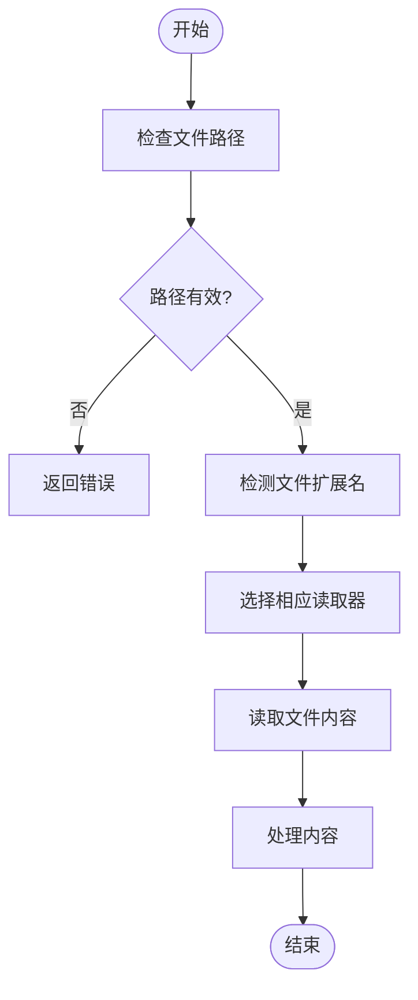
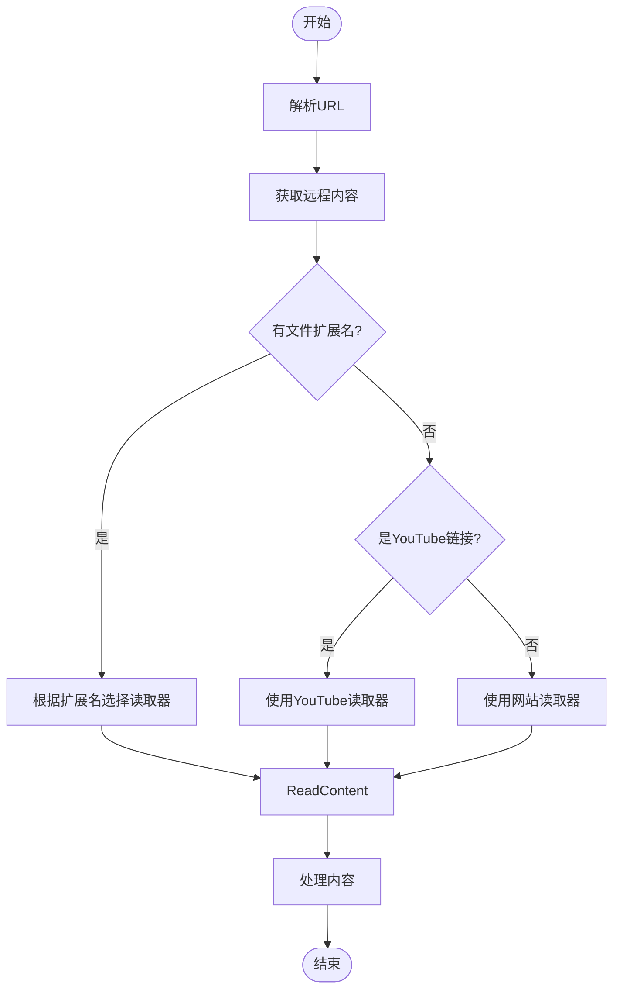
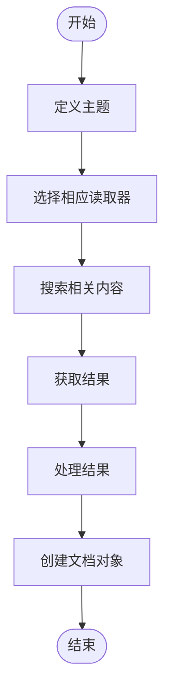
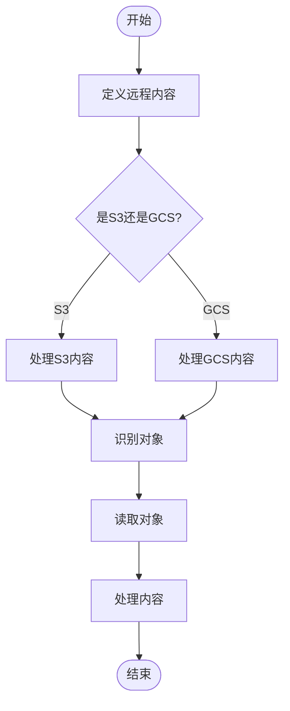
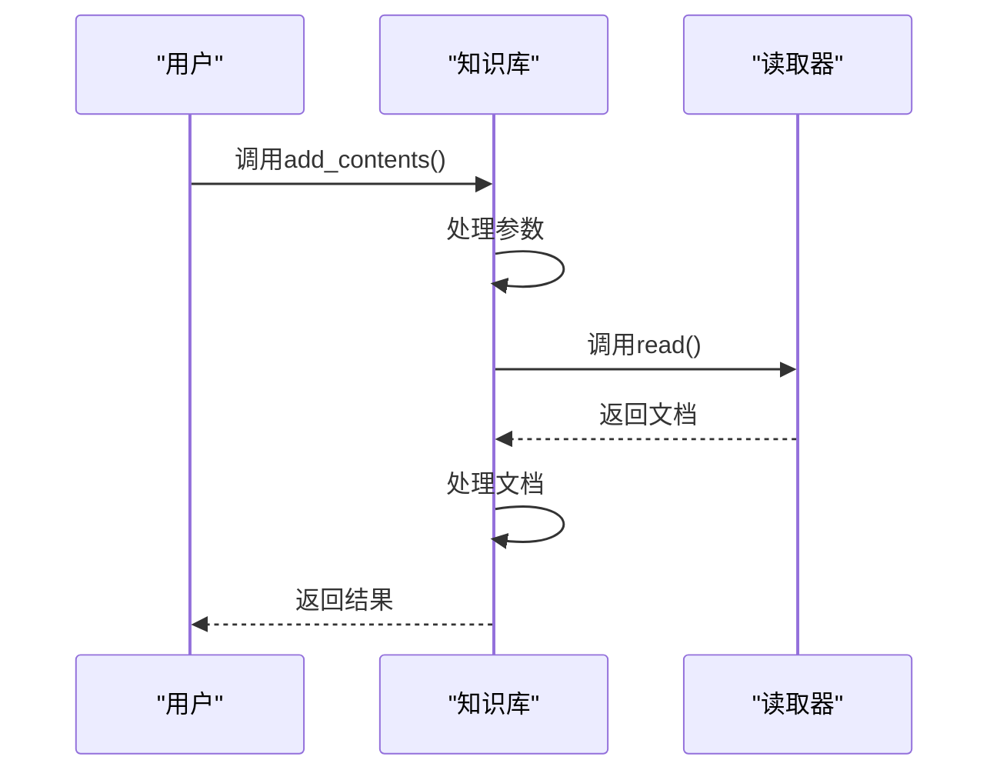
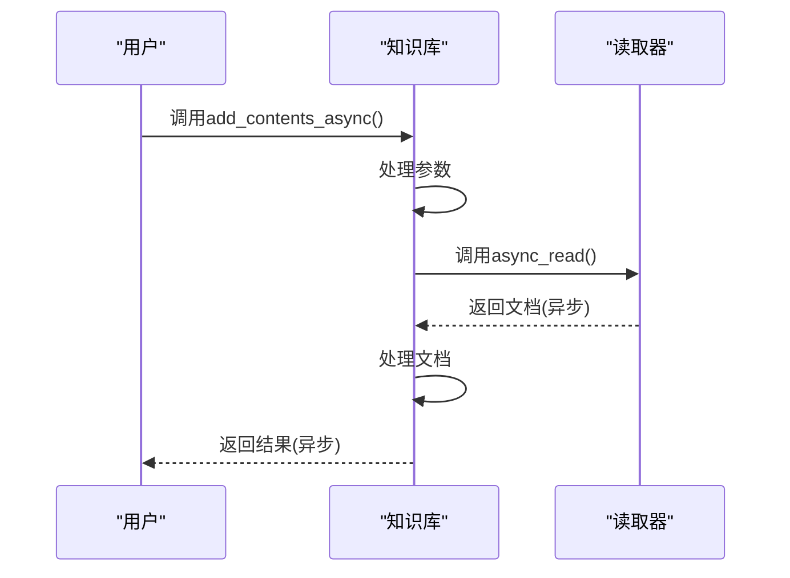
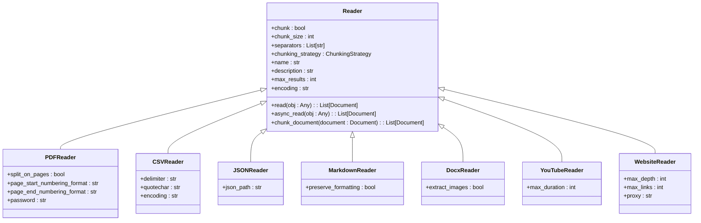
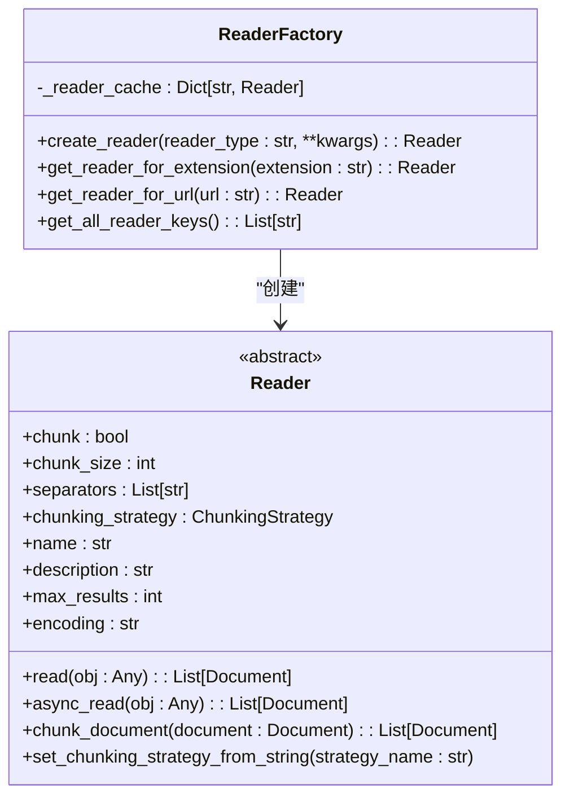

# 知识加载与操作

<cite>
**本文档中引用的文件**  
- [knowledge.py](file://libs/agno/agno/knowledge/knowledge.py)
- [base.py](file://libs/agno/agno/knowledge/reader/base.py)
- [reader_factory.py](file://libs/agno/agno/knowledge/reader/reader_factory.py)
- [pdf_reader.py](file://libs/agno/agno/knowledge/reader/pdf_reader.py)
- [csv_reader.py](file://libs/agno/agno/knowledge/reader/csv_reader.py)
- [arxiv_reader.py](file://libs/agno/agno/knowledge/reader/arxiv_reader.py)
- [youtube_reader.py](file://libs/agno/agno/knowledge/reader/youtube_reader.py)
- [website_reader.py](file://libs/agno/agno/knowledge/reader/website_reader.py)
- [01_from_path.py](file://cookbook/knowledge/basic_operations/01_from_path.py)
- [02_from_url.py](file://cookbook/knowledge/basic_operations/02_from_url.py)
- [03_from_topic.py](file://cookbook/knowledge/basic_operations/03_from_topic.py)
</cite>

## 目录
1. [简介](#简介)
2. [知识加载来源](#知识加载来源)
3. [同步与异步加载模式](#同步与异步加载模式)
4. [文件格式支持与读取器架构](#文件格式支持与读取器架构)
5. [Reader组件架构与扩展机制](#reader组件架构与扩展机制)
6. [配置选项](#配置选项)
7. [实际应用示例](#实际应用示例)
8. [总结](#总结)

## 简介
本文档详细介绍了如何为智能体和团队从多种来源加载知识。系统支持从本地文件系统、远程URL、S3、GCS存储桶、YouTube视频、特定主题或数据库等多种来源加载知识。文档涵盖了同步和异步加载模式，以及如何处理不同文件格式（如PDF、CSV、JSON、Markdown、Docx等）。通过分析核心组件和实际示例，展示了如何构建一个从多个来源加载知识的知识库。

**Section sources**
- [knowledge.py](file://libs/agno/agno/knowledge/knowledge.py#L1-L50)

## 知识加载来源
知识加载系统支持多种来源，包括本地文件路径、远程URL、特定主题、S3存储桶和GCS存储桶。每种来源都有相应的处理机制和配置选项。

### 本地文件系统
通过`add_content_async`方法的`path`参数，可以从本地文件系统加载知识。系统会自动根据文件扩展名选择合适的读取器。



**Diagram sources**
- [knowledge.py](file://libs/agno/agno/knowledge/knowledge.py#L488-L524)

**Section sources**
- [01_from_path.py](file://cookbook/knowledge/basic_operations/01_from_path.py#L1-L48)

### 远程URL
通过`add_content_async`方法的`url`参数，可以从远程URL加载知识。系统会根据URL内容和扩展名自动选择合适的读取器。



**Diagram sources**
- [knowledge.py](file://libs/agno/agno/knowledge/knowledge.py#L488-L524)
- [reader_factory.py](file://libs/agno/agno/knowledge/reader/reader_factory.py#L187-L221)

**Section sources**
- [02_from_url.py](file://cookbook/knowledge/basic_operations/02_from_url.py#L1-L48)

### 特定主题
通过`topics`参数和相应的读取器（如WikipediaReader或ArxivReader），可以从特定主题加载知识。这种方式适用于从学术数据库或百科全书获取信息。



**Diagram sources**
- [arxiv_reader.py](file://libs/agno/agno/knowledge/reader/arxiv_reader.py#L41-L80)
- [wikipedia_reader.py](file://libs/agno/agno/knowledge/reader/wikipedia_reader.py)

**Section sources**
- [03_from_topic.py](file://cookbook/knowledge/basic_operations/03_from_topic.py#L1-L42)

### S3和GCS存储桶
通过`remote_content`参数，可以从S3或GCS存储桶加载知识。系统支持指定存储桶、键、前缀等参数来精确控制加载范围。



**Diagram sources**
- [knowledge.py](file://libs/agno/agno/knowledge/knowledge.py#L743-L768)
- [remote_content.py](file://libs/agno/agno/knowledge/remote_content/remote_content.py#L45-L87)

## 同步与异步加载模式
系统提供了同步和异步两种加载模式，以满足不同的使用场景和性能需求。

### 同步加载
同步加载模式通过`add_contents`方法实现，适用于简单的应用场景或脚本执行。



**Diagram sources**
- [knowledge.py](file://libs/agno/agno/knowledge/knowledge.py#L100-L150)

### 异步加载
异步加载模式通过`add_contents_async`方法实现，适用于需要高性能和并发处理的场景。



**Diagram sources**
- [knowledge.py](file://libs/agno/agno/knowledge/knowledge.py#L80-L99)

## 文件格式支持与读取器架构
系统支持多种文件格式，每种格式都有专门的读取器进行处理。

### 支持的文件格式
系统支持以下文件格式：
- PDF
- CSV
- JSON
- Markdown
- Docx
- 文本文件
- YouTube视频
- 网站内容



**Diagram sources**
- [base.py](file://libs/agno/agno/knowledge/reader/base.py#L0-L91)
- [pdf_reader.py](file://libs/agno/agno/knowledge/reader/pdf_reader.py#L0-L199)
- [csv_reader.py](file://libs/agno/agno/knowledge/reader/csv_reader.py)

## Reader组件架构与扩展机制
Reader组件是知识加载系统的核心，负责从各种来源读取和解析内容。

### 基础架构
Reader组件基于抽象基类实现，提供了统一的接口和默认行为。



**Diagram sources**
- [base.py](file://libs/agno/agno/knowledge/reader/base.py#L0-L91)
- [reader_factory.py](file://libs/agno/agno/knowledge/reader/reader_factory.py#L0-L221)

### 具体实现
#### PDF读取器
PDF读取器支持密码保护的PDF文件和OCR功能，能够处理包含图像的PDF文档。

```python
[SPEC SYMBOL](file://libs/agno/agno/knowledge/reader/pdf_reader.py#L200-L457)
```

**Section sources**
- [pdf_reader.py](file://libs/agno/agno/knowledge/reader/pdf_reader.py#L200-L457)

#### CSV读取器
CSV读取器支持自定义分隔符、引号字符和编码，能够处理复杂的CSV文件。

```python
[SPEC SYMBOL](file://libs/agno/agno/knowledge/reader/csv_reader.py)
```

**Section sources**
- [csv_reader.py](file://libs/agno/agno/knowledge/reader/csv_reader.py)

#### Arxiv读取器
Arxiv读取器能够从arXiv数据库搜索和获取学术论文，支持按相关性排序。

```python
[SPEC SYMBOL](file://libs/agno/agno/knowledge/reader/arxiv_reader.py#L41-L80)
```

**Section sources**
- [arxiv_reader.py](file://libs/agno/agno/knowledge/reader/arxiv_reader.py#L41-L80)

#### Web读取器
Web读取器能够爬取网站内容，支持设置最大深度和链接数量限制。

```python
[SPEC SYMBOL](file://libs/agno/agno/knowledge/reader/website_reader.py#L0-L199)
```

**Section sources**
- [website_reader.py](file://libs/agno/agno/knowledge/reader/website_reader.py#L0-L199)

## 配置选项
系统提供了丰富的配置选项，以满足不同的使用需求。

### 自定义编码
CSV读取器支持自定义编码，可以处理不同字符集的文件。

```python
[SPEC SYMBOL](file://cookbook/knowledge/readers/csv_reader_custom_encodings.py)
```

### 密码保护的PDF
PDF读取器支持密码保护的PDF文件，可以在读取时提供密码。

```python
[SPEC SYMBOL](file://cookbook/knowledge/readers/pdf_reader_password.py)
```

### 跳过已存在内容
在添加内容时，可以通过`skip_if_exists`参数控制是否跳过已存在的内容。

```python
[SPEC SYMBOL](file://cookbook/knowledge/basic_operations/11_skip_if_exists.py)
```

### 内容过滤
支持通过`include`和`exclude`参数过滤文件，只加载符合特定模式的文件。

```python
[SPEC SYMBOL](file://cookbook/knowledge/basic_operations/08_include_exclude_files.py)
```

## 实际应用示例
以下是构建一个从多个来源加载知识的知识库的实际示例。

```python
[SPEC SYMBOL](file://cookbook/knowledge/basic_operations/04_from_multiple.py)
```

该示例展示了如何从本地文件、远程URL和特定主题等多个来源加载知识，并构建一个综合的知识库。

**Section sources**
- [04_from_multiple.py](file://cookbook/knowledge/basic_operations/04_from_multiple.py)

## 总结
本文档详细介绍了知识加载与操作系统的各个方面，包括多种知识来源、同步与异步加载模式、文件格式支持、Reader组件架构和扩展机制，以及各种配置选项。通过这些功能，用户可以灵活地从各种来源加载知识，构建强大的智能体和团队应用。