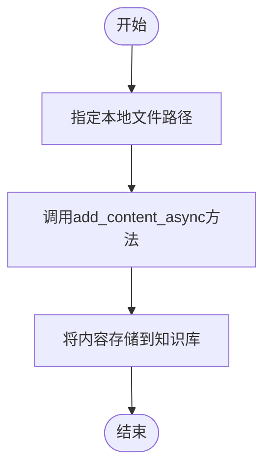
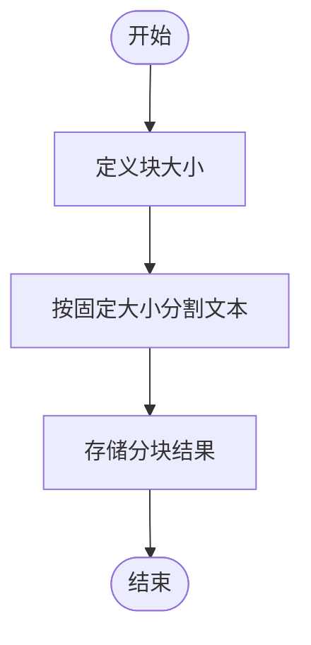
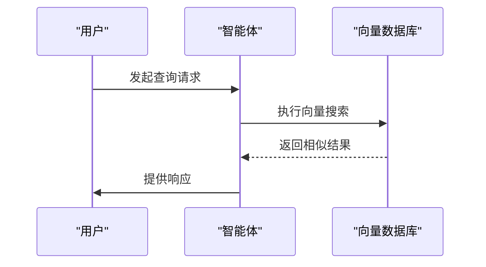

# 知识管理

<cite>
**本文档中引用的文件**
- [01_from_path.py](file://cookbook/knowledge/basic_operations/01_from_path.py)
- [02_from_url.py](file://cookbook/knowledge/basic_operations/02_from_url.py)
- [06_from_s3.py](file://cookbook/knowledge/basic_operations/06_from_s3.py)
- [07_from_gcs.py](file://cookbook/knowledge/basic_operations/07_from_gcs.py)
- [03_from_topic.py](file://cookbook/knowledge/basic_operations/03_from_topic.py)
- [fixed_size_chunking.py](file://cookbook/knowledge/chunking/fixed_size_chunking.py)
- [recursive_chunking.py](file://cookbook/knowledge/chunking/recursive_chunking.py)
- [semantic_chunking.py](file://cookbook/knowledge/chunking/semantic_chunking.py)
- [agentic_chunking.py](file://cookbook/knowledge/chunking/agentic_chunking.py)
- [openai_embedder.py](file://cookbook/knowledge/embedders/openai_embedder.py)
- [pgvector_db.py](file://cookbook/knowledge/vector_db/pgvector/pgvector_db.py)
- [vector_search.py](file://cookbook/knowledge/search_type/vector_search.py)
- [keyword_search.py](file://cookbook/knowledge/search_type/keyword_search.py)
- [hybrid_search.py](file://cookbook/knowledge/search_type/hybrid_search.py)
- [filtering.py](file://cookbook/knowledge/filters/filtering.py)
- [retriever.py](file://cookbook/knowledge/custom_retriever/retriever.py)
- [knowledge_tools.py](file://cookbook/knowledge/knowledge_tools.py)
</cite>

## 目录
1. [简介](#简介)
2. [知识加载方式](#知识加载方式)
3. [知识分块策略](#知识分块策略)
4. [嵌入器与向量数据库](#嵌入器与向量数据库)
5. [检索类型](#检索类型)
6. [过滤器与自定义检索器](#过滤器与自定义检索器)
7. [构建RAG智能体示例](#构建rag智能体示例)
8. [结论](#结论)

## 简介
知识管理是智能体系统的核心功能，它允许智能体访问和利用外部信息来增强其响应能力。本指南详细介绍了如何为智能体或团队配置和使用知识库，涵盖了从数据加载、分块、嵌入到检索的完整流程。

## 知识加载方式
知识库支持从多种来源加载内容，确保了灵活性和广泛的适用性。

### 从本地路径加载
通过指定本地文件路径，可以将文件内容添加到知识库中。此方法适用于存储在本地系统中的文档、简历或其他文件。

**Diagram sources**
- [01_from_path.py](file://cookbook/knowledge/basic_operations/01_from_path.py)

**Section sources**
- [01_from_path.py](file://cookbook/knowledge/basic_operations/01_from_path.py)

### 从URL加载
可以从指定的URL加载内容，这使得能够直接从网络资源获取信息，如网页、PDF文档等。

**Section sources**
- [02_from_url.py](file://cookbook/knowledge/basic_operations/02_from_url.py)

### 从S3加载
支持从Amazon S3存储桶加载内容，这对于云存储的文档管理非常有用。

**Section sources**
- [06_from_s3.py](file://cookbook/knowledge/basic_operations/06_from_s3.py)

### 从GCS加载
可以从Google Cloud Storage加载内容，为使用GCP的用户提供便利。

**Section sources**
- [07_from_gcs.py](file://cookbook/knowledge/basic_operations/07_from_gcs.py)

### 从特定主题加载
可以根据特定主题加载相关内容，这种方法有助于聚焦于特定领域的知识。

**Section sources**
- [03_from_topic.py](file://cookbook/knowledge/basic_operations/03_from_topic.py)

## 知识分块策略
知识分块是将大文档分割成更小、更易管理的部分的过程，这对于提高检索效率至关重要。

### 固定大小分块
将文本按固定字符或标记长度分割成块，简单直接，但可能在不自然的边界处切断内容。

**Diagram sources**
- [fixed_size_chunking.py](file://cookbook/knowledge/chunking/fixed_size_chunking.py)

**Section sources**
- [fixed_size_chunking.py](file://cookbook/knowledge/chunking/fixed_size_chunking.py)

### 递归分块
使用递归方式在自然边界（如句子或段落）处分割文本，保持内容的连贯性。

**Section sources**
- [recursive_chunking.py](file://cookbook/knowledge/chunking/recursive_chunking.py)

### 语义分块
基于语义相似性分割文本，确保每个块包含语义上相关的句子，提高检索的相关性。

**Section sources**
- [semantic_chunking.py](file://cookbook/knowledge/chunking/semantic_chunking.py)

### 代理分块
利用AI代理智能地确定最佳分块边界，结合内容结构和语义信息进行分割。

**Section sources**
- [agentic_chunking.py](file://cookbook/knowledge/chunking/agentic_chunking.py)

## 嵌入器与向量数据库
嵌入器将文本转换为向量表示，而向量数据库则用于存储和检索这些向量。

### 嵌入器
支持多种嵌入模型提供商，如OpenAI、Cohere、Hugging Face等，用户可以根据需求选择合适的嵌入器。

**Section sources**
- [openai_embedder.py](file://cookbook/knowledge/embedders/openai_embedder.py)

### 向量数据库
支持多种向量数据库实现，包括PgVector、LanceDB、Milvus等，提供灵活的存储选项。

**Section sources**
- [pgvector_db.py](file://cookbook/knowledge/vector_db/pgvector/pgvector_db.py)

## 检索类型
不同的检索类型满足不同场景下的信息查找需求。

### 向量搜索
基于向量相似度进行搜索，找到与查询最接近的文档块。

**Diagram sources**
- [vector_search.py](file://cookbook/knowledge/search_type/vector_search.py)

**Section sources**
- [vector_search.py](file://cookbook/knowledge/search_type/vector_search.py)

### 关键词搜索
基于关键词匹配进行搜索，适合精确查找特定术语或短语。

**Section sources**
- [keyword_search.py](file://cookbook/knowledge/search_type/keyword_search.py)

### 混合搜索
结合向量搜索和关键词搜索的优势，提供更全面的检索结果。

**Section sources**
- [hybrid_search.py](file://cookbook/knowledge/search_type/hybrid_search.py)

## 过滤器与自定义检索器
通过配置过滤器和自定义检索器，可以进一步优化知识检索过程。

### 过滤器
允许在加载或检索时应用过滤条件，控制对知识内容的访问。

**Section sources**
- [filtering.py](file://cookbook/knowledge/filters/filtering.py)

### 自定义检索器
提供完全控制检索逻辑的能力，用户可以实现自己的检索算法。

**Section sources**
- [retriever.py](file://cookbook/knowledge/custom_retriever/retriever.py)

## 构建RAG智能体示例
通过以下步骤展示如何构建一个具备RAG能力的智能体：

1. 创建知识实例并配置向量数据库
2. 添加内容到知识库
3. 配置智能体以使用知识库
4. 执行查询并获取响应

**Section sources**
- [knowledge_tools.py](file://cookbook/knowledge/knowledge_tools.py)

## 结论
知识管理为智能体提供了强大的信息检索能力，通过合理配置知识加载、分块、嵌入和检索策略，可以显著提升智能体的性能和实用性。