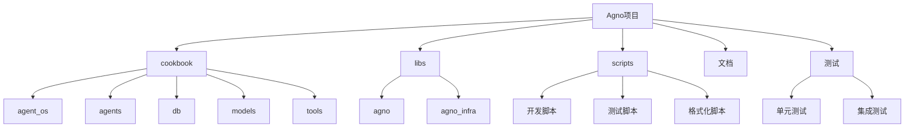
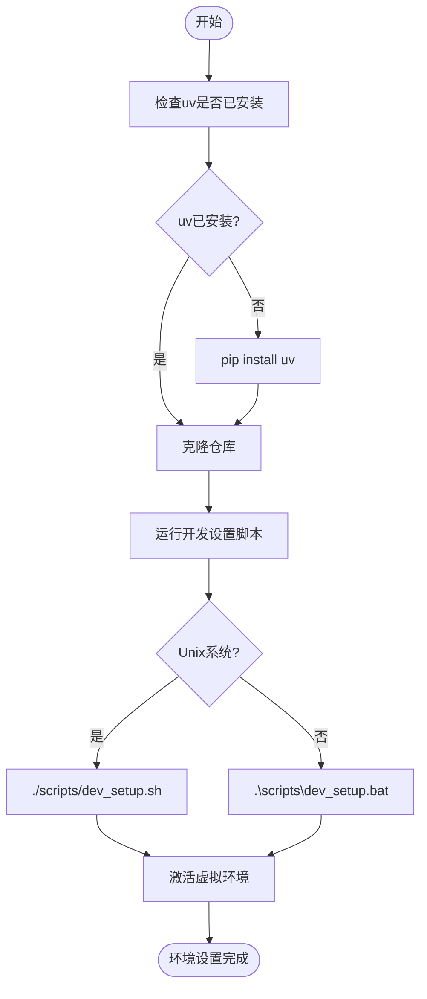
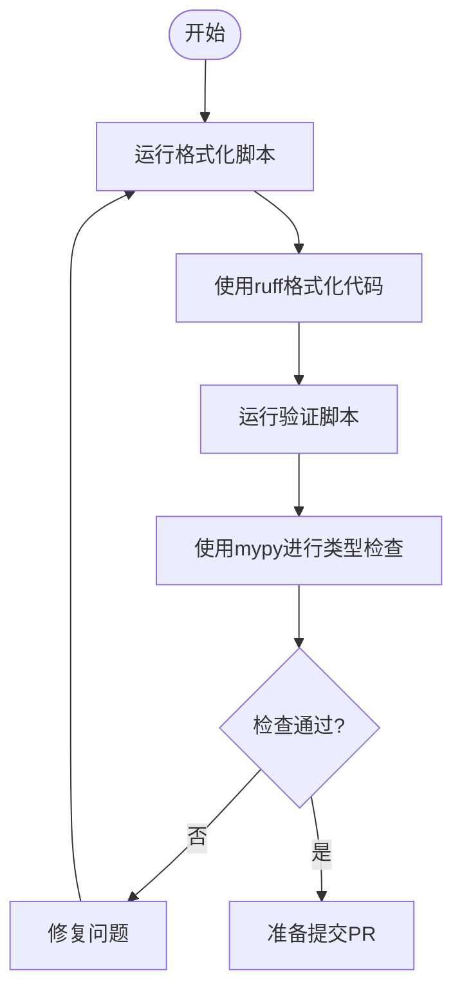
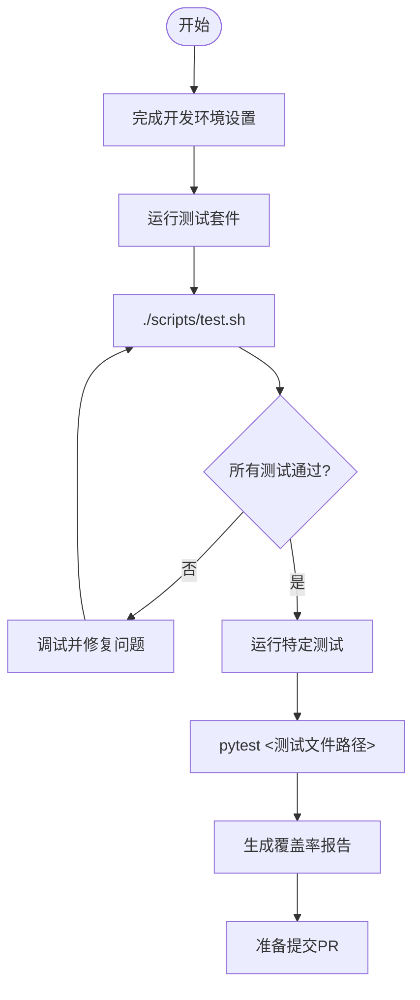
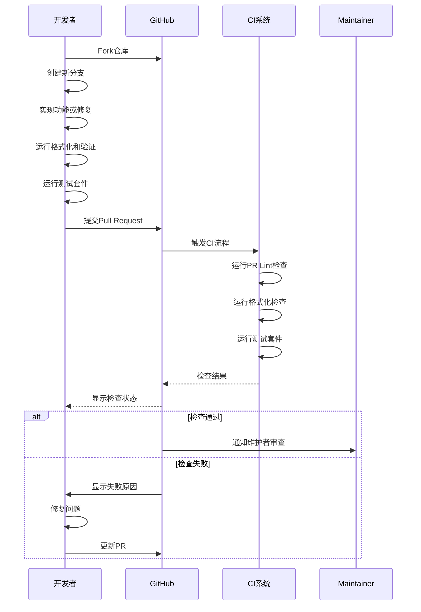
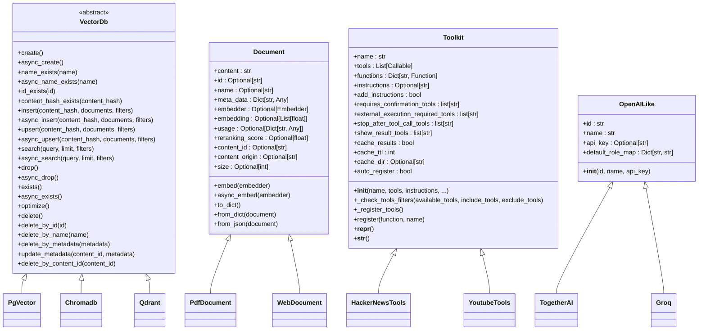

# 贡献指南

<cite>
**本文档中引用的文件**
- [CONTRIBUTING.md](file://CONTRIBUTING.md)
- [README.md](file://README.md)
- [dev_setup.sh](file://scripts/dev_setup.sh)
- [test.sh](file://scripts/test.sh)
- [format.sh](file://scripts/format.sh)
- [validate.sh](file://scripts/validate.sh)
- [pyproject.toml](file://libs/agno/pyproject.toml)
- [test_string.py](file://libs/agno/tests/unit/utils/test_string.py)
- [like.py](file://libs/agno/agno/models/openai/like.py)
- [toolkit.py](file://libs/agno/agno/tools/toolkit.py)
- [base.py](file://libs/agno/agno/vectordb/base.py)
- [document/base.py](file://libs/agno/agno/knowledge/document/base.py)
</cite>

## 目录
1. [简介](#简介)
2. [项目结构](#项目结构)
3. [开发环境设置](#开发环境设置)
4. [代码格式化与验证](#代码格式化与验证)
5. [测试策略](#测试策略)
6. [Pull Request流程](#pull-request流程)
7. [代码审查标准](#代码审查标准)
8. [项目代码结构概述](#项目代码结构概述)
9. [贡献者入门建议](#贡献者入门建议)
10. [结论](#结论)

## 简介
Agno是一个高性能的多智能体系统运行时框架，旨在帮助开发者构建、运行和管理安全的多智能体系统。本贡献指南为希望为Agno项目贡献代码的开发者提供清晰的指引，涵盖从环境设置到提交Pull Request的完整流程。

**Section sources**
- [README.md](file://README.md#L0-L140)
- [CONTRIBUTING.md](file://CONTRIBUTING.md#L0-L128)

## 项目结构
Agno项目的目录结构经过精心设计，以支持模块化开发和清晰的功能划分。项目主要分为以下几个部分：

- **cookbook**: 包含各种使用示例和教程，按功能分类组织
- **libs**: 核心库代码，包含agno主库和agno_infra基础设施
- **scripts**: 开发和测试脚本，包括环境设置、格式化、测试等
- **docs**: 文档文件
- **tests**: 测试代码，分为单元测试和集成测试

这种结构使得开发者能够快速定位相关代码，并理解不同组件之间的关系。

**Diagram sources**
- [CONTRIBUTING.md](file://CONTRIBUTING.md#L0-L128)
- [README.md](file://README.md#L0-L140)

**Section sources**
- [CONTRIBUTING.md](file://CONTRIBUTING.md#L0-L128)
- [README.md](file://README.md#L0-L140)

## 开发环境设置
为了开始为Agno项目贡献代码，您需要设置本地开发环境。以下是详细的设置步骤：

1. 克隆仓库
2. 确保已安装`uv`（Python包管理器）
3. 运行开发环境设置脚本

项目提供了跨平台的脚本文件来简化环境设置过程：

- 对于Unix系统：使用`./scripts/dev_setup.sh`
- 对于Windows系统：使用`.\scripts\dev_setup.bat`

这些脚本会创建一个虚拟环境（.venv），安装所有必要的依赖项，并将agno包以可编辑模式安装，以便您可以直接修改代码并立即看到效果。

**Diagram sources**
- [dev_setup.sh](file://scripts/dev_setup.sh#L0-L60)
- [CONTRIBUTING.md](file://CONTRIBUTING.md#L20-L45)

**Section sources**
- [dev_setup.sh](file://scripts/dev_setup.sh#L0-L60)
- [CONTRIBUTING.md](file://CONTRIBUTING.md#L20-L45)

## 代码格式化与验证
Agno项目采用严格的代码质量标准，确保代码的一致性和可维护性。在提交Pull Request之前，您必须运行格式化和验证脚本：

- 格式化脚本：`./scripts/format.sh` (Unix) 或 `.\scripts\format.bat` (Windows)
- 验证脚本：`./scripts/validate.sh` (Unix) 或 `.\scripts\validate.bat` (Windows)

这些脚本会执行以下操作：
- 使用`ruff`进行代码格式化
- 使用`mypy`进行静态类型检查

项目使用`ruff`作为代码格式化工具，配置在`pyproject.toml`文件中，设置了120字符的行长度限制和Python 3.9作为目标版本。同时，项目采用`mypy`进行类型检查，确保代码的类型安全性。

**Diagram sources**
- [format.sh](file://scripts/format.sh#L0-L19)
- [validate.sh](file://scripts/validate.sh#L0-L21)
- [pyproject.toml](file://libs/agno/pyproject.toml#L0-L477)

**Section sources**
- [format.sh](file://scripts/format.sh#L0-L19)
- [validate.sh](file://scripts/validate.sh#L0-L21)
- [pyproject.toml](file://libs/agno/pyproject.toml#L0-L477)

## 测试策略
Agno项目采用全面的测试策略，确保代码质量和功能稳定性。测试分为单元测试和集成测试两种类型，分别位于`libs/agno/tests/unit`和`libs/agno/tests/integration`目录中。

### 运行测试套件
在提交Pull Request之前，您需要确保所有测试都能通过。运行测试的步骤如下：

1. 完成开发环境设置
2. 运行完整的测试套件：`./scripts/test.sh`
3. 运行特定测试文件：`pytest ./libs/agno/tests/unit/utils/test_string.py`

测试脚本会生成覆盖率报告，帮助您了解测试的完整性。项目鼓励贡献者为新功能添加相应的测试用例，以确保代码的可靠性和可维护性。

### 编写新的测试用例
当您添加新功能时，应该同时编写相应的测试用例。测试用例应该覆盖正常情况和边界情况，确保代码在各种场景下都能正确工作。

**Diagram sources**
- [test.sh](file://scripts/test.sh#L0-L24)
- [test_string.py](file://libs/agno/tests/unit/utils/test_string.py#L0-L349)

**Section sources**
- [test.sh](file://scripts/test.sh#L0-L24)
- [test_string.py](file://libs/agno/tests/unit/utils/test_string.py#L0-L349)

## Pull Request流程
提交Pull Request是贡献代码的关键步骤。为了确保项目历史的清晰和有序，请遵循以下指南：

### PR标题命名约定
PR标题必须以方括号括起的类型标签开头，后跟一个空格和简洁的主题。
- 示例：`[feat] 添加用户认证功能`
- 有效类型：`[feat]`、`[fix]`、`[docs]`、`[test]`、`[refactor]`、`[build]`、`[ci]`、`[chore]`、`[perf]`、`[style]`、`[revert]`

### PR描述要求
PR描述应理想地引用其解决的问题，使用`fixes #<issue_number>`、`closes #<issue_number>`或`resolves #<issue_number>`等关键字。
- 示例：`此PR通过实现新的登录流程解决了#42`

这些指南由项目的PR Lint工作流自动执行，确保所有PR都符合标准。

**Diagram sources**
- [CONTRIBUTING.md](file://CONTRIBUTING.md#L47-L70)

**Section sources**
- [CONTRIBUTING.md](file://CONTRIBUTING.md#L47-L70)

## 代码审查标准
Agno项目的代码审查标准旨在确保代码质量、一致性和可维护性。以下是代码审查的主要标准：

1. **代码质量**：代码应清晰、简洁，遵循Python最佳实践
2. **类型注解**：所有函数和方法都应有适当的类型注解
3. **文档字符串**：所有公共API都应有完整的文档字符串
4. **测试覆盖**：新功能必须有相应的测试用例
5. **性能考虑**：代码应考虑性能影响，避免不必要的计算和内存使用
6. **安全性**：代码应避免常见的安全漏洞

审查者会特别关注代码是否符合项目的架构设计和编码规范，以及是否对现有功能产生了意外的影响。

**Section sources**
- [CONTRIBUTING.md](file://CONTRIBUTING.md#L47-L70)
- [pyproject.toml](file://libs/agno/pyproject.toml#L0-L477)

## 项目代码结构概述
了解Agno项目的代码结构有助于贡献者快速定位相关代码。项目的核心组件包括：

### 模型层
位于`libs/agno/agno/models`目录，实现了与不同LLM提供商的集成。对于支持OpenAI API规范的提供商，可以通过继承`OpenAILike`类来实现。

### 工具层
位于`libs/agno/agno/tools`目录，包含了各种工具包。每个工具包继承自`Toolkit`类，并通过`register`方法注册功能。

### 向量数据库层
位于`libs/agno/agno/vectordb`目录，定义了`VectorDb`抽象基类，所有向量数据库实现都必须继承此基类并实现其抽象方法。

### 知识库层
位于`libs/agno/agno/knowledge`目录，处理文档的管理和检索。`Document`类用于表示文档，包含内容、元数据和嵌入等属性。

**Diagram sources**
- [base.py](file://libs/agno/agno/vectordb/base.py#L0-L109)
- [document/base.py](file://libs/agno/agno/knowledge/document/base.py#L0-L59)
- [toolkit.py](file://libs/agno/agno/tools/toolkit.py#L0-L147)
- [like.py](file://libs/agno/agno/models/openai/like.py#L0-L28)

**Section sources**
- [base.py](file://libs/agno/agno/vectordb/base.py#L0-L109)
- [document/base.py](file://libs/agno/agno/knowledge/document/base.py#L0-L59)
- [toolkit.py](file://libs/agno/agno/tools/toolkit.py#L0-L147)
- [like.py](file://libs/agno/agno/models/openai/like.py#L0-L28)

## 贡献者入门建议
我们鼓励贡献者从以下几个方面开始参与项目：

1. **修复文档**：改进现有文档的清晰度和完整性
2. **报告问题**：发现并报告bug或提出功能建议
3. **解决'good first issue'**：从标记为'good first issue'的问题开始，这些通常是适合新手的简单任务

项目提供了丰富的示例和教程（位于cookbook目录），可以帮助您快速了解如何使用Agno框架。如果您有任何问题，可以通过Discord或社区论坛与我们联系。

**Section sources**
- [CONTRIBUTING.md](file://CONTRIBUTING.md#L0-L128)
- [README.md](file://README.md#L0-L140)

## 结论
感谢您对Agno项目的贡献！通过遵循本指南中的步骤，您可以确保您的贡献符合项目标准，并顺利地被合并到主代码库中。记住，每个贡献，无论大小，都对项目的发展至关重要。

如果您在贡献过程中遇到任何问题，请不要犹豫，通过Discord或社区论坛与我们联系。我们期待与您合作，共同推动Agno项目的发展。

**Section sources**
- [CONTRIBUTING.md](file://CONTRIBUTING.md#L0-L128)
- [README.md](file://README.md#L0-L140)