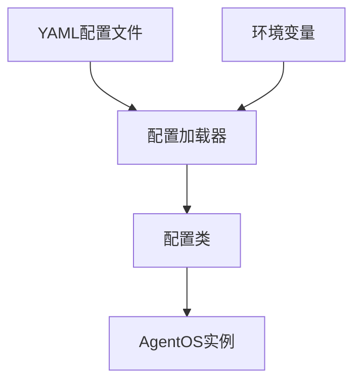
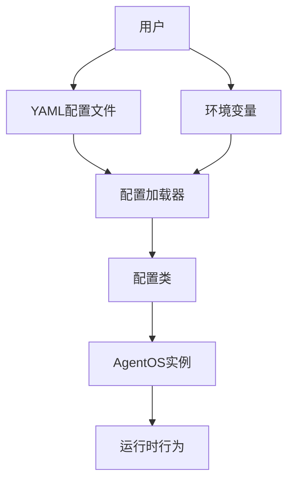
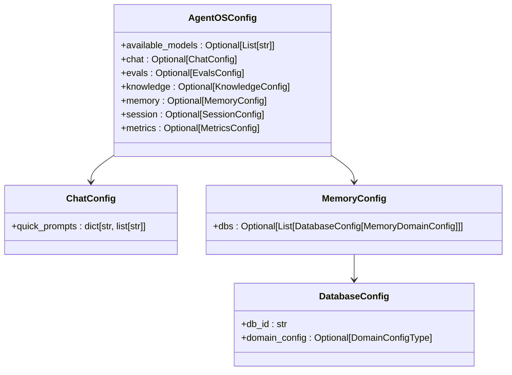
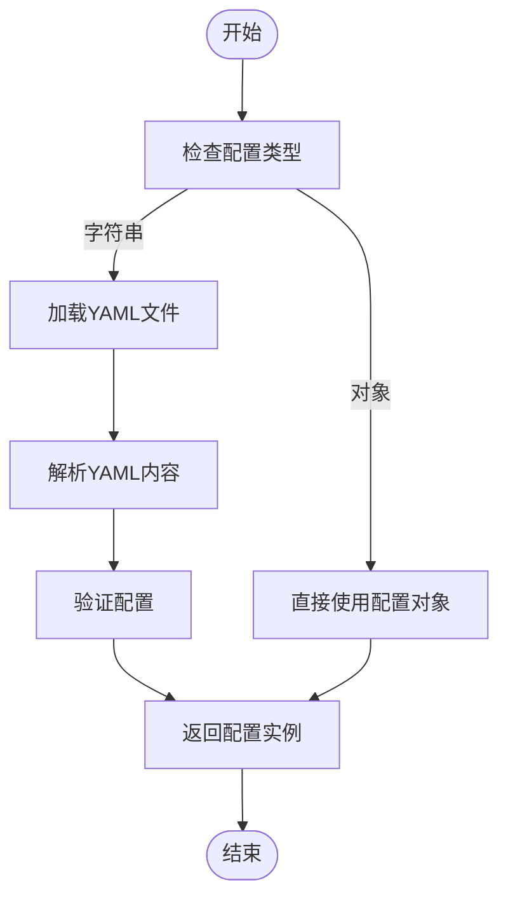
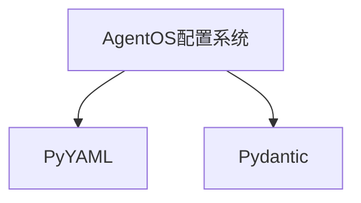

# AgentOS配置

<cite>
**本文档中引用的文件**  
- [config.yaml](file://cookbook/agent_os/os_config/config.yaml)
- [yaml_config.py](file://cookbook/agent_os/os_config/yaml_config.py)
- [basic.py](file://cookbook/agent_os/os_config/basic.py)
- [config.py](file://libs/agno/agno/os/config.py)
- [app.py](file://libs/agno/agno/os/app.py)
</cite>

## 目录
1. [简介](#简介)
2. [项目结构](#项目结构)
3. [核心组件](#核心组件)
4. [架构概述](#架构概述)
5. [详细组件分析](#详细组件分析)
6. [依赖分析](#依赖分析)
7. [性能考虑](#性能考虑)
8. [故障排除指南](#故障排除指南)
9. [结论](#结论)

## 简介
AgentOS配置系统提供了一种灵活的方式来配置AgentOS实例，支持通过YAML配置文件和环境变量进行配置。本系统允许用户定义模型设置、数据库连接、工具启用、MCP服务器配置和日志级别等。配置可以通过编程方式加载和覆盖，并且支持不同环境（开发、测试、生产）的配置管理。

## 项目结构
AgentOS配置系统主要由以下几个部分组成：
- YAML配置文件：用于定义AgentOS实例的配置
- 配置类：用于解析和验证配置
- 配置加载器：用于从文件或环境变量加载配置



**图示来源**
- [config.yaml](file://cookbook/agent_os/os_config/config.yaml)
- [config.py](file://libs/agno/agno/os/config.py)
- [app.py](file://libs/agno/agno/os/app.py)

**章节来源**
- [config.yaml](file://cookbook/agent_os/os_config/config.yaml)
- [config.py](file://libs/agno/agno/os/config.py)

## 核心组件
AgentOS配置系统的核心组件包括配置文件、配置类和配置加载器。这些组件共同工作，确保AgentOS实例能够正确地加载和应用配置。

**章节来源**
- [config.py](file://libs/agno/agno/os/config.py)
- [app.py](file://libs/agno/agno/os/app.py)

## 架构概述
AgentOS配置系统的架构设计旨在提供一个灵活且可扩展的配置管理方案。系统通过YAML文件和环境变量接收配置信息，然后使用配置类进行解析和验证，最后将配置应用于AgentOS实例。



**图示来源**
- [config.py](file://libs/agno/agno/os/config.py)
- [app.py](file://libs/agno/agno/os/app.py)

## 详细组件分析
### 配置文件分析
AgentOS配置文件使用YAML格式，支持多种配置选项，包括模型设置、数据库连接、工具启用、MCP服务器配置和日志级别。

#### 配置文件结构
```yaml
chat:
  quick_prompts:
    marketing-agent:
      - "What can you do?"
      - "How is our latest post working?"
      - "Tell me about our active marketing campaigns"
memory:
  dbs:
    - db_id: db-0001
      domain_config:
        display_name: Main app user memories
    - db_id: db-0002
      domain_config:
        display_name: Support flow user memories
```

**章节来源**
- [config.yaml](file://cookbook/agent_os/os_config/config.yaml)

### 配置类分析
AgentOS配置类使用Pydantic BaseModel进行定义，确保配置的类型安全和验证。

#### 配置类结构


**图示来源**
- [config.py](file://libs/agno/agno/os/config.py)

**章节来源**
- [config.py](file://libs/agno/agno/os/config.py)

### 配置加载器分析
AgentOS配置加载器负责从YAML文件或环境变量中加载配置，并将其转换为配置类实例。

#### 配置加载流程


**图示来源**
- [app.py](file://libs/agno/agno/os/app.py)

**章节来源**
- [app.py](file://libs/agno/agno/os/app.py)

## 依赖分析
AgentOS配置系统依赖于以下几个外部库：
- PyYAML：用于解析YAML文件
- Pydantic：用于配置类的定义和验证



**图示来源**
- [config.py](file://libs/agno/agno/os/config.py)
- [app.py](file://libs/agno/agno/os/app.py)

**章节来源**
- [config.py](file://libs/agno/agno/os/config.py)
- [app.py](file://libs/agno/agno/os/app.py)

## 性能考虑
AgentOS配置系统在设计时考虑了性能因素，确保配置加载和解析过程高效。通过使用Pydantic进行配置验证，可以在运行时快速发现配置错误，避免因配置问题导致的性能下降。

## 故障排除指南
### 常见问题
1. **配置文件格式错误**：确保YAML文件格式正确，避免语法错误。
2. **环境变量未设置**：检查必要的环境变量是否已正确设置。
3. **配置项缺失**：确保所有必需的配置项都已定义。

### 调试技巧
- 使用`print`语句输出配置加载过程中的关键信息。
- 检查日志文件以获取详细的错误信息。

**章节来源**
- [app.py](file://libs/agno/agno/os/app.py)

## 结论
AgentOS配置系统提供了一个强大而灵活的配置管理方案，支持通过YAML文件和环境变量进行配置。通过合理的架构设计和组件划分，系统能够高效地加载和应用配置，满足不同环境下的需求。