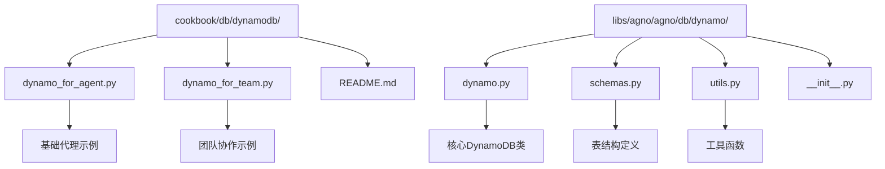
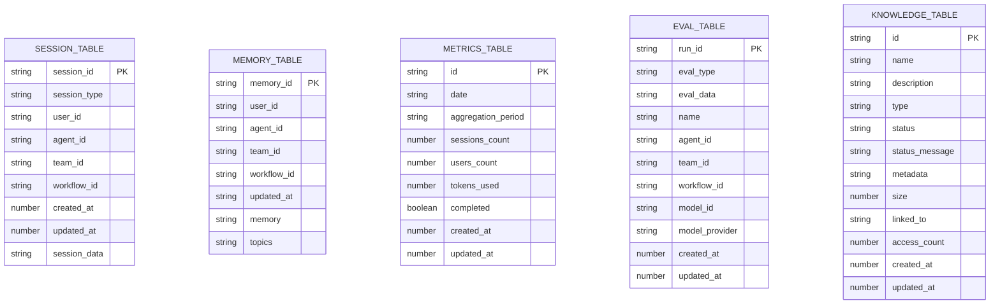
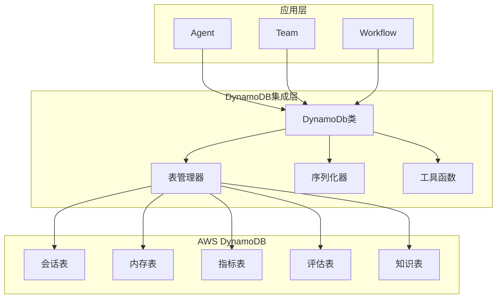
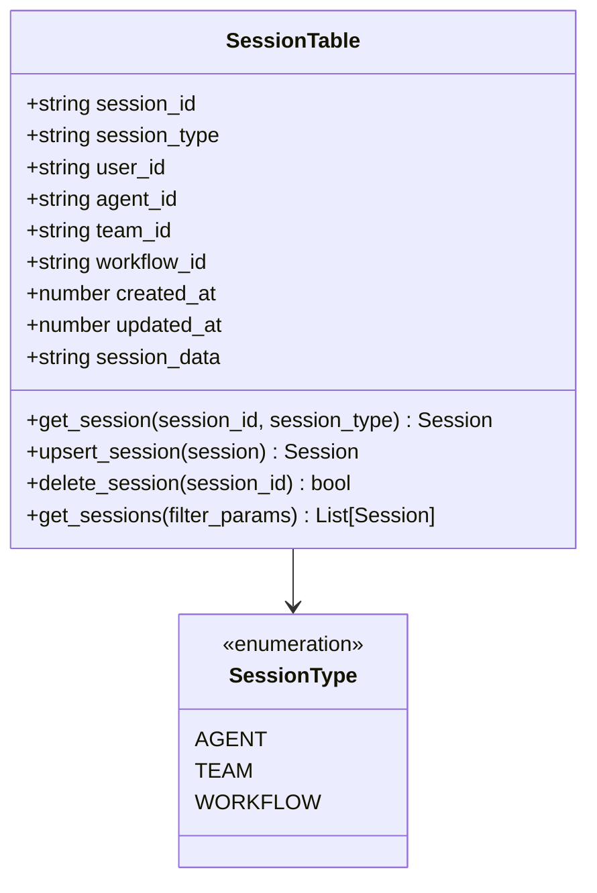
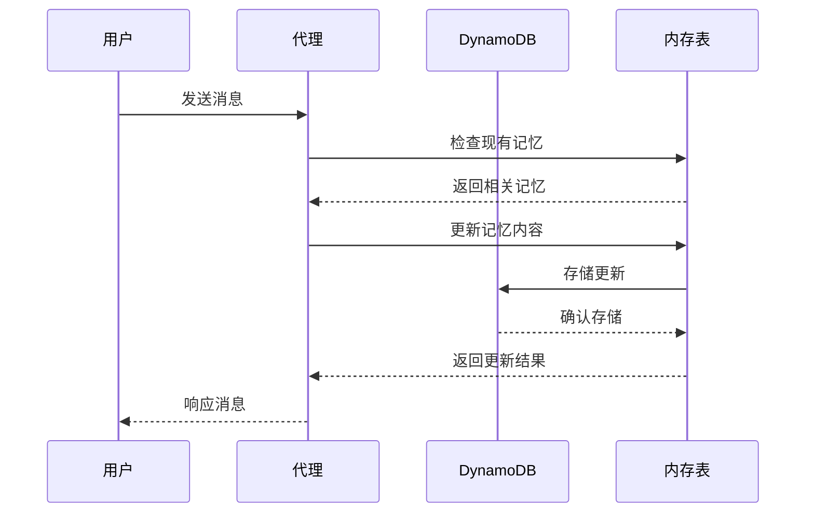
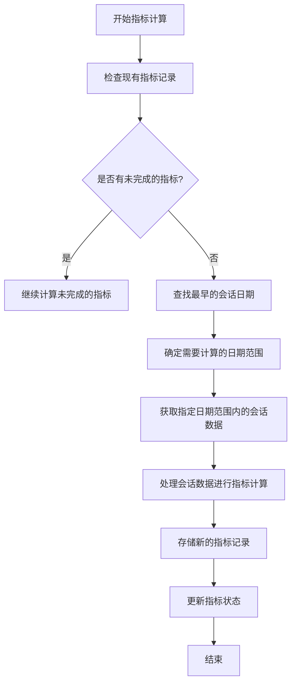
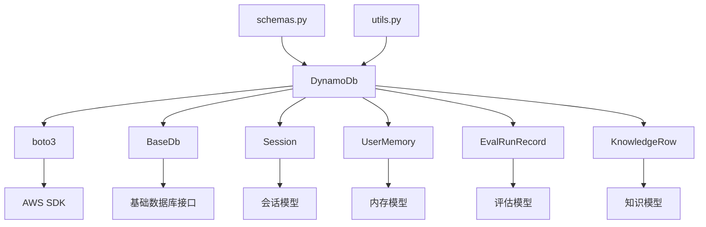

# DynamoDB集成

<cite>
**本文档中引用的文件**
- [dynamo_for_agent.py](file://cookbook/db/dynamodb/dynamo_for_agent.py)
- [dynamo_for_team.py](file://cookbook/db/dynamodb/dynamo_for_team.py)
- [dynamo.py](file://libs/agno/agno/db/dynamo/dynamo.py)
- [schemas.py](file://libs/agno/agno/db/dynamo/schemas.py)
- [utils.py](file://libs/agno/agno/db/dynamo/utils.py)
- [README.md](file://cookbook/db/dynamodb/README.md)
</cite>

## 目录
1. [简介](#简介)
2. [项目结构](#项目结构)
3. [核心组件](#核心组件)
4. [架构概览](#架构概览)
5. [详细组件分析](#详细组件分析)
6. [依赖关系分析](#依赖关系分析)
7. [性能考虑](#性能考虑)
8. [故障排除指南](#故障排除指南)
9. [结论](#结论)

## 简介

DynamoDB集成是Agno系统中的一个关键功能模块，它提供了高性能、可扩展的NoSQL数据库解决方案。通过与AWS DynamoDB的深度集成，Agno能够为代理、团队和工作流提供可靠的会话存储、内存管理、指标计算和知识库管理功能。

DynamoDB作为Amazon Web Services提供的托管NoSQL数据库服务，具有以下核心优势：
- **高可用性**：自动复制到多个可用区
- **弹性扩展**：支持按需和预置容量模式
- **低延迟**：全球分布的数据访问
- **内置安全性**：IAM集成和加密支持

## 项目结构

DynamoDB集成模块位于`cookbook/db/dynamodb/`目录下，包含以下关键文件：



**图表来源**
- [dynamo_for_agent.py](file://cookbook/db/dynamodb/dynamo_for_agent.py#L1-L22)
- [dynamo_for_team.py](file://cookbook/db/dynamodb/dynamo_for_team.py#L1-L64)
- [dynamo.py](file://libs/agno/agno/db/dynamo/dynamo.py#L1-L50)

**章节来源**
- [dynamo_for_agent.py](file://cookbook/db/dynamodb/dynamo_for_agent.py#L1-L22)
- [dynamo_for_team.py](file://cookbook/db/dynamodb/dynamo_for_team.py#L1-L64)
- [README.md](file://cookbook/db/dynamodb/README.md#L1-L44)

## 核心组件

### DynamoDb类

DynamoDb类是整个DynamoDB集成的核心，继承自BaseDb基类，提供了完整的数据库操作接口。

```python
class DynamoDb(BaseDb):
    def __init__(
        self,
        db_client=None,
        region_name: Optional[str] = None,
        aws_access_key_id: Optional[str] = None,
        aws_secret_access_key: Optional[str] = None,
        session_table: Optional[str] = None,
        memory_table: Optional[str] = None,
        metrics_table: Optional[str] = None,
        eval_table: Optional[str] = None,
        knowledge_table: Optional[str] = None,
        id: Optional[str] = None,
    ):
```

该类的主要特性包括：

1. **多表架构**：支持会话、内存、指标、评估和知识库五种表类型
2. **自动表创建**：首次使用时自动创建所需的DynamoDB表
3. **环境变量配置**：支持通过环境变量或参数配置AWS凭据
4. **批量操作支持**：针对DynamoDB的25项限制优化的批量写入操作

### 表结构设计

DynamoDB集成使用五个主要表来存储不同类型的数据：



**图表来源**
- [schemas.py](file://libs/agno/agno/db/dynamo/schemas.py#L1-L199)

**章节来源**
- [dynamo.py](file://libs/agno/agno/db/dynamo/dynamo.py#L42-L1752)
- [schemas.py](file://libs/agno/agno/db/dynamo/schemas.py#L1-L199)

## 架构概览

DynamoDB集成采用分层架构设计，确保数据的一致性和高效访问：



**图表来源**
- [dynamo.py](file://libs/agno/agno/db/dynamo/dynamo.py#L42-L106)

## 详细组件分析

### 会话管理

会话管理是DynamoDB集成的核心功能之一，支持三种类型的会话：代理会话、团队会话和工作流会话。

#### 会话表结构



**图表来源**
- [dynamo.py](file://libs/agno/agno/db/dynamo/dynamo.py#L235-L480)
- [schemas.py](file://libs/agno/agno/db/dynamo/schemas.py#L5-L40)

#### 会话查询优化

DynamoDB集成为会话管理实现了高效的查询机制：

1. **全局二级索引（GSI）**：为不同的查询模式创建专门的索引
2. **复合过滤**：支持多维度过滤条件
3. **分页处理**：自动处理大量数据的分页
4. **排序支持**：支持多种排序字段和顺序

```python
# 示例：获取特定用户的代理会话
sessions = db.get_sessions(
    session_type=SessionType.AGENT,
    user_id="user_123",
    limit=10,
    sort_by="created_at",
    sort_order="desc"
)
```

### 内存管理

用户内存管理功能允许持久化和检索用户的记忆数据，支持主题分类和内容搜索。

#### 内存表设计



**图表来源**
- [dynamo.py](file://libs/agno/agno/db/dynamo/dynamo.py#L636-L754)

### 指标计算

DynamoDB集成提供了完整的指标计算功能，用于监控系统性能和使用情况。

#### 指标表结构



**图表来源**
- [dynamo.py](file://libs/agno/agno/db/dynamo/dynamo.py#L913-L1073)

### 错误处理和重试机制

虽然DynamoDB本身提供了内置的错误处理和重试机制，但DynamoDb类实现了额外的错误处理层：

```python
def get_sessions(self, ...):
    try:
        # 执行DynamoDB查询
        response = self.client.query(**query_kwargs)
        items = response.get("Items", [])
        
        # 处理分页
        while "LastEvaluatedKey" in response:
            query_kwargs["ExclusiveStartKey"] = response["LastEvaluatedKey"]
            response = self.client.query(**query_kwargs)
            items.extend(response.get("Items", []))
            
        return items
        
    except Exception as e:
        log_error(f"Failed to get sessions: {e}")
        return []
```

**章节来源**
- [dynamo.py](file://libs/agno/agno/db/dynamo/dynamo.py#L294-L480)
- [dynamo.py](file://libs/agno/agno/db/dynamo/dynamo.py#L913-L1073)

## 依赖关系分析

DynamoDB集成模块具有清晰的依赖关系结构：



**图表来源**
- [dynamo.py](file://libs/agno/agno/db/dynamo/dynamo.py#L1-L30)

**章节来源**
- [dynamo.py](file://libs/agno/agno/db/dynamo/dynamo.py#L1-L30)

## 性能考虑

### 预置容量 vs 按需容量

DynamoDB支持两种容量模式，每种都有其适用场景：

1. **预置容量模式**
   - 适用于可预测的工作负载
   - 提供一致的性能保证
   - 成本效益更高（对于稳定流量）
   - 需要手动调整读写容量单位

2. **按需容量模式**
   - 自动适应流量变化
   - 适合不可预测的工作负载
   - 更高的成本（按实际使用付费）
   - 无需容量规划

### 查询优化策略

为了最大化DynamoDB的性能，系统采用了多种优化策略：

1. **索引设计**：为常用查询模式创建专门的GSI
2. **批量操作**：利用DynamoDB的批量写入能力
3. **分页处理**：避免单次查询返回过多数据
4. **条件表达式**：在服务器端过滤数据

### 分页和复合查询

DynamoDB集成了智能的分页和复合查询功能：

```python
def get_user_memories(self, ...):
    # 使用GSI查询当提供user_id时
    if user_id:
        items = execute_query_with_pagination(
            self.client,
            table_name,
            "user_id-updated_at-index",
            key_condition_expression,
            expression_attribute_names,
            expression_attribute_values,
            filter_expression,
            sort_by,
            sort_order,
            limit,
            page,
        )
    else:
        # 否则使用全表扫描
        response = self.client.scan(**scan_kwargs)
        items = response.get("Items", [])
```

## 故障排除指南

### 常见问题和解决方案

1. **AWS凭据配置问题**
   ```bash
   # 检查环境变量
   echo $AWS_ACCESS_KEY_ID
   echo $AWS_SECRET_ACCESS_KEY
   echo $AWS_REGION
   
   # 或使用AWS CLI配置
   aws configure
   ```

2. **表权限问题**
   ```python
   # 检查表是否存在
   table_exists = db._table_exists("agno_sessions")
   
   # 手动创建表
   db._create_tables()
   ```

3. **网络连接问题**
   ```python
   # 测试DynamoDB连接
   try:
       db.client.describe_table(TableName="agno_sessions")
   except Exception as e:
       print(f"DynamoDB连接失败: {e}")
   ```

### 日志和监控

DynamoDB集成提供了详细的日志记录功能：

```python
from agno.utils.log import log_debug, log_error, log_info

# 记录调试信息
log_debug(f"Table {table_name} created successfully")

# 记录错误信息
log_error(f"Failed to get sessions: {e}")

# 记录信息
log_info("No session data found. Won't calculate metrics.")
```

**章节来源**
- [dynamo.py](file://libs/agno/agno/db/dynamo/dynamo.py#L108-L125)
- [utils.py](file://libs/agno/agno/db/dynamo/utils.py#L1-L50)

## 结论

DynamoDB集成是Agno系统中的一个强大且灵活的功能模块，它提供了完整的NoSQL数据库解决方案。通过精心设计的表结构、优化的查询机制和robust的错误处理，DynamoDB集成能够满足各种规模的应用需求。

### 主要优势

1. **高性能**：利用DynamoDB的分布式架构和全局复制能力
2. **可扩展性**：支持从个人项目到企业级应用的各种规模
3. **可靠性**：内置的容错机制和自动备份功能
4. **易用性**：简洁的API设计和自动化的表管理

### 最佳实践建议

1. **合理选择容量模式**：根据实际工作负载选择预置或按需容量
2. **优化索引设计**：为常用的查询模式创建专门的GSI
3. **实施监控**：定期检查指标表以了解系统性能
4. **定期维护**：清理过期数据以保持最佳性能

通过遵循这些最佳实践，开发者可以充分利用DynamoDB集成的强大功能，构建高性能、可扩展的Agno应用程序。