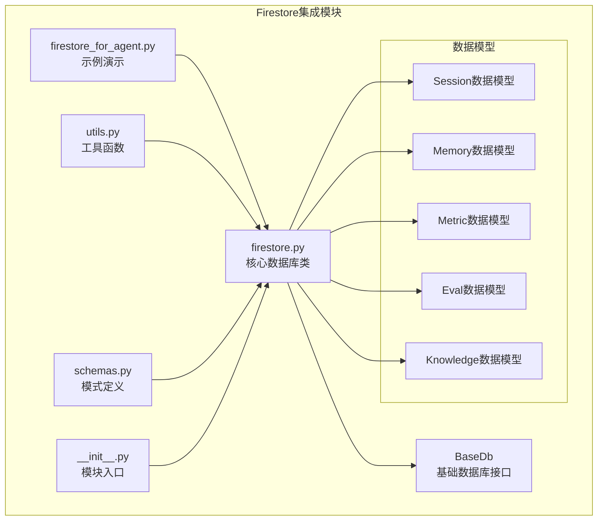
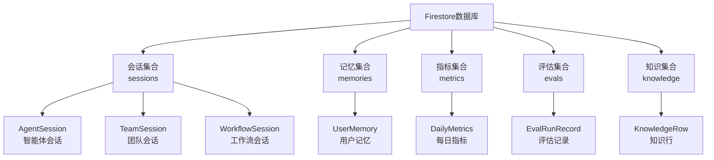
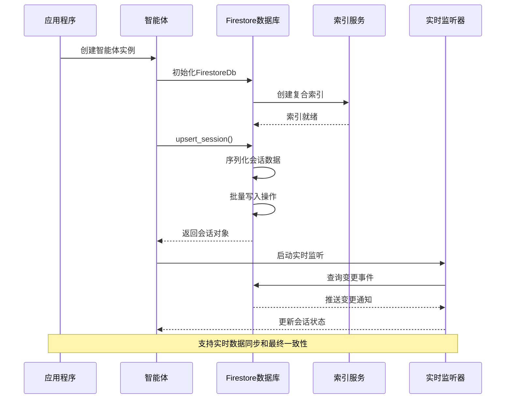
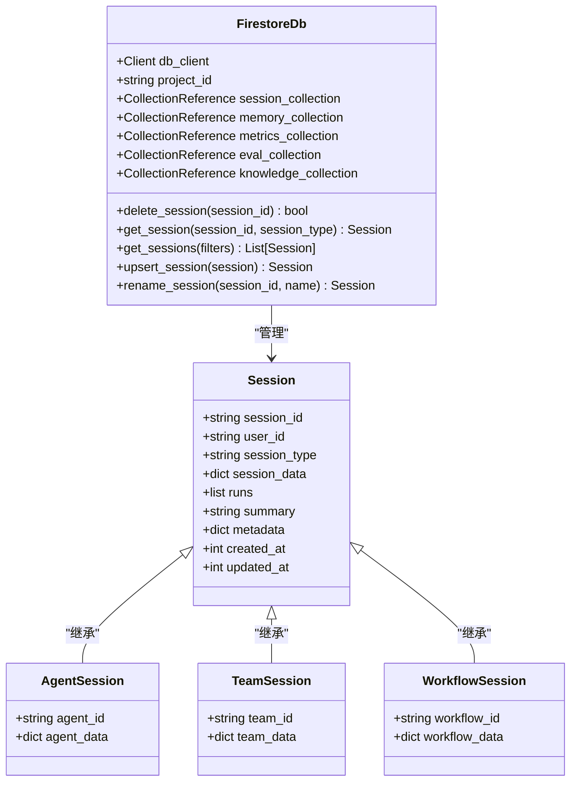
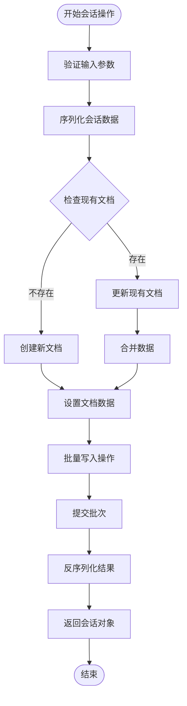
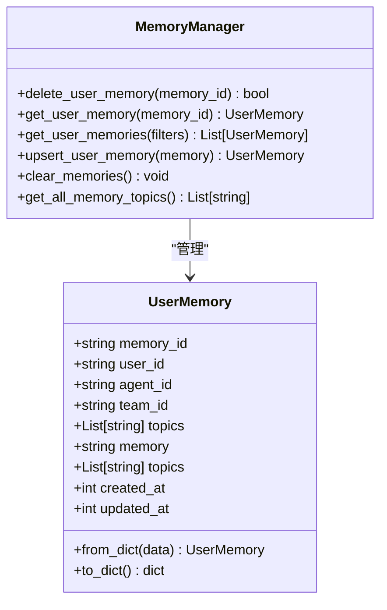
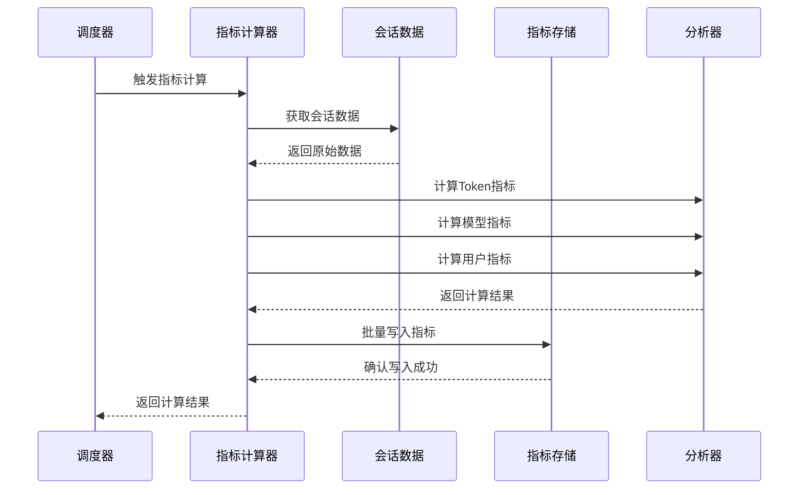
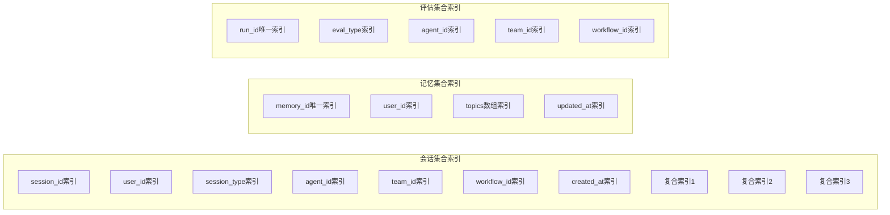
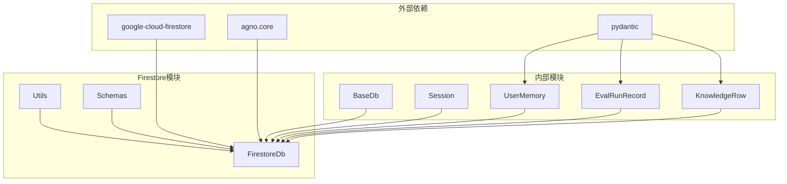

# Firestore集成

<cite>
**本文档中引用的文件**
- [firestore_for_agent.py](file://cookbook/db/firestore/firestore_for_agent.py)
- [README.md](file://cookbook/db/firestore/README.md)
- [firestore.py](file://libs/agno/agno/db/firestore/firestore.py)
- [utils.py](file://libs/agno/agno/db/firestore/utils.py)
- [schemas.py](file://libs/agno/agno/db/firestore/schemas.py)
- [__init__.py](file://libs/agno/agno/db/firestore/__init__.py)
</cite>

## 目录
1. [简介](#简介)
2. [项目结构](#项目结构)
3. [核心组件](#核心组件)
4. [架构概览](#架构概览)
5. [详细组件分析](#详细组件分析)
6. [依赖关系分析](#依赖关系分析)
7. [性能考虑](#性能考虑)
8. [故障排除指南](#故障排除指南)
9. [结论](#结论)

## 简介

Firestore集成为Agno系统提供了强大的NoSQL数据库解决方案，支持智能体、团队和工作流的数据持久化存储。该集成基于Google Cloud Firestore构建，提供了实时监听、最终一致性保证和灵活的查询能力，特别适合需要实时更新和高并发访问的应用场景。

Firestore作为现代云原生数据库，具有以下核心优势：
- **实时数据同步**：支持实时监听和推送通知
- **最终一致性**：在分布式环境中提供高性能
- **灵活查询**：支持复杂查询和索引优化
- **自动扩展**：根据负载自动调整资源
- **多语言支持**：提供丰富的客户端SDK

## 项目结构

Firestore集成模块采用分层架构设计，包含核心数据库类、工具函数和模式定义：



**图表来源**
- [firestore_for_agent.py](file://cookbook/db/firestore/firestore_for_agent.py#L1-L32)
- [firestore.py](file://libs/agno/agno/db/firestore/firestore.py#L1-L50)

**章节来源**
- [firestore_for_agent.py](file://cookbook/db/firestore/firestore_for_agent.py#L1-L32)
- [README.md](file://cookbook/db/firestore/README.md#L1-L40)

## 核心组件

### FirestoreDb类

FirestoreDb是整个集成的核心类，继承自BaseDb基类，提供了完整的数据库操作接口：

```python
class FirestoreDb(BaseDb):
    def __init__(
        self,
        db_client: Optional[Client] = None,
        project_id: Optional[str] = None,
        session_collection: Optional[str] = None,
        memory_collection: Optional[str] = None,
        metrics_collection: Optional[str] = None,
        eval_collection: Optional[str] = None,
        knowledge_collection: Optional[str] = None,
        id: Optional[str] = None,
    ):
```

该类支持多种数据类型的存储：
- **会话数据**：智能体、团队和工作流的运行状态
- **用户记忆**：长期记忆和上下文信息
- **指标数据**：性能统计和使用分析
- **评估数据**：测试结果和质量评估
- **知识库**：文档和参考资料

### 数据层次结构设计

Firestore采用文档数据库模型，数据按集合(Collection)和文档(Document)组织：



**图表来源**
- [firestore.py](file://libs/agno/agno/db/firestore/firestore.py#L31-L61)
- [schemas.py](file://libs/agno/agno/db/firestore/schemas.py#L1-L131)

**章节来源**
- [firestore.py](file://libs/agno/agno/db/firestore/firestore.py#L31-L200)
- [schemas.py](file://libs/agno/agno/db/firestore/schemas.py#L1-L131)

## 架构概览

Firestore集成采用多层架构设计，确保数据的一致性、可扩展性和高性能：



**图表来源**
- [firestore.py](file://libs/agno/agno/db/firestore/firestore.py#L470-L600)
- [utils.py](file://libs/agno/agno/db/firestore/utils.py#L20-L50)

## 详细组件分析

### 会话管理组件

会话管理是Firestore集成的核心功能之一，支持智能体、团队和工作流的生命周期管理：



**图表来源**
- [firestore.py](file://libs/agno/agno/db/firestore/firestore.py#L470-L600)
- [firestore.py](file://libs/agno/agno/db/firestore/firestore.py#L500-L650)

#### 会话操作流程

会话的创建和更新遵循以下流程：



**图表来源**
- [firestore.py](file://libs/agno/agno/db/firestore/firestore.py#L500-L650)

### 内存管理组件

用户记忆管理提供了长期记忆存储和检索功能：



**图表来源**
- [firestore.py](file://libs/agno/agno/db/firestore/firestore.py#L650-L800)

### 指标计算组件

指标计算功能提供了自动化的数据分析和统计：



**图表来源**
- [firestore.py](file://libs/agno/agno/db/firestore/firestore.py#L900-L1100)
- [utils.py](file://libs/agno/agno/db/firestore/utils.py#L110-L200)

**章节来源**
- [firestore.py](file://libs/agno/agno/db/firestore/firestore.py#L470-L800)
- [utils.py](file://libs/agno/agno/db/firestore/utils.py#L110-L279)

### 安全规则和索引配置

Firestore集成自动配置必要的索引以优化查询性能：



**图表来源**
- [schemas.py](file://libs/agno/agno/db/firestore/schemas.py#L1-L131)

**章节来源**
- [schemas.py](file://libs/agno/agno/db/firestore/schemas.py#L1-L131)
- [utils.py](file://libs/agno/agno/db/firestore/utils.py#L20-L100)

## 依赖关系分析

Firestore集成模块具有清晰的依赖关系结构：



**图表来源**
- [firestore.py](file://libs/agno/agno/db/firestore/firestore.py#L1-L30)
- [__init__.py](file://libs/agno/agno/db/firestore/__init__.py#L1-L2)

**章节来源**
- [firestore.py](file://libs/agno/agno/db/firestore/firestore.py#L1-L30)
- [__init__.py](file://libs/agno/agno/db/firestore/__init__.py#L1-L2)

## 性能考虑

### 批量写入优化

Firestore集成实现了高效的批量写入机制，支持最大500个操作的批次：

```python
# 批量删除示例
batch = self.db_client.batch()
for session_id in session_ids:
    docs = collection_ref.where(filter=FieldFilter("session_id", "==", session_id)).stream()
    for doc in docs:
        batch.delete(doc.reference)
batch.commit()
```

### 索引策略

系统自动创建优化的复合索引来支持常见查询模式：

- **会话查询索引**：支持按类型、用户ID和时间排序的复合查询
- **记忆查询索引**：支持按用户ID和组件ID的快速检索
- **评估查询索引**：支持按组件类型和评估类型的过滤

### 成本管理策略

1. **查询优化**：使用适当的索引减少读取成本
2. **批量操作**：合并多个操作减少API调用次数
3. **数据压缩**：序列化JSON字段减少存储空间
4. **定期清理**：自动清理过期数据避免存储膨胀

## 故障排除指南

### 常见问题和解决方案

#### 1. 认证失败
```bash
# 使用gcloud CLI认证
gcloud auth application-default login

# 或设置环境变量
export GOOGLE_APPLICATION_CREDENTIALS="/path/to/service-account.json"
```

#### 2. 索引创建失败
- 检查项目权限
- 验证集合名称正确性
- 确保网络连接正常

#### 3. 查询性能问题
- 检查是否使用了正确的索引
- 优化查询条件和排序
- 考虑添加复合索引

#### 4. 批量操作限制
- 单次操作不超过500个
- 处理部分成功的情况
- 实现重试机制

**章节来源**
- [README.md](file://cookbook/db/firestore/README.md#L15-L40)
- [firestore.py](file://libs/agno/agno/db/firestore/firestore.py#L1200-L1443)

## 结论

Firestore集成为Agno系统提供了强大而灵活的数据存储解决方案。通过合理的架构设计、自动化的索引管理和高效的批量操作，该集成能够满足现代应用对实时性、可扩展性和性能的要求。

主要优势包括：
- **实时数据同步**：支持实时监听和推送通知
- **最终一致性**：在分布式环境中提供高性能
- **灵活查询**：支持复杂查询和索引优化
- **自动扩展**：根据负载自动调整资源
- **多语言支持**：提供丰富的客户端SDK

建议在生产环境中：
1. 正确配置安全规则和访问控制
2. 监控查询性能和成本
3. 实施适当的数据保留策略
4. 定期备份重要数据

通过合理使用这些功能，开发者可以构建出高性能、可扩展的智能应用系统。