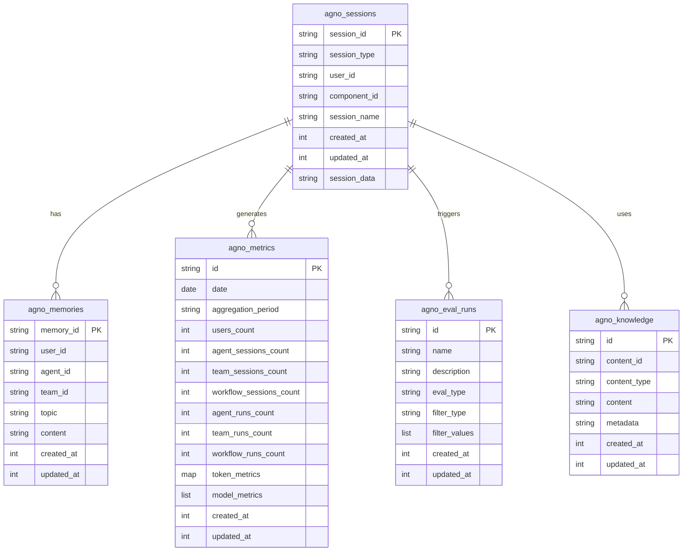

# NoSQL数据库

<cite>
**本文档中引用的文件**   
- [mongodb_for_agent.py](file://cookbook/db/mongo/mongodb_for_agent.py)
- [mongodb_for_team.py](file://cookbook/db/mongo/mongodb_for_team.py)
- [dynamo_for_agent.py](file://cookbook/db/dynamodb/dynamo_for_agent.py)
- [dynamo_for_team.py](file://cookbook/db/dynamodb/dynamo_for_team.py)
- [firestore_for_agent.py](file://cookbook/db/firestore/firestore_for_agent.py)
- [mongo.py](file://libs/agno/agno/db/mongo/mongo.py)
- [dynamo.py](file://libs/agno/agno/db/dynamo/dynamo.py)
- [firestore.py](file://libs/agno/agno/db/firestore/firestore.py)
- [base.py](file://libs/agno/agno/db/base.py)
</cite>

## 目录
1. [引言](#引言)
2. [项目结构](#项目结构)
3. [核心组件](#核心组件)
4. [架构概述](#架构概述)
5. [详细组件分析](#详细组件分析)
6. [依赖分析](#依赖分析)
7. [性能考虑](#性能考虑)
8. [故障排除指南](#故障排除指南)
9. [结论](#结论)

## 引言
本文档全面介绍了如何将MongoDB、DynamoDB和Firestore三种NoSQL数据库集成到Agno系统中作为持久化存储。文档详细说明了数据模型设计、集合/表结构、索引策略和查询模式，提供了具体的代码示例展示数据读写操作。同时讨论了NoSQL数据库在处理非结构化数据、水平扩展和高可用性方面的优势，以及在事务支持和复杂查询方面的限制，并包含了针对每种数据库的最佳实践和常见陷阱。

## 项目结构
Agno系统的NoSQL数据库集成主要位于`cookbook/db`目录下，每个数据库类型都有独立的子目录。项目结构清晰地分离了不同数据库的实现，便于维护和扩展。

**Diagram sources**
- [cookbook/db/mongo/README.md](file://cookbook/db/mongo/README.md)
- [cookbook/db/dynamodb/README.md](file://cookbook/db/dynamodb/README.md)
- [cookbook/db/firestore/README.md](file://cookbook/db/firestore/README.md)

**Section sources**
- [cookbook/db/mongo/README.md](file://cookbook/db/mongo/README.md)
- [cookbook/db/dynamodb/README.md](file://cookbook/db/dynamodb/README.md)
- [cookbook/db/firestore/README.md](file://cookbook/db/firestore/README.md)

## 核心组件
Agno系统的NoSQL数据库集成核心组件包括MongoDB、DynamoDB和Firestore的实现类，它们都继承自`BaseDb`抽象基类。这些组件提供了统一的接口用于会话管理、内存存储、指标收集和知识库管理。

**Section sources**
- [libs/agno/agno/db/base.py](file://libs/agno/agno/db/base.py)
- [libs/agno/agno/db/mongo/mongo.py](file://libs/agno/agno/db/mongo/mongo.py)
- [libs/agno/agno/db/dynamo/dynamo.py](file://libs/agno/agno/db/dynamo/dynamo.py)
- [libs/agno/agno/db/firestore/firestore.py](file://libs/agno/agno/db/firestore/firestore.py)

## 架构概述
Agno系统的NoSQL数据库集成架构采用抽象工厂模式，通过`BaseDb`基类定义统一的数据库操作接口，具体的数据库实现类（MongoDb、DynamoDb、FirestoreDb）负责实现这些接口。这种设计模式使得系统可以轻松地在不同NoSQL数据库之间切换，而无需修改上层业务逻辑。

**Diagram sources**
- [libs/agno/agno/db/base.py](file://libs/agno/agno/db/base.py)
- [libs/agno/agno/db/mongo/mongo.py](file://libs/agno/agno/db/mongo/mongo.py)
- [libs/agno/agno/db/dynamo/dynamo.py](file://libs/agno/agno/db/dynamo/dynamo.py)
- [libs/agno/agno/db/firestore/firestore.py](file://libs/agno/agno/db/firestore/firestore.py)

## 详细组件分析

### MongoDB集成分析
MongoDB集成通过`MongoDb`类实现，该类提供了完整的数据库操作功能，包括会话管理、内存存储、指标收集和知识库管理。MongoDB使用集合（Collection）来组织数据，每个集合对应一种数据类型。

#### 数据模型设计
MongoDB在Agno系统中使用以下集合来存储不同类型的数据：
- `agno_sessions`: 存储会话数据
- `agno_memories`: 存储用户记忆
- `agno_metrics`: 存储系统指标
- `agno_eval_runs`: 存储评估运行数据
- `agno_knowledge`: 存储知识库内容

**Diagram sources**
- [libs/agno/agno/db/mongo/mongo.py](file://libs/agno/agno/db/mongo/mongo.py)
- [libs/agno/agno/db/mongo/utils.py](file://libs/agno/agno/db/mongo/utils.py)

#### 索引策略
MongoDB为每个集合创建了必要的索引以优化查询性能。索引策略包括：
- 会话集合：在`session_id`、`user_id`、`component_id`和`created_at`字段上创建索引
- 记忆集合：在`memory_id`、`user_id`、`agent_id`、`team_id`和`topic`字段上创建索引
- 指标集合：在`date`和`aggregation_period`字段上创建复合索引

**Diagram sources**
- [libs/agno/agno/db/mongo/utils.py](file://libs/agno/agno/db/mongo/utils.py)
- [libs/agno/agno/db/mongo/schemas.py](file://libs/agno/agno/db/mongo/schemas.py)

**Section sources**
- [libs/agno/agno/db/mongo/mongo.py](file://libs/agno/agno/db/mongo/mongo.py)
- [libs/agno/agno/db/mongo/utils.py](file://libs/agno/agno/db/mongo/utils.py)

### DynamoDB集成分析
DynamoDB集成通过`DynamoDb`类实现，该类提供了与AWS DynamoDB服务的接口。DynamoDB使用表（Table）来组织数据，每个表对应一种数据类型。

#### 数据模型设计
DynamoDB在Agno系统中使用以下表来存储不同类型的数据：
- `agno_sessions`: 存储会话数据
- `agno_memories`: 存储用户记忆
- `agno_metrics`: 存储系统指标
- `agno_eval_runs`: 存储评估运行数据
- `agno_knowledge`: 存储知识库内容

**Diagram sources**
- [libs/agno/agno/db/dynamo/dynamo.py](file://libs/agno/agno/db/dynamo/dynamo.py)
- [libs/agno/agno/db/dynamo/schemas.py](file://libs/agno/agno/db/dynamo/schemas.py)

#### 索引策略
DynamoDB为每个表定义了主键和可能的二级索引。索引策略包括：
- 会话表：使用`session_id`作为分区键
- 记忆表：使用`memory_id`作为分区键
- 指标表：使用`id`作为分区键，`date`和`aggregation_period`作为排序键

**Diagram sources**
- [libs/agno/agno/db/dynamo/dynamo.py](file://libs/agno/agno/db/dynamo/dynamo.py)
- [libs/agno/agno/db/dynamo/schemas.py](file://libs/agno/agno/db/dynamo/schemas.py)

**Section sources**
- [libs/agno/agno/db/dynamo/dynamo.py](file://libs/agno/agno/db/dynamo/dynamo.py)
- [libs/agno/agno/db/dynamo/schemas.py](file://libs/agno/agno/db/dynamo/schemas.py)

### Firestore集成分析
Firestore集成通过`FirestoreDb`类实现，该类提供了与Google Cloud Firestore服务的接口。Firestore使用集合（Collection）来组织数据，每个集合对应一种数据类型。

#### 数据模型设计
Firestore在Agno系统中使用以下集合来存储不同类型的数据：
- `agno_sessions`: 存储会话数据
- `agno_memories`: 存储用户记忆
- `agno_metrics`: 存储系统指标
- `agno_eval_runs`: 存储评估运行数据
- `agno_knowledge`: 存储知识库内容

**Diagram sources**
- [libs/agno/agno/db/firestore/firestore.py](file://libs/agno/agno/db/firestore/firestore.py)
- [libs/agno/agno/db/firestore/schemas.py](file://libs/agno/agno/db/firestore/schemas.py)

#### 索引策略
Firestore为每个集合创建了必要的索引以优化查询性能。索引策略包括：
- 会话集合：在`session_id`、`user_id`、`component_id`和`created_at`字段上创建索引
- 记忆集合：在`memory_id`、`user_id`、`agent_id`、`team_id`和`topic`字段上创建索引
- 指标集合：在`date`和`aggregation_period`字段上创建复合索引

**Diagram sources**
- [libs/agno/agno/db/firestore/firestore.py](file://libs/agno/agno/db/firestore/firestore.py)
- [libs/agno/agno/db/firestore/utils.py](file://libs/agno/agno/db/firestore/utils.py)

**Section sources**
- [libs/agno/agno/db/firestore/firestore.py](file://libs/agno/agno/db/firestore/firestore.py)
- [libs/agno/agno/db/firestore/utils.py](file://libs/agno/agno/db/firestore/utils.py)

## 依赖分析
Agno系统的NoSQL数据库集成依赖于多个外部库和云服务。这些依赖关系确保了系统能够与不同的数据库服务进行交互。

**Diagram sources**
- [libs/agno/agno/db/mongo/mongo.py](file://libs/agno/agno/db/mongo/mongo.py)
- [libs/agno/agno/db/dynamo/dynamo.py](file://libs/agno/agno/db/dynamo/dynamo.py)
- [libs/agno/agno/db/firestore/firestore.py](file://libs/agno/agno/db/firestore/firestore.py)

**Section sources**
- [libs/agno/agno/db/mongo/mongo.py](file://libs/agno/agno/db/mongo/mongo.py)
- [libs/agno/agno/db/dynamo/dynamo.py](file://libs/agno/agno/db/dynamo/dynamo.py)
- [libs/agno/agno/db/firestore/firestore.py](file://libs/agno/agno/db/firestore/firestore.py)

## 性能考虑
在选择和配置NoSQL数据库时，需要考虑多个性能因素，包括读写吞吐量、延迟、扩展性和成本。

### MongoDB性能特点
- **优势**: 支持丰富的查询操作，包括聚合管道、文本搜索和地理空间查询
- **限制**: 在高并发写入场景下可能遇到性能瓶颈
- **最佳实践**: 使用合适的索引，避免全表扫描；合理设计文档结构，减少嵌套深度

### DynamoDB性能特点
- **优势**: 提供可预测的低延迟，支持自动扩展
- **限制**: 查询灵活性有限，复杂查询需要额外设计
- **最佳实践**: 合理设计主键和二级索引；使用批量操作提高效率；监控和调整读写容量单位

### Firestore性能特点
- **优势**: 实时同步功能强大，查询性能优秀
- **限制**: 免费层级有使用限制，超出后会产生费用
- **最佳实践**: 使用集合组查询；合理设计数据模型以减少读取次数；利用缓存机制

## 故障排除指南
在使用NoSQL数据库集成时，可能会遇到各种问题。以下是一些常见问题及其解决方案。

### 连接问题
- **MongoDB**: 确保MongoDB服务正在运行，检查连接字符串是否正确
- **DynamoDB**: 确认AWS凭证已正确配置，检查区域设置是否正确
- **Firestore**: 确认Google Cloud凭证已正确配置，检查项目ID是否正确

### 性能问题
- **索引缺失**: 检查是否为常用查询字段创建了适当的索引
- **数据模型不合理**: 重新评估数据模型设计，考虑是否需要调整文档/项目结构
- **查询效率低**: 优化查询语句，避免全表扫描

### 数据一致性问题
- **MongoDB**: 考虑使用事务来保证多文档操作的一致性
- **DynamoDB**: 使用条件写入来避免竞态条件
- **Firestore**: 利用事务和批量写入来保证数据一致性

**Section sources**
- [libs/agno/agno/db/mongo/mongo.py](file://libs/agno/agno/db/mongo/mongo.py)
- [libs/agno/agno/db/dynamo/dynamo.py](file://libs/agno/agno/db/dynamo/dynamo.py)
- [libs/agno/agno/db/firestore/firestore.py](file://libs/agno/agno/db/firestore/firestore.py)

## 结论
Agno系统的NoSQL数据库集成提供了灵活、可扩展的持久化存储解决方案。通过MongoDB、DynamoDB和Firestore三种不同的NoSQL数据库实现，系统能够适应不同的应用场景和性能需求。每种数据库都有其独特的优势和适用场景，开发者可以根据具体需求选择合适的数据库。文档中提供的代码示例和最佳实践可以帮助开发者快速上手并避免常见陷阱，确保系统的稳定性和性能。