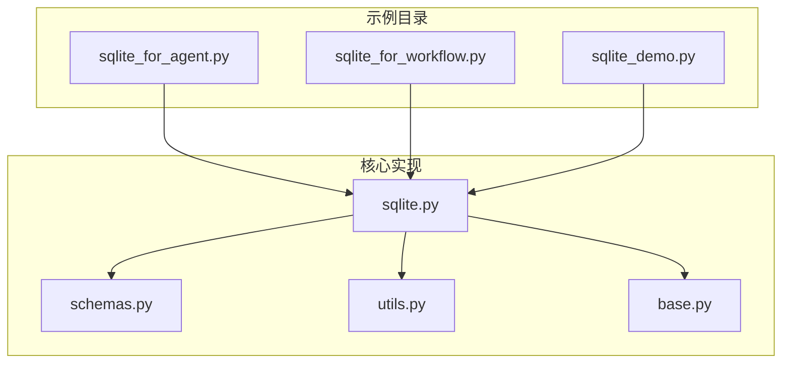
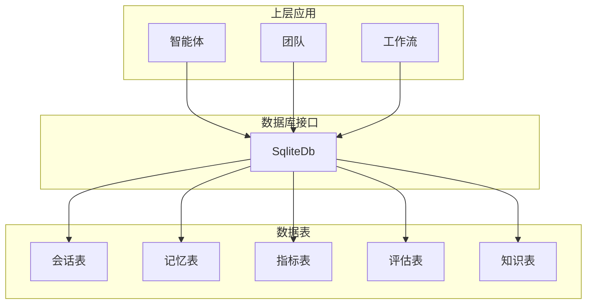
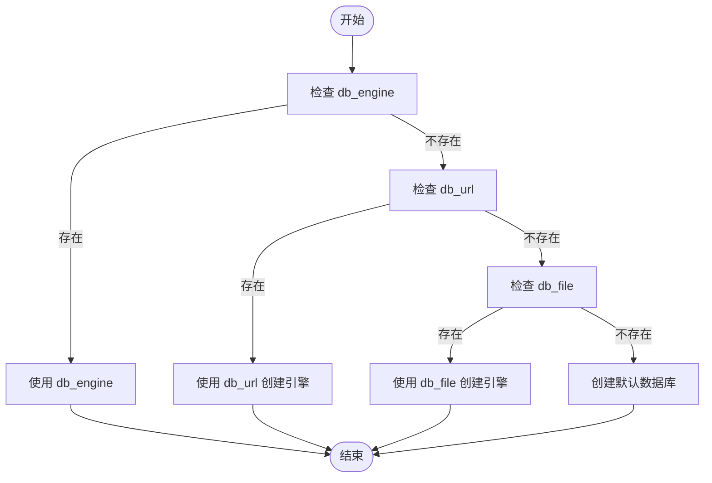
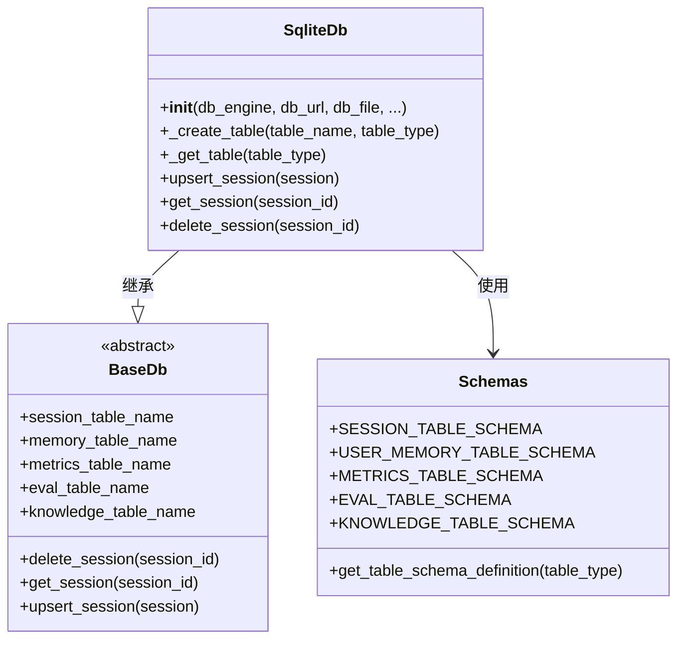
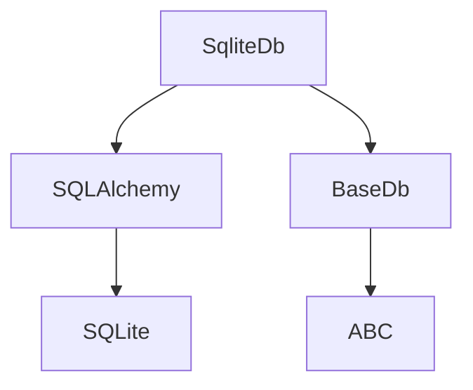

# SQLite 集成

<cite>
**本文档中引用的文件**  
- [sqlite_for_agent.py](file://cookbook/db/sqllite/sqlite_for_agent.py)
- [sqlite_for_workflow.py](file://cookbook/db/sqllite/sqlite_for_workflow.py)
- [sqlite.py](file://libs/agno/agno/db/sqlite/sqlite.py)
- [schemas.py](file://libs/agno/agno/db/sqlite/schemas.py)
- [utils.py](file://libs/agno/agno/db/sqlite/utils.py)
- [base.py](file://libs/agno/agno/db/base.py)
</cite>

## 目录
1. [简介](#简介)
2. [项目结构](#项目结构)
3. [核心组件](#核心组件)
4. [架构概述](#架构概述)
5. [详细组件分析](#详细组件分析)
6. [依赖分析](#依赖分析)
7. [性能考虑](#性能考虑)
8. [故障排除指南](#故障排除指南)
9. [结论](#结论)

## 简介
本文档详细介绍了如何将 SQLite 作为轻量级、嵌入式数据库集成到 Agno 的智能体系统中。重点说明了其在开发、测试环境或资源受限场景下的优势。文档提供了 `sqlite_for_agent.py` 和 `sqlite_for_workflow.py` 中的配置示例，解释了数据库文件路径设置、模式初始化和数据持久化机制。讨论了 SQLite 的 ACID 特性在智能体状态管理中的保障作用，以及其在并发写入场景下的局限性（如 WAL 模式的使用）。此外，还提供了性能优化建议，如 PRAGMA 设置、索引创建和查询优化，以确保在处理智能体交互数据时的高效性。

## 项目结构
Agno 项目的 SQLite 集成主要位于 `cookbook/db/sqllite/` 目录下，包含针对智能体、团队和工作流的存储示例。核心实现位于 `libs/agno/agno/db/sqlite/` 目录中，提供了与 SQLite 数据库交互的接口。



**图示来源**  
- [sqlite_for_agent.py](file://cookbook/db/sqllite/sqlite_for_agent.py)
- [sqlite_for_workflow.py](file://cookbook/db/sqllite/sqlite_for_workflow.py)
- [sqlite.py](file://libs/agno/agno/db/sqlite/sqlite.py)
- [schemas.py](file://libs/agno/agno/db/sqlite/schemas.py)
- [utils.py](file://libs/agno/agno/db/sqlite/utils.py)
- [base.py](file://libs/agno/agno/db/sqlite/base.py)

**本节来源**  
- [sqlite_for_agent.py](file://cookbook/db/sqllite/sqlite_for_agent.py)
- [sqlite_for_workflow.py](file://cookbook/db/sqllite/sqlite_for_workflow.py)
- [sqlite.py](file://libs/agno/agno/db/sqlite/sqlite.py)

## 核心组件
SQLite 集成的核心组件包括 `SqliteDb` 类，它继承自 `BaseDb` 抽象类，实现了与 SQLite 数据库的连接、表创建、数据持久化等操作。`SqliteDb` 类通过 SQLAlchemy 与 SQLite 数据库进行交互，支持会话、记忆、指标、评估和知识等数据的存储。

**本节来源**  
- [sqlite.py](file://libs/agno/agno/db/sqlite/sqlite.py#L1-L200)
- [base.py](file://libs/agno/agno/db/base.py#L1-L50)

## 架构概述
SQLite 集成的架构基于分层设计，`SqliteDb` 类作为数据库接口，负责与底层 SQLite 数据库进行通信。上层的智能体、团队和工作流通过 `SqliteDb` 实例进行数据的读写操作。数据持久化机制通过会话表、记忆表、指标表、评估表和知识表实现，确保智能体的状态和交互数据能够被持久化存储。



**图示来源**  
- [sqlite.py](file://libs/agno/agno/db/sqlite/sqlite.py#L1-L200)
- [schemas.py](file://libs/agno/agno/db/sqlite/schemas.py#L1-L120)

## 详细组件分析
### SqliteDb 类分析
`SqliteDb` 类是 SQLite 集成的核心，负责初始化数据库连接、创建表、执行数据操作等。其构造函数支持通过 `db_engine`、`db_url` 或 `db_file` 指定数据库连接方式，默认情况下会在当前目录创建一个名为 `agno.db` 的数据库文件。

#### 初始化流程


**图示来源**  
- [sqlite.py](file://libs/agno/agno/db/sqlite/sqlite.py#L50-L100)

#### 表创建机制
`SqliteDb` 类通过 `_create_table` 方法创建数据表，该方法根据表类型获取相应的模式定义，并创建表和索引。模式定义存储在 `schemas.py` 文件中，包括会话表、记忆表、指标表、评估表和知识表的列定义。



**图示来源**  
- [sqlite.py](file://libs/agno/agno/db/sqlite/sqlite.py#L100-L200)
- [schemas.py](file://libs/agno/agno/db/sqlite/schemas.py#L1-L120)

### 配置示例分析
#### 智能体配置
在 `sqlite_for_agent.py` 示例中，通过 `SqliteDb` 类创建一个 SQLite 数据库实例，并将其传递给智能体。智能体的会话和运行数据将被存储在 SQLite 数据库中。

```python
db = SqliteDb(db_file="tmp/data.db")
agent = Agent(db=db, tools=[DuckDuckGoTools()], add_history_to_context=True, add_datetime_to_context=True)
```

**本节来源**  
- [sqlite_for_agent.py](file://cookbook/db/sqllite/sqlite_for_agent.py#L1-L25)

#### 工作流配置
在 `sqlite_for_workflow.py` 示例中，`SqliteDb` 实例被用于工作流，确保工作流的步骤和状态能够被持久化存储。

```python
db = SqliteDb(db_file="tmp/workflow.db")
content_creation_workflow = Workflow(name="Content Creation Workflow", description="Automated content creation from blog posts to social media", db=db, steps=[research_step, content_planning_step])
```

**本节来源**  
- [sqlite_for_workflow.py](file://cookbook/db/sqllite/sqlite_for_workflow.py#L1-L65)

## 依赖分析
SQLite 集成依赖于 SQLAlchemy 作为 ORM 工具，通过 `sqlalchemy` 包与 SQLite 数据库进行交互。此外，`SqliteDb` 类依赖于 `BaseDb` 抽象类，实现了数据库操作的接口。



**图示来源**  
- [sqlite.py](file://libs/agno/agno/db/sqlite/sqlite.py#L1-L50)
- [base.py](file://libs/agno/agno/db/base.py#L1-L20)

**本节来源**  
- [sqlite.py](file://libs/agno/agno/db/sqlite/sqlite.py#L1-L50)
- [base.py](file://libs/agno/agno/db/base.py#L1-L20)

## 性能考虑
为了优化 SQLite 在智能体系统中的性能，可以采取以下措施：
- **PRAGMA 设置**：通过 PRAGMA 语句优化数据库性能，如启用 WAL 模式以提高并发写入性能。
- **索引创建**：为频繁查询的列创建索引，以加快查询速度。
- **查询优化**：避免复杂的查询，尽量使用简单的查询语句。

**本节来源**  
- [sqlite.py](file://libs/agno/agno/db/sqlite/sqlite.py)
- [utils.py](file://libs/agno/agno/db/sqlite/utils.py)

## 故障排除指南
在使用 SQLite 集成时，可能会遇到以下问题：
- **数据库文件路径错误**：确保 `db_file` 参数指定的路径存在且可写。
- **表创建失败**：检查数据库连接是否正常，确保 SQLAlchemy 和 SQLite 驱动已正确安装。
- **并发写入冲突**：在高并发场景下，考虑使用 WAL 模式或优化写入逻辑。

**本节来源**  
- [sqlite.py](file://libs/agno/agno/db/sqlite/sqlite.py)
- [utils.py](file://libs/agno/agno/db/sqlite/utils.py)

## 结论
SQLite 作为轻量级、嵌入式数据库，非常适合在开发、测试环境或资源受限场景下集成到 Agno 的智能体系统中。通过 `SqliteDb` 类，可以方便地实现智能体、团队和工作流的数据持久化。尽管 SQLite 在并发写入场景下存在局限性，但通过合理的配置和优化，可以满足大多数应用场景的需求。