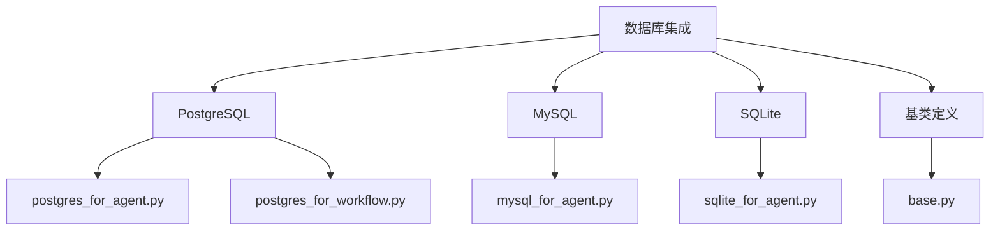
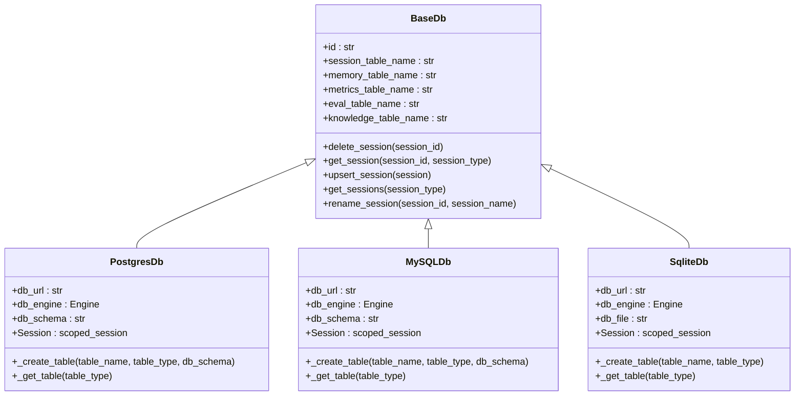
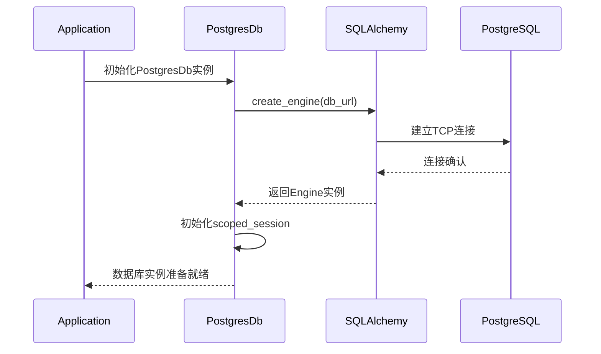
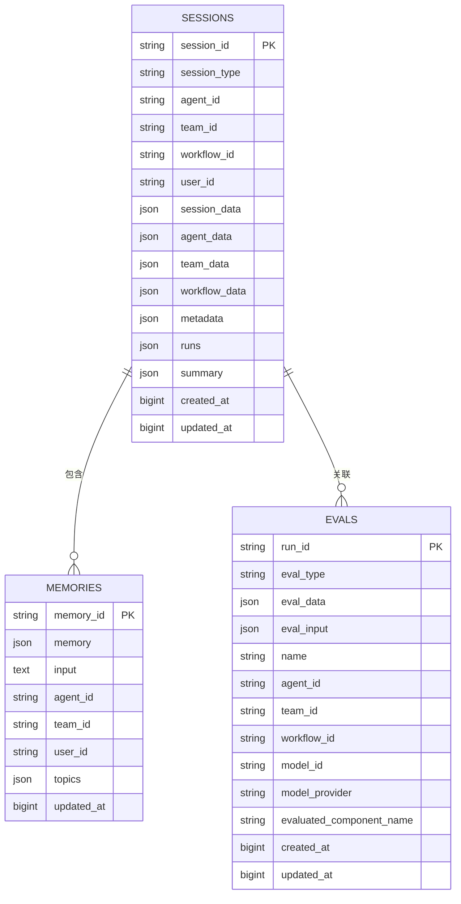
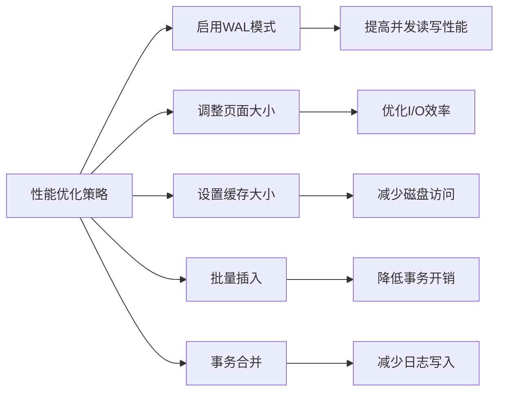
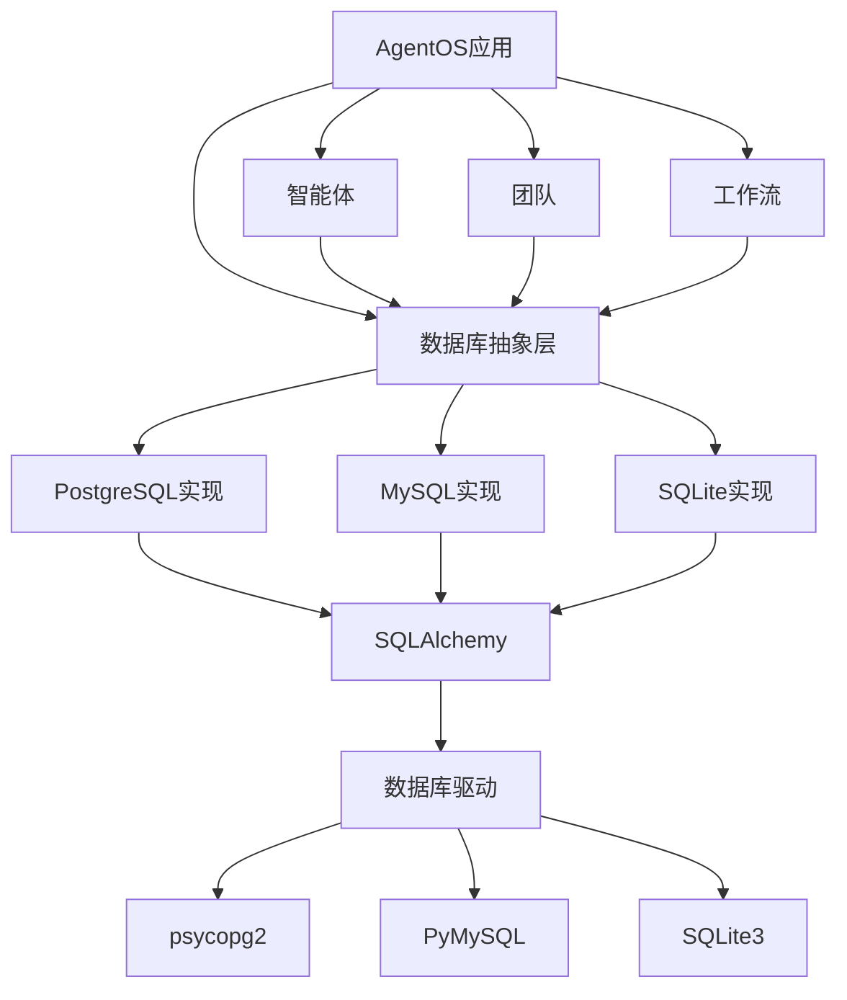
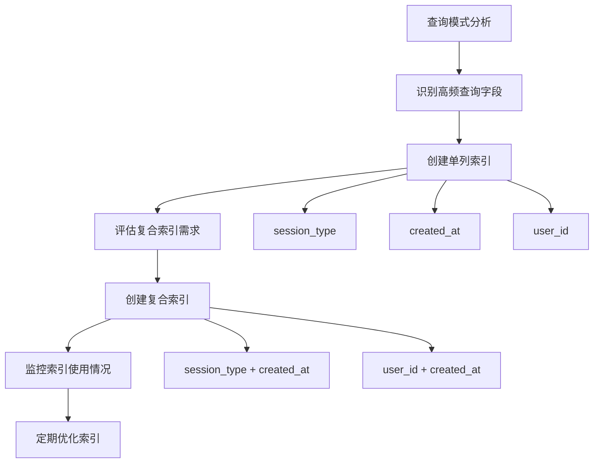

# 关系型数据库

<cite>
**本文档中引用的文件**   
- [postgres_for_agent.py](file://cookbook/db/postgres/postgres_for_agent.py)
- [postgres_for_workflow.py](file://cookbook/db/postgres/postgres_for_workflow.py)
- [mysql_for_agent.py](file://cookbook/db/mysql/mysql_for_agent.py)
- [sqlite_for_agent.py](file://cookbook/db/sqllite/sqlite_for_agent.py)
- [postgres.py](file://libs/agno/agno/db/postgres/postgres.py)
- [mysql.py](file://libs/agno/agno/db/mysql/mysql.py)
- [sqlite.py](file://libs/agno/agno/db/sqlite/sqlite.py)
- [base.py](file://libs/agno/agno/db/base.py)
- [postgres_schemas.py](file://libs/agno/agno/db/postgres/schemas.py)
- [mysql_schemas.py](file://libs/agno/agno/db/mysql/schemas.py)
- [sqlite_schemas.py](file://libs/agno/agno/db/sqlite/schemas.py)
</cite>

## 目录
1. [简介](#简介)
2. [项目结构](#项目结构)
3. [核心组件](#核心组件)
4. [架构概述](#架构概述)
5. [详细组件分析](#详细组件分析)
6. [依赖分析](#依赖分析)
7. [性能考虑](#性能考虑)
8. [故障排除指南](#故障排除指南)
9. [结论](#结论)

## 简介
本文档详细介绍了在AgentOS中集成PostgreSQL、MySQL和SQLite关系型数据库的方法。文档重点阐述了如何将这些数据库配置为智能体、团队和工作流的持久化存储后端，涵盖了连接参数、连接字符串格式、初始化步骤以及在高并发场景下的性能调优策略。通过实际代码示例，展示了不同数据库在会话管理、历史记录存储和状态持久化方面的具体实现差异。

## 项目结构
AgentOS的数据库集成模块采用分层架构设计，将不同数据库的实现分离到独立的目录中。每个数据库类型都有专门的配置文件和实现类，确保了代码的可维护性和扩展性。



**Diagram sources**
- [postgres_for_agent.py](file://cookbook/db/postgres/postgres_for_agent.py#L1-L20)
- [mysql_for_agent.py](file://cookbook/db/mysql/mysql_for_agent.py#L1-L18)
- [sqlite_for_agent.py](file://cookbook/db/sqllite/sqlite_for_agent.py#L1-L25)

**Section sources**
- [cookbook/db](file://cookbook/db#L1-L10)

## 核心组件
关系型数据库集成的核心组件包括数据库连接管理、会话持久化、事务处理和连接池配置。这些组件共同确保了智能体、团队和工作流的状态能够在不同会话之间保持一致。

**Section sources**
- [postgres.py](file://libs/agno/agno/db/postgres/postgres.py#L35-L65)
- [mysql.py](file://libs/agno/agno/db/mysql/mysql.py#L37-L67)
- [sqlite.py](file://libs/agno/agno/db/sqlite/sqlite.py#L50-L80)

## 架构概述
AgentOS的数据库架构采用抽象工厂模式，为不同类型的数据库提供了统一的接口。这种设计使得应用程序可以无缝切换不同的数据库后端，而无需修改核心业务逻辑。



**Diagram sources**
- [base.py](file://libs/agno/agno/db/base.py#L20-L246)
- [postgres.py](file://libs/agno/agno/db/postgres/postgres.py#L35-L65)
- [mysql.py](file://libs/agno/agno/db/mysql/mysql.py#L37-L67)
- [sqlite.py](file://libs/agno/agno/db/sqlite/sqlite.py#L50-L80)

## 详细组件分析

### PostgreSQL 集成分析
PostgreSQL作为功能最强大的开源关系型数据库，在AgentOS中被用作高性能的持久化存储后端。其JSONB类型支持高效的半结构化数据存储，非常适合存储智能体的会话数据。

#### 连接配置
PostgreSQL的连接通过SQLAlchemy引擎管理，支持多种连接方式：



**Diagram sources**
- [postgres.py](file://libs/agno/agno/db/postgres/postgres.py#L35-L65)
- [postgres_for_agent.py](file://cookbook/db/postgres/postgres_for_agent.py#L10-L15)

#### 表结构设计
PostgreSQL的表结构设计充分利用了其高级特性，如JSONB字段和部分索引：



**Diagram sources**
- [schemas.py](file://libs/agno/agno/db/postgres/schemas.py#L10-L124)

**Section sources**
- [postgres.py](file://libs/agno/agno/db/postgres/postgres.py#L105-L133)
- [schemas.py](file://libs/agno/agno/db/postgres/schemas.py#L10-L124)

### MySQL 集成分析
MySQL作为广泛使用的开源关系型数据库，在AgentOS中提供了可靠的持久化存储解决方案。其连接池和事务处理能力使其适合中等规模的应用场景。

#### 连接参数
MySQL的连接字符串格式遵循标准的JDBC语法：

```python
db_url = "mysql+pymysql://ai:ai@localhost:3306/ai"
```

连接参数说明：
- **协议**: `mysql+pymysql` - 使用PyMySQL驱动
- **用户名**: `ai` - 数据库用户名
- **密码**: `ai` - 数据库密码
- **主机**: `localhost` - 数据库服务器地址
- **端口**: `3306` - MySQL默认端口
- **数据库**: `ai` - 目标数据库名称

**Section sources**
- [mysql.py](file://libs/agno/agno/db/mysql/mysql.py#L37-L67)
- [mysql_for_agent.py](file://cookbook/db/mysql/mysql_for_agent.py#L10-L15)

#### 初始化步骤
MySQL数据库的初始化过程包括创建数据库模式和表结构：

```mermaid
flowchart TD
A[创建MySQLDb实例] --> B{提供db_engine?}
B --> |是| C[使用现有引擎]
B --> |否| D{提供db_url?}
D --> |是| E[create_engine(db_url)]
D --> |否| F[抛出ValueError]
E --> G[初始化Session工厂]
G --> H[创建数据库模式]
H --> I[创建表结构]
I --> J[创建索引]
J --> K[初始化完成]
```

**Diagram sources**
- [mysql.py](file://libs/agno/agno/db/mysql/mysql.py#L105-L133)

### SQLite 集成分析
SQLite作为轻量级的嵌入式数据库，在AgentOS中适用于开发和测试环境。其文件型数据库特性使得部署和迁移变得极为简单。

#### 配置方式
SQLite支持三种配置方式，按优先级排序：

1. **db_engine**: 直接提供SQLAlchemy引擎实例
2. **db_url**: 提供数据库URL（如`sqlite:///path/to/db.sqlite`）
3. **db_file**: 指定数据库文件路径

当所有参数都未提供时，系统会自动在当前目录创建`agno.db`文件。

```python
# 方式1：使用db_file参数
db = SqliteDb(db_file="tmp/data.db")

# 方式2：使用db_url参数
db = SqliteDb(db_url="sqlite:///tmp/data.db")

# 方式3：使用现有引擎
from sqlalchemy import create_engine
engine = create_engine("sqlite:///tmp/data.db")
db = SqliteDb(db_engine=engine)
```

**Section sources**
- [sqlite.py](file://libs/agno/agno/db/sqlite/sqlite.py#L50-L80)
- [sqlite_for_agent.py](file://cookbook/db/sqllite/sqlite_for_agent.py#L10-L15)

#### 性能优化
尽管SQLite是单文件数据库，但仍可通过以下方式优化性能：



**Diagram sources**
- [sqlite.py](file://libs/agno/agno/db/sqlite/sqlite.py#L105-L133)

## 依赖分析
关系型数据库模块的依赖关系清晰，遵循单一职责原则。每个数据库实现都依赖于SQLAlchemy作为ORM层，同时保持与核心应用逻辑的松耦合。



**Diagram sources**
- [base.py](file://libs/agno/agno/db/base.py#L20-L246)
- [postgres.py](file://libs/agno/agno/db/postgres/postgres.py#L35-L65)
- [mysql.py](file://libs/agno/agno/db/mysql/mysql.py#L37-L67)
- [sqlite.py](file://libs/agno/agno/db/sqlite/sqlite.py#L50-L80)

**Section sources**
- [base.py](file://libs/agno/agno/db/base.py#L1-L246)
- [requirements.txt](file://libs/agno/requirements.txt#L1-L10)

## 性能考虑
在高并发场景下，数据库性能调优至关重要。以下是针对不同数据库的性能优化策略：

### 连接池配置
所有数据库实现都支持连接池配置，以提高并发处理能力：

```python
# 连接池参数
pool_size = 20          # 连接池大小
max_overflow = 10       # 最大溢出连接数
pool_timeout = 30       # 连接超时时间（秒）
pool_recycle = 3600     # 连接回收时间（秒）
```

### 索引优化
合理的索引设计可以显著提高查询性能：



### 事务处理
合理的事务管理可以确保数据一致性和系统性能：

```python
# 事务处理最佳实践
with db.Session() as session:
    try:
        # 批量操作
        session.bulk_save_objects(entities)
        # 显式提交
        session.commit()
    except Exception as e:
        # 异常回滚
        session.rollback()
        raise e
```

**Section sources**
- [postgres.py](file://libs/agno/agno/db/postgres/postgres.py#L105-L133)
- [mysql.py](file://libs/agno/agno/db/mysql/mysql.py#L105-L133)
- [sqlite.py](file://libs/agno/agno/db/sqlite/sqlite.py#L105-L133)

## 故障排除指南
在使用关系型数据库集成时，可能会遇到以下常见问题及解决方案：

### 连接问题
**问题**: 数据库连接失败
**解决方案**:
1. 检查数据库服务是否正在运行
2. 验证连接字符串的正确性
3. 确认网络连接和防火墙设置
4. 检查数据库用户权限

### 性能问题
**问题**: 查询响应缓慢
**解决方案**:
1. 检查相关字段是否已建立索引
2. 分析查询执行计划
3. 考虑增加连接池大小
4. 优化数据库配置参数

### 数据一致性问题
**问题**: 数据丢失或不一致
**解决方案**:
1. 确保所有写操作都在事务中执行
2. 检查异常处理逻辑是否正确回滚
3. 验证数据库的持久化设置
4. 定期备份重要数据

**Section sources**
- [postgres.py](file://libs/agno/agno/db/postgres/postgres.py#L105-L133)
- [mysql.py](file://libs/agno/agno/db/mysql/mysql.py#L105-L133)
- [sqlite.py](file://libs/agno/agno/db/sqlite/sqlite.py#L105-L133)

## 结论
AgentOS的关系型数据库集成提供了灵活、可扩展的持久化解决方案。通过统一的抽象层，开发者可以轻松在PostgreSQL、MySQL和SQLite之间切换，根据应用场景选择最适合的数据库。PostgreSQL适合高性能、高并发的生产环境；MySQL适合中等规模的应用；SQLite则非常适合开发和测试。合理的连接池配置、索引优化和事务管理是确保系统性能和数据一致性的关键。