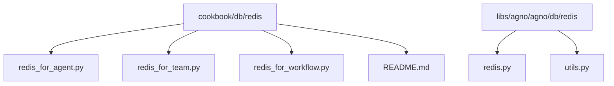
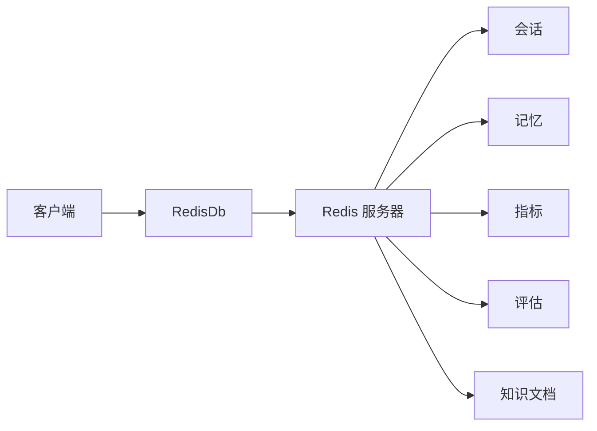
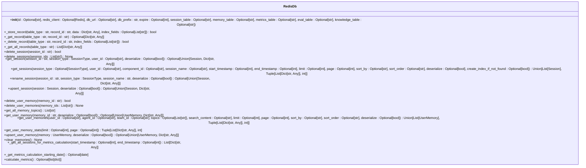
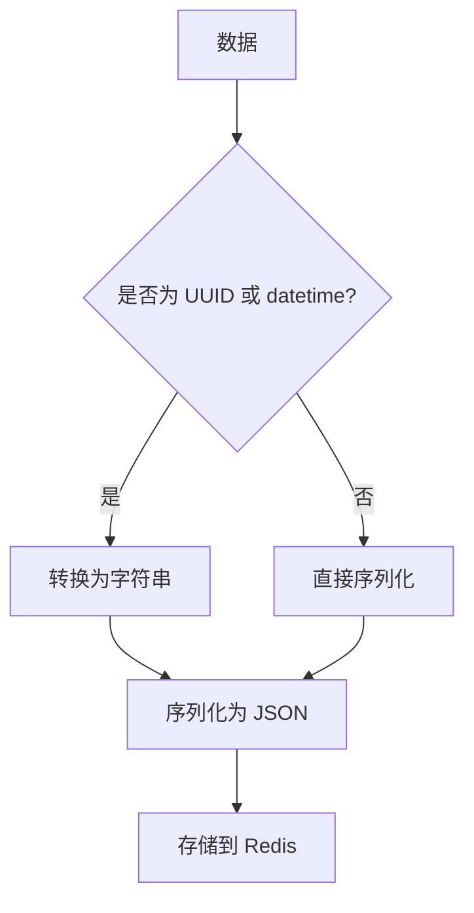
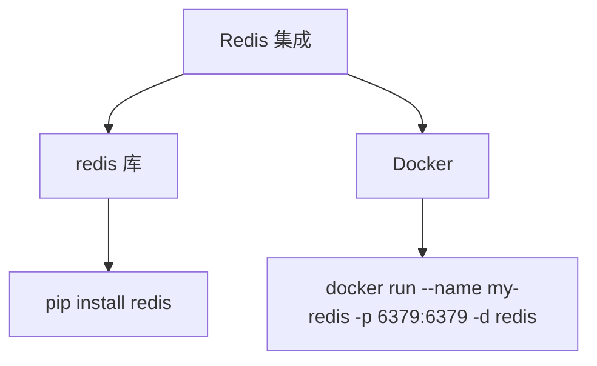

# Redis 集成

<cite>
**本文档中引用的文件**  
- [redis_for_agent.py](file://cookbook/db/redis/redis_for_agent.py)
- [redis_for_team.py](file://cookbook/db/redis/redis_for_team.py)
- [redis_for_workflow.py](file://cookbook/db/redis/redis_for_workflow.py)
- [redis.py](file://libs/agno/agno/db/redis/redis.py)
- [utils.py](file://libs/agno/agno/db/redis/utils.py)
- [README.md](file://cookbook/db/redis/README.md)
- [run_redis.sh](file://cookbook/scripts/run_redis.sh)
</cite>

## 目录
1. [简介](#简介)
2. [项目结构](#项目结构)
3. [核心组件](#核心组件)
4. [架构概述](#架构概述)
5. [详细组件分析](#详细组件分析)
6. [依赖分析](#依赖分析)
7. [性能考虑](#性能考虑)
8. [故障排除指南](#故障排除指南)
9. [结论](#结论)

## 简介
本文档详细介绍了如何在智能体、团队和工作流中配置和使用 Redis 作为外部内存存储。Redis 在分布式环境中具有高并发读写性能、数据持久化选项和集群支持等优势。文档提供了实际代码示例，展示如何通过 `redis_for_agent.py` 配置智能体的会话存储，以及如何在团队协作中利用 Redis 共享状态。详细说明了连接参数、序列化策略和错误处理机制。讨论了 Redis 作为缓存层的最佳实践，包括键命名约定、过期策略和内存优化。包含性能调优建议和常见问题排查指南，如连接超时和内存溢出。

## 项目结构
项目结构中，Redis 相关的文件位于 `cookbook/db/redis` 目录下，包括 `redis_for_agent.py`、`redis_for_team.py` 和 `redis_for_workflow.py`。这些文件展示了如何在不同场景下使用 Redis。此外，`libs/agno/agno/db/redis` 目录下包含了 Redis 数据库的实现代码，包括 `redis.py` 和 `utils.py`。

**图示来源**
- [redis_for_agent.py](file://cookbook/db/redis/redis_for_agent.py)
- [redis_for_team.py](file://cookbook/db/redis/redis_for_team.py)
- [redis_for_workflow.py](file://cookbook/db/redis/redis_for_workflow.py)
- [redis.py](file://libs/agno/agno/db/redis/redis.py)
- [utils.py](file://libs/agno/agno/db/redis/utils.py)

**节来源**
- [redis_for_agent.py](file://cookbook/db/redis/redis_for_agent.py)
- [redis_for_team.py](file://cookbook/db/redis/redis_for_team.py)
- [redis_for_workflow.py](file://cookbook/db/redis/redis_for_workflow.py)
- [redis.py](file://libs/agno/agno/db/redis/redis.py)
- [utils.py](file://libs/agno/agno/db/redis/utils.py)

## 核心组件
核心组件包括 `RedisDb` 类，它提供了与 Redis 数据库交互的接口。`RedisDb` 类支持会话、记忆、指标、评估和知识文档的存储和检索。通过 `redis_for_agent.py`、`redis_for_team.py` 和 `redis_for_workflow.py` 文件，展示了如何在不同场景下使用 `RedisDb`。

**节来源**
- [redis_for_agent.py](file://cookbook/db/redis/redis_for_agent.py)
- [redis_for_team.py](file://cookbook/db/redis/redis_for_team.py)
- [redis_for_workflow.py](file://cookbook/db/redis/redis_for_workflow.py)
- [redis.py](file://libs/agno/agno/db/redis/redis.py)

## 架构概述
Redis 集成的架构包括客户端、Redis 服务器和数据库类。客户端通过 `RedisDb` 类与 Redis 服务器通信，存储和检索数据。`RedisDb` 类提供了会话、记忆、指标、评估和知识文档的存储和检索方法。

**图示来源**
- [redis.py](file://libs/agno/agno/db/redis/redis.py)

**节来源**
- [redis.py](file://libs/agno/agno/db/redis/redis.py)

## 详细组件分析
### RedisDb 类分析
`RedisDb` 类是 Redis 集成的核心，提供了与 Redis 数据库交互的接口。它支持会话、记忆、指标、评估和知识文档的存储和检索。

#### 类图

**图示来源**
- [redis.py](file://libs/agno/agno/db/redis/redis.py)

**节来源**
- [redis.py](file://libs/agno/agno/db/redis/redis.py)

### 序列化策略
`RedisDb` 类使用 `json` 模块进行序列化和反序列化。`CustomEncoder` 类处理非 JSON 可序列化类型，如 `UUID` 和 `datetime`。

**图示来源**
- [utils.py](file://libs/agno/agno/db/redis/utils.py)

**节来源**
- [utils.py](file://libs/agno/agno/db/redis/utils.py)

## 依赖分析
Redis 集成依赖于 `redis` 库，需要通过 `pip install redis` 安装。此外，还需要 Docker 来启动 Redis 容器。

**图示来源**
- [README.md](file://cookbook/db/redis/README.md)
- [run_redis.sh](file://cookbook/scripts/run_redis.sh)

**节来源**
- [README.md](file://cookbook/db/redis/README.md)
- [run_redis.sh](file://cookbook/scripts/run_redis.sh)

## 性能考虑
Redis 作为缓存层，具有高并发读写性能。通过设置 `expire` 参数，可以控制键的过期时间，避免内存溢出。键命名约定采用 `prefix:table_type:key_id` 的格式，便于管理和查询。

**节来源**
- [redis.py](file://libs/agno/agno/db/redis/redis.py)
- [utils.py](file://libs/agno/agno/db/redis/utils.py)

## 故障排除指南
常见问题包括连接超时和内存溢出。连接超时可能是由于 Redis 服务器未启动或网络问题。内存溢出可能是由于未设置过期时间或数据量过大。可以通过检查 Redis 服务器状态和设置适当的过期时间来解决这些问题。

**节来源**
- [redis.py](file://libs/agno/agno/db/redis/redis.py)
- [utils.py](file://libs/agno/agno/db/redis/utils.py)

## 结论
本文档详细介绍了如何在智能体、团队和工作流中配置和使用 Redis 作为外部内存存储。通过 `RedisDb` 类，可以方便地与 Redis 服务器通信，存储和检索数据。文档提供了实际代码示例，展示了如何在不同场景下使用 Redis，并讨论了最佳实践和常见问题排查指南。