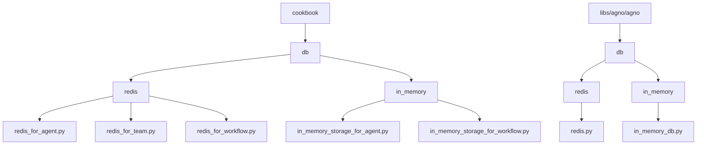
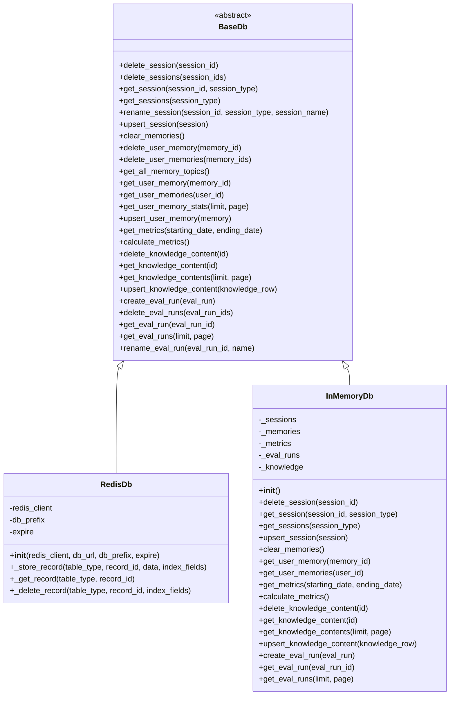
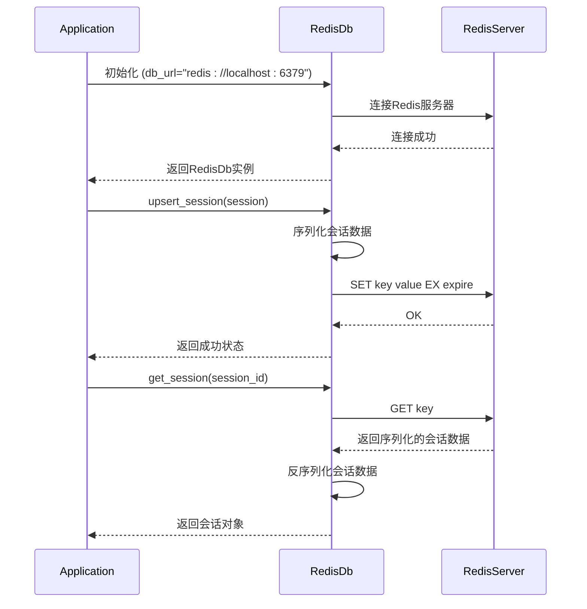
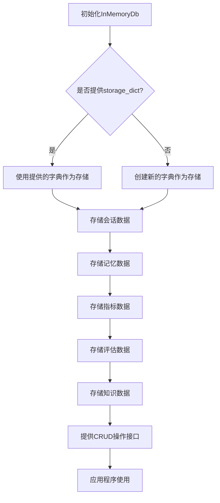
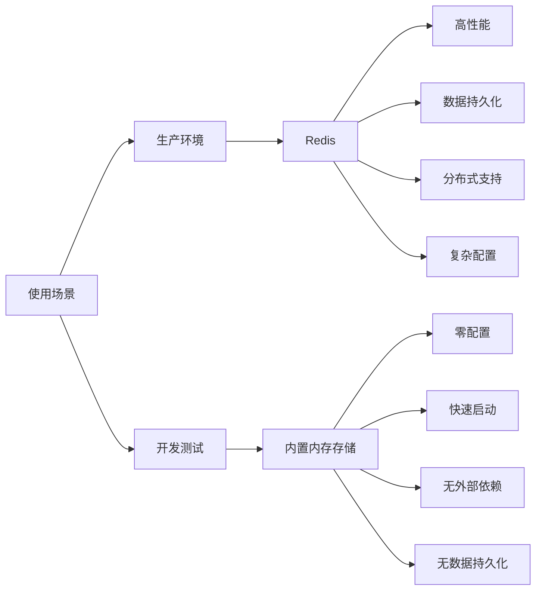
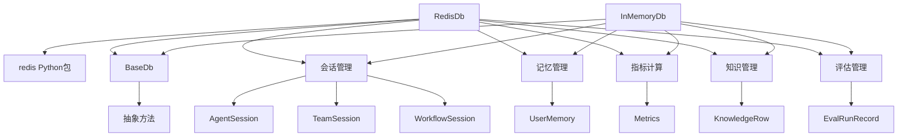

# 内存数据库

<cite>
**本文档中引用的文件**  
- [redis_for_agent.py](file://cookbook/db/redis/redis_for_agent.py)
- [redis_for_team.py](file://cookbook/db/redis/redis_for_team.py)
- [redis_for_workflow.py](file://cookbook/db/redis/redis_for_workflow.py)
- [in_memory_storage_for_agent.py](file://cookbook/db/in_memory/in_memory_storage_for_agent.py)
- [in_memory_storage_for_workflow.py](file://cookbook/db/in_memory/in_memory_storage_for_workflow.py)
- [RedisDb.py](file://libs/agno/agno/db/redis/redis.py)
- [InMemoryDb.py](file://libs/agno/agno/db/in_memory/in_memory_db.py)
- [base.py](file://libs/agno/agno/db/base.py)
</cite>

## 目录
1. [简介](#简介)
2. [项目结构](#项目结构)
3. [核心组件](#核心组件)
4. [架构概述](#架构概述)
5. [详细组件分析](#详细组件分析)
6. [依赖分析](#依赖分析)
7. [性能考量](#性能考量)
8. [故障排除指南](#故障排除指南)
9. [结论](#结论)

## 简介
本文档详细介绍了如何在Agno框架中集成和使用内存数据库，重点介绍Redis和内置内存存储的使用场景和配置方法。文档解释了如何利用Redis作为高速缓存层或会话存储，以及如何使用内置内存存储进行快速原型开发和测试。通过具体的配置示例，展示了连接设置和数据持久化策略。同时讨论了内存数据库在低延迟响应、临时数据存储和分布式环境中的优势，以及在数据持久性和容量限制方面的挑战。

## 项目结构
项目结构清晰地组织了内存数据库相关的示例和实现。`cookbook/db/redis`目录包含Redis集成的示例代码，而`cookbook/db/in_memory`目录则包含内置内存存储的示例。核心实现位于`libs/agno/agno/db`目录下，其中`redis`子目录包含Redis数据库的实现，`in_memory`子目录包含内置内存存储的实现。

**图示来源**
- [redis_for_agent.py](file://cookbook/db/redis/redis_for_agent.py)
- [in_memory_storage_for_agent.py](file://cookbook/db/in_memory/in_memory_storage_for_agent.py)
- [redis.py](file://libs/agno/agno/db/redis/redis.py)
- [in_memory_db.py](file://libs/agno/agno/db/in_memory/in_memory_db.py)

**本节来源**
- [redis_for_agent.py](file://cookbook/db/redis/redis_for_agent.py)
- [in_memory_storage_for_agent.py](file://cookbook/db/in_memory/in_memory_storage_for_agent.py)

## 核心组件
本文档的核心组件包括Redis数据库集成和内置内存存储实现。Redis组件提供了高性能的持久化存储解决方案，适用于生产环境，而内置内存存储组件则提供了轻量级的临时存储解决方案，适用于快速原型开发和测试。

**本节来源**
- [redis_for_agent.py](file://cookbook/db/redis/redis_for_agent.py)
- [in_memory_storage_for_agent.py](file://cookbook/db/in_memory/in_memory_storage_for_agent.py)

## 架构概述
Agno框架的内存数据库架构基于抽象基类`BaseDb`，该类定义了所有数据库实现必须遵循的接口。`RedisDb`和`InMemoryDb`类分别实现了这个接口，提供了具体的数据库功能。这种设计模式允许用户在不同的存储后端之间轻松切换，而无需修改应用程序的其他部分。

**图示来源**
- [base.py](file://libs/agno/agno/db/base.py)
- [redis.py](file://libs/agno/agno/db/redis/redis.py)
- [in_memory_db.py](file://libs/agno/agno/db/in_memory/in_memory_db.py)

## 详细组件分析

### Redis数据库分析
Redis数据库组件提供了高性能的持久化存储解决方案，适用于生产环境。它支持通过Redis客户端实例或连接URL进行连接，并提供了丰富的配置选项，如数据库前缀和键的过期时间。

**图示来源**
- [redis.py](file://libs/agno/agno/db/redis/redis.py)
- [redis_for_agent.py](file://cookbook/db/redis/redis_for_agent.py)

### 内置内存存储分析
内置内存存储组件提供了轻量级的临时存储解决方案，适用于快速原型开发和测试。它将所有数据存储在内存中的字典里，无需任何外部依赖，但数据不会在程序重启后持久化。

**图示来源**
- [in_memory_db.py](file://libs/agno/agno/db/in_memory/in_memory_db.py)
- [in_memory_storage_for_agent.py](file://cookbook/db/in_memory/in_memory_storage_for_agent.py)

### 使用场景分析
内存数据库在不同的使用场景下有不同的优势和挑战。Redis适合需要高性能和数据持久化的生产环境，而内置内存存储适合快速原型开发和测试。

**图示来源**
- [redis_for_agent.py](file://cookbook/db/redis/redis_for_agent.py)
- [in_memory_storage_for_agent.py](file://cookbook/db/in_memory/in_memory_storage_for_agent.py)

**本节来源**
- [redis_for_agent.py](file://cookbook/db/redis/redis_for_agent.py)
- [in_memory_storage_for_agent.py](file://cookbook/db/in_memory/in_memory_storage_for_agent.py)

## 依赖分析
内存数据库组件的依赖关系清晰，`RedisDb`依赖于`redis` Python包，而`InMemoryDb`没有外部依赖。两个类都继承自`BaseDb`抽象基类，并使用了框架中的其他组件，如会话管理、记忆管理、指标计算等。

**图示来源**
- [redis.py](file://libs/agno/agno/db/redis/redis.py)
- [in_memory_db.py](file://libs/agno/agno/db/in_memory/in_memory_db.py)
- [base.py](file://libs/agno/agno/db/base.py)

**本节来源**
- [redis.py](file://libs/agno/agno/db/redis/redis.py)
- [in_memory_db.py](file://libs/agno/agno/db/in_memory/in_memory_db.py)

## 性能考量
内存数据库的性能考量主要集中在延迟、吞吐量和资源使用上。Redis作为外部服务，其性能受网络延迟和服务器配置的影响，而内置内存存储的性能则完全取决于本地机器的内存和CPU性能。

**本节来源**
- [redis.py](file://libs/agno/agno/db/redis/redis.py)
- [in_memory_db.py](file://libs/agno/agno/db/in_memory/in_memory_db.py)

## 故障排除指南
在使用内存数据库时可能会遇到一些常见问题，如Redis连接失败、内存溢出等。对于Redis连接问题，应检查连接URL和服务器状态；对于内存溢出问题，应监控内存使用情况并考虑使用外部持久化存储。

**本节来源**
- [redis.py](file://libs/agno/agno/db/redis/redis.py)
- [in_memory_db.py](file://libs/agno/agno/db/in_memory/in_memory_db.py)

## 结论
Agno框架提供了灵活的内存数据库集成方案，支持Redis和内置内存存储两种模式。Redis适合生产环境，提供高性能和数据持久化；内置内存存储适合开发测试，提供零配置和快速启动。开发者可以根据具体需求选择合适的存储方案，并通过统一的接口进行操作。