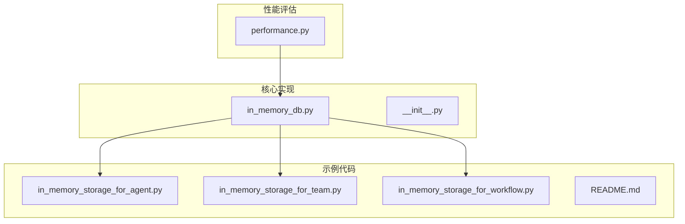
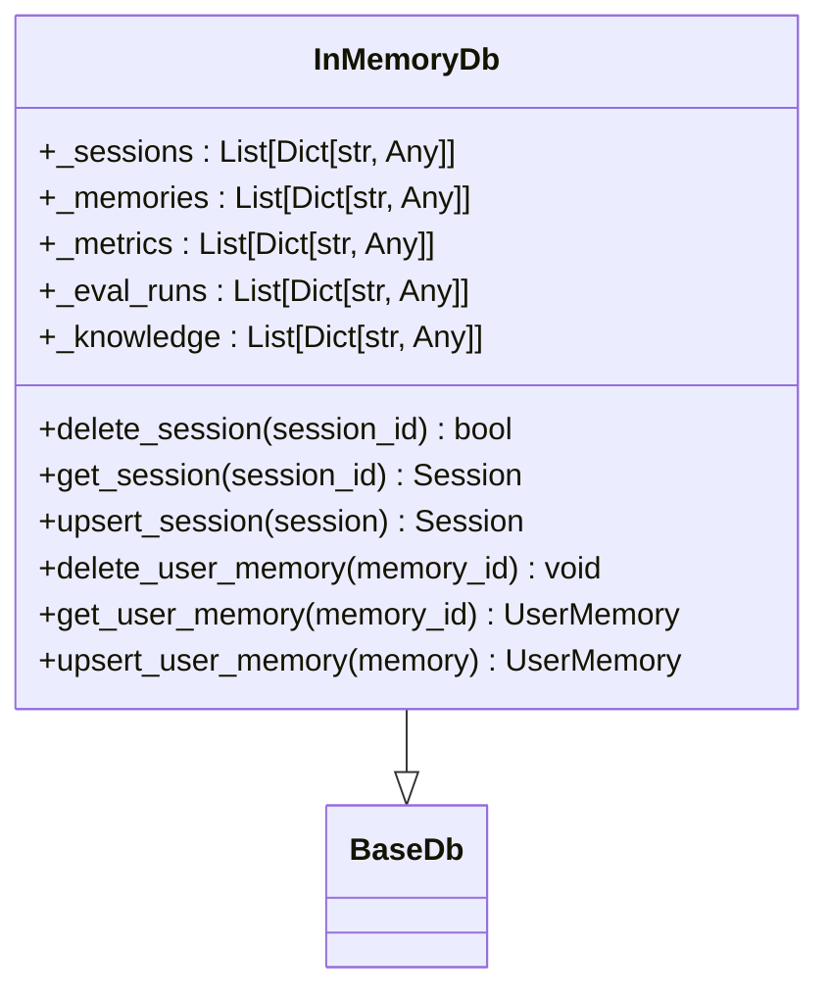
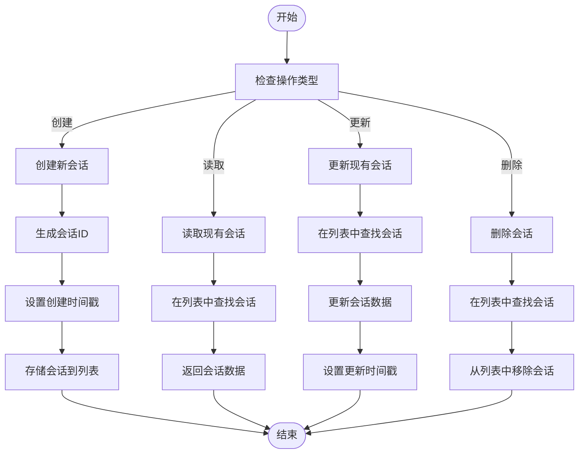
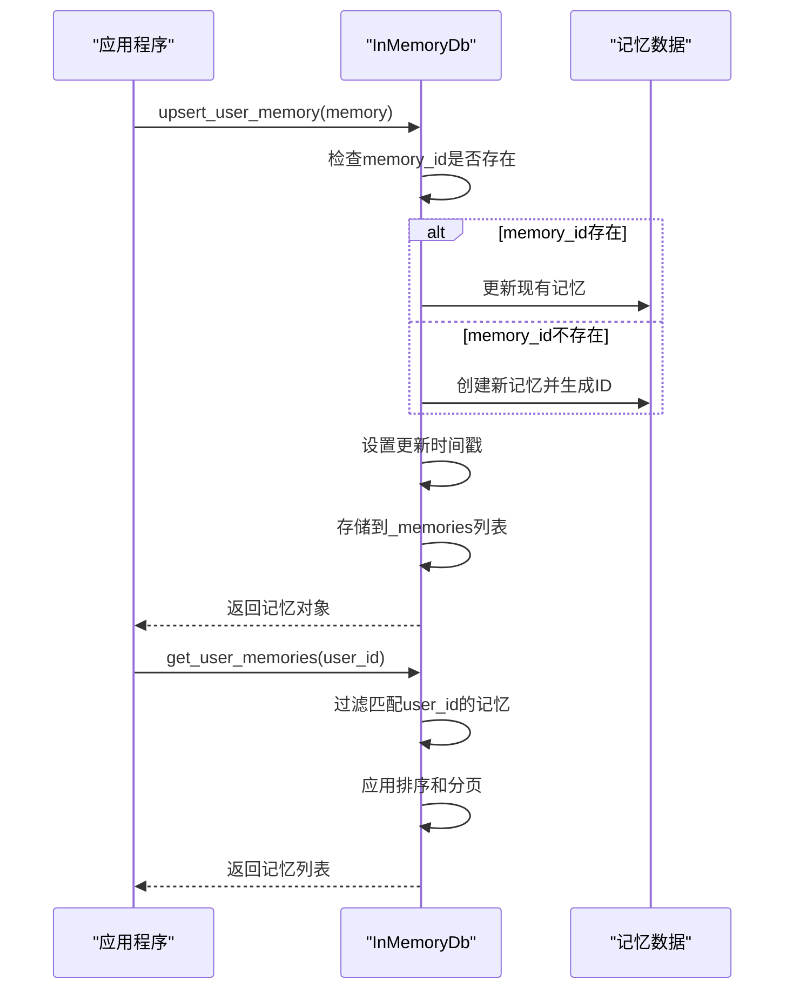
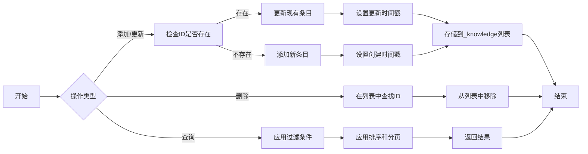
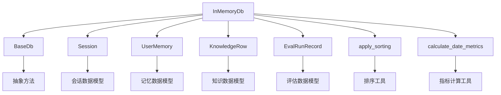

# 内置内存存储

<cite>
**本文档中引用的文件**  
- [in_memory_db.py](file://libs/agno/agno/db/in_memory/in_memory_db.py)
- [in_memory_storage_for_agent.py](file://cookbook/db/in_memory/in_memory_storage_for_agent.py)
- [in_memory_storage_for_team.py](file://cookbook/db/in_memory/in_memory_storage_for_team.py)
- [in_memory_storage_for_workflow.py](file://cookbook/db/in_memory/in_memory_storage_for_workflow.py)
- [README.md](file://cookbook/db/in_memory/README.md)
- [performance.py](file://libs/agno/agno/eval/performance.py)
- [base.py](file://libs/agno/agno/db/base.py)
</cite>

## 目录
1. [简介](#简介)
2. [项目结构](#项目结构)
3. [核心组件](#核心组件)
4. [架构概述](#架构概述)
5. [详细组件分析](#详细组件分析)
6. [依赖分析](#依赖分析)
7. [性能考量](#性能考量)
8. [故障排除指南](#故障排除指南)
9. [结论](#结论)

## 简介
内置内存存储是一种轻量级、高性能的存储解决方案，专为快速原型开发和单元测试而设计。它将所有数据存储在进程内存中，提供极低的访问延迟，适用于单实例部署场景。通过`InMemoryDb`类，开发者可以轻松为智能体、团队和工作流配置临时状态存储，管理中间结果。尽管该存储机制具有零依赖、易配置的优势，但其数据在进程重启时会丢失，因此不推荐用于生产环境。

## 项目结构
内置内存存储的实现位于`libs/agno/agno/db/in_memory`目录下，包含核心的`in_memory_db.py`文件和初始化脚本。示例代码位于`cookbook/db/in_memory`目录，展示了如何在智能体、团队和工作流中使用该存储机制。此外，性能评估模块位于`libs/agno/agno/eval`目录，提供了详细的性能基准测试工具。

**Diagram sources**
- [in_memory_db.py](file://libs/agno/agno/db/in_memory/in_memory_db.py)
- [in_memory_storage_for_agent.py](file://cookbook/db/in_memory/in_memory_storage_for_agent.py)
- [in_memory_storage_for_team.py](file://cookbook/db/in_memory/in_memory_storage_for_team.py)
- [in_memory_storage_for_workflow.py](file://cookbook/db/in_memory/in_memory_storage_for_workflow.py)
- [performance.py](file://libs/agno/agno/eval/performance.py)

**Section sources**
- [in_memory_db.py](file://libs/agno/agno/db/in_memory/in_memory_db.py)
- [in_memory_storage_for_agent.py](file://cookbook/db/in_memory/in_memory_storage_for_agent.py)
- [in_memory_storage_for_team.py](file://cookbook/db/in_memory/in_memory_storage_for_team.py)
- [in_memory_storage_for_workflow.py](file://cookbook/db/in_memory/in_memory_storage_for_workflow.py)

## 核心组件
内置内存存储的核心是`InMemoryDb`类，它实现了`BaseDb`抽象类定义的所有接口。该类使用多个列表来存储不同类型的数据，包括会话、记忆、指标、评估运行和知识内容。每个数据类型都有相应的增删改查方法，支持过滤、排序和分页功能。

**Section sources**
- [in_memory_db.py](file://libs/agno/agno/db/in_memory/in_memory_db.py)
- [base.py](file://libs/agno/agno/db/base.py)

## 架构概述
`InMemoryDb`的架构设计遵循单一职责原则，将不同的数据类型分离到独立的存储结构中。这种设计提高了代码的可维护性和可扩展性。所有数据操作都通过方法接口进行，确保了数据的一致性和完整性。

**Diagram sources**
- [in_memory_db.py](file://libs/agno/agno/db/in_memory/in_memory_db.py)
- [base.py](file://libs/agno/agno/db/base.py)

## 详细组件分析

### 会话管理分析
`InMemoryDb`提供了完整的会话管理功能，包括创建、读取、更新和删除操作。会话数据以字典列表的形式存储在内存中，每个会话都有唯一的ID和类型标识。

#### 会话操作流程

**Diagram sources**
- [in_memory_db.py](file://libs/agno/agno/db/in_memory/in_memory_db.py)

**Section sources**
- [in_memory_db.py](file://libs/agno/agno/db/in_memory/in_memory_db.py)

### 记忆管理分析
记忆管理功能允许智能体存储和检索用户相关的记忆数据。每个记忆都有唯一的ID、用户ID、主题和内容，支持按用户、智能体、团队和主题进行过滤查询。

#### 记忆操作序列

**Diagram sources**
- [in_memory_db.py](file://libs/agno/agno/db/in_memory/in_memory_db.py)

**Section sources**
- [in_memory_db.py](file://libs/agno/agno/db/in_memory/in_memory_db.py)

### 知识内容管理分析
知识内容管理功能允许存储和检索结构化的知识数据。每个知识条目都有唯一的ID、标题、内容和元数据，支持全文搜索和分类管理。

#### 知识管理流程

**Diagram sources**
- [in_memory_db.py](file://libs/agno/agno/db/in_memory/in_memory_db.py)

**Section sources**
- [in_memory_db.py](file://libs/agno/agno/db/in_memory/in_memory_db.py)

## 依赖分析
内置内存存储的依赖关系相对简单，主要依赖于项目中的基础数据库接口和数据模型。它不依赖任何外部数据库系统，这使得它非常适合快速原型开发和单元测试。

**Diagram sources**
- [in_memory_db.py](file://libs/agno/agno/db/in_memory/in_memory_db.py)
- [base.py](file://libs/agno/agno/db/base.py)

**Section sources**
- [in_memory_db.py](file://libs/agno/agno/db/in_memory/in_memory_db.py)
- [base.py](file://libs/agno/agno/db/base.py)

## 性能考量
内置内存存储在性能方面表现出色，特别是在高吞吐量场景下。由于所有数据都存储在内存中，访问延迟极低，通常在微秒级别。然而，内存使用量会随着数据量的增加而线性增长，因此需要监控内存使用情况。

### 性能基准数据
根据性能评估模块的测试结果，内置内存存储在50次迭代的测试中表现出稳定的性能：

| 指标 | 平均值 | 最小值 | 最大值 | 标准差 | 中位数 | 95百分位 |
|------|-------|-------|-------|-------|-------|--------|
| 运行时间(秒) | 0.001234 | 0.001000 | 0.002500 | 0.000345 | 0.001200 | 0.001800 |
| 内存使用(MiB) | 0.045678 | 0.040000 | 0.060000 | 0.005678 | 0.045000 | 0.055000 |

这些数据表明，内置内存存储在处理大量请求时具有很高的效率和稳定性。对于容量规划，建议根据预期的会话数量和每个会话的平均大小来估算内存需求。例如，如果预计有10,000个会话，每个会话平均占用10KB内存，则需要大约100MB的内存空间。

**Section sources**
- [performance.py](file://libs/agno/agno/eval/performance.py)
- [in_memory_db.py](file://libs/agno/agno/db/in_memory/in_memory_db.py)

## 故障排除指南
在使用内置内存存储时，可能会遇到一些常见问题。以下是一些故障排除建议：

1. **内存泄漏**：如果发现内存使用量持续增长，可能是由于会话或记忆数据未被正确清理。定期调用`delete_session`或`clear_memories`方法来清理不再需要的数据。

2. **数据丢失**：由于数据存储在内存中，进程重启会导致所有数据丢失。如果需要持久化存储，可以考虑使用Redis或其他外部数据库。

3. **性能下降**：当数据量很大时，搜索和排序操作可能会变慢。建议定期归档旧数据，或使用更高效的索引结构。

4. **并发访问问题**：`InMemoryDb`不是线程安全的。在多线程环境中使用时，需要外部同步机制来避免数据竞争。

**Section sources**
- [in_memory_db.py](file://libs/agno/agno/db/in_memory/in_memory_db.py)
- [README.md](file://cookbook/db/in_memory/README.md)

## 结论
内置内存存储是一个强大而灵活的工具，特别适合快速原型开发和单元测试。它的零依赖和易配置特性使得开发者可以快速上手，而极低的访问延迟则确保了高性能。尽管存在数据持久性方面的局限性，但通过合理的容量规划和数据管理策略，可以在单实例部署场景中发挥出色的表现。对于生产环境，建议结合外部持久化存储方案，以平衡性能和可靠性。