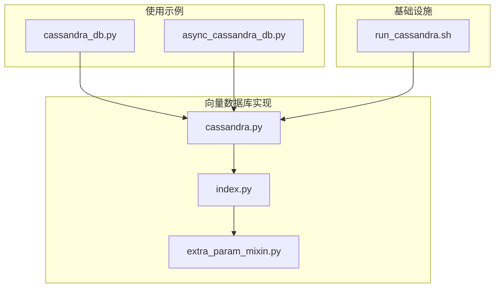
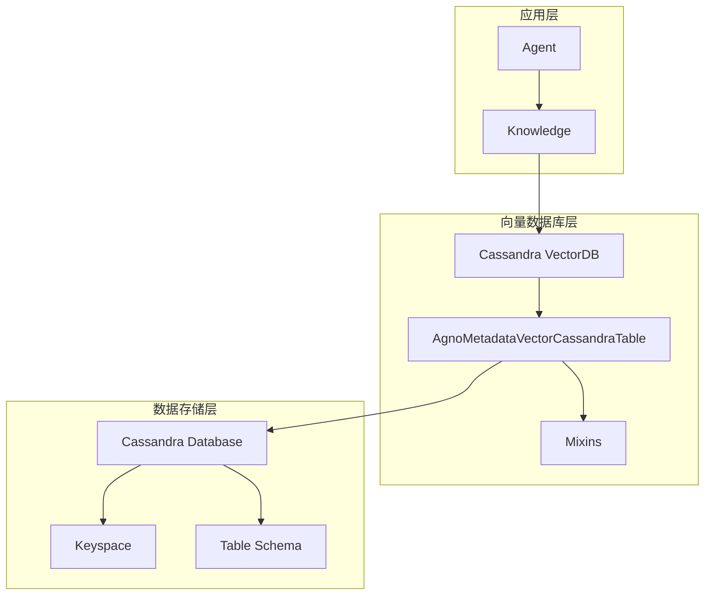
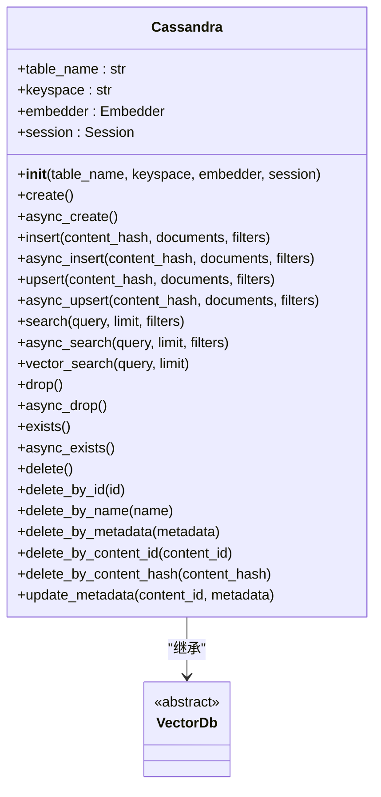
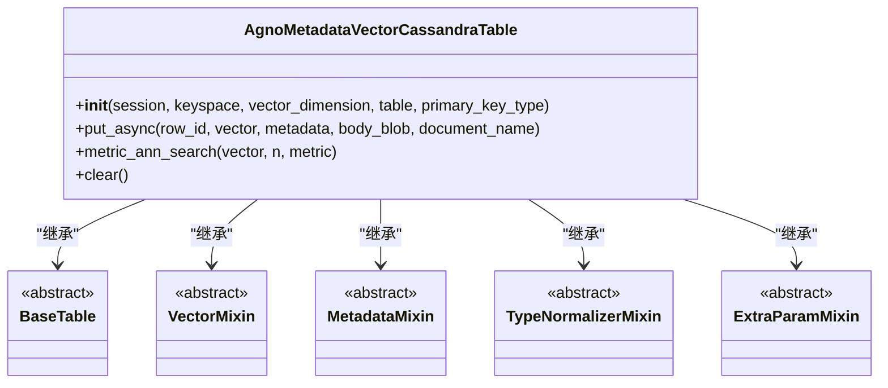
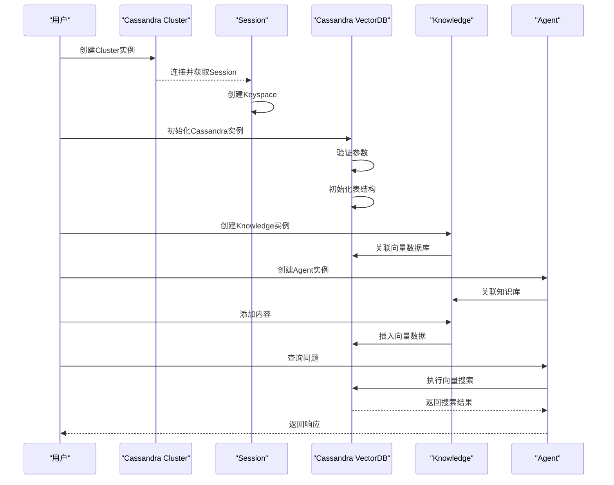
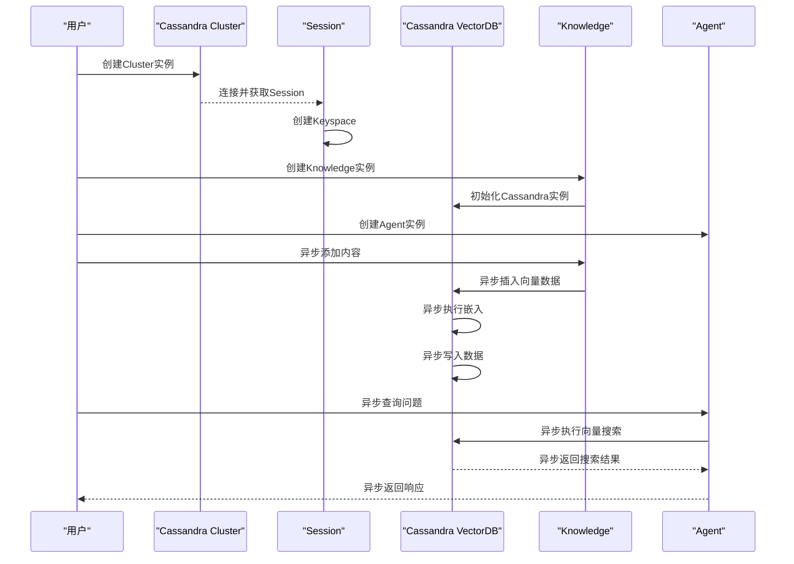
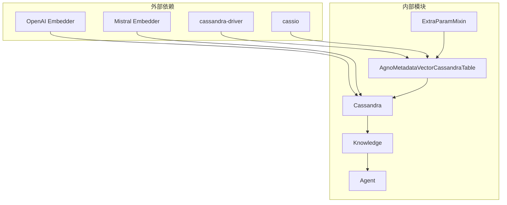

# Cassandra

<cite>
**本文档中引用的文件**   
- [cassandra.py](file://libs/agno/agno/vectordb/cassandra/cassandra.py)
- [index.py](file://libs/agno/agno/vectordb/cassandra/index.py)
- [extra_param_mixin.py](file://libs/agno/agno/vectordb/cassandra/extra_param_mixin.py)
- [cassandra_db.py](file://cookbook/knowledge/vector_db/cassandra_db/cassandra_db.py)
- [async_cassandra_db.py](file://cookbook/knowledge/vector_db/cassandra_db/async_cassandra_db.py)
- [run_cassandra.sh](file://cookbook/scripts/run_cassandra.sh)
</cite>

## 目录
1. [简介](#简介)
2. [项目结构](#项目结构)
3. [核心组件](#核心组件)
4. [架构概述](#架构概述)
5. [详细组件分析](#详细组件分析)
6. [依赖分析](#依赖分析)
7. [性能考虑](#性能考虑)
8. [故障排除指南](#故障排除指南)
9. [结论](#结论)

## 简介
本文档详细阐述了如何在Agno中集成Cassandra向量数据库，以实现大规模、高可用的向量数据存储。文档涵盖了Cassandra的键空间（Keyspace）和表（Table）设计，特别是为向量数据优化的模式。通过代码示例展示了如何使用Cassandra的用户定义函数（UDF）或外部索引服务来实现近似最近邻（ANN）搜索。同时讨论了Cassandra的无中心架构、线性可扩展性以及在需要极高写入吞吐量和容错能力的场景下的应用。还包括数据分区策略和一致性级别设置的指导。

## 项目结构
Agno项目中的Cassandra向量数据库集成主要分布在`vectordb`模块和`cookbook`示例中。`vectordb`模块提供了Cassandra向量数据库的实现，而`cookbook`则提供了具体的使用示例。

**图示来源**
- [cassandra.py](file://libs/agno/agno/vectordb/cassandra/cassandra.py)
- [index.py](file://libs/agno/agno/vectordb/cassandra/index.py)
- [extra_param_mixin.py](file://libs/agno/agno/vectordb/cassandra/extra_param_mixin.py)
- [cassandra_db.py](file://cookbook/knowledge/vector_db/cassandra_db/cassandra_db.py)
- [async_cassandra_db.py](file://cookbook/knowledge/vector_db/cassandra_db/async_cassandra_db.py)
- [run_cassandra.sh](file://cookbook/scripts/run_cassandra.sh)

**本节来源**
- [cassandra.py](file://libs/agno/agno/vectordb/cassandra/cassandra.py)
- [cassandra_db.py](file://cookbook/knowledge/vector_db/cassandra_db/cassandra_db.py)

## 核心组件
Cassandra向量数据库集成的核心组件包括`Cassandra`类、`AgnoMetadataVectorCassandraTable`类和`ExtraParamMixin`类。这些组件共同实现了向量数据的存储、检索和管理功能。

**本节来源**
- [cassandra.py](file://libs/agno/agno/vectordb/cassandra/cassandra.py)
- [index.py](file://libs/agno/agno/vectordb/cassandra/index.py)
- [extra_param_mixin.py](file://libs/agno/agno/vectordb/cassandra/extra_param_mixin.py)

## 架构概述
Cassandra向量数据库集成的架构基于Cassandra的分布式特性，利用其无中心架构和线性可扩展性来支持大规模向量数据存储。架构中包含了键空间管理、表结构设计、向量索引和元数据管理等关键组件。

**图示来源**
- [cassandra.py](file://libs/agno/agno/vectordb/cassandra/cassandra.py)
- [index.py](file://libs/agno/agno/vectordb/cassandra/index.py)

## 详细组件分析

### Cassandra类分析
`Cassandra`类是向量数据库的主要入口，继承自`VectorDb`基类，提供了向量数据的创建、插入、搜索和删除等核心功能。

#### 类图

**图示来源**
- [cassandra.py](file://libs/agno/agno/vectordb/cassandra/cassandra.py)

**本节来源**
- [cassandra.py](file://libs/agno/agno/vectordb/cassandra/cassandra.py)

### AgnoMetadataVectorCassandraTable类分析
`AgnoMetadataVectorCassandraTable`类是Cassandra表的具体实现，通过多重继承组合了多个功能混入（Mixin），实现了向量存储和元数据管理的功能。

#### 类图

**图示来源**
- [index.py](file://libs/agno/agno/vectordb/cassandra/index.py)
- [extra_param_mixin.py](file://libs/agno/agno/vectordb/cassandra/extra_param_mixin.py)

**本节来源**
- [index.py](file://libs/agno/agno/vectordb/cassandra/index.py)
- [extra_param_mixin.py](file://libs/agno/agno/vectordb/cassandra/extra_param_mixin.py)

### 使用示例分析
通过示例代码展示了如何在实际应用中使用Cassandra向量数据库。

#### 同步使用流程

**图示来源**
- [cassandra_db.py](file://cookbook/knowledge/vector_db/cassandra_db/cassandra_db.py)

**本节来源**
- [cassandra_db.py](file://cookbook/knowledge/vector_db/cassandra_db/cassandra_db.py)

#### 异步使用流程

**图示来源**
- [async_cassandra_db.py](file://cookbook/knowledge/vector_db/cassandra_db/async_cassandra_db.py)

**本节来源**
- [async_cassandra_db.py](file://cookbook/knowledge/vector_db/cassandra_db/async_cassandra_db.py)

## 依赖分析
Cassandra向量数据库集成依赖于多个外部库和内部模块，形成了一个完整的向量数据处理生态系统。

**图示来源**
- [cassandra.py](file://libs/agno/agno/vectordb/cassandra/cassandra.py)
- [index.py](file://libs/agno/agno/vectordb/cassandra/index.py)
- [extra_param_mixin.py](file://libs/agno/agno/vectordb/cassandra/extra_param_mixin.py)
- [cassandra_db.py](file://cookbook/knowledge/vector_db/cassandra_db/cassandra_db.py)
- [async_cassandra_db.py](file://cookbook/knowledge/vector_db/cassandra_db/async_cassandra_db.py)

**本节来源**
- [cassandra.py](file://libs/agno/agno/vectordb/cassandra/cassandra.py)
- [index.py](file://libs/agno/agno/vectordb/cassandra/index.py)
- [extra_param_mixin.py](file://libs/agno/agno/vectordb/cassandra/extra_param_mixin.py)

## 性能考虑
Cassandra向量数据库集成在设计时充分考虑了性能因素，特别是在大规模数据处理和高并发场景下的表现。

1. **异步操作支持**：通过`asyncio.to_thread`实现异步操作，避免阻塞主线程，提高系统吞吐量。
2. **批量处理**：在插入操作中使用批量处理，减少数据库交互次数，提高写入效率。
3. **索引优化**：利用Cassandra的二级索引和ALLOW FILTERING特性，优化查询性能。
4. **向量维度固定**：将向量维度固定为1024，便于存储优化和索引构建。
5. **元数据管理**：通过`metadata_s`字段存储结构化元数据，支持基于元数据的高效查询。

**本节来源**
- [cassandra.py](file://libs/agno/agno/vectordb/cassandra/cassandra.py)

## 故障排除指南
在使用Cassandra向量数据库集成时，可能会遇到一些常见问题，以下是一些故障排除建议。

**本节来源**
- [cassandra.py](file://libs/agno/agno/vectordb/cassandra/cassandra.py)
- [cassandra_db.py](file://cookbook/knowledge/vector_db/cassandra_db/cassandra_db.py)

## 结论
Cassandra向量数据库集成在Agno中提供了一个强大、可扩展的向量数据存储解决方案。通过利用Cassandra的分布式架构和线性可扩展性，该集成能够支持大规模、高可用的向量数据存储和检索。设计中的异步支持、批量处理和索引优化确保了高性能的数据操作。通过合理的键空间和表结构设计，以及对元数据的灵活管理，该集成能够满足各种复杂的应用场景需求。