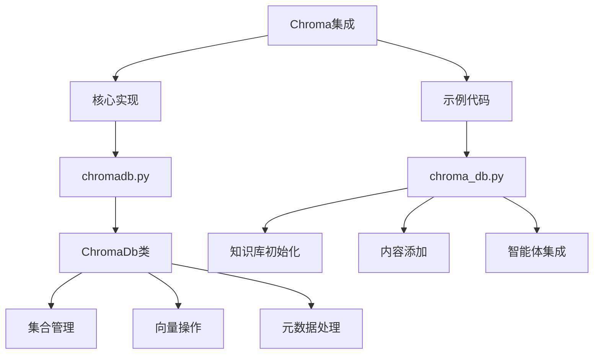
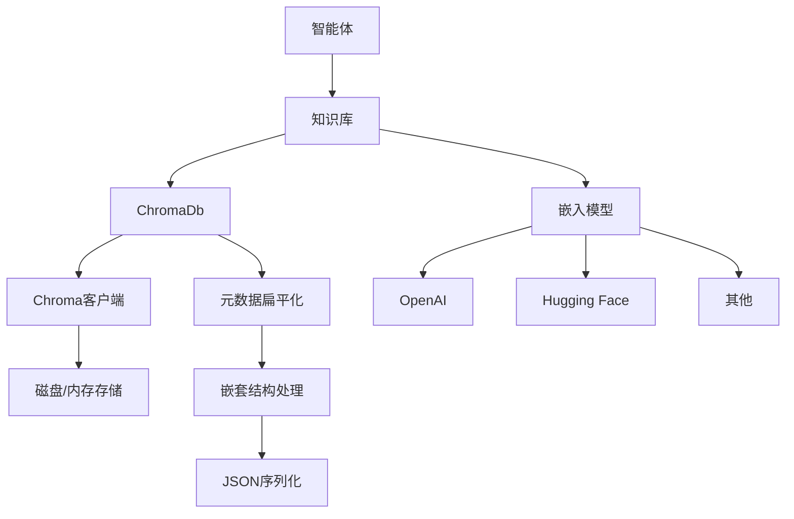
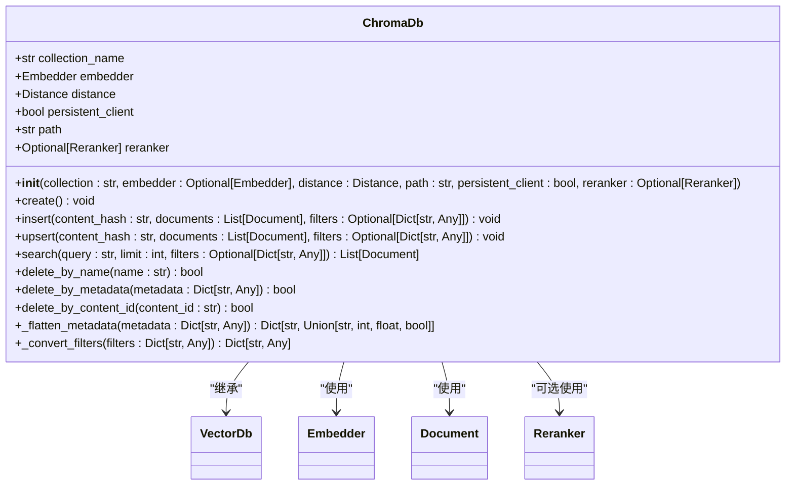
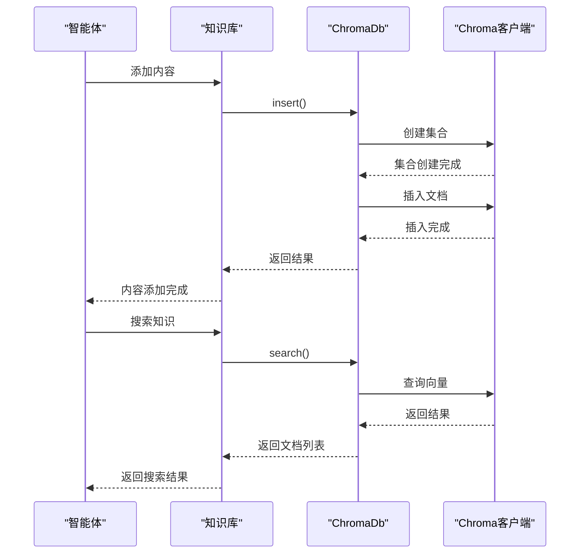
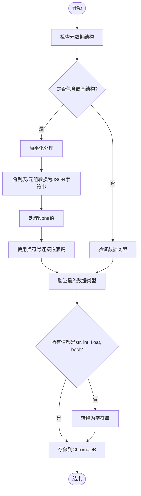
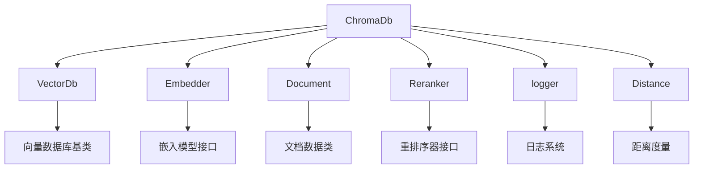

# Chroma

<cite>
**本文档中引用的文件**  
- [chromadb.py](file://libs/agno/agno/vectordb/chroma/chromadb.py)
- [chroma_db.py](file://cookbook/knowledge/vector_db/chroma_db/chroma_db.py)
- [test_chromadb.py](file://libs/agno/tests/unit/vectordb/test_chromadb.py)
- [base.py](file://libs/agno/agno/knowledge/document/base.py)
- [__init__.py](file://libs/agno/agno/vectordb/chroma/__init__.py)
</cite>

## 目录
1. [简介](#简介)
2. [项目结构](#项目结构)
3. [核心组件](#核心组件)
4. [架构概述](#架构概述)
5. [详细组件分析](#详细组件分析)
6. [依赖分析](#依赖分析)
7. [性能考虑](#性能考虑)
8. [故障排除指南](#故障排除指南)
9. [结论](#结论)

## 简介
本文档详细说明了如何在Agno中配置和使用Chroma向量数据库进行知识存储与检索。涵盖了Chroma的同步和异步API使用方法，包括集合创建、向量插入、相似性搜索和元数据过滤。文档提供了来自`chroma_db.py`的实际代码示例，展示如何将Chroma集成到智能体的知识检索流程中。同时讨论了Chroma的持久化选项、内存与磁盘存储模式、以及与其他嵌入模型（如OpenAI、Hugging Face）的兼容性，并包含性能优化建议和常见问题排查指南。

## 项目结构
Chroma向量数据库的实现位于项目的`libs/agno/agno/vectordb/chroma/`目录下，主要包含`chromadb.py`文件，该文件定义了`ChromaDb`类，实现了与Chroma数据库的交互功能。示例代码位于`cookbook/knowledge/vector_db/chroma_db/`目录下的`chroma_db.py`文件中，展示了如何在实际应用中使用Chroma进行知识存储和检索。

**Diagram sources**
- [chromadb.py](file://libs/agno/agno/vectordb/chroma/chromadb.py)
- [chroma_db.py](file://cookbook/knowledge/vector_db/chroma_db/chroma_db.py)

**Section sources**
- [chromadb.py](file://libs/agno/agno/vectordb/chroma/chromadb.py)
- [chroma_db.py](file://cookbook/knowledge/vector_db/chroma_db/chroma_db.py)

## 核心组件
Chroma集成的核心组件是`ChromaDb`类，它继承自`VectorDb`基类，提供了与Chroma向量数据库交互的完整接口。该类支持集合的创建、文档的插入与更新、相似性搜索以及元数据过滤等功能。`ChromaDb`类还实现了对复杂嵌套元数据的扁平化处理，确保与Chroma数据库的兼容性。

**Section sources**
- [chromadb.py](file://libs/agno/agno/vectordb/chroma/chromadb.py#L0-L833)

## 架构概述
Chroma集成架构采用分层设计，上层是`Knowledge`类，负责管理知识库的抽象；中层是`ChromaDb`类，提供与Chroma数据库的具体交互；底层是Chroma客户端，负责实际的数据库操作。这种设计使得知识存储与检索功能可以灵活地集成到智能体系统中。

**Diagram sources**
- [chromadb.py](file://libs/agno/agno/vectordb/chroma/chromadb.py#L0-L833)
- [chroma_db.py](file://cookbook/knowledge/vector_db/chroma_db/chroma_db.py#L0-L35)

## 详细组件分析

### ChromaDb类分析
`ChromaDb`类是Chroma集成的核心，提供了完整的向量数据库操作接口。

#### 类结构

**Diagram sources**
- [chromadb.py](file://libs/agno/agno/vectordb/chroma/chromadb.py#L0-L833)

#### 同步与异步API

**Diagram sources**
- [chromadb.py](file://libs/agno/agno/vectordb/chroma/chromadb.py#L0-L833)
- [chroma_db.py](file://cookbook/knowledge/vector_db/chroma_db/chroma_db.py#L0-L35)

#### 元数据处理流程

**Diagram sources**
- [chromadb.py](file://libs/agno/agno/vectordb/chroma/chromadb.py#L75-L118)

**Section sources**
- [chromadb.py](file://libs/agno/agno/vectordb/chroma/chromadb.py#L0-L833)

## 依赖分析
Chroma集成依赖于多个核心组件，包括向量数据库基础类、嵌入模型、文档类和日志系统。这些依赖关系确保了Chroma功能的完整性和可靠性。

**Diagram sources**
- [chromadb.py](file://libs/agno/agno/vectordb/chroma/chromadb.py#L0-L833)

**Section sources**
- [chromadb.py](file://libs/agno/agno/vectordb/chroma/chromadb.py#L0-L833)

## 性能考虑
在使用Chroma向量数据库时，需要考虑以下几个性能方面的因素：

1. **持久化模式选择**：根据应用场景选择合适的持久化模式。对于需要数据持久化的生产环境，建议使用`persistent_client=True`并指定存储路径；对于临时或测试环境，可以使用内存模式以获得更好的性能。

2. **批量操作**：尽量使用批量插入和更新操作，而不是单个文档的频繁操作，以减少数据库交互次数，提高整体性能。

3. **元数据优化**：避免在元数据中存储过大的嵌套结构，因为这些结构会被扁平化并转换为字符串，可能会影响查询性能。

4. **距离度量选择**：根据具体需求选择合适的距离度量方式（余弦相似度、欧氏距离等），不同的度量方式在不同场景下的性能表现可能有所差异。

5. **异步操作**：对于I/O密集型操作，建议使用异步API（如`async_insert`、`async_search`）以提高系统的响应性和吞吐量。

**Section sources**
- [chromadb.py](file://libs/agno/agno/vectordb/chroma/chromadb.py#L0-L833)

## 故障排除指南
在使用Chroma集成时，可能会遇到以下常见问题及其解决方案：

1. **Chroma包未安装**：如果出现`ImportError: The 'chromadb' package is not installed`错误，请确保已通过`pip install chromadb`安装了Chroma包。

2. **元数据类型错误**：如果在插入文档时遇到元数据类型验证错误，检查元数据中是否包含不支持的复杂类型（如嵌套字典、自定义对象等）。`ChromaDb`类会自动将这些复杂类型扁平化并转换为字符串，但应尽量避免过度复杂的元数据结构。

3. **内容哈希检查问题**：在ChromaDB 0.5.0版本中存在一个内部bug，可能导致`content_hash_exists`方法出现类型错误。系统已实现相应的错误处理和警告机制，建议升级到更新版本的ChromaDB以避免此问题。

4. **路径权限问题**：如果使用持久化模式时遇到文件访问错误，请检查指定的存储路径是否有足够的读写权限，并确保目录存在。

5. **嵌入模型配置**：如果未提供嵌入模型，系统会默认使用`OpenAIEmbedder`。确保已正确配置相应的API密钥，或提供自定义的嵌入模型实例。

**Section sources**
- [chromadb.py](file://libs/agno/agno/vectordb/chroma/chromadb.py#L0-L833)
- [test_chromadb.py](file://libs/agno/tests/unit/vectordb/test_chromadb.py#L0-L593)

## 结论
Chroma向量数据库集成提供了一套完整且灵活的知识存储与检索解决方案。通过`ChromaDb`类，开发者可以轻松地在Agno智能体系统中实现向量化知识管理。该集成支持同步和异步操作、复杂的元数据过滤、以及与其他嵌入模型的无缝集成。通过合理配置持久化选项和优化使用模式，可以在保证数据可靠性的同时获得良好的性能表现。文档中提供的示例代码和最佳实践为开发者快速上手和解决常见问题提供了有力支持。