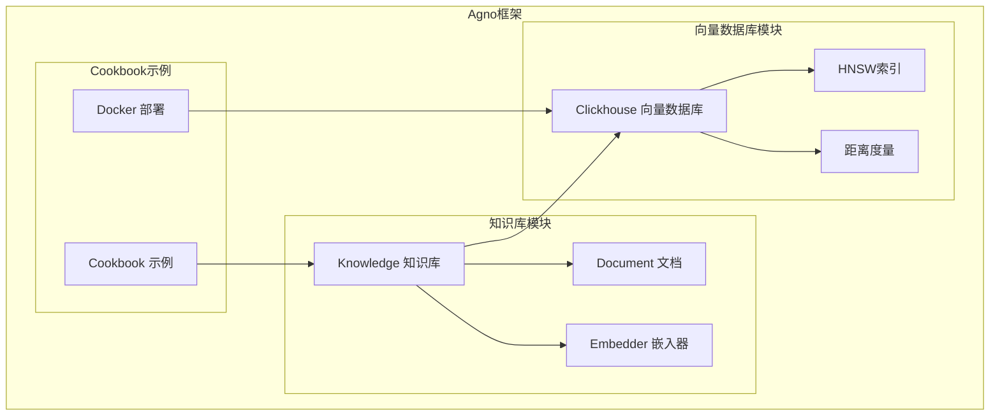
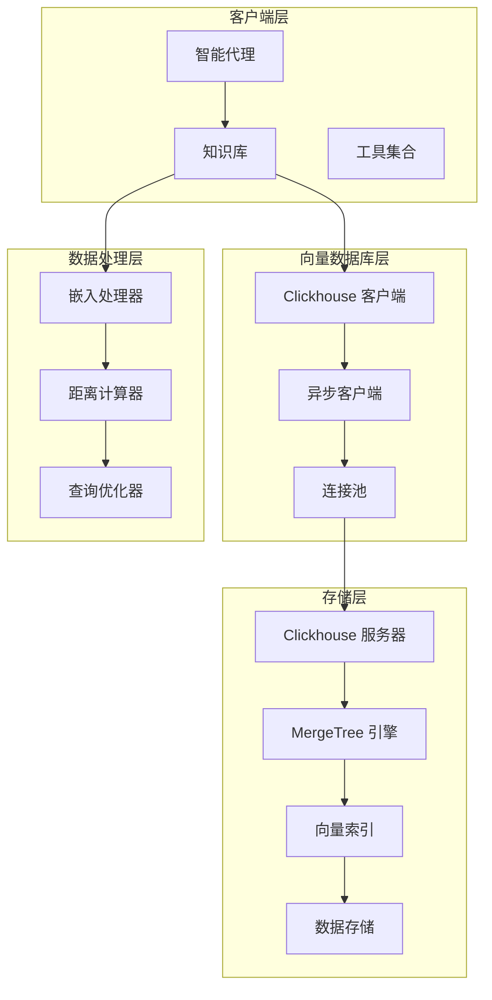
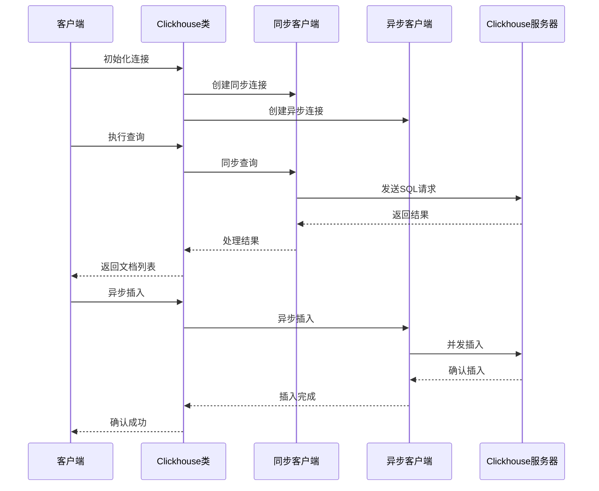
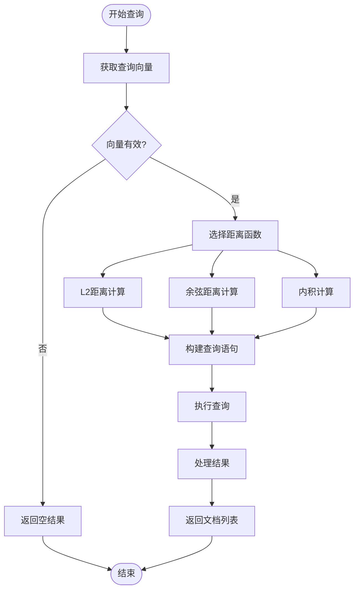

# ClickHouse向量数据库集成文档

<cite>
**本文档中引用的文件**
- [clickhousedb.py](file://libs/agno/agno/vectordb/clickhouse/clickhousedb.py)
- [index.py](file://libs/agno/agno/vectordb/clickhouse/index.py)
- [clickhouse.py](file://cookbook/knowledge/vector_db/clickhouse_db/clickhouse.py)
- [distance.py](file://libs/agno/agno/vectordb/distance.py)
- [__init__.py](file://libs/agno/agno/vectordb/clickhouse/__init__.py)
- [run_clickhouse.sh](file://cookbook/scripts/run_clickhouse.sh)
- [run_clickhouse.bat](file://cookbook/scripts/run_clickhouse.bat)
</cite>

## 目录
1. [简介](#简介)
2. [项目结构](#项目结构)
3. [核心组件](#核心组件)
4. [架构概览](#架构概览)
5. [详细组件分析](#详细组件分析)
6. [向量搜索实现](#向量搜索实现)
7. [性能优化](#性能优化)
8. [部署指南](#部署指南)
9. [故障排除指南](#故障排除指南)
10. [结论](#结论)

## 简介

ClickHouse是一个高性能的列式数据库管理系统，特别适用于分析型工作负载。在向量数据库领域，ClickHouse展现了卓越的性能优势，特别是在处理海量数据集时的向量相似性搜索能力。本文档详细介绍如何将ClickHouse作为向量数据库使用，包括其表引擎选择、向量数据存储格式、ANN函数应用以及在各种分析场景下的最佳实践。

ClickHouse的核心优势在于：
- **卓越的查询性能**：通过列式存储和向量化执行大幅提升查询速度
- **数据压缩优势**：高效的压缩算法减少存储空间需求
- **大规模数据处理**：支持PB级数据的高效处理
- **实时分析能力**：低延迟的实时数据分析
- **向量相似性计算**：内置的ANN函数支持多种距离度量

## 项目结构

ClickHouse向量数据库集成在Agno框架中的组织结构如下：



**图表来源**
- [clickhousedb.py](file://libs/agno/agno/vectordb/clickhouse/clickhousedb.py#L1-L50)
- [index.py](file://libs/agno/agno/vectordb/clickhouse/index.py#L1-L10)

**章节来源**
- [clickhousedb.py](file://libs/agno/agno/vectordb/clickhouse/clickhousedb.py#L1-L783)
- [__init__.py](file://libs/agno/agno/vectordb/clickhouse/__init__.py#L1-L8)

## 核心组件

### Clickhouse类

Clickhouse类是整个向量数据库集成的核心，继承自VectorDb基类，提供了完整的向量数据库操作接口。

```python
class Clickhouse(VectorDb):
    def __init__(
        self,
        table_name: str,
        host: str,
        username: Optional[str] = None,
        password: str = "",
        port: int = 0,
        database_name: str = "ai",
        dsn: Optional[str] = None,
        compress: str = "lz4",
        client: Optional[clickhouse_connect.driver.client.Client] = None,
        asyncclient: Optional[clickhouse_connect.driver.asyncclient.AsyncClient] = None,
        embedder: Optional[Embedder] = None,
        distance: Distance = Distance.cosine,
        index: Optional[HNSW] = HNSW(),
    ):
```

### HNSW索引配置

HNSW（Hierarchical Navigable Small World）索引是ClickHouse中用于向量相似性搜索的高效索引结构：

```python
class HNSW(BaseModel):
    quantization: Literal["f64", "f32", "f16", "bf16", "i8"] = "bf16"
    hnsw_max_connections_per_layer: int = 32
    hnsw_candidate_list_size_for_construction: int = 128
```

### 距离度量系统

支持多种距离度量方法，满足不同的向量相似性计算需求：

```python
class Distance(str, Enum):
    cosine = "cosine"
    l2 = "l2"
    max_inner_product = "max_inner_product"
```

**章节来源**
- [clickhousedb.py](file://libs/agno/agno/vectordb/clickhouse/clickhousedb.py#L20-L60)
- [index.py](file://libs/agno/agno/vectordb/clickhouse/index.py#L1-L10)
- [distance.py](file://libs/agno/agno/vectordb/distance.py#L1-L6)

## 架构概览

ClickHouse向量数据库的整体架构采用分层设计，确保高性能和可扩展性：



**图表来源**
- [clickhousedb.py](file://libs/agno/agno/vectordb/clickhouse/clickhousedb.py#L20-L60)
- [clickhousedb.py](file://libs/agno/agno/vectordb/clickhouse/clickhousedb.py#L150-L184)

## 详细组件分析

### 表引擎选择与配置

ClickHouse向量数据库使用ReplacigMergeTree作为主要表引擎，这种选择提供了以下优势：

```sql
ENGINE = ReplacingMergeTree ORDER BY id
```

**关键特性：**
- **ReplacingMergeTree**：支持重复数据的合并和去重
- **ORDER BY id**：按主键排序，优化查询性能
- **自动合并**：后台自动合并小块数据，保持查询效率

### 向量数据存储格式

向量数据采用Array(Float32)类型存储，确保高效的内存访问和计算性能：

```sql
embedding Array(Float32)
```

**存储字段说明：**
- `id`: 唯一标识符，使用MD5哈希生成
- `name`: 文档名称
- `meta_data`: JSON格式的元数据
- `filters`: JSON格式的过滤条件
- `content`: 原始内容文本
- `content_id`: 内容唯一标识
- `embedding`: 向量嵌入数组
- `usage`: 使用统计信息
- `created_at`: 创建时间戳
- `content_hash`: 内容哈希值

### 连接管理与异步支持



**图表来源**
- [clickhousedb.py](file://libs/agno/agno/vectordb/clickhouse/clickhousedb.py#L60-L80)
- [clickhousedb.py](file://libs/agno/agno/vectordb/clickhouse/clickhousedb.py#L120-L140)

**章节来源**
- [clickhousedb.py](file://libs/agno/agno/vectordb/clickhouse/clickhousedb.py#L150-L184)
- [clickhousedb.py](file://libs/agno/agno/vectordb/clickhouse/clickhousedb.py#L20-L60)

## 向量搜索实现

### ANN函数应用

ClickHouse提供了内置的向量相似性计算函数，支持多种距离度量：

```python
def search(self, query: str, limit: int = 5, filters: Optional[Dict[str, Any]] = None) -> List[Document]:
    query_embedding = self.embedder.get_embedding(query)
    if query_embedding is None:
        logger.error(f"Error getting embedding for Query: {query}")
        return []

    parameters = self._get_base_parameters()
    where_query = ""

    order_by_query = ""
    if self.distance == Distance.l2 or self.distance == Distance.max_inner_product:
        order_by_query = "ORDER BY L2Distance(embedding, {query_embedding:Array(Float32)})"
        parameters["query_embedding"] = query_embedding
    if self.distance == Distance.cosine:
        order_by_query = "ORDER BY cosineDistance(embedding, {query_embedding:Array(Float32)})"
        parameters["query_embedding"] = query_embedding
```

### 支持的距离度量

1. **L2距离（欧几里得距离）**：
   ```sql
   ORDER BY L2Distance(embedding, {query_embedding})
   ```
   适用于需要精确距离测量的场景。

2. **余弦距离**：
   ```sql
   ORDER BY cosineDistance(embedding, {query_embedding})
   ```
   适用于方向相似性比较，对向量长度不敏感。

3. **最大内积**：
   ```sql
   ORDER BY maxInnerProduct(embedding, {query_embedding})
   ```
   适用于高维向量的快速相似性搜索。

### 查询优化策略



**图表来源**
- [clickhousedb.py](file://libs/agno/agno/vectordb/clickhouse/clickhousedb.py#L395-L430)
- [clickhousedb.py](file://libs/agno/agno/vectordb/clickhouse/clickhousedb.py#L430-L470)

**章节来源**
- [clickhousedb.py](file://libs/agno/agno/vectordb/clickhouse/clickhousedb.py#L395-L470)
- [clickhousedb.py](file://libs/agno/agno/vectordb/clickhouse/clickhousedb.py#L470-L520)

## 性能优化

### 数据压缩配置

ClickHouse默认使用LZ4压缩算法，显著减少存储空间：

```python
compress: str = "lz4"
```

**压缩优势：**
- **高压缩比**：相比原始数据减少70-90%存储空间
- **快速解压**：LZ4提供极快的解压缩速度
- **CPU友好**：压缩和解压缩开销低

### 异步操作支持

```python
async def _ensure_async_client(self):
    """确保我们有一个初始化的异步客户端。"""
    if self.async_client is None:
        self.async_client = await clickhouse_connect.get_async_client(
            host=self.host,
            password=self.password,
            database=self.database_name,
            port=self.port,
            dsn=self.dsn,
            compress=self.compress,
            settings={"allow_experimental_vector_similarity_index": 1},
        )
    return self.async_client
```

### 向量索引优化

HNSW索引参数调优：

```python
quantization: "bf16"  # 半精度浮点数，平衡精度和性能
hnsw_max_connections_per_layer: 32  # 每层最大连接数
hnsw_candidate_list_size_for_construction: 128  # 构建候选列表大小
```

**优化建议：**
- 根据向量维度调整`hnsw_max_connections_per_layer`
- 使用`bf16`量化减少内存占用
- 适当增加候选列表大小提升召回率

**章节来源**
- [clickhousedb.py](file://libs/agno/agno/vectordb/clickhouse/clickhousedb.py#L60-L80)
- [index.py](file://libs/agno/agno/vectordb/clickhouse/index.py#L1-L10)

## 部署指南

### Docker部署

推荐使用Docker容器化部署ClickHouse：

```bash
docker run -d \
  -e CLICKHOUSE_DB=ai \
  -e CLICKHOUSE_USER=ai \
  -e CLICKHOUSE_PASSWORD=ai \
  -e CLICKHOUSE_DEFAULT_ACCESS_MANAGEMENT=1 \
  -v clickhouse_data:/var/lib/clickhouse/ \
  -v clickhouse_log:/var/log/clickhouse-server/ \
  -p 8123:8123 \
  -p 9000:9000 \
  --ulimit nofile=262144:262144 \
  --name clickhouse-server \
  clickhouse/clickhouse-server
```

### 环境变量配置

- `CLICKHOUSE_DB`: 默认数据库名（ai）
- `CLICKHOUSE_USER`: 默认用户名（ai）
- `CLICKHOUSE_PASSWORD`: 默认密码（ai）
- `CLICKHOUSE_DEFAULT_ACCESS_MANAGEMENT`: 启用访问管理
- `nofile`: 文件描述符限制设置

### Python依赖安装

```bash
pip install clickhouse-connect
```

**章节来源**
- [run_clickhouse.sh](file://cookbook/scripts/run_clickhouse.sh#L1-L11)
- [run_clickhouse.bat](file://cookbook/scripts/run_clickhouse.bat#L1-L11)

## 故障排除指南

### 常见问题及解决方案

1. **连接失败**
   - 检查主机名和端口配置
   - 验证网络连通性
   - 确认防火墙设置

2. **权限错误**
   - 验证用户名和密码
   - 检查数据库访问权限
   - 确认用户角色配置

3. **索引创建失败**
   - 启用实验性功能：`SET allow_experimental_vector_similarity_index = 1`
   - 检查向量维度匹配
   - 验证索引参数配置

4. **查询超时**
   - 调整查询超时设置
   - 优化索引参数
   - 增加服务器资源

### 性能监控

```python
def get_count(self) -> int:
    parameters = self._get_base_parameters()
    result = self.client.query(
        "SELECT count(*) FROM {database_name:Identifier}.{table_name:Identifier}",
        parameters=parameters,
    )
    if result.first_row:
        return int(result.first_row[0])
    return 0
```

### 日志记录

系统提供详细的日志记录功能：

```python
log_debug(f"Checking if table exists: {self.table_name}")
logger.error(f"Error getting embedding for Query: {query}")
```

**章节来源**
- [clickhousedb.py](file://libs/agno/agno/vectordb/clickhouse/clickhousedb.py#L542-L550)
- [clickhousedb.py](file://libs/agno/agno/vectordb/clickhouse/clickhousedb.py#L395-L400)

## 结论

ClickHouse作为向量数据库展现了强大的分析型向量搜索能力，特别适合处理大规模数据集和实时分析场景。通过合理的配置和优化，可以实现高性能的向量相似性搜索，为各种AI应用场景提供强有力的数据支撑。

**主要优势：**
- **高性能查询**：列式存储和向量化执行
- **大规模处理**：支持PB级数据的高效处理
- **灵活配置**：丰富的索引和压缩选项
- **易于部署**：Docker化部署简化运维
- **完整生态**：丰富的工具和社区支持

**适用场景：**
- 用户行为分析和推荐系统
- 日志分析和异常检测
- 多媒体内容检索
- 实时推荐和搜索
- 大规模知识图谱查询

通过本文档的指导，开发者可以充分利用ClickHouse的向量数据库能力，构建高效、可扩展的AI应用系统。