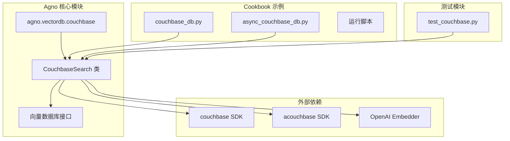
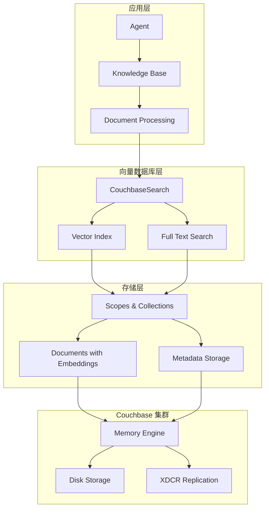
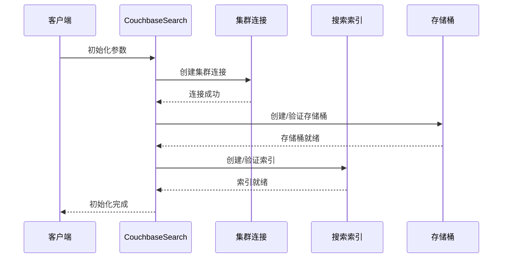
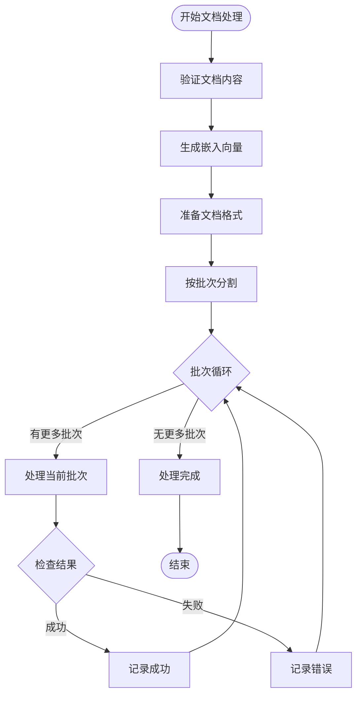
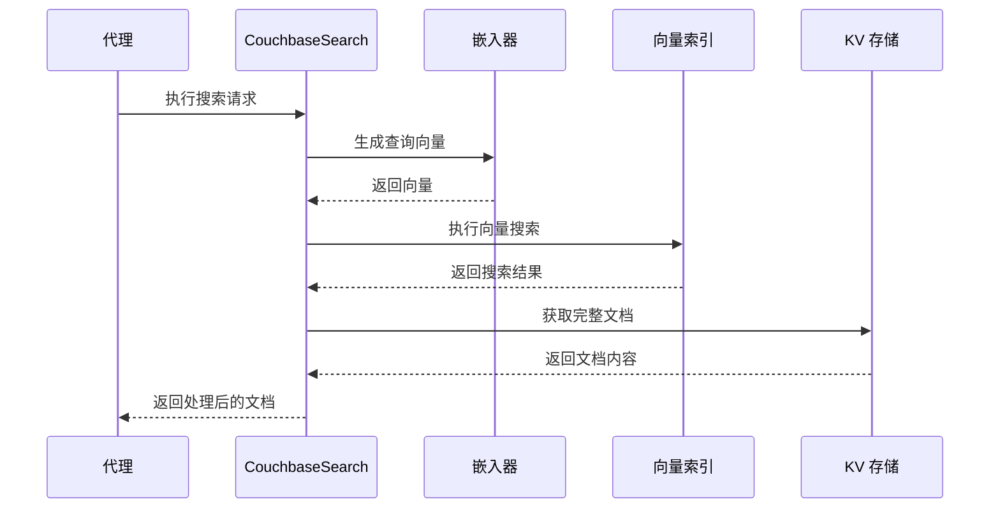
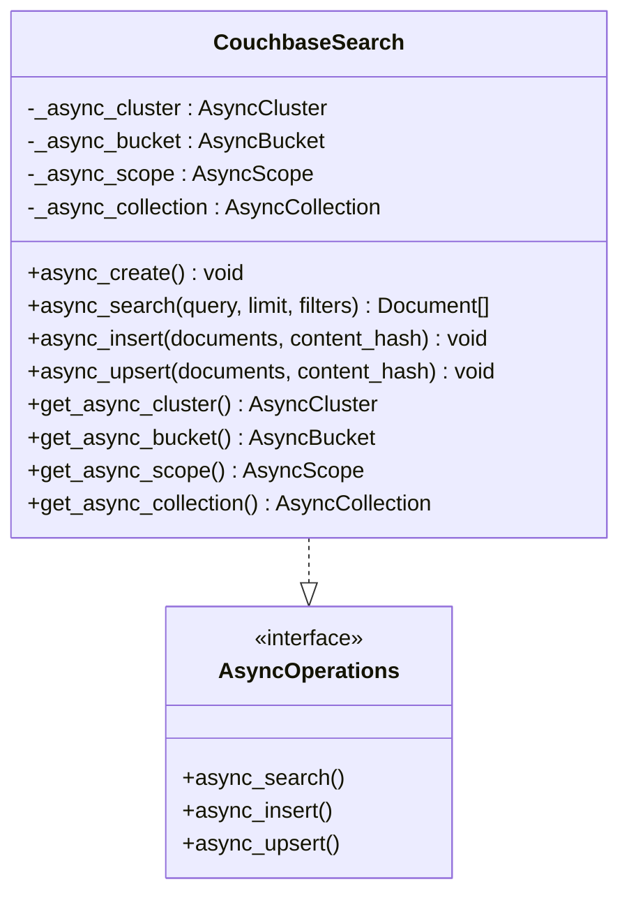
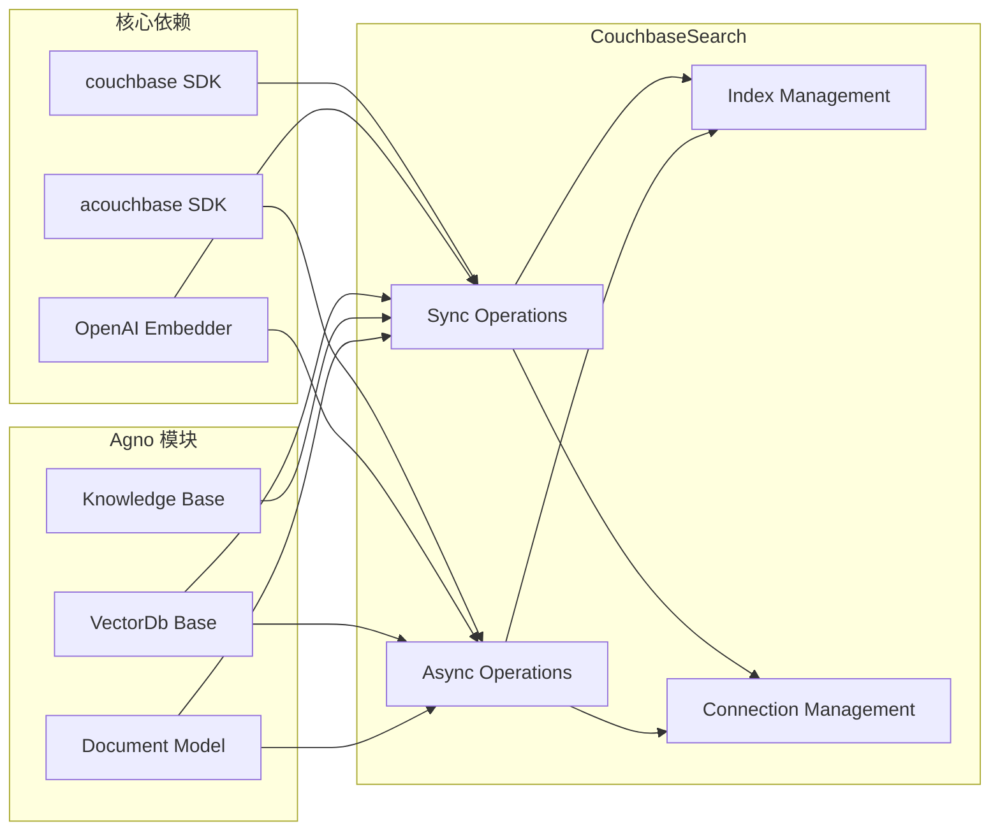

# Couchbase 向量数据库集成文档

<cite>
**本文档引用的文件**
- [couchbase.py](file://libs/agno/agno/vectordb/couchbase/couchbase.py)
- [couchbase_db.py](file://cookbook/knowledge/vector_db/couchbase_db/couchbase_db.py)
- [async_couchbase_db.py](file://cookbook/knowledge/vector_db/couchbase_db/async_couchbase_db.py)
- [run_couchbase.sh](file://cookbook/scripts/run_couchbase.sh)
- [test_couchbase.py](file://libs/agno/tests/unit/vectordb/test_couchbase.py)
- [README.md](file://cookbook/knowledge/README.md)
</cite>

## 目录
1. [简介](#简介)
2. [项目结构](#项目结构)
3. [核心组件](#核心组件)
4. [架构概览](#架构概览)
5. [详细组件分析](#详细组件分析)
6. [依赖关系分析](#依赖关系分析)
7. [性能考虑](#性能考虑)
8. [故障排除指南](#故障排除指南)
9. [结论](#结论)

## 简介

Couchbase 是一个高性能的分布式 NoSQL 数据库，具有强大的向量搜索功能。本文档详细介绍了如何在 Agno 框架中集成和使用 Couchbase 的向量搜索功能，包括集群设置、存储桶配置、索引创建以及通过 N1QL 查询语言执行复杂的向量搜索和文档查询操作。

Couchbase 的内存优先架构使其成为需要高读写性能和灵活数据模型应用的理想选择。它支持跨数据中心复制（XDCR），提供了强大的数据一致性和可用性保证。

## 项目结构

Couchbase 集成在 Agno 项目中的组织结构如下：

**图表来源**
- [couchbase.py](file://libs/agno/agno/vectordb/couchbase/couchbase.py#L1-L50)
- [couchbase_db.py](file://cookbook/knowledge/vector_db/couchbase_db/couchbase_db.py#L1-L30)

**章节来源**
- [couchbase.py](file://libs/agno/agno/vectordb/couchbase/couchbase.py#L1-L100)
- [README.md](file://cookbook/knowledge/README.md#L1-L50)

## 核心组件

### CouchbaseSearch 类

CouchbaseSearch 是 Couchbase 向量数据库的核心实现类，继承自 VectorDb 基类。该类提供了完整的向量搜索功能，包括同步和异步操作。

主要特性：
- 支持同步和异步操作
- 内置向量搜索和全文搜索
- 自动索引管理和优化
- 批量文档插入和更新
- 支持过滤器和元数据

### 连接管理

系统支持两种连接模式：
1. **同步连接**：使用标准的 Couchbase SDK
2. **异步连接**：使用 acouchbase SDK 提供异步操作

**章节来源**
- [couchbase.py](file://libs/agno/agno/vectordb/couchbase/couchbase.py#L44-L120)
- [couchbase.py](file://libs/agno/agno/vectordb/couchbase/couchbase.py#L800-L900)

## 架构概览

Couchbase 向量数据库集成采用分层架构设计：

**图表来源**
- [couchbase.py](file://libs/agno/agno/vectordb/couchbase/couchbase.py#L44-L80)
- [couchbase_db.py](file://cookbook/knowledge/vector_db/couchbase_db/couchbase_db.py#L50-L120)

## 详细组件分析

### 初始化和配置

CouchbaseSearch 的初始化过程包括多个关键步骤：

**图表来源**
- [couchbase.py](file://libs/agno/agno/vectordb/couchbase/couchbase.py#L120-L180)
- [couchbase.py](file://libs/agno/agno/vectordb/couchbase/couchbase.py#L200-L250)

### 文档处理流程

文档插入和更新采用批量处理机制：

**图表来源**
- [couchbase.py](file://libs/agno/agno/vectordb/couchbase/couchbase.py#L300-L400)
- [couchbase.py](file://libs/agno/agno/vectordb/couchbase/couchbase.py#L450-L550)

### 向量搜索实现

向量搜索是 Couchbase 集成的核心功能：

**图表来源**
- [couchbase.py](file://libs/agno/agno/vectordb/couchbase/couchbase.py#L448-L490)
- [couchbase.py](file://libs/agno/agno/vectordb/couchbase/couchbase.py#L990-L1030)

**章节来源**
- [couchbase.py](file://libs/agno/agno/vectordb/couchbase/couchbase.py#L448-L550)
- [couchbase.py](file://libs/agno/agno/vectordb/couchbase/couchbase.py#L990-L1050)

### 异步操作支持

CouchbaseSearch 提供完整的异步操作支持：

**图表来源**
- [couchbase.py](file://libs/agno/agno/vectordb/couchbase/couchbase.py#L800-L900)
- [couchbase.py](file://libs/agno/agno/vectordb/couchbase/couchbase.py#L1000-L1100)

**章节来源**
- [couchbase.py](file://libs/agno/agno/vectordb/couchbase/couchbase.py#L800-L1100)
- [async_couchbase_db.py](file://cookbook/knowledge/vector_db/couchbase_db/async_couchbase_db.py#L50-L150)

## 依赖关系分析

Couchbase 集成的依赖关系图展示了各组件之间的相互依赖：

**图表来源**
- [couchbase.py](file://libs/agno/agno/vectordb/couchbase/couchbase.py#L1-L40)
- [couchbase.py](file://libs/agno/agno/vectordb/couchbase/couchbase.py#L44-L70)

**章节来源**
- [couchbase.py](file://libs/agno/agno/vectordb/couchbase/couchbase.py#L1-L70)
- [test_couchbase.py](file://libs/agno/tests/unit/vectordb/test_couchbase.py#L1-L50)

## 性能考虑

### 内存优先架构

Couchbase 的内存优先架构提供了以下性能优势：
- **高速读写**：数据优先存储在内存中
- **低延迟**：减少磁盘 I/O 操作
- **可扩展性**：支持水平和垂直扩展

### 批处理优化

系统采用批处理机制优化性能：
- **批量插入**：默认批次大小为 500
- **并行处理**：支持并发文档处理
- **错误恢复**：部分失败时的优雅降级

### 索引优化

向量索引配置优化：
- **相似度计算**：使用点积相似度
- **索引分区**：支持多分区配置
- **副本管理**：可配置副本数量

## 故障排除指南

### 常见问题和解决方案

1. **连接失败**
   - 检查连接字符串格式
   - 验证认证凭据
   - 确认网络连通性

2. **索引创建失败**
   - 检查存储桶权限
   - 验证索引定义语法
   - 确认集群状态

3. **向量搜索超时**
   - 增加等待时间
   - 检查索引状态
   - 优化查询参数

**章节来源**
- [couchbase.py](file://libs/agno/agno/vectordb/couchbase/couchbase.py#L120-L200)
- [test_couchbase.py](file://libs/agno/tests/unit/vectordb/test_couchbase.py#L296-L350)

## 结论

Couchbase 向量数据库集成为 Agno 框架提供了强大的向量搜索能力。通过其内存优先架构、跨数据中心复制和灵活的数据模型，Couchbase 成为构建高性能知识库和智能代理系统的理想选择。

主要优势：
- **高性能**：内存优先架构提供低延迟访问
- **可扩展性**：支持大规模部署和动态扩展
- **灵活性**：支持多种数据类型和查询模式
- **可靠性**：内置数据一致性和高可用性保障

建议在生产环境中使用 Couchbase Capella 云服务，以获得更好的运维体验和企业级支持。