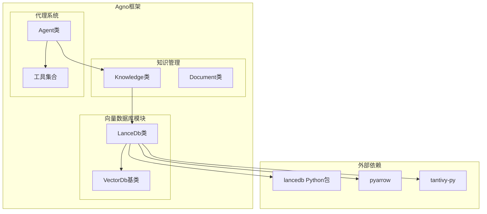
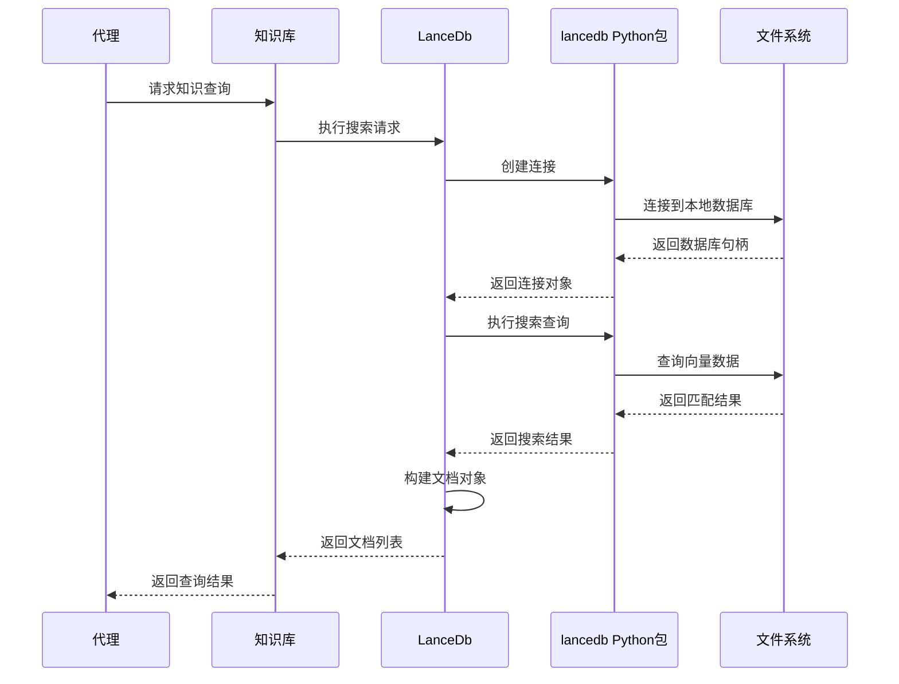
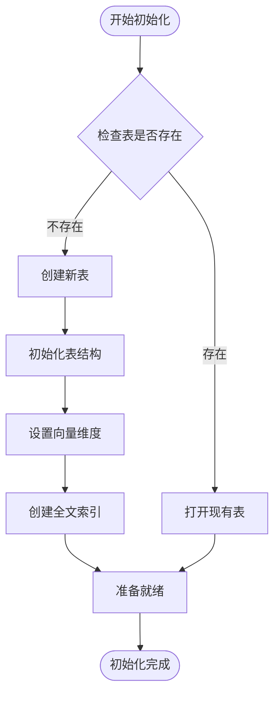
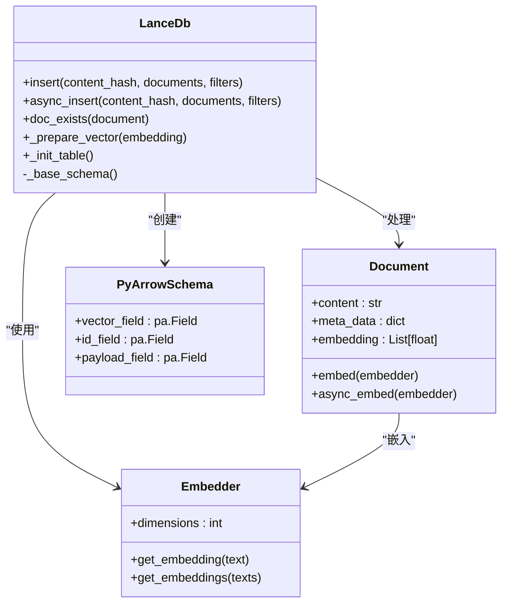
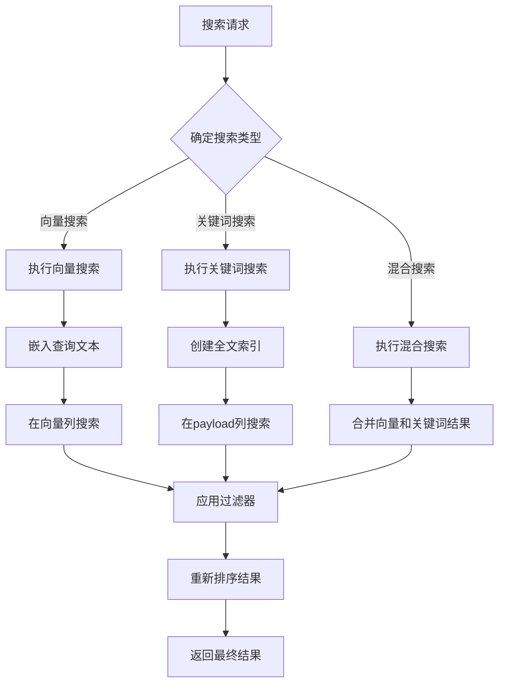
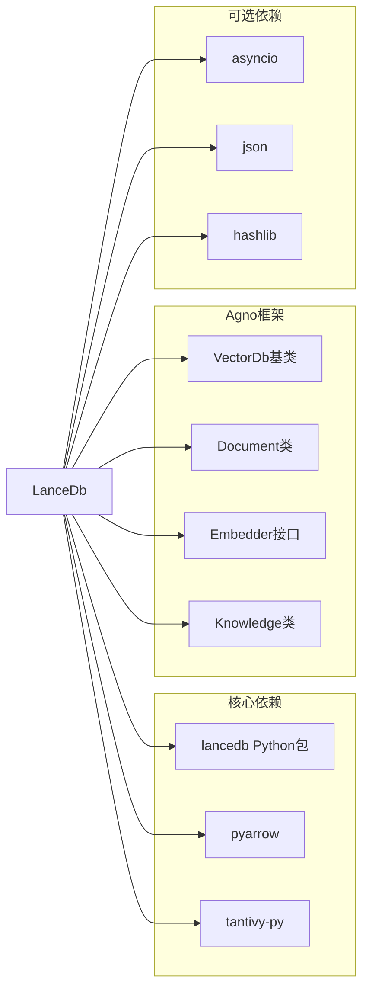

# LanceDB 向量数据库集成文档

<cite>
**本文档中引用的文件**
- [lance_db.py](file://libs/agno/agno/vectordb/lancedb/lance_db.py)
- [test_lancedb.py](file://libs/agno/tests/integration/vector_dbs/test_lancedb.py)
- [test_lancedb.py](file://libs/agno/tests/unit/vectordb/test_lancedb.py)
- [agentic_rag_lancedb.py](file://cookbook/agents/rag/agentic_rag_lancedb.py)
- [traditional_rag_lancedb.py](file://cookbook/agents/rag/traditional_rag_lancedb.py)
- [rag_with_lance_db_and_sqlite.py](file://cookbook/agents/rag/rag_with_lance_db_and_sqlite.py)
- [remote_lance_db.py](file://cookbook/knowledge/vector_db/singlestore_db/lance_db/remote_lance_db.py)
- [chroma_db.py](file://cookbook/knowledge/vector_db/chroma_db/chroma_db.py)
- [sqlite_for_agent.py](file://cookbook/db/sqllite/sqlite_for_agent.py)
</cite>

## 目录
1. [简介](#简介)
2. [项目结构](#项目结构)
3. [核心组件](#核心组件)
4. [架构概览](#架构概览)
5. [详细组件分析](#详细组件分析)
6. [依赖关系分析](#依赖关系分析)
7. [性能考虑](#性能考虑)
8. [故障排除指南](#故障排除指南)
9. [结论](#结论)

## 简介

LanceDB是一个开源、嵌入式的向量数据库，专为现代AI应用设计。它提供了轻量级、高性能的向量存储和检索功能，支持多种搜索类型，包括向量搜索、关键词搜索和混合搜索。LanceDB采用Apache Arrow格式存储数据，具有出色的内存效率和查询性能。

LanceDB的主要特性包括：
- **嵌入式设计**：无需外部服务，直接在本地文件系统中存储数据
- **多搜索类型**：支持向量搜索、关键词搜索和混合搜索
- **异步支持**：完整的异步操作支持
- **Tantivy集成**：原生支持全文搜索
- **SQL查询**：支持SQL风格的查询接口
- **边缘友好**：适合资源受限环境

## 项目结构

LanceDB集成在Agno框架中的组织结构如下：



**图表来源**
- [lance_db.py](file://libs/agno/agno/vectordb/lancedb/lance_db.py#L1-L50)
- [__init__.py](file://libs/agno/agno/vectordb/lancedb/__init__.py#L1-L5)

**章节来源**
- [lance_db.py](file://libs/agno/agno/vectordb/lancedb/lance_db.py#L1-L100)

## 核心组件

### LanceDb类

LanceDb是Agno框架中LanceDB向量数据库的实现类，继承自VectorDb基类。它提供了完整的向量数据库操作功能，包括表创建、数据插入、向量搜索等。

```python
class LanceDb(VectorDb):
    """
    LanceDb类用于管理与LanceDb的向量操作

    参数:
        uri: LanceDB数据库的URI
        connection: 要使用的LanceDB连接
        table: 要使用的LanceDB表实例
        async_connection: 要使用的LanceDB异步连接
        async_table: 要使用的LanceDB异步表实例
        table_name: 要使用的LanceDB表名
        api_key: 用于LanceDB连接的API密钥
        embedder: 在嵌入文档内容时使用的嵌入器
        search_type: 搜索文档时使用的搜索类型
        distance: 搜索文档时使用的距离度量
        nprobes: 搜索文档时使用的探测数
        reranker: 重新排序文档时使用的重排序器
        use_tantivy: 是否使用Tantivy进行全文搜索
        on_bad_vectors: 如果向量无效该如何处理
        fill_value: 如果on_bad_vectors为"fill"时要填充的值
    """
```

### 主要属性和方法

LanceDb类的核心属性包括：

- **uri**: 数据库URI，指定LanceDB的存储位置
- **table_name**: 表名，用于标识特定的数据表
- **embedder**: 嵌入器，负责将文本转换为向量
- **search_type**: 搜索类型（向量、关键词、混合）
- **distance**: 距离度量（余弦、欧几里得等）

**章节来源**
- [lance_db.py](file://libs/agno/agno/vectordb/lancedb/lance_db.py#L21-L41)

## 架构概览

LanceDB在Agno框架中的架构设计体现了现代向量数据库的最佳实践：



**图表来源**
- [lance_db.py](file://libs/agno/agno/vectordb/lancedb/lance_db.py#L100-L150)
- [agentic_rag_lancedb.py](file://cookbook/agents/rag/agentic_rag_lancedb.py#L10-L30)

## 详细组件分析

### 表创建和初始化

LanceDb支持同步和异步两种表创建方式：



**图表来源**
- [lance_db.py](file://libs/agno/agno/vectordb/lancedb/lance_db.py#L100-L130)

### 数据插入流程

LanceDb支持批量数据插入，并提供多种错误处理机制：



**图表来源**
- [lance_db.py](file://libs/agno/agno/vectordb/lancedb/lance_db.py#L200-L300)
- [test_lancedb.py](file://libs/agno/tests/integration/vector_dbs/test_lancedb.py#L40-L80)

### 搜索功能

LanceDb支持三种主要的搜索类型：

1. **向量搜索**：基于语义相似性的搜索
2. **关键词搜索**：基于全文索引的搜索
3. **混合搜索**：结合向量和关键词搜索



**图表来源**
- [lance_db.py](file://libs/agno/agno/vectordb/lancedb/lance_db.py#L400-L500)

**章节来源**
- [lance_db.py](file://libs/agno/agno/vectordb/lancedb/lance_db.py#L300-L600)

### 异步操作支持

LanceDb提供了完整的异步操作支持，包括：

- 异步表创建和删除
- 异步数据插入
- 异步搜索查询
- 异步计数操作

```python
# 异步操作示例
vector_db = LanceDb(
    table_name="async_test",
    uri="tmp/lancedb_async",
    embedder=MockEmbedder(),
)

await vector_db.async_create()
await vector_db.async_insert("1234", test_docs)
results = await vector_db.async_search("test query", limit=10)
```

**章节来源**
- [test_lancedb.py](file://libs/agno/tests/integration/vector_dbs/test_lancedb.py#L100-L150)

## 依赖关系分析

LanceDb的依赖关系体现了其轻量级和模块化的设计理念：



**图表来源**
- [lance_db.py](file://libs/agno/agno/vectordb/lancedb/lance_db.py#L1-L20)

**章节来源**
- [lance_db.py](file://libs/agno/agno/vectordb/lancedb/lance_db.py#L1-L30)

## 性能考虑

### 内存优化

LanceDB采用Apache Arrow格式存储数据，这种列式存储格式具有以下优势：

- **零拷贝访问**：直接从磁盘读取数据，无需额外的内存分配
- **压缩存储**：支持高效的压缩算法减少存储空间
- **向量化操作**：支持SIMD指令集加速向量计算

### 查询性能

LanceDB的查询性能优化包括：

- **索引优化**：支持向量索引和全文索引
- **并行处理**：充分利用多核CPU进行并行计算
- **缓存策略**：智能缓存频繁访问的数据

### 存储效率

- **本地文件存储**：避免网络延迟和带宽限制
- **增量更新**：支持高效的数据增量更新
- **垃圾回收**：自动清理过期数据

## 故障排除指南

### 常见问题和解决方案

1. **导入错误**
   ```python
   # 错误：ImportError: `lancedb` not installed
   # 解决方案：安装lancedb包
   pip install lancedb
   ```

2. **Tantivy依赖**
   ```python
   # 错误：ImportError: Please install tantivy-py
   # 解决方案：安装tantivy-py包
   pip install tantivy
   ```

3. **向量维度不匹配**
   ```python
   # 错误：Vector dimension mismatch
   # 解决方案：确保嵌入器输出的向量维度与表定义一致
   ```

4. **表不存在**
   ```python
   # 错误：Table not initialized
   # 解决方案：先调用create()方法创建表
   vector_db.create()
   ```

**章节来源**
- [lance_db.py](file://libs/agno/agno/vectordb/lancedb/lance_db.py#L120-L140)

## 实际应用场景

### 传统RAG（检索增强生成）

```python
from agno.agent import Agent
from agno.knowledge.embedder.openai import OpenAIEmbedder
from agno.knowledge.knowledge import Knowledge
from agno.models.openai import OpenAIChat
from agno.vectordb.lancedb import LanceDb, SearchType

# 配置LanceDB向量数据库
vector_db = LanceDb(
    table_name="recipes",
    uri="tmp/lancedb",
    search_type=SearchType.vector,
    embedder=OpenAIEmbedder(id="text-embedding-3-small"),
)

# 创建知识库
knowledge = Knowledge(vector_db=vector_db)
knowledge.add_content(url="https://example.com/recipes.pdf")

# 创建代理
agent = Agent(
    model=OpenAIChat(id="gpt-4o"),
    knowledge=knowledge,
    add_knowledge_to_context=True,
    search_knowledge=False,
    markdown=True,
)

agent.print_response("如何制作泰式椰奶鸡汤？")
```

### 智能RAG（基于代理的RAG）

```python
from agno.agent import Agent
from agno.knowledge.embedder.openai import OpenAIEmbedder
from agno.knowledge.knowledge import Knowledge
from agno.models.openai import OpenAIChat
from agno.vectordb.lancedb import LanceDb, SearchType

# 配置LanceDB向量数据库
knowledge = Knowledge(
    vector_db=LanceDb(
        table_name="recipes",
        uri="tmp/lancedb",
        search_type=SearchType.vector,
        embedder=OpenAIEmbedder(id="text-embedding-3-small"),
    ),
)

# 添加内容到知识库
knowledge.add_content(url="https://example.com/recipes.pdf")

# 创建支持搜索的代理
agent = Agent(
    model=OpenAIChat(id="gpt-4o"),
    knowledge=knowledge,
    search_knowledge=True,
    markdown=True,
)

agent.print_response("如何制作泰式椰奶鸡汤？", stream=True)
```

### SQLite和LanceDB结合使用

```python
from agno.agent import Agent
from agno.db.sqlite.sqlite import SqliteDb
from agno.knowledge.embedder.ollama import OllamaEmbedder
from agno.knowledge.knowledge import Knowledge
from agno.models.ollama import Ollama
from agno.vectordb.lancedb import LanceDb

# 配置Ollama嵌入器
embedder = OllamaEmbedder(id="nomic-embed-text", dimensions=768)

# 创建LanceDB向量数据库
vector_db = LanceDb(
    table_name="recipes",
    uri="/tmp/lancedb",
    embedder=embedder,
)

# 创建知识库
knowledge = Knowledge(vector_db=vector_db)
knowledge.add_content(url="https://example.com/recipes.pdf")

# 设置SQLite存储
db = SqliteDb(db_file="data.db")

# 初始化代理
agent = Agent(
    session_id="session_id",
    user_id="user",
    model=Ollama(id="llama3.1:8b"),
    knowledge=knowledge,
    db=db,
)

agent.print_response("从知识库中提取制作泰式椰奶鸡汤的第一步是什么？", markdown=True)
```

**章节来源**
- [agentic_rag_lancedb.py](file://cookbook/agents/rag/agentic_rag_lancedb.py#L1-L37)
- [traditional_rag_lancedb.py](file://cookbook/agents/rag/traditional_rag_lancedb.py#L1-L39)
- [rag_with_lance_db_and_sqlite.py](file://cookbook/agents/rag/rag_with_lance_db_and_sqlite.py#L1-L52)

## 结论

LanceDB作为一个开源、嵌入式的向量数据库，在Agno框架中展现了出色的性能和易用性。其主要优势包括：

1. **轻量级设计**：无需外部服务，直接在本地存储数据
2. **高性能搜索**：支持多种搜索类型和优化的查询引擎
3. **异步支持**：完整的异步操作支持，适合高并发场景
4. **灵活配置**：支持多种嵌入器和搜索策略
5. **易于集成**：与Agno框架无缝集成，开箱即用

LanceDB特别适合以下场景：
- 边缘计算和资源受限环境
- 需要本地数据控制的应用
- 快速原型开发和测试
- 小规模到中等规模的数据集

通过本文档的详细介绍，开发者可以充分利用LanceDB的强大功能，构建高效、可靠的AI应用程序。