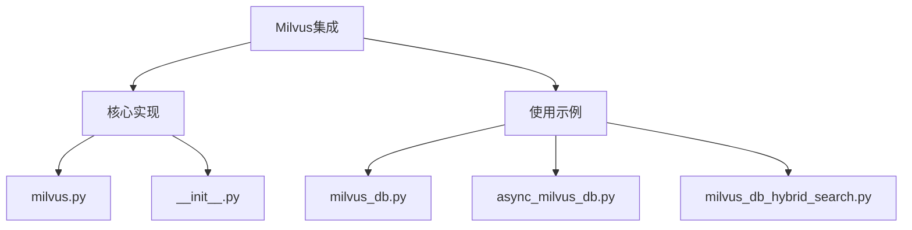
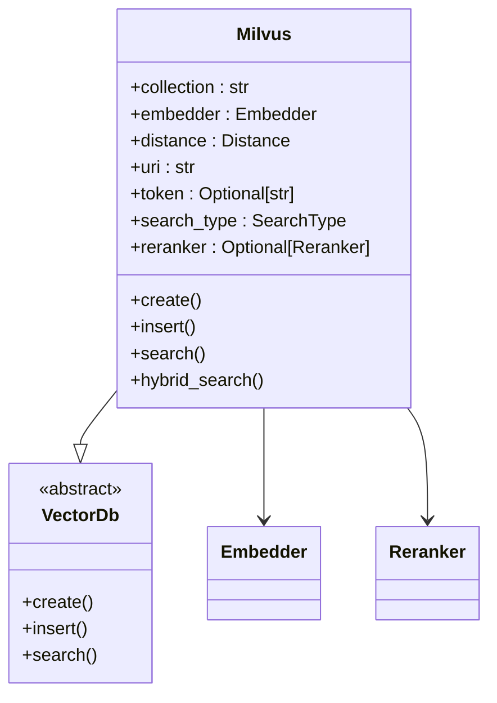
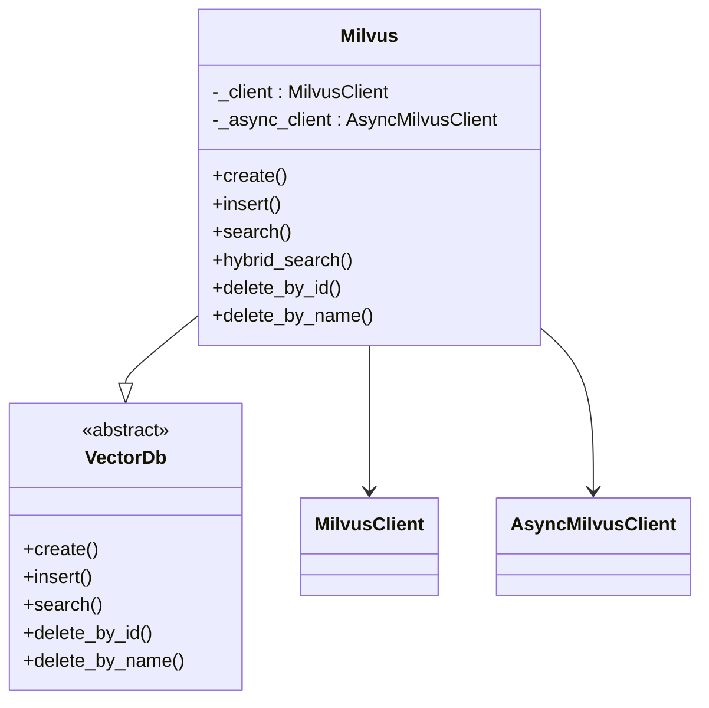
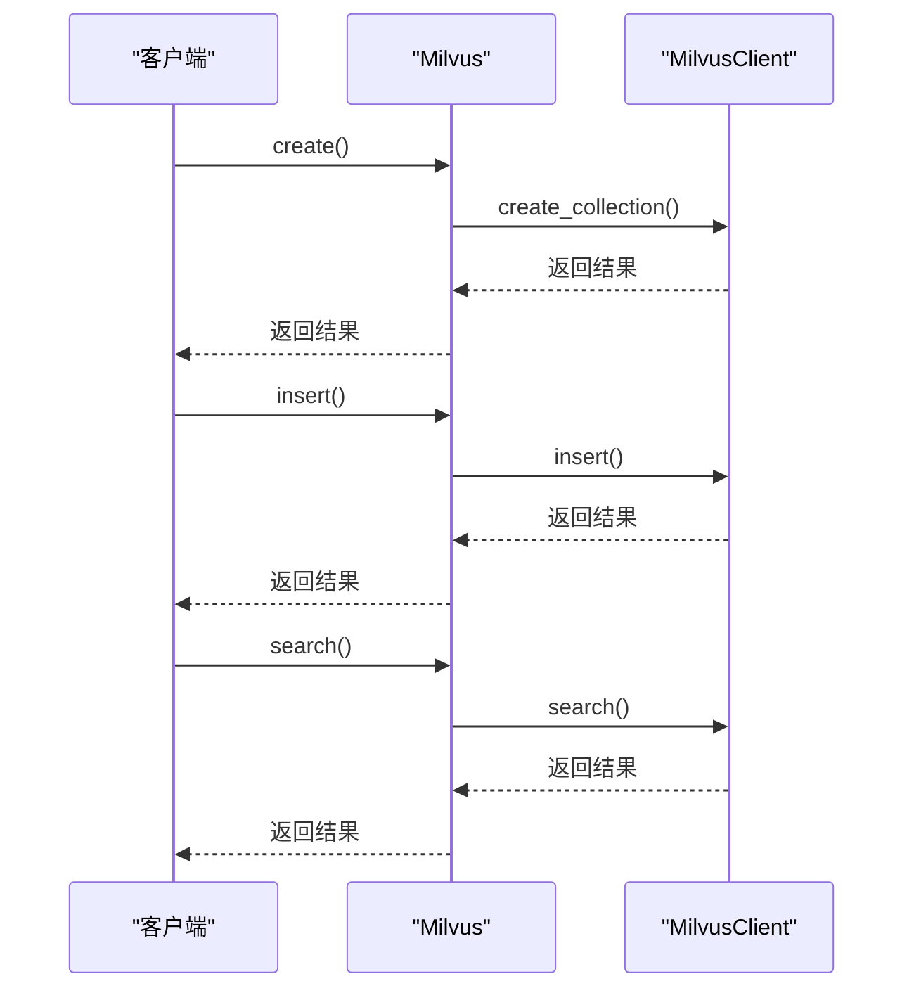
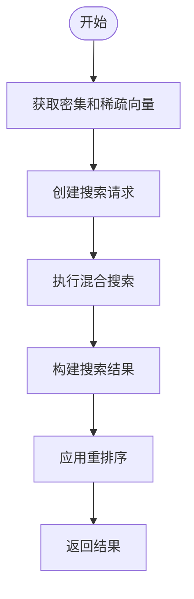
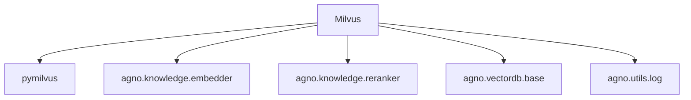

# Milvus

<cite>
**本文档中引用的文件**   
- [milvus.py](file://libs/agno/agno/vectordb/milvus/milvus.py)
- [milvus_db.py](file://cookbook/knowledge/vector_db/milvus_db/milvus_db.py)
- [async_milvus_db.py](file://cookbook/knowledge/vector_db/milvus_db/async_milvus_db.py)
- [milvus_db_hybrid_search.py](file://cookbook/knowledge/vector_db/milvus_db/milvus_db_hybrid_search.py)
- [filtering_milvus.py](file://cookbook/knowledge/filters/vector_dbs/filtering_milvus.py)
- [test_milvusdb.py](file://libs/agno/tests/unit/vectordb/test_milvusdb.py)
- [base.py](file://libs/agno/agno/vectordb/base.py)
- [search.py](file://libs/agno/agno/vectordb/search.py)
</cite>

## 目录
1. [简介](#简介)
2. [项目结构](#项目结构)
3. [核心组件](#核心组件)
4. [架构概述](#架构概述)
5. [详细组件分析](#详细组件分析)
6. [依赖分析](#依赖分析)
7. [性能考虑](#性能考虑)
8. [故障排除指南](#故障排除指南)
9. [结论](#结论)

## 简介
Milvus是一个开源的向量数据库，专为大规模向量搜索场景设计。在Agno框架中，Milvus被用作向量数据库后端，支持高效的向量相似性搜索。本文档深入介绍了Milvus在Agno中的集成，涵盖了核心概念、配置方法、索引创建、向量查询执行以及参数调优等内容。

## 项目结构
Agno项目中的Milvus集成主要位于`libs/agno/agno/vectordb/milvus`目录下。该目录包含Milvus的实现文件和初始化文件。此外，在`cookbook/knowledge/vector_db/milvus_db`目录下提供了多个使用示例，展示了如何在不同场景下使用Milvus。

**Diagram sources**
- [milvus.py](file://libs/agno/agno/vectordb/milvus/milvus.py)
- [milvus_db.py](file://cookbook/knowledge/vector_db/milvus_db/milvus_db.py)

**Section sources**
- [milvus.py](file://libs/agno/agno/vectordb/milvus/milvus.py)
- [milvus_db.py](file://cookbook/knowledge/vector_db/milvus_db/milvus_db.py)

## 核心组件
Milvus集成的核心组件包括`Milvus`类和`SearchType`枚举。`Milvus`类实现了向量数据库的基本操作，如创建集合、插入数据、搜索等。`SearchType`枚举定义了支持的搜索类型，包括向量搜索、关键词搜索和混合搜索。

**Section sources**
- [milvus.py](file://libs/agno/agno/vectordb/milvus/milvus.py)
- [search.py](file://libs/agno/agno/vectordb/search.py)

## 架构概述
Milvus在Agno中的架构遵循典型的向量数据库模式。它使用集合（Collection）来组织数据，每个集合可以包含多个分区（Partition）。索引类型如IVF和HNSW用于加速向量搜索。Milvus支持分布式架构，并可通过Zilliz Cloud进行托管。

**Diagram sources**
- [milvus.py](file://libs/agno/agno/vectordb/milvus/milvus.py)
- [base.py](file://libs/agno/agno/vectordb/base.py)

## 详细组件分析

### Milvus类分析
`Milvus`类是Milvus集成的核心，实现了向量数据库的所有基本操作。它继承自`VectorDb`抽象基类，并提供了具体的实现。

#### 对象导向组件

**Diagram sources**
- [milvus.py](file://libs/agno/agno/vectordb/milvus/milvus.py)
- [base.py](file://libs/agno/agno/vectordb/base.py)

#### API/服务组件

**Diagram sources**
- [milvus.py](file://libs/agno/agno/vectordb/milvus/milvus.py)

**Section sources**
- [milvus.py](file://libs/agno/agno/vectordb/milvus/milvus.py)

### 混合搜索分析
混合搜索结合了密集向量和稀疏向量的相似性搜索，提供了更准确的搜索结果。

#### 复杂逻辑组件

**Diagram sources**
- [milvus.py](file://libs/agno/agno/vectordb/milvus/milvus.py)

**Section sources**
- [milvus.py](file://libs/agno/agno/vectordb/milvus/milvus.py)

## 依赖分析
Milvus集成依赖于多个外部库和内部模块。主要依赖包括`pymilvus`库用于与Milvus服务器通信，`agno.knowledge.embedder`用于生成向量嵌入，以及`agno.vectordb.base`作为基类。

**Diagram sources**
- [milvus.py](file://libs/agno/agno/vectordb/milvus/milvus.py)

**Section sources**
- [milvus.py](file://libs/agno/agno/vectordb/milvus/milvus.py)

## 性能考虑
Milvus的性能受多个参数影响，包括`nlist`和`nprobe`。`nlist`参数控制IVF索引的聚类数量，而`nprobe`参数控制搜索时检查的聚类数量。通过调整这些参数，可以在搜索精度和速度之间取得平衡。

## 故障排除指南
在使用Milvus时，可能会遇到一些常见问题，如连接失败、搜索结果不准确等。确保正确配置`uri`和`token`，并根据数据规模选择合适的部署方式（本地文件、Docker/Kubernetes或Zilliz Cloud）。

**Section sources**
- [milvus.py](file://libs/agno/agno/vectordb/milvus/milvus.py)

## 结论
Milvus在Agno中的集成提供了强大的向量搜索功能，支持多种搜索类型和灵活的配置选项。通过合理配置和参数调优，可以在大规模向量搜索场景下实现高效、准确的搜索。