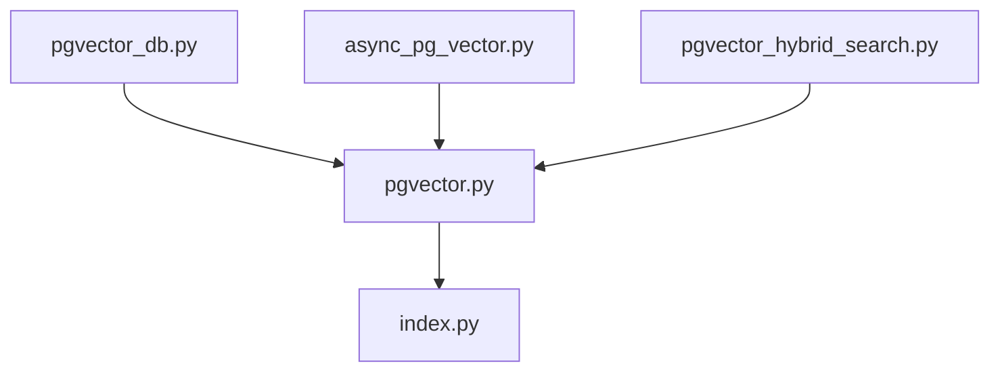
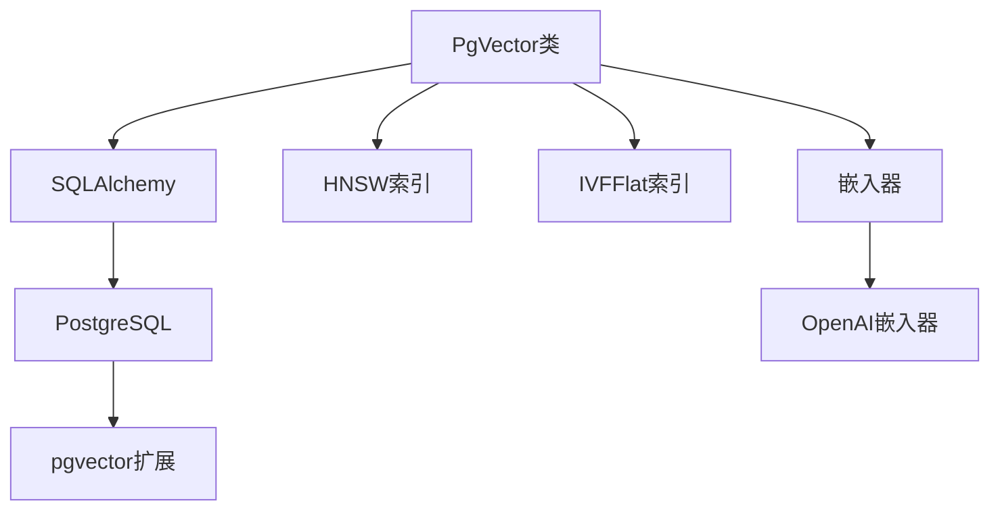
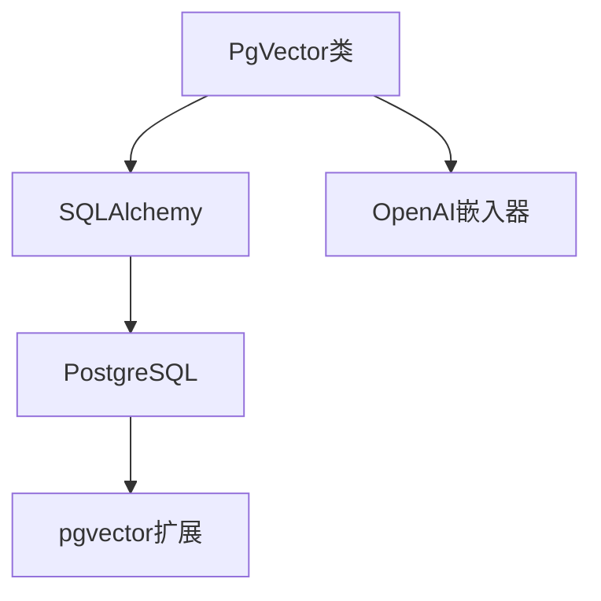

# PGVector

<cite>
**本文档中引用的文件**   
- [pgvector_db.py](file://cookbook/knowledge/vector_db/pgvector/pgvector_db.py)
- [async_pg_vector.py](file://cookbook/knowledge/vector_db/pgvector/async_pg_vector.py)
- [pgvector_hybrid_search.py](file://cookbook/knowledge/vector_db/pgvector/pgvector_hybrid_search.py)
- [pgvector.py](file://libs/agno/agno/vectordb/pgvector/pgvector.py)
- [index.py](file://libs/agno/agno/vectordb/pgvector/index.py)
</cite>

## 目录
1. [简介](#简介)
2. [项目结构](#项目结构)
3. [核心组件](#核心组件)
4. [架构概述](#架构概述)
5. [详细组件分析](#详细组件分析)
6. [依赖分析](#依赖分析)
7. [性能考虑](#性能考虑)
8. [故障排除指南](#故障排除指南)
9. [结论](#结论)

## 简介
PGVector是一个向量数据库集成模块，用于在PostgreSQL数据库中启用和使用PGVector扩展。它允许在PostgreSQL中存储和查询向量数据，利用现有的PostgreSQL基础设施、事务完整性和成熟的生态系统。PGVector支持向量数据类型（如vector）的使用以及索引（如HNSW, IVFFlat）的创建。它提供了代码示例，展示如何执行向量插入、相似性搜索（使用`<->`操作符）和混合查询（结合SQL条件）。此外，PGVector还讨论了在利用现有PostgreSQL基础设施、事务完整性和成熟生态系统方面的优势，并包括性能调优、索引维护和与Django/SQLAlchemy等ORM集成的指导。

## 项目结构
PGVector相关的文件位于`cookbook/knowledge/vector_db/pgvector`目录下，主要包括`pgvector_db.py`、`async_pg_vector.py`和`pgvector_hybrid_search.py`。这些文件展示了如何使用PGVector进行向量数据库操作。核心实现位于`libs/agno/agno/vectordb/pgvector`目录下的`pgvector.py`文件中，该文件定义了`PgVector`类，提供了创建、插入、搜索和管理向量数据的方法。此外，`index.py`文件定义了HNSW和IVFFlat索引的配置。



**图源**
- [pgvector_db.py](file://cookbook/knowledge/vector_db/pgvector/pgvector_db.py)
- [async_pg_vector.py](file://cookbook/knowledge/vector_db/pgvector/async_pg_vector.py)
- [pgvector_hybrid_search.py](file://cookbook/knowledge/vector_db/pgvector/pgvector_hybrid_search.py)
- [pgvector.py](file://libs/agno/agno/vectordb/pgvector/pgvector.py)
- [index.py](file://libs/agno/agno/vectordb/pgvector/index.py)

## 核心组件
PGVector的核心组件包括`PgVector`类，该类提供了创建、插入、搜索和管理向量数据的方法。`PgVector`类使用SQLAlchemy与PostgreSQL数据库交互，并利用pgvector扩展来处理向量数据。`PgVector`类支持多种搜索类型，包括向量搜索、关键词搜索和混合搜索。此外，`PgVector`类还支持HNSW和IVFFlat索引，以提高搜索性能。

**节源**
- [pgvector.py](file://libs/agno/agno/vectordb/pgvector/pgvector.py#L33-L60)

## 架构概述
PGVector的架构基于PostgreSQL和pgvector扩展。`PgVector`类使用SQLAlchemy与PostgreSQL数据库交互，并利用pgvector扩展来处理向量数据。`PgVector`类提供了创建、插入、搜索和管理向量数据的方法。`PgVector`类支持多种搜索类型，包括向量搜索、关键词搜索和混合搜索。此外，`PgVector`类还支持HNSW和IVFFlat索引，以提高搜索性能。



**图源**
- [pgvector.py](file://libs/agno/agno/vectordb/pgvector/pgvector.py#L33-L60)
- [index.py](file://libs/agno/agno/vectordb/pgvector/index.py#L0-L23)

## 详细组件分析
### PgVector类分析
`PgVector`类是PGVector的核心组件，提供了创建、插入、搜索和管理向量数据的方法。`PgVector`类使用SQLAlchemy与PostgreSQL数据库交互，并利用pgvector扩展来处理向量数据。

#### 初始化
`PgVector`类的初始化方法接受多个参数，包括表名、模式、数据库URL、数据库引擎、嵌入器、搜索类型、向量索引、距离度量、前缀匹配、向量分数权重、内容语言、模式版本、自动升级模式、重排序器和使用批处理。

```python
def __init__(
    self,
    table_name: str,
    schema: str = "ai",
    db_url: Optional[str] = None,
    db_engine: Optional[Engine] = None,
    embedder: Optional[Embedder] = None,
    search_type: SearchType = SearchType.vector,
    vector_index: Union[Ivfflat, HNSW] = HNSW(),
    distance: Distance = Distance.cosine,
    prefix_match: bool = False,
    vector_score_weight: float = 0.5,
    content_language: str = "english",
    schema_version: int = 1,
    auto_upgrade_schema: bool = False,
    reranker: Optional[Reranker] = None,
    use_batch: bool = False,
):
```

#### 表创建
`PgVector`类的`create`方法用于创建表。如果表不存在，则创建表并启用pgvector扩展。

```python
def create(self) -> None:
    if not self.table_exists():
        with self.Session() as sess, sess.begin():
            log_debug("Creating extension: vector")
            sess.execute(text("CREATE EXTENSION IF NOT EXISTS vector;"))
            if self.schema is not None:
                log_debug(f"Creating schema: {self.schema}")
                sess.execute(text(f"CREATE SCHEMA IF NOT EXISTS {self.schema};"))
        log_debug(f"Creating table: {self.table_name}")
        self.table.create(self.db_engine)
```

#### 向量搜索
`PgVector`类的`vector_search`方法用于执行向量相似性搜索。该方法接受查询字符串、限制和过滤器作为参数，并返回匹配的文档列表。

```python
def vector_search(self, query: str, limit: int = 5, filters: Optional[Dict[str, Any]] = None) -> List[Document]:
    try:
        query_embedding = self.embedder.get_embedding(query)
        if query_embedding is None:
            logger.error(f"Error getting embedding for Query: {query}")
            return []

        columns = [
            self.table.c.id,
            self.table.c.name,
            self.table.c.meta_data,
            self.table.c.content,
            self.table.c.embedding,
            self.table.c.usage,
        ]

        stmt = select(*columns)

        if filters is not None:
            stmt = stmt.where(self.table.c.meta_data.contains(filters))

        if self.distance == Distance.l2:
            stmt = stmt.order_by(self.table.c.embedding.l2_distance(query_embedding))
        elif self.distance == Distance.cosine:
            stmt = stmt.order_by(self.table.c.embedding.cosine_distance(query_embedding))
        elif self.distance == Distance.max_inner_product:
            stmt = stmt.order_by(self.table.c.embedding.max_inner_product(query_embedding))
        else:
            logger.error(f"Unknown distance metric: {self.distance}")
            return []

        stmt = stmt.limit(limit)

        log_debug(f"Vector search query: {stmt}")

        try:
            with self.Session() as sess, sess.begin():
                if self.vector_index is not None:
                    if isinstance(self.vector_index, Ivfflat):
                        sess.execute(text(f"SET LOCAL ivfflat.probes = {self.vector_index.probes}"))
                    elif isinstance(self.vector_index, HNSW):
                        sess.execute(text(f"SET LOCAL hnsw.ef_search = {self.vector_index.ef_search}"))
                results = sess.execute(stmt).fetchall()
        except Exception as e:
            logger.error(f"Error performing semantic search: {e}")
            logger.error("Table might not exist, creating for future use")
            self.create()
            return []

        search_results: List[Document] = []
        for result in results:
            search_results.append(
                Document(
                    id=result.id,
                    name=result.name,
                    meta_data=result.meta_data,
                    content=result.content,
                    embedder=self.embedder,
                    embedding=result.embedding,
                    usage=result.usage,
                )
            )

        if self.reranker:
            search_results = self.reranker.rerank(query=query, documents=search_results)

        log_info(f"Found {len(search_results)} documents")
        return search_results
    except Exception as e:
        logger.error(f"Error during vector search: {e}")
        return []
```

#### 关键词搜索
`PgVector`类的`keyword_search`方法用于执行关键词搜索。该方法接受查询字符串、限制和过滤器作为参数，并返回匹配的文档列表。

```python
def keyword_search(self, query: str, limit: int = 5, filters: Optional[Dict[str, Any]] = None) -> List[Document]:
    try:
        columns = [
            self.table.c.id,
            self.table.c.name,
            self.table.c.meta_data,
            self.table.c.content,
            self.table.c.embedding,
            self.table.c.usage,
        ]

        stmt = select(*columns)

        ts_vector = func.to_tsvector(self.content_language, self.table.c.content)
        processed_query = self.enable_prefix_matching(query) if self.prefix_match else query
        ts_query = func.websearch_to_tsquery(self.content_language, bindparam("query", value=processed_query))
        text_rank = func.ts_rank_cd(ts_vector, ts_query)

        if filters is not None:
            stmt = stmt.where(self.table.c.meta_data.contains(filters))

        stmt = stmt.order_by(text_rank.desc())

        stmt = stmt.limit(limit)

        log_debug(f"Keyword search query: {stmt}")

        try:
            with self.Session() as sess, sess.begin():
                results = sess.execute(stmt).fetchall()
        except Exception as e:
            logger.error(f"Error performing keyword search: {e}")
            logger.error("Table might not exist, creating for future use")
            self.create()
            return []

        search_results: List[Document] = []
        for result in results:
            search_results.append(
                Document(
                    id=result.id,
                    name=result.name,
                    meta_data=result.meta_data,
                    content=result.content,
                    embedder=self.embedder,
                    embedding=result.embedding,
                    usage=result.usage,
                )
            )

        log_info(f"Found {len(search_results)} documents")
        return search_results
    except Exception as e:
        logger.error(f"Error during keyword search: {e}")
        return []
```

#### 混合搜索
`PgVector`类的`hybrid_search`方法用于执行混合搜索，结合向量相似性和全文搜索。该方法接受查询字符串、限制和过滤器作为参数，并返回匹配的文档列表。

```python
def hybrid_search(
    self,
    query: str,
    limit: int = 5,
    filters: Optional[Dict[str, Any]] = None,
) -> List[Document]:
    try:
        query_embedding = self.embedder.get_embedding(query)
        if query_embedding is None:
            logger.error(f"Error getting embedding for Query: {query}")
            return []

        columns = [
            self.table.c.id,
            self.table.c.name,
            self.table.c.meta_data,
            self.table.c.content,
            self.table.c.embedding,
            self.table.c.usage,
        ]

        ts_vector = func.to_tsvector(self.content_language, self.table.c.content)
        processed_query = self.enable_prefix_matching(query) if self.prefix_match else query
        ts_query = func.websearch_to_tsquery(self.content_language, bindparam("query", value=processed_query))
        text_rank = func.ts_rank_cd(ts_vector, ts_query)

        if self.distance == Distance.l2:
            vector_distance = self.table.c.embedding.l2_distance(query_embedding)
            vector_score = 1 / (1 + vector_distance)
        elif self.distance == Distance.cosine:
            vector_distance = self.table.c.embedding.cosine_distance(query_embedding)
            vector_score = 1 / (1 + vector_distance)
        elif self.distance == Distance.max_inner_product:
            raw_vector_score = self.table.c.embedding.max_inner_product(query_embedding)
            vector_score = (raw_vector_score + 1) / 2
        else:
            logger.error(f"Unknown distance metric: {self.distance}")
            return []

        if not 0 <= self.vector_score_weight <= 1:
            logger.error(f"Invalid vector_score_weight: {self.vector_score_weight}")
            return []

        combined_score = (
            self.vector_score_weight * vector_score + (1 - self.vector_score_weight) * text_rank
        )

        stmt = select(*columns).order_by(desc(combined_score))

        if filters is not None:
            stmt = stmt.where(self.table.c.meta_data.contains(filters))

        stmt = stmt.limit(limit)

        log_debug(f"Hybrid search query: {stmt}")

        try:
            with self.Session() as sess, sess.begin():
                if self.vector_index is not None:
                    if isinstance(self.vector_index, Ivfflat):
                        sess.execute(text(f"SET LOCAL ivfflat.probes = {self.vector_index.probes}"))
                    elif isinstance(self.vector_index, HNSW):
                        sess.execute(text(f"SET LOCAL hnsw.ef_search = {self.vector_index.ef_search}"))
                results = sess.execute(stmt).fetchall()
        except Exception as e:
            logger.error(f"Error performing hybrid search: {e}")
            logger.error("Table might not exist, creating for future use")
            self.create()
            return []

        search_results: List[Document] = []
        for result in results:
            search_results.append(
                Document(
                    id=result.id,
                    name=result.name,
                    meta_data=result.meta_data,
                    content=result.content,
                    embedder=self.embedder,
                    embedding=result.embedding,
                    usage=result.usage,
                )
            )

        if self.reranker:
            search_results = self.reranker.rerank(query=query, documents=search_results)

        log_info(f"Found {len(search_results)} documents")
        return search_results
    except Exception as e:
        logger.error(f"Error during hybrid search: {e}")
        return []
```

#### 索引配置
`PgVector`类支持HNSW和IVFFlat索引。`index.py`文件定义了HNSW和IVFFlat索引的配置。

```python
class Ivfflat(BaseModel):
    name: Optional[str] = None
    lists: int = 100
    probes: int = 10
    dynamic_lists: bool = True
    configuration: Dict[str, Any] = {
        "maintenance_work_mem": "2GB",
    }


class HNSW(BaseModel):
    name: Optional[str] = None
    m: int = 16
    ef_search: int = 5
    ef_construction: int = 200
    configuration: Dict[str, Any] = {
        "maintenance_work_mem": "2GB",
    }
```

**图源**
- [pgvector.py](file://libs/agno/agno/vectordb/pgvector/pgvector.py#L650-L900)
- [index.py](file://libs/agno/agno/vectordb/pgvector/index.py#L0-L23)

**节源**
- [pgvector.py](file://libs/agno/agno/vectordb/pgvector/pgvector.py#L33-L60)
- [index.py](file://libs/agno/agno/vectordb/pgvector/index.py#L0-L23)

## 依赖分析
PGVector依赖于多个库，包括SQLAlchemy、pgvector、OpenAI嵌入器等。`PgVector`类使用SQLAlchemy与PostgreSQL数据库交互，并利用pgvector扩展来处理向量数据。`PgVector`类还依赖于OpenAI嵌入器来生成向量嵌入。



**图源**
- [pgvector.py](file://libs/agno/agno/vectordb/pgvector/pgvector.py#L33-L60)
- [index.py](file://libs/agno/agno/vectordb/pgvector/index.py#L0-L23)

## 性能考虑
PGVector通过使用HNSW和IVFFlat索引来提高搜索性能。HNSW索引适用于高维向量的近似最近邻搜索，而IVFFlat索引适用于低维向量的精确最近邻搜索。此外，PGVector还支持批处理插入，以提高插入性能。

## 故障排除指南
如果在使用PGVector时遇到问题，可以检查以下几点：
1. 确保PostgreSQL数据库已正确配置，并且pgvector扩展已启用。
2. 确保SQLAlchemy和pgvector库已正确安装。
3. 确保OpenAI嵌入器已正确配置，并且可以生成向量嵌入。
4. 检查日志文件，以获取有关错误的详细信息。

**节源**
- [pgvector.py](file://libs/agno/agno/vectordb/pgvector/pgvector.py#L33-L60)

## 结论
PGVector是一个强大的向量数据库集成模块，用于在PostgreSQL数据库中启用和使用PGVector扩展。它提供了创建、插入、搜索和管理向量数据的方法，并支持多种搜索类型和索引。PGVector还讨论了在利用现有PostgreSQL基础设施、事务完整性和成熟生态系统方面的优势，并包括性能调优、索引维护和与Django/SQLAlchemy等ORM集成的指导。