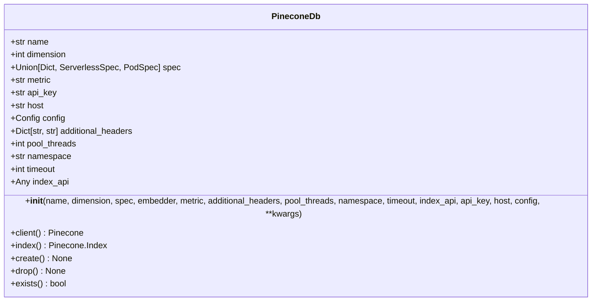
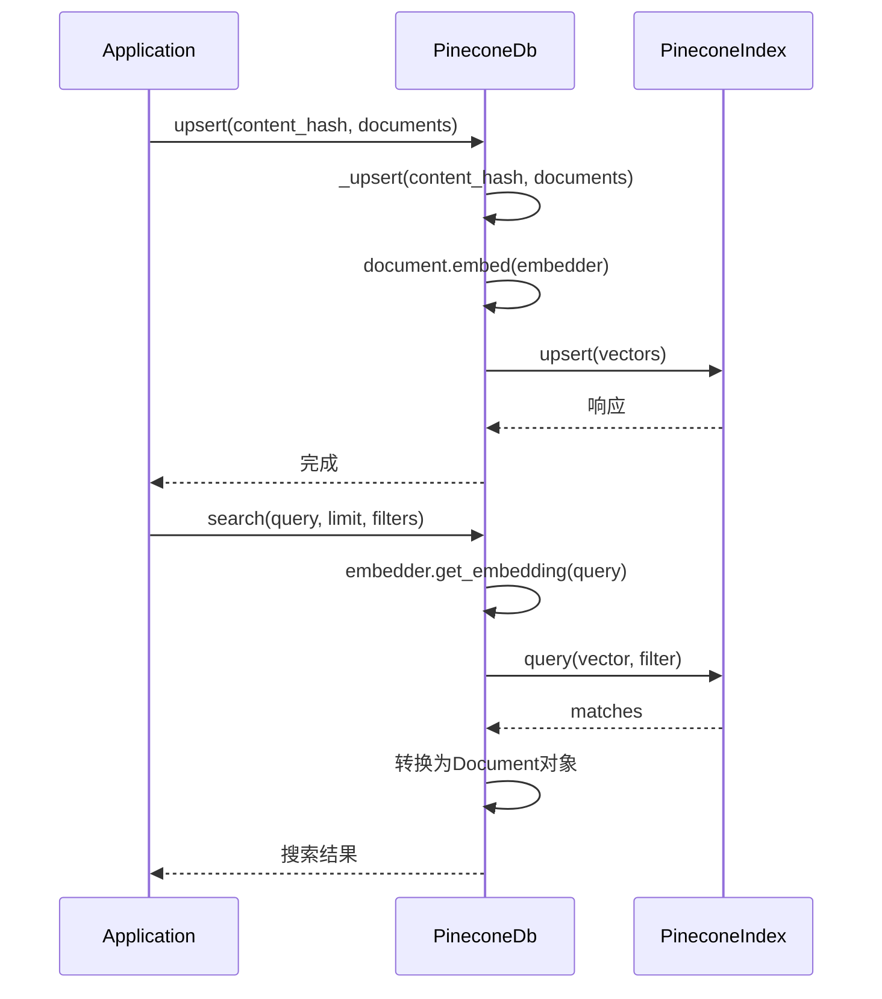
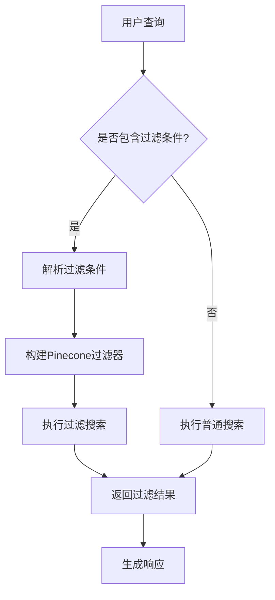
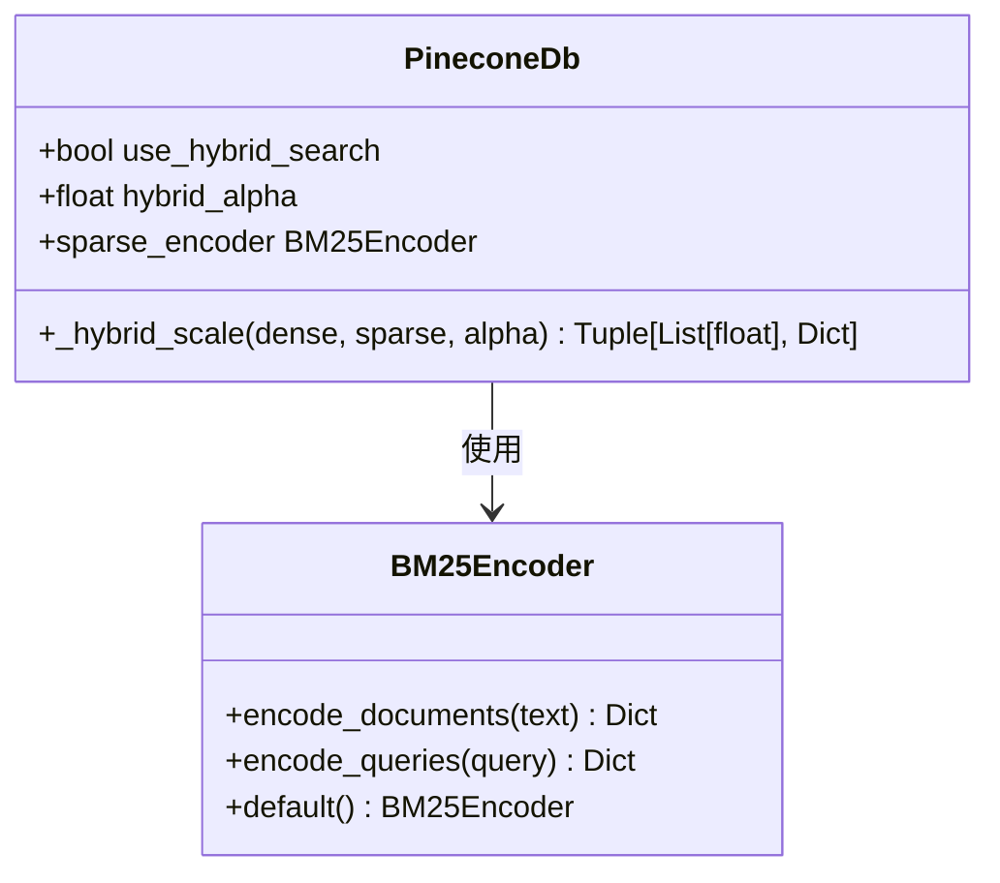

# Pinecone

<cite>
**本文档中引用的文件**   
- [pineconedb.py](file://libs/agno/agno/vectordb/pineconedb/pineconedb.py)
- [pinecone_db.py](file://cookbook/knowledge/vector_db/pinecone_db/pinecone_db.py)
- [filtering_pinecone.py](file://cookbook/knowledge/filters/vector_dbs/filtering_pinecone.py)
- [test_pineconedb.py](file://libs/agno/tests/unit/vectordb/test_pineconedb.py)
</cite>

## 目录
1. [简介](#简介)
2. [Pinecone索引配置](#pinecone索引配置)
3. [向量操作](#向量操作)
4. [元数据过滤与智能检索](#元数据过滤与智能检索)
5. [混合搜索与重排序](#混合搜索与重排序)
6. [认证与API密钥管理](#认证与api密钥管理)
7. [性能优化与成本控制](#性能优化与成本控制)
8. [最佳实践](#最佳实践)

## 简介
Pinecone向量数据库集成文档详细介绍了如何将Pinecone云服务集成到Agno系统中。该集成提供了高性能的向量存储和检索功能，支持大规模RAG（检索增强生成）应用。通过Pinecone的高可用性和可扩展性架构，系统能够处理海量知识库的实时检索需求。

Pinecone在Agno系统中作为向量数据库的核心组件，负责存储和检索由嵌入模型生成的向量表示。系统通过`PineconeDb`类提供了完整的CRUD操作接口，支持同步和异步操作模式，确保了在高并发场景下的性能表现。集成方案充分利用了Pinecone的serverless架构和pod类型配置，实现了按需扩展和成本优化。

**Section sources**
- [pineconedb.py](file://libs/agno/agno/vectordb/pineconedb/pineconedb.py#L1-L50)

## Pinecone索引配置
Pinecone索引的创建和配置是集成过程中的关键步骤。通过`PineconeDb`类的初始化参数，可以精确控制索引的各项属性。索引配置主要包括名称、维度、规格、度量标准等核心参数。



**Diagram sources **
- [pineconedb.py](file://libs/agno/agno/vectordb/pineconedb/pineconedb.py#L31-L47)

索引的规格（spec）参数支持两种配置模式：serverless和pod。Serverless模式适用于流量波动较大的应用场景，能够自动扩展资源；而pod模式则适合需要稳定性能和可预测成本的生产环境。在serverless模式下，需要指定云服务提供商和区域，如`{"serverless": {"cloud": "aws", "region": "us-east-1"}}`。

维度参数必须与所使用的嵌入模型输出的向量维度相匹配。例如，当使用OpenAI的text-embedding-ada-002模型时，维度应设置为1536。度量标准（metric）参数支持"cosine"、"dotproduct"和"euclidean"等选项，其中余弦相似度（cosine）是最常用的语义相似性度量方法。

**Section sources**
- [pineconedb.py](file://libs/agno/agno/vectordb/pineconedb/pineconedb.py#L31-L108)

## 向量操作
向量操作是Pinecone集成的核心功能，包括向量的上载、查询和删除等基本操作。`PineconeDb`类提供了丰富的API接口，支持同步和异步两种操作模式，满足不同应用场景的需求。



**Diagram sources **
- [pineconedb.py](file://libs/agno/agno/vectordb/pineconeedb/pineconedb.py#L200-L300)

上载操作通过`upsert`方法实现，该方法会先检查内容哈希是否存在，如果存在则先删除旧数据再插入新数据，确保数据的一致性。上载过程支持批量处理，可以通过`batch_size`参数控制每次上载的向量数量，优化性能表现。异步上载方法`async_upsert`利用`asyncio.gather`实现并行处理，显著提高了大规模数据上载的效率。

查询操作通过`search`方法实现，支持基于元数据的过滤功能。查询时，系统首先使用嵌入模型将查询文本转换为向量，然后在Pinecone索引中执行相似性搜索。搜索结果会自动转换为`Document`对象，便于后续处理。删除操作提供了多种方式，包括按ID、名称、元数据和内容ID删除，满足不同的数据管理需求。

**Section sources**
- [pineconedb.py](file://libs/agno/agno/vectordb/pineconedb/pineconedb.py#L200-L400)

## 元数据过滤与智能检索
元数据过滤功能在智能体知识检索中发挥着关键作用，能够实现精确的数据筛选和上下文感知的检索。通过在向量元数据中存储丰富的上下文信息，系统可以执行复杂的条件查询，提高检索的准确性和相关性。



**Diagram sources **
- [filtering_pinecone.py](file://cookbook/knowledge/filters/vector_dbs/filtering_pinecone.py#L0-L93)

在实际应用中，元数据可以包含文档类型、用户ID、时间戳等各种属性。例如，在简历筛选场景中，可以为每个简历向量添加"user_id"、"document_type"和"year"等元数据字段。当需要查询特定用户的简历时，只需在搜索时添加相应的过滤条件即可。

```python
agent.print_response(
    "Tell me about Jordan Mitchell's experience and skills",
    knowledge_filters={"user_id": "jordan_mitchell"},
    markdown=True,
)
```

这种基于元数据的过滤机制不仅提高了检索的精确度，还支持多租户场景下的数据隔离。每个智能体可以访问特定元数据范围内的知识，确保了数据的安全性和隐私性。此外，系统支持复杂的过滤表达式，如范围查询、存在性检查和逻辑组合，满足多样化的检索需求。

**Section sources**
- [filtering_pinecone.py](file://cookbook/knowledge/filters/vector_dbs/filtering_pinecone.py#L0-L93)

## 混合搜索与重排序
混合搜索功能结合了密集向量搜索和稀疏向量搜索的优势，通过凸组合的方式实现更精确的检索结果。该功能通过`use_hybrid_search`参数启用，利用BM25算法生成稀疏向量，与嵌入模型生成的密集向量进行融合。



**Diagram sources **
- [pineconedb.py](file://libs/agno/agno/vectordb/pineconedb/pineconedb.py#L98-L109)

混合搜索的实现基于`_hybrid_scale`方法，该方法将密集向量和稀疏向量按指定的alpha系数进行加权组合。alpha系数的取值范围为0到1，其中1表示纯语义搜索，0表示纯关键词搜索。通过调整alpha系数，可以在语义相似性和关键词匹配之间找到最佳平衡点。

重排序功能通过`reranker`参数实现，允许在初步检索结果的基础上进行二次排序。系统支持集成各种重排序模型，如Cohere Rerank或自定义的重排序算法。重排序过程会考虑查询与文档的深层语义关系，进一步提升检索结果的质量。这种两阶段的检索架构（检索+重排序）在大规模知识库场景下表现出色，能够在保证召回率的同时提高精确率。

**Section sources**
- [pineconedb.py](file://libs/agno/agno/vectordb/pineconedb/pineconedb.py#L395-L416)

## 认证与API密钥管理
认证配置是Pinecone集成的安全基础，通过API密钥实现对Pinecone服务的访问控制。系统支持多种密钥管理方式，包括环境变量、配置文件和运行时参数，确保了部署的灵活性和安全性。

API密钥应在安全的环境中存储，推荐使用环境变量或密钥管理服务。在代码示例中，API密钥通过`getenv("PINECONE_API_KEY")`从环境变量获取，避免了密钥的硬编码。这种做法不仅提高了安全性，还便于在不同环境（开发、测试、生产）之间切换配置。

```python
api_key = getenv("PINECONE_API_KEY")
vector_db = PineconeDb(
    name=index_name,
    dimension=1536,
    metric="cosine",
    spec={"serverless": {"cloud": "aws", "region": "us-east-1"}},
    api_key=api_key,
)
```

对于多租户应用，可以为每个租户配置独立的API密钥和索引，实现资源隔离和访问控制。系统还支持通过`additional_headers`参数添加自定义请求头，可用于实现更复杂的认证机制，如JWT令牌或IP白名单。所有与Pinecone的通信都通过HTTPS加密，确保了数据传输的安全性。

**Section sources**
- [pinecone_db.py](file://cookbook/knowledge/vector_db/pinecone_db/pinecone_db.py#L0-L39)

## 性能优化与成本控制
性能优化和成本控制是Pinecone集成的重要考虑因素。系统通过多种机制实现高性能和成本效益的平衡，包括异步操作、批量处理和资源优化配置。

在性能方面，系统充分利用了Pinecone的异步API和批量处理能力。`async_upsert`方法通过`asyncio.gather`实现并行向量准备，然后使用Pinecone客户端的批量上载功能，显著提高了数据上载的吞吐量。对于查询操作，系统通过连接池和线程优化减少了网络延迟，提高了响应速度。

在成本控制方面，建议根据实际工作负载选择合适的部署模式。对于开发和测试环境，可以使用serverless模式，按实际使用量计费；对于生产环境，pod模式通常更具成本效益。通过监控索引的使用情况和查询性能，可以及时调整资源配置，避免资源浪费。

此外，系统实现了智能的索引管理策略，包括自动创建和删除索引。当检测到索引不存在时，系统会自动创建新索引；当知识库不再需要时，可以调用`drop`方法删除索引，避免持续产生费用。这种按需创建和销毁的模式特别适合临时性或周期性的知识处理任务。

**Section sources**
- [pineconedb.py](file://libs/agno/agno/vectordb/pineconedb/pineconedb.py#L400-L500)

## 最佳实践
在集成Pinecone向量数据库时，遵循以下最佳实践可以确保系统的稳定性、性能和安全性。

首先，在初始化`PineconeDb`实例时，应确保所有必需参数都已正确配置。特别是维度参数必须与嵌入模型的输出维度完全匹配，否则会导致向量操作失败。建议在生产环境中使用明确的API密钥和主机配置，避免依赖默认值。

其次，对于大规模数据上载，应使用`async_upsert`方法并合理设置`batch_size`参数。过小的批次会导致网络开销增加，而过大的批次可能引发内存问题。通常建议的批次大小为100-1000个向量，具体值需要根据实际硬件和网络条件进行调优。

第三，充分利用元数据过滤功能来优化检索性能。通过在查询时添加精确的过滤条件，可以显著减少需要扫描的向量数量，提高查询速度并降低计算成本。同时，合理的元数据设计可以支持复杂的业务逻辑，如多租户数据隔离和权限控制。

最后，定期监控索引的使用情况和性能指标。Pinecone提供了丰富的监控API，可以获取索引的大小、查询延迟和资源使用情况。基于这些指标，可以及时调整索引配置，如副本数量和pod类型，确保系统在高负载下仍能稳定运行。

**Section sources**
- [pineconedb.py](file://libs/agno/agno/vectordb/pineconedb/pineconedb.py#L500-L675)