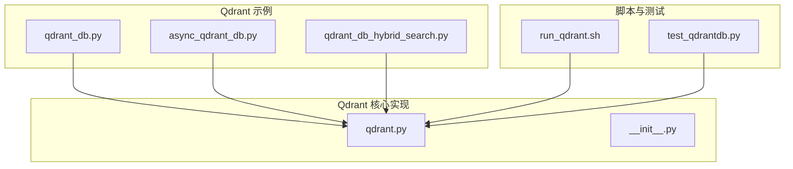
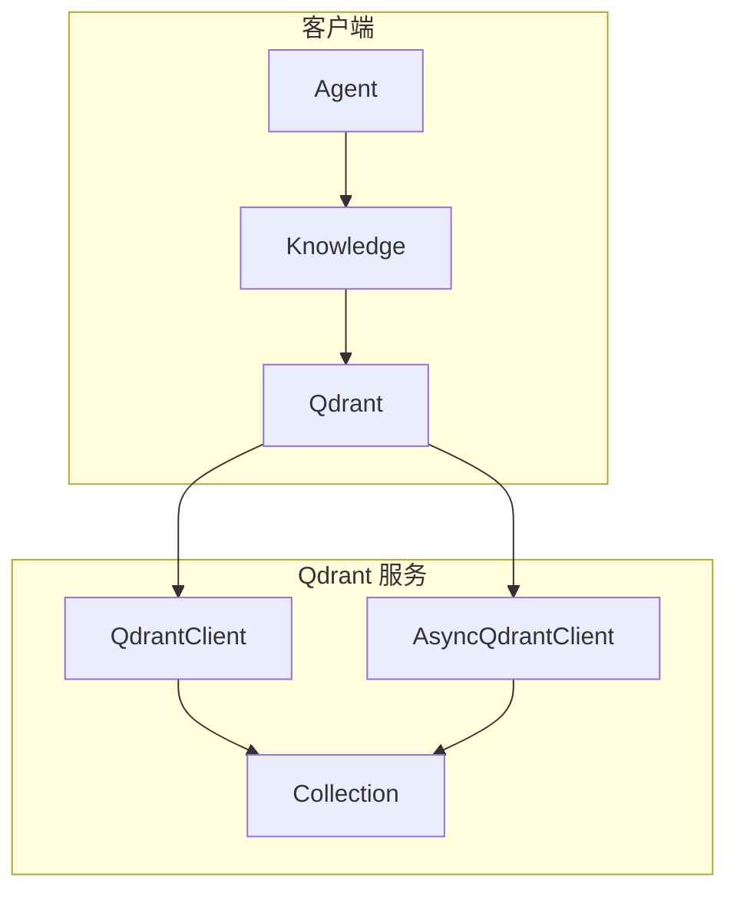
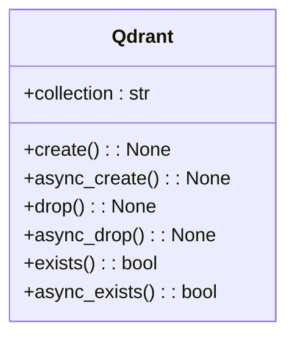
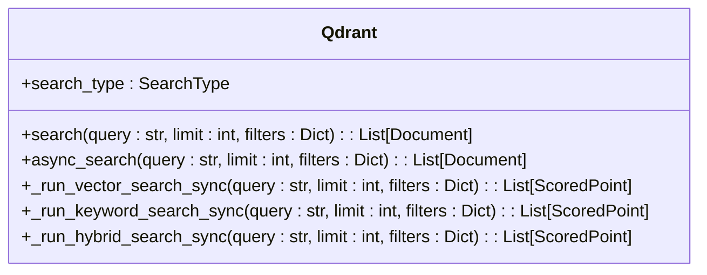
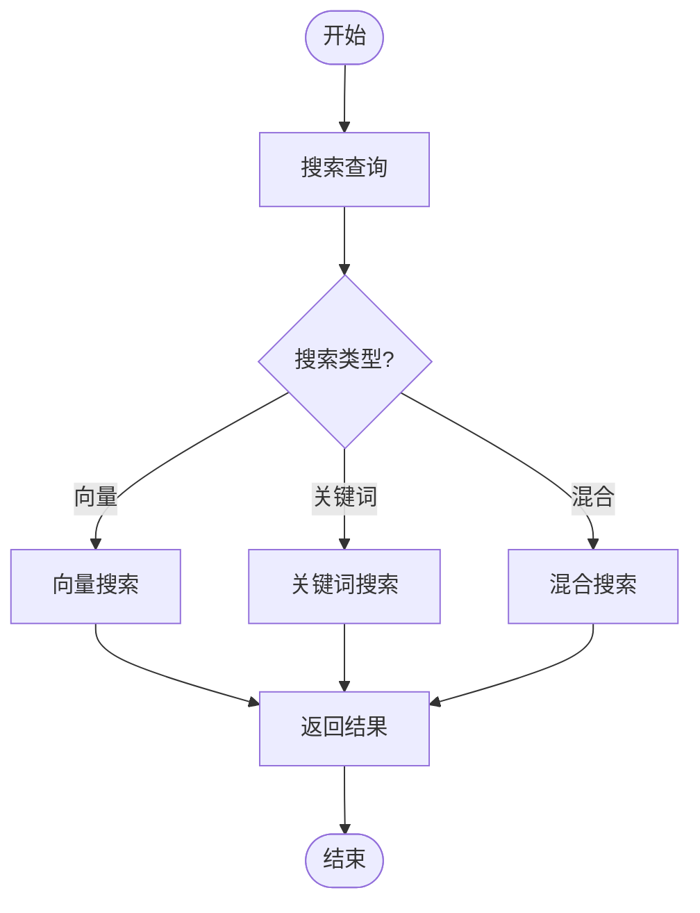
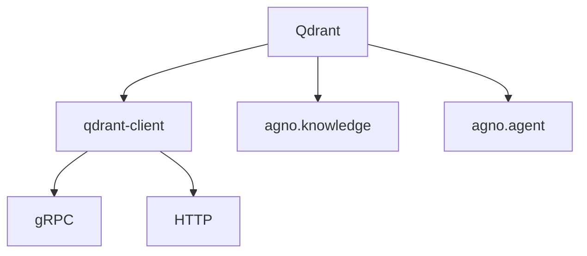

# Qdrant

<cite>
**本文档中引用的文件**  
- [qdrant_db.py](file://cookbook/knowledge/vector_db/qdrant_db/qdrant_db.py)
- [async_qdrant_db.py](file://cookbook/knowledge/vector_db/qdrant_db/async_qdrant_db.py)
- [qdrant_db_hybrid_search.py](file://cookbook/knowledge/vector_db/qdrant_db/qdrant_db_hybrid_search.py)
- [qdrant.py](file://libs/agno/agno/vectordb/qdrant/qdrant.py)
- [run_qdrant.sh](file://cookbook/scripts/run_qdrant.sh)
- [qdrant_fastembed.py](file://cookbook/knowledge/embedders/qdrant_fastembed.py)
- [test_qdrantdb.py](file://libs/agno/tests/unit/vectordb/test_qdrantdb.py)
</cite>

## 目录
1. [简介](#简介)
2. [项目结构](#项目结构)
3. [核心组件](#核心组件)
4. [架构概述](#架构概述)
5. [详细组件分析](#详细组件分析)
6. [依赖分析](#依赖分析)
7. [性能考虑](#性能考虑)
8. [故障排除指南](#故障排除指南)
9. [结论](#结论)

## 简介
Qdrant是一个专为高效相似性搜索而设计的向量搜索引擎，支持集合管理、向量索引配置（如HNSW参数）和元数据过滤。它提供对gRPC和HTTP协议的支持，适用于云服务和自托管部署选项。本文档详细阐述了Qdrant的配置和使用方法，涵盖其在高并发场景下的性能表现、资源调优建议以及混合搜索实现。

## 项目结构
Qdrant集成位于`cookbook/knowledge/vector_db/qdrant_db`目录下，包含同步和异步操作示例及混合搜索实现。核心实现位于`libs/agno/agno/vectordb/qdrant`中，提供了完整的向量数据库功能。

**图示来源**
- [qdrant_db.py](file://cookbook/knowledge/vector_db/qdrant_db/qdrant_db.py)
- [async_qdrant_db.py](file://cookbook/knowledge/vector_db/qdrant_db/async_qdrant_db.py)
- [qdrant_db_hybrid_search.py](file://cookbook/knowledge/vector_db/qdrant_db/qdrant_db_hybrid_search.py)
- [qdrant.py](file://libs/agno/agno/vectordb/qdrant/qdrant.py)
- [run_qdrant.sh](file://cookbook/scripts/run_qdrant.sh)
- [test_qdrantdb.py](file://libs/agno/tests/unit/vectordb/test_qdrantdb.py)

**本节来源**
- [qdrant_db.py](file://cookbook/knowledge/vector_db/qdrant_db/qdrant_db.py)
- [qdrant.py](file://libs/agno/agno/vectordb/qdrant/qdrant.py)

## 核心组件
Qdrant的核心组件包括集合管理、向量索引配置、相似性搜索、元数据存储与过滤以及混合搜索功能。通过`Qdrant`类实现，支持同步和异步操作，并提供对gRPC和HTTP协议的支持。

**本节来源**
- [qdrant.py](file://libs/agno/agno/vectordb/qdrant/qdrant.py)
- [qdrant_db.py](file://cookbook/knowledge/vector_db/qdrant_db/qdrant_db.py)

## 架构概述
Qdrant架构基于客户端-服务器模型，使用`QdrantClient`和`AsyncQdrantClient`进行通信。它支持本地持久化和远程部署，通过REST API和gRPC接口提供服务。

**图示来源**
- [qdrant.py](file://libs/agno/agno/vectordb/qdrant/qdrant.py)
- [qdrant_db.py](file://cookbook/knowledge/vector_db/qdrant_db/qdrant_db.py)

## 详细组件分析

### 集合管理分析
Qdrant的集合管理功能通过`create`、`drop`、`exists`等方法实现，支持同步和异步操作。

**图示来源**
- [qdrant.py](file://libs/agno/agno/vectordb/qdrant/qdrant.py)

### 向量索引与搜索分析
Qdrant支持多种搜索类型，包括向量搜索、关键词搜索和混合搜索，通过HNSW算法实现高效的相似性搜索。

**图示来源**
- [qdrant.py](file://libs/agno/agno/vectordb/qdrant/qdrant.py)

### 元数据与混合搜索分析
Qdrant利用payload功能存储和过滤元数据，支持通过`meta_data`字段进行精确匹配和条件过滤，实现混合搜索。

**图示来源**
- [qdrant.py](file://libs/agno/agno/vectordb/qdrant/qdrant.py)
- [qdrant_db_hybrid_search.py](file://cookbook/knowledge/vector_db/qdrant_db/qdrant_db_hybrid_search.py)

**本节来源**
- [qdrant.py](file://libs/agno/agno/vectordb/qdrant/qdrant.py)
- [qdrant_db_hybrid_search.py](file://cookbook/knowledge/vector_db/qdrant_db/qdrant_db_hybrid_search.py)

## 依赖分析
Qdrant依赖于`qdrant-client`库进行核心功能实现，同时与`agno`框架的其他组件如`Knowledge`、`Agent`等紧密集成。

**图示来源**
- [qdrant.py](file://libs/agno/agno/vectordb/qdrant/qdrant.py)
- [qdrant_db.py](file://cookbook/knowledge/vector_db/qdrant_db/qdrant_db.py)

**本节来源**
- [qdrant.py](file://libs/agno/agno/vectordb/qdrant/qdrant.py)

## 性能考虑
Qdrant在高并发场景下表现出色，支持批量插入和异步操作，通过HNSW索引实现快速相似性搜索。建议使用gRPC协议以获得更好的性能，并合理配置向量维度和距离度量。

## 故障排除指南
常见问题包括连接失败、集合不存在和搜索结果不准确。确保Qdrant服务正在运行，检查URL和端口配置，并验证集合名称和搜索参数。

**本节来源**
- [qdrant.py](file://libs/agno/agno/vectordb/qdrant/qdrant.py)
- [run_qdrant.sh](file://cookbook/scripts/run_qdrant.sh)

## 结论
Qdrant作为一个功能强大的向量搜索引擎，提供了全面的集合管理、高效的相似性搜索和灵活的元数据过滤功能。通过合理的配置和优化，可以在各种应用场景中发挥出色性能。