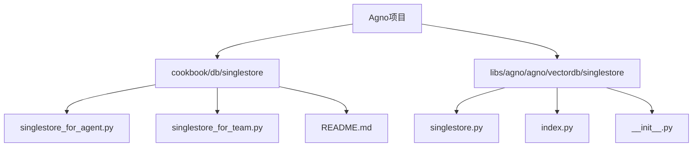
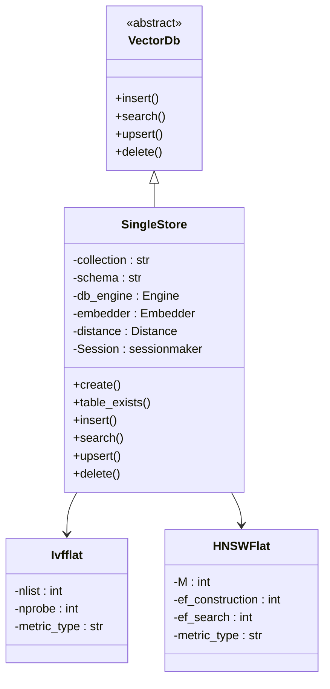
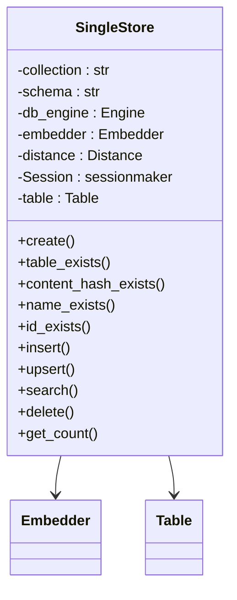
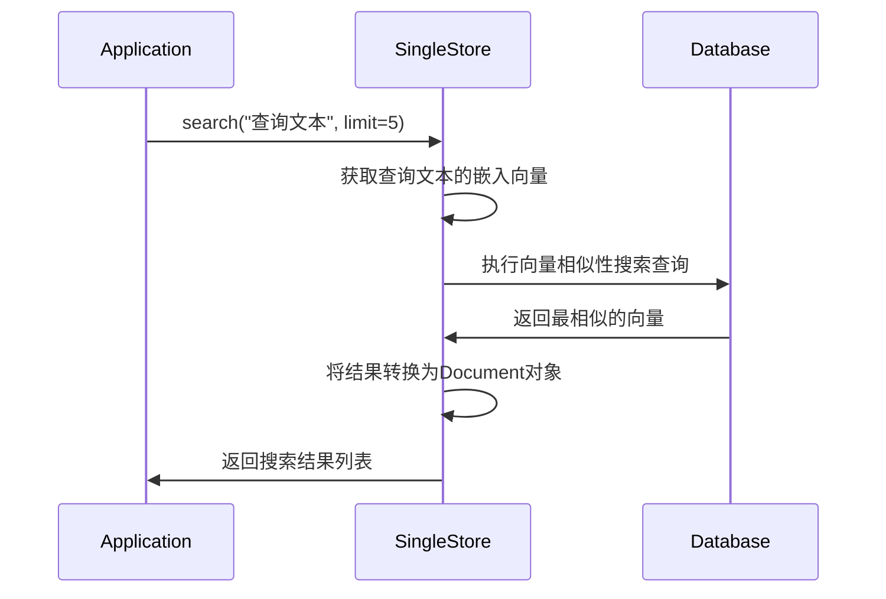
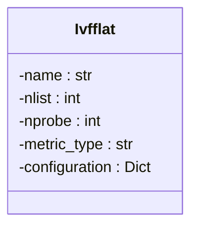
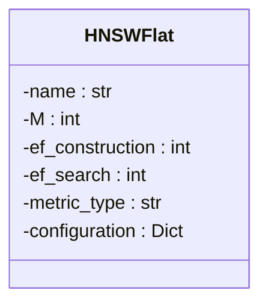
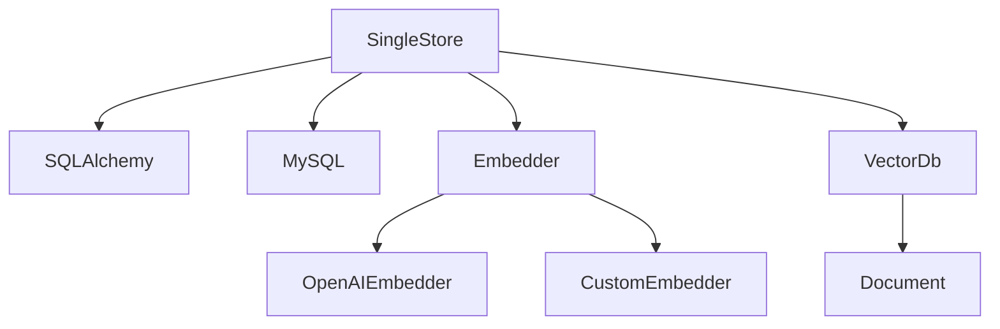

# SingleStore

<cite>
**本文档中引用的文件**  
- [singlestore.py](file://libs/agno/agno/vectordb/singlestore/singlestore.py)
- [index.py](file://libs/agno/agno/vectordb/singlestore/index.py)
- [singlestore_for_agent.py](file://cookbook/db/singlestore/singlestore_for_agent.py)
- [singlestore_for_team.py](file://cookbook/db/singlestore/singlestore_for_team.py)
- [schemas.py](file://libs/agno/agno/db/singlestore/schemas.py)
- [singlestore_demo.py](file://cookbook/agent_os/dbs/singlestore_demo.py)
</cite>

## 目录
1. [简介](#简介)
2. [项目结构](#项目结构)
3. [核心组件](#核心组件)
4. [架构概述](#架构概述)
5. [详细组件分析](#详细组件分析)
6. [依赖分析](#依赖分析)
7. [性能考虑](#性能考虑)
8. [故障排除指南](#故障排除指南)
9. [结论](#结论)

## 简介
本文档详细介绍如何在Agno框架中集成SingleStore向量数据库，以实现高效的实时分析。文档涵盖了SingleStore数据库和表的配置，特别是向量数据类型的使用。通过代码示例展示如何在Agno中执行结合向量相似性搜索和传统SQL查询的混合工作负载。同时讨论SingleStore的内存优化表、分布式架构以及其在处理高并发、低延迟查询方面的优势。文档还包括与SingleStore云服务集成的步骤和性能调优指南。

## 项目结构
SingleStore集成在Agno项目中主要分布在两个目录：`cookbook/db/singlestore` 和 `libs/agno/agno/vectordb/singlestore`。前者包含使用SingleStore作为数据库的示例代码，后者包含SingleStore向量数据库的具体实现。

**Diagram sources**
- [singlestore_for_agent.py](file://cookbook/db/singlestore/singlestore_for_agent.py)
- [singlestore.py](file://libs/agno/agno/vectordb/singlestore/singlestore.py)

**Section sources**
- [singlestore_for_agent.py](file://cookbook/db/singlestore/singlestore_for_agent.py)
- [singlestore.py](file://libs/agno/agno/vectordb/singlestore/singlestore.py)

## 核心组件
SingleStore向量数据库集成的核心组件包括`SingleStore`类，它实现了向量搜索功能，以及`Ivfflat`和`HNSWFlat`索引类，用于优化向量搜索性能。这些组件共同提供了在SingleStore中进行高效向量搜索的能力。

**Section sources**
- [singlestore.py](file://libs/agno/agno/vectordb/singlestore/singlestore.py)
- [index.py](file://libs/agno/agno/vectordb/singlestore/index.py)

## 架构概述
SingleStore向量数据库的架构基于SQLAlchemy和MySQL协议，通过自定义的`SingleStore`类实现向量搜索功能。该类继承自`VectorDb`基类，并实现了向量插入、搜索、更新和删除等操作。

**Diagram sources**
- [singlestore.py](file://libs/agno/agno/vectordb/singlestore/singlestore.py)
- [index.py](file://libs/agno/agno/vectordb/singlestore/index.py)

## 详细组件分析

### SingleStore类分析
`SingleStore`类是向量数据库集成的核心，负责管理向量数据的存储和检索。它通过SQLAlchemy与SingleStore数据库进行交互，并利用MySQL的VECTOR数据类型存储向量。

#### 类图

**Diagram sources**
- [singlestore.py](file://libs/agno/agno/vectordb/singlestore/singlestore.py)

#### 搜索流程

**Diagram sources**
- [singlestore.py](file://libs/agno/agno/vectordb/singlestore/singlestore.py)

### 索引机制分析
SingleStore支持两种向量索引类型：Ivfflat和HNSWFlat。这些索引通过优化向量搜索算法来提高查询性能。

#### Ivfflat索引

**Diagram sources**
- [index.py](file://libs/agno/agno/vectordb/singlestore/index.py)

#### HNSWFlat索引

**Diagram sources**
- [index.py](file://libs/agno/agno/vectordb/singlestore/index.py)

**Section sources**
- [index.py](file://libs/agno/agno/vectordb/singlestore/index.py)
- [singlestore.py](file://libs/agno/agno/vectordb/singlestore/singlestore.py)

## 依赖分析
SingleStore向量数据库集成依赖于多个外部库和内部组件。主要依赖包括SQLAlchemy用于数据库操作，以及各种嵌入模型用于生成向量。

**Diagram sources**
- [singlestore.py](file://libs/agno/agno/vectordb/singlestore/singlestore.py)
- [schemas.py](file://libs/agno/agno/db/singlestore/schemas.py)

**Section sources**
- [singlestore.py](file://libs/agno/agno/vectordb/singlestore/singlestore.py)
- [schemas.py](file://libs/agno/agno/db/singlestore/schemas.py)

## 性能考虑
SingleStore向量数据库在设计时考虑了多种性能优化策略。通过使用内存优化表和分布式架构，SingleStore能够处理高并发、低延迟的查询请求。向量索引（如Ivfflat和HNSWFlat）进一步提高了向量搜索的效率。

**Section sources**
- [singlestore.py](file://libs/agno/agno/vectordb/singlestore/singlestore.py)
- [index.py](file://libs/agno/agno/vectordb/singlestore/index.py)

## 故障排除指南
在使用SingleStore向量数据库时，可能会遇到一些常见问题。以下是一些故障排除建议：

1. 确保已安装必要的依赖库（sqlalchemy, pymysql）。
2. 检查数据库连接参数是否正确。
3. 验证向量维度与嵌入模型匹配。
4. 确保数据库表已正确创建并包含向量列。

**Section sources**
- [singlestore.py](file://libs/agno/agno/vectordb/singlestore/singlestore.py)
- [singlestore_for_agent.py](file://cookbook/db/singlestore/singlestore_for_agent.py)

## 结论
SingleStore向量数据库集成提供了一种高效的方式来处理实时分析任务。通过结合向量相似性搜索和传统SQL查询，开发者可以构建强大的混合工作负载应用。SingleStore的内存优化表和分布式架构使其成为处理高并发、低延迟查询的理想选择。