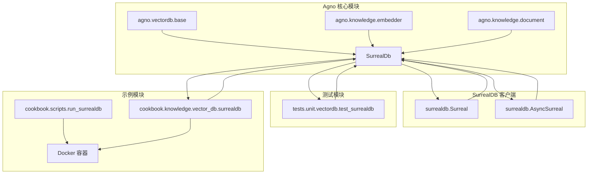
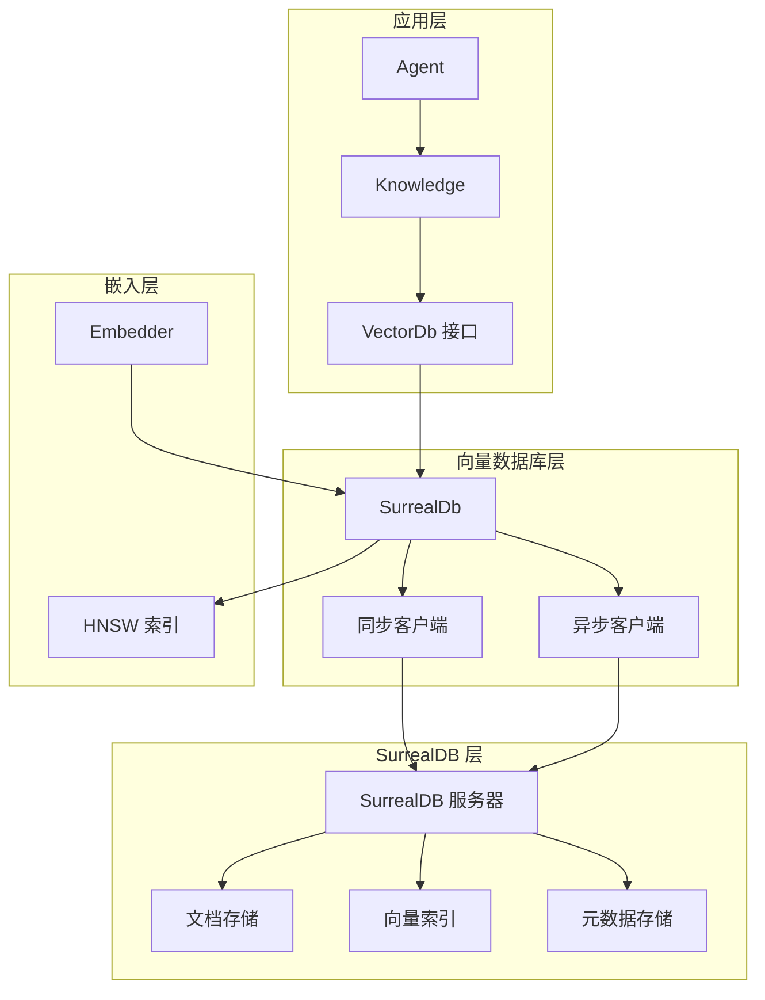
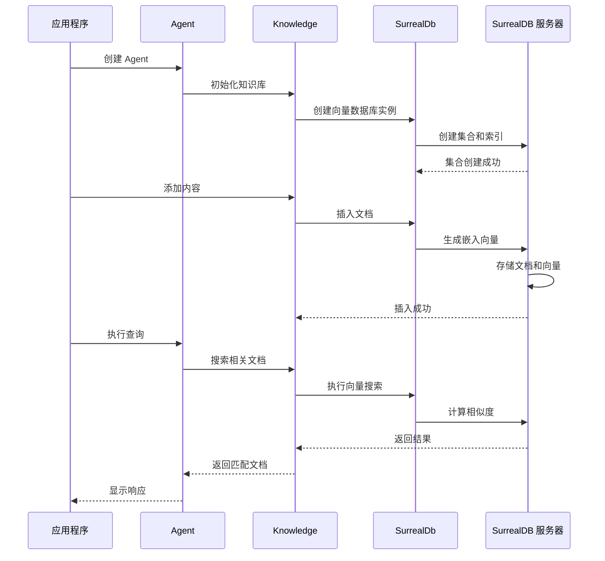
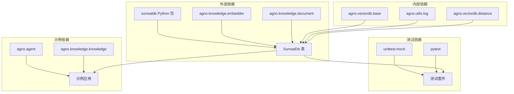

# SurrealDB 向量数据库集成文档

<cite>
**本文档中引用的文件**
- [surrealdb.py](file://libs/agno/agno/vectordb/surrealdb/surrealdb.py)
- [test_surrealdb.py](file://libs/agno/tests/unit/vectordb/test_surrealdb.py)
- [surreal_db.py](file://cookbook/knowledge/vector_db/surrealdb/surreal_db.py)
- [async_surreal_db.py](file://cookbook/knowledge/vector_db/surrealdb/async_surreal_db.py)
- [README.md](file://cookbook/knowledge/vector_db/README.md)
- [run_surrealdb.sh](file://cookbook/scripts/run_surrealdb.sh)
</cite>

## 目录
1. [简介](#简介)
2. [项目结构](#项目结构)
3. [核心组件](#核心组件)
4. [架构概览](#架构概览)
5. [详细组件分析](#详细组件分析)
6. [依赖关系分析](#依赖关系分析)
7. [性能考虑](#性能考虑)
8. [故障排除指南](#故障排除指南)
9. [结论](#结论)

## 简介

SurrealDB 是一个现代化的多模型数据库，支持文档、图和关系数据类型。它提供了强大的向量搜索能力，使其成为构建智能知识检索系统和向量数据库的理想选择。本文档全面介绍了如何在 Agno 框架中集成和使用 SurrealDB 作为向量数据库。

SurrealDB 的主要优势包括：
- **多模型支持**：同时支持文档、图和关系数据
- **原生向量搜索**：内置 HNSW 索引支持高效的向量相似性搜索
- **实时订阅**：支持实时数据变更通知
- **内置身份验证**：提供完整的用户管理和权限控制
- **多连接方式**：支持 WebSocket 和 HTTP 连接
- **异步操作**：原生支持异步查询和操作

## 项目结构

SurrealDB 集成在 Agno 项目中的组织结构如下：



**图表来源**
- [surrealdb.py](file://libs/agno/agno/vectordb/surrealdb/surrealdb.py#L1-L50)
- [test_surrealdb.py](file://libs/agno/tests/unit/vectordb/test_surrealdb.py#L1-L30)

**章节来源**
- [surrealdb.py](file://libs/agno/agno/vectordb/surrealdb/surrealdb.py#L1-L674)
- [README.md](file://cookbook/knowledge/vector_db/README.md#L1-L49)

## 核心组件

### SurrealDb 类

SurrealDb 类是整个向量数据库集成的核心，继承自 VectorDb 基类，提供了完整的向量搜索功能。

```python
class SurrealDb(VectorDb):
    """SurrealDB Vector Database implementation supporting both sync and async operations."""
```

### 主要特性

1. **同步和异步支持**：同时支持阻塞式和异步操作
2. **多种距离度量**：支持余弦相似度、欧几里得距离和点积
3. **灵活的元数据处理**：支持任意结构的元数据存储
4. **完整的 CRUD 操作**：提供插入、更新、删除和查询功能
5. **高级过滤功能**：支持基于元数据的复杂查询过滤

**章节来源**
- [surrealdb.py](file://libs/agno/agno/vectordb/surrealdb/surrealdb.py#L18-L674)

## 架构概览

SurrealDB 向量数据库集成采用分层架构设计：



**图表来源**
- [surrealdb.py](file://libs/agno/agno/vectordb/surrealdb/surrealdb.py#L83-L110)
- [surreal_db.py](file://cookbook/knowledge/vector_db/surrealdb/surreal_db.py#L1-L55)

## 详细组件分析

### 初始化配置

SurrealDb 类的初始化过程包含了多个关键参数：

```python
def __init__(
    self,
    client: Optional[Union[BlockingWsSurrealConnection, BlockingHttpSurrealConnection]] = None,
    async_client: Optional[Union[AsyncWsSurrealConnection, AsyncHttpSurrealConnection]] = None,
    collection: str = "documents",
    distance: Distance = Distance.cosine,
    efc: int = 150,
    m: int = 12,
    search_ef: int = 40,
    embedder: Optional[Embedder] = None,
):
```

#### 关键参数说明：

1. **client/async_client**：SurrealDB 客户端实例
2. **collection**：集合名称，默认为 "documents"
3. **distance**：距离度量方法（余弦、欧几里得、点积）
4. **efc**：HNSW 构建时间/精度权衡参数
5. **m**：HNSW 每个元素的最大连接数
6. **search_ef**：HNSW 搜索时间/精度权衡参数
7. **embedder**：文本嵌入生成器

### 数据库操作流程



**图表来源**
- [surrealdb.py](file://libs/agno/agno/vectordb/surrealdb/surrealdb.py#L112-L200)
- [surreal_db.py](file://cookbook/knowledge/vector_db/surrealdb/surreal_db.py#L20-L50)

### 向量搜索实现

SurrealDb 使用 SurrealQL 查询语言执行向量搜索：

```sql
SELECT
    content,
    meta_data,
    vector::distance::knn() as distance
FROM {collection}
WHERE embedding <|{limit}, {search_ef}|> $query_embedding
{filter_condition}
ORDER BY distance ASC
LIMIT {limit};
```

这个查询语句展示了 SurrealDB 的强大功能：
- **向量距离计算**：使用 `vector::distance::knn()` 函数
- **HNSW 索引优化**：通过 `|<{limit}, {search_ef}|>` 参数优化搜索
- **灵活过滤**：支持基于元数据的条件过滤
- **排序和限制**：按相似度排序并限制返回结果数量

### 元数据处理机制

SurrealDb 支持灵活的元数据存储和处理：

```python
def _build_filter_condition(filters: Optional[Dict[str, Any]] = None) -> str:
    """Build filter condition for queries."""
    if not filters:
        return ""
    conditions = [f"meta_data.{key} = ${key}" for key in filters]
    return "AND " + " AND ".join(conditions)
```

这种设计允许用户根据任意元数据字段进行过滤，例如：
- 文档类型过滤
- 内容来源筛选
- 时间范围限制
- 用户特定标签

**章节来源**
- [surrealdb.py](file://libs/agno/agno/vectordb/surrealdb/surrealdb.py#L112-L400)

### 同步 vs 异步操作

SurrealDb 提供了完整的同步和异步操作支持：

#### 同步操作示例：
```python
# 创建集合
surrealdb.create()

# 插入文档
surrealdb.insert(content_hash="hash", documents=[doc])

# 搜索文档
results = surrealdb.search("query text", limit=5)
```

#### 异步操作示例：
```python
# 异步创建集合
await surrealdb.async_create()

# 异步插入文档
await surrealdb.async_insert(content_hash="hash", documents=[doc])

# 异步搜索文档
results = await surrealdb.async_search("query text", limit=5)
```

**章节来源**
- [surrealdb.py](file://libs/agno/agno/vectordb/surrealdb/surrealdb.py#L400-L600)

## 依赖关系分析

SurrealDB 向量数据库集成的依赖关系如下：



**图表来源**
- [surrealdb.py](file://libs/agno/agno/vectordb/surrealdb/surrealdb.py#L1-L15)
- [test_surrealdb.py](file://libs/agno/tests/unit/vectordb/test_surrealdb.py#L1-L20)

### 核心依赖项

1. **surrealdb Python 包**：SurrealDB 客户端库
2. **agno.knowledge.embedder**：文本嵌入生成器
3. **agno.knowledge.document**：文档数据结构
4. **agno.vectordb.base**：向量数据库基类
5. **agno.utils.log**：日志记录工具
6. **agno.vectordb.distance**：距离度量枚举

**章节来源**
- [surrealdb.py](file://libs/agno/agno/vectordb/surrealdb/surrealdb.py#L1-L15)

## 性能考虑

### HNSW 索引参数调优

SurrealDb 使用 HNSW（Hierarchical Navigable Small World）算法来优化向量搜索性能。关键参数包括：

1. **efc (Construction Time/Accuracy Trade-off)**：默认值 150
   - 较高值：更好的索引质量，但构建时间更长
   - 较低值：更快的构建速度，但可能影响搜索精度

2. **m (Max Connections Per Element)**：默认值 12
   - 控制每个节点的最大连接数
   - 影响内存使用和搜索效率

3. **search_ef (Search Time/Accuracy Trade-off)**：默认值 40
   - 控制搜索过程中的候选节点数量
   - 较高值：更精确的搜索结果，但速度较慢

### 性能优化建议

1. **批量操作**：使用批量插入和更新操作
2. **合理设置搜索参数**：根据应用需求调整 ef 和 search_ef
3. **索引预热**：在大量数据插入后重新构建索引
4. **连接池管理**：复用数据库连接以减少开销

### 内存和存储优化

- **向量维度**：选择合适的嵌入维度以平衡精度和存储
- **元数据压缩**：对大型元数据字段进行压缩或分片存储
- **定期清理**：删除过期或无用的文档以释放存储空间

## 故障排除指南

### 常见问题及解决方案

#### 1. 连接问题

**问题**：无法连接到 SurrealDB 服务器
```
RuntimeError: Client is not initialized
```

**解决方案**：
```python
# 确保正确初始化客户端
client = Surreal(url="ws://localhost:8000")
client.signin({"username": "root", "password": "root"})
client.use(namespace="test", database="test")

surrealdb = SurrealDb(client=client)
```

#### 2. 集合不存在

**问题**：尝试访问不存在的集合
```
SurrealDBError: Collection does not exist
```

**解决方案**：
```python
# 在操作前检查集合是否存在
if not surrealdb.exists():
    surrealdb.create()

# 或者使用异步版本
await surrealdb.async_exists()
```

#### 3. 嵌入生成失败

**问题**：无法生成文档嵌入
```
TypeError: 'NoneType' object is not iterable
```

**解决方案**：
```python
# 确保嵌入器正确初始化
from agno.knowledge.embedder.openai import OpenAIEmbedder
embedder = OpenAIEmbedder()
surrealdb = SurrealDb(embedder=embedder)
```

#### 4. 查询超时

**问题**：向量搜索查询超时
```
TimeoutError: Query timeout exceeded
```

**解决方案**：
- 调整 `search_ef` 参数以平衡速度和精度
- 优化 HNSW 索引参数
- 检查服务器资源使用情况

### 调试技巧

1. **启用详细日志**：使用 `log_debug` 查看详细操作信息
2. **查询验证**：打印生成的 SurrealQL 查询语句
3. **结果检查**：验证返回的文档结构和内容
4. **性能监控**：监控查询时间和资源使用情况

**章节来源**
- [surrealdb.py](file://libs/agno/agno/vectordb/surrealdb/surrealdb.py#L150-L200)
- [test_surrealdb.py](file://libs/agno/tests/unit/vectordb/test_surrealdb.py#L1-L50)

## 结论

SurrealDB 向量数据库集成为 Agno 框架提供了强大而灵活的向量搜索能力。通过其多模型支持、原生向量搜索功能和实时订阅特性，SurrealDB 成为构建智能知识检索系统和复杂向量数据库应用的理想选择。

### 主要优势

1. **统一的数据模型**：支持文档、图和关系数据的统一存储
2. **高性能向量搜索**：基于 HNSW 算法的高效相似性搜索
3. **实时数据同步**：支持实时数据变更通知和订阅
4. **内置安全机制**：提供完整的身份验证和授权功能
5. **灵活的部署选项**：支持本地开发和云环境部署

### 最佳实践建议

1. **合理选择距离度量**：根据应用场景选择合适的相似度计算方法
2. **优化索引参数**：根据数据规模和查询模式调整 HNSW 参数
3. **元数据设计**：设计合理的元数据结构以支持高效过滤
4. **监控和维护**：定期监控数据库性能并进行必要的维护
5. **备份策略**：制定完善的数据备份和恢复策略

SurrealDB 的多模型特性和强大的向量搜索能力使其成为构建下一代智能应用的重要技术选择。随着 AI 应用的不断发展，SurrealDB 将继续为开发者提供创新的数据存储和检索解决方案。