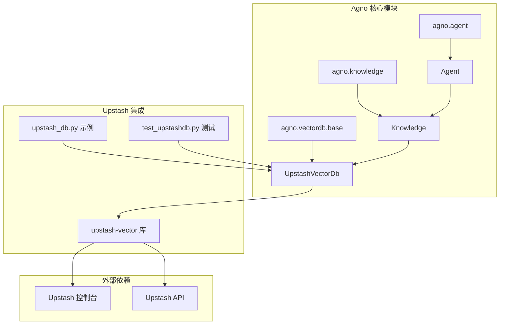
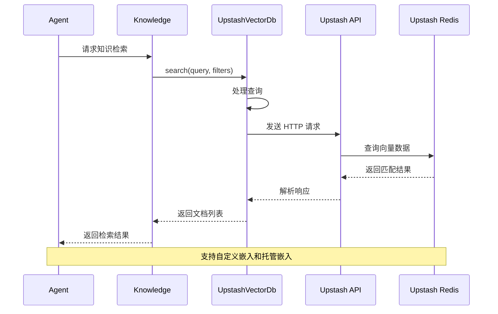
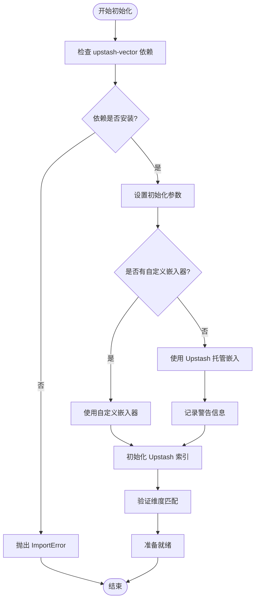
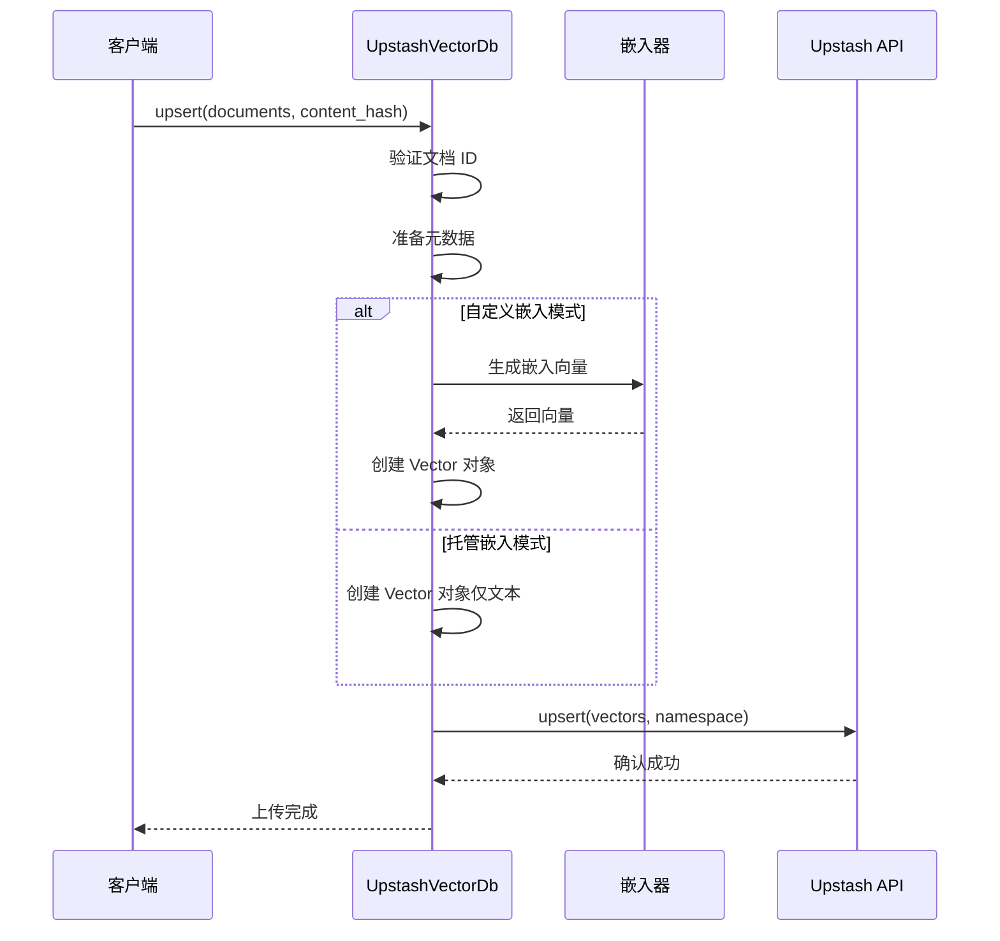
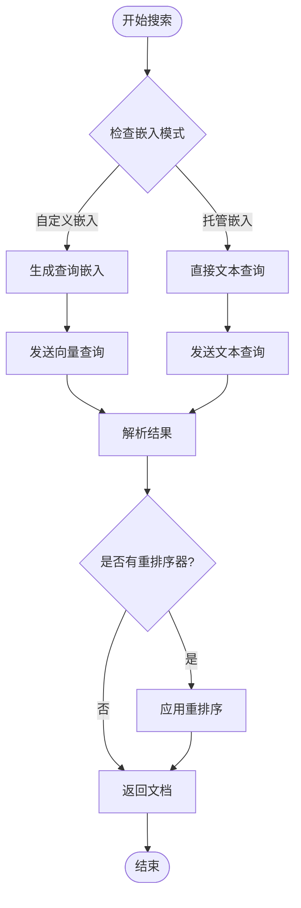
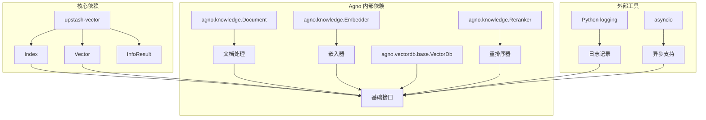

# Upstash 向量数据库集成文档

<cite>
**本文档引用的文件**
- [upstashdb.py](file://libs/agno/agno/vectordb/upstashdb/upstashdb.py)
- [test_upstashdb.py](file://libs/agno/tests/unit/vectordb/test_upstashdb.py)
- [upstash_db.py](file://cookbook/knowledge/vector_db/upstash_db/upstash_db.py)
- [base.py](file://libs/agno/agno/vectordb/base.py)
- [README.md](file://cookbook/knowledge/vector_db/README.md)
</cite>

## 目录
1. [简介](#简介)
2. [项目结构](#项目结构)
3. [核心组件](#核心组件)
4. [架构概览](#架构概览)
5. [详细组件分析](#详细组件分析)
6. [依赖关系分析](#依赖关系分析)
7. [性能考虑](#性能考虑)
8. [故障排除指南](#故障排除指南)
9. [结论](#结论)

## 简介

Upstash 是一个基于 Redis 的无服务器向量数据库服务，专为现代云原生应用程序设计。它提供了简单而强大的向量搜索功能，支持自定义嵌入模型和 Upstash 托管的嵌入模型。本文档详细介绍了如何在 Agno 框架中集成和使用 Upstash 向量数据库，包括创建、配置、API 端点使用以及最佳实践。

Upstash 的主要优势包括：
- **无服务器架构**：无需管理基础设施，按使用量计费
- **Redis 兼容性**：基于 Redis 构建，具有高性能和可扩展性
- **托管服务**：完全托管的向量数据库服务
- **多模型支持**：支持自定义嵌入模型和托管嵌入模型
- **低运维成本**：自动扩展和优化

## 项目结构

Upstash 向量数据库集成在 Agno 项目中的组织结构如下：



**图表来源**
- [upstashdb.py](file://libs/agno/agno/vectordb/upstashdb/upstashdb.py#L1-L35)
- [base.py](file://libs/agno/agno/vectordb/base.py#L1-L109)

**章节来源**
- [upstashdb.py](file://libs/agno/agno/vectordb/upstashdb/upstashdb.py#L1-L651)
- [README.md](file://cookbook/knowledge/vector_db/README.md#L1-L49)

## 核心组件

Upstash 向量数据库集成的核心组件包括以下几个关键部分：

### UpstashVectorDb 类

这是 Upstash 向量数据库的主要接口类，继承自 `VectorDb` 基类：

```python
class UpstashVectorDb(VectorDb):
    """
    提供对 Upstash Vector 数据库的接口，支持自定义嵌入和 Upstash 托管嵌入模型。
    
    参数:
        url (str): Upstash Vector 数据库 URL
        token (str): Upstash Vector API 令牌
        retries (Optional[int]): 操作重试次数，默认为 3
        retry_interval (Optional[float]): 重试间隔时间（秒），默认为 1.0
        dimension (Optional[int]): 嵌入维度，默认为 None
        embedder (Optional[Embedder]): 使用的嵌入器，如果为 None，则使用 Upstash 托管嵌入模型
        namespace (Optional[str]): 使用的命名空间，默认为 DEFAULT_NAMESPACE
        reranker (Optional[Reranker]): 使用的重排序器，默认为 None
    """
```

### 关键属性和方法

- **初始化参数**：
  - `url`: Upstash Vector 数据库的 REST API URL
  - `token`: 认证令牌
  - `retries`: 重试次数
  - `retry_interval`: 重试间隔
  - `dimension`: 嵌入维度
  - `embedder`: 自定义嵌入器
  - `namespace`: 命名空间
  - `reranker`: 重排序器

- **核心方法**：
  - `upsert()`: 插入或更新文档
  - `search()`: 向量搜索
  - `exists()`: 检查索引是否存在
  - `delete()`: 删除文档
  - `optimize()`: 优化索引（空操作，因为 Upstash 自动优化）

**章节来源**
- [upstashdb.py](file://libs/agno/agno/vectordb/upstashdb/upstashdb.py#L25-L651)

## 架构概览

Upstash 向量数据库在 Agno 中的架构设计遵循分层模式：



**图表来源**
- [upstashdb.py](file://libs/agno/agno/vectordb/upstashdb/upstashdb.py#L350-L420)
- [upstash_db.py](file://cookbook/knowledge/vector_db/upstash_db/upstash_db.py#L1-L42)

## 详细组件分析

### 初始化和连接管理

UpstashVectorDb 类的初始化过程包含以下关键步骤：



**图表来源**
- [upstashdb.py](file://libs/agno/agno/vectordb/upstashdb/upstashdb.py#L40-L85)

### 文档上传流程

文档上传（upsert）过程支持两种模式：

1. **托管嵌入模式**：直接上传文本内容，由 Upstash 生成嵌入
2. **自定义嵌入模式**：使用用户提供的嵌入器生成嵌入向量



**图表来源**
- [upstashdb.py](file://libs/agno/agno/vectordb/upstashdb/upstashdb.py#L200-L289)

### 搜索功能实现

搜索功能支持两种查询模式：



**图表来源**
- [upstashdb.py](file://libs/agno/agno/vectordb/upstashdb/upstashdb.py#L350-L420)

**章节来源**
- [upstashdb.py](file://libs/agno/agno/vectordb/upstashdb/upstashdb.py#L200-L420)

### 错误处理和重试机制

UpstashVectorDb 实现了完善的错误处理和重试机制：

```python
# 重试配置
self.retries: int = retries if retries is not None else 3
self.retry_interval: float = retry_interval if retry_interval is not None else 1.0

# 连接验证
try:
    self.index.info()
    return True
except Exception as e:
    logger.error(f"Error checking index existence: {str(e)}")
    return False
```

**章节来源**
- [upstashdb.py](file://libs/agno/agno/vectordb/upstashdb/upstashdb.py#L40-L85)
- [upstashdb.py](file://libs/agno/agno/vectordb/upstashdb/upstashdb.py#L100-L120)

## 依赖关系分析

Upstash 向量数据库集成的依赖关系图：



**图表来源**
- [upstashdb.py](file://libs/agno/agno/vectordb/upstashdb/upstashdb.py#L1-L15)
- [base.py](file://libs/agno/agno/vectordb/base.py#L1-L109)

**章节来源**
- [upstashdb.py](file://libs/agno/agno/vectordb/upstashdb/upstashdb.py#L1-L15)

## 性能考虑

### 连接池和并发处理

Upstash 向量数据库在 Agno 中的性能优化策略：

1. **单例模式**：Index 对象采用延迟初始化，避免不必要的连接
2. **批量操作**：支持批量插入和查询，减少网络开销
3. **异步支持**：提供异步接口，支持高并发场景
4. **缓存机制**：利用 Redis 的内存特性，提供快速查询

### 最佳实践建议

1. **合理设置维度**：确保嵌入维度与索引配置一致
2. **使用命名空间**：在多租户环境中隔离数据
3. **监控指标**：关注查询延迟和吞吐量
4. **定期优化**：虽然 Upstash 自动优化，但仍需监控性能

## 故障排除指南

### 常见问题和解决方案

1. **依赖未安装**
   ```bash
   pip install upstash-vector
   ```

2. **认证失败**
   - 检查 URL 和 Token 是否正确
   - 验证环境变量设置
   - 确认 API 权限

3. **维度不匹配**
   ```python
   # 确保维度设置正确
   db = UpstashVectorDb(
       url="your-url",
       token="your-token",
       dimension=384  # 根据实际嵌入维度设置
   )
   ```

4. **网络连接问题**
   - 检查防火墙设置
   - 验证 DNS 解析
   - 考虑使用代理

### 调试技巧

```python
# 启用详细日志
import logging
logging.getLogger('agno').setLevel(logging.DEBUG)

# 检查索引状态
db = UpstashVectorDb(url, token)
print(f"Index exists: {db.exists()}")
info = db.get_index_info()
print(f"Dimension: {info.dimension}, Vectors: {info.vector_count}")
```

**章节来源**
- [upstashdb.py](file://libs/agno/agno/vectordb/upstashdb/upstashdb.py#L100-L120)
- [test_upstashdb.py](file://libs/agno/tests/unit/vectordb/test_upstashdb.py#L60-L80)

## 结论

Upstash 向量数据库为 Agno 框架提供了强大而灵活的向量搜索能力。其基于 Redis 的无服务器架构使得部署和维护变得极其简单，同时保持了高性能和可扩展性。

### 主要优势

1. **易于集成**：简单的 API 设计，与现有 Agno 组件无缝集成
2. **灵活配置**：支持自定义嵌入和托管嵌入两种模式
3. **高性能**：基于 Redis 的底层架构提供快速查询
4. **低运维成本**：按使用量计费，无需管理基础设施
5. **企业级特性**：支持命名空间、过滤器和元数据管理

### 适用场景

- **快速原型开发**：需要快速搭建向量搜索功能的应用
- **微服务架构**：作为独立的服务组件
- **多租户应用**：利用命名空间隔离不同租户的数据
- **实时搜索**：需要低延迟向量搜索的应用
- **成本敏感项目**：按使用量计费的经济模式

通过本文档的指导，开发者可以充分利用 Upstash 向量数据库的强大功能，在 Agno 框架中构建高效、可靠的向量搜索应用。