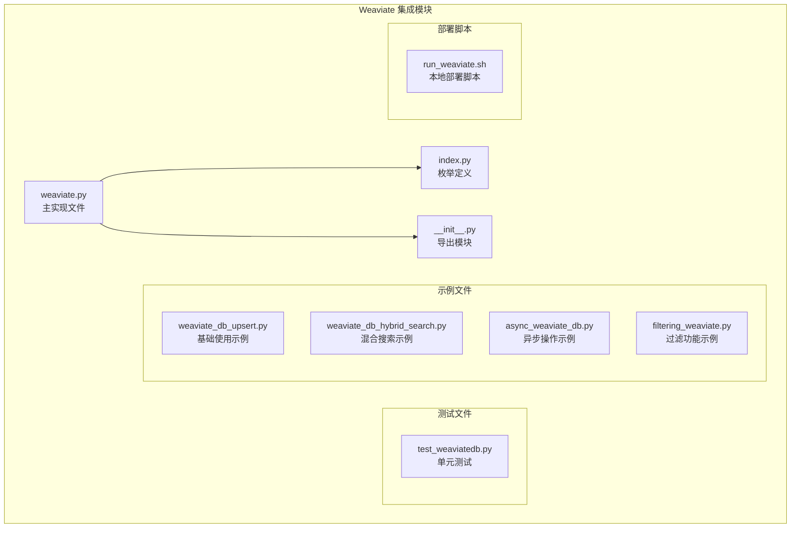
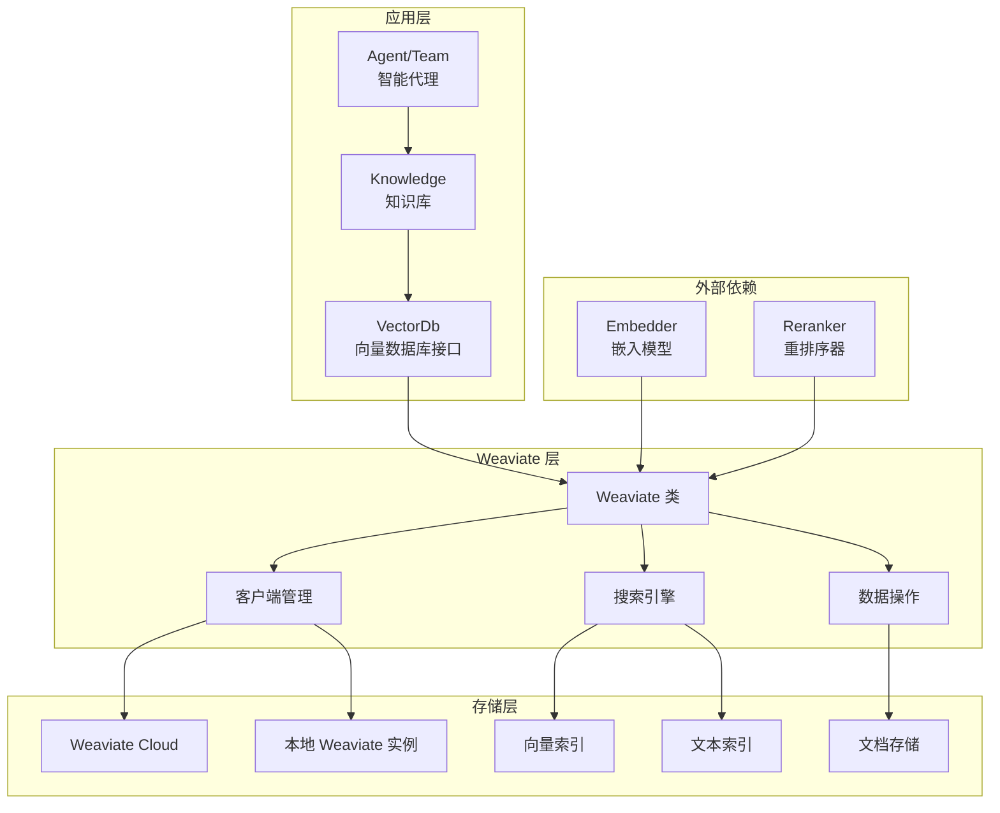
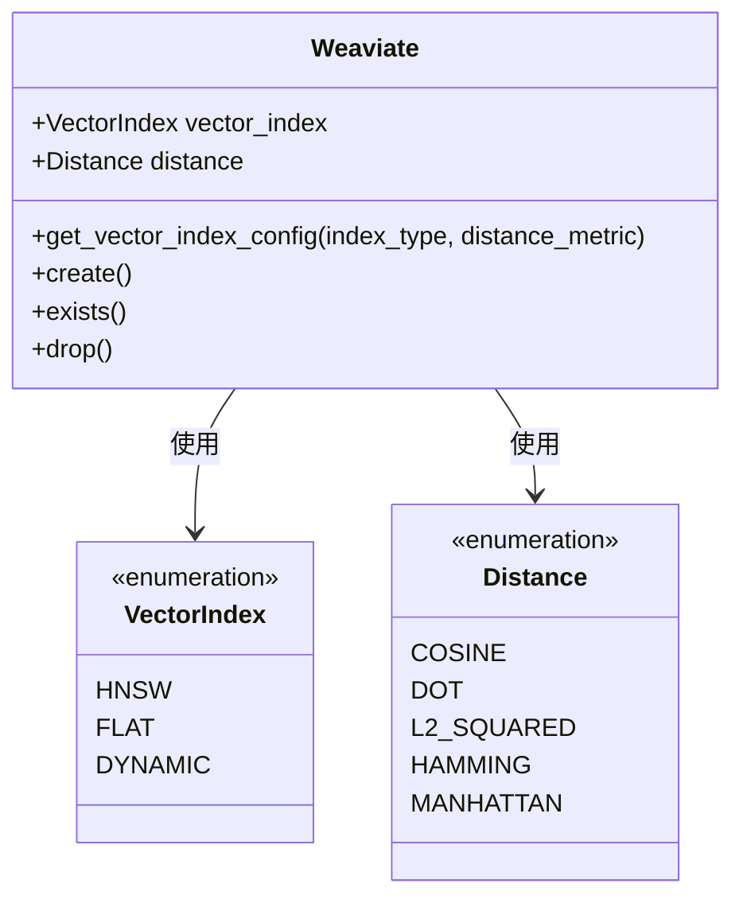
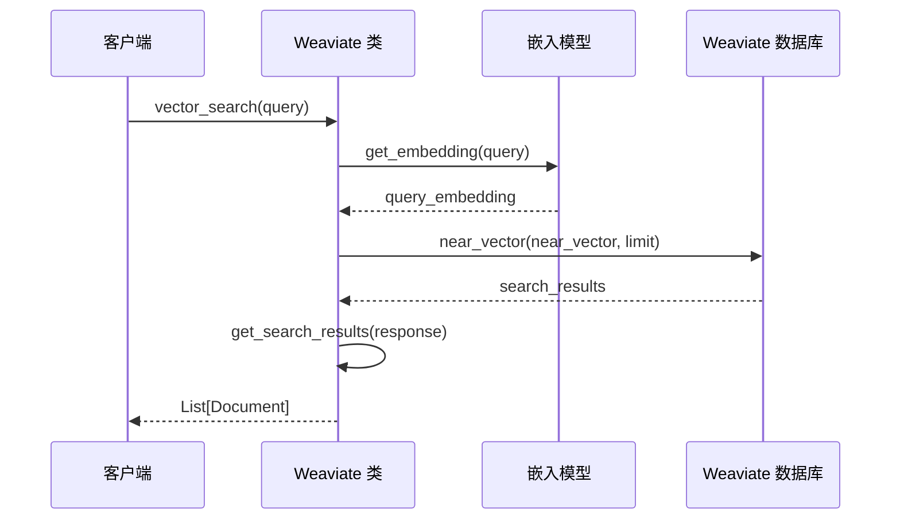
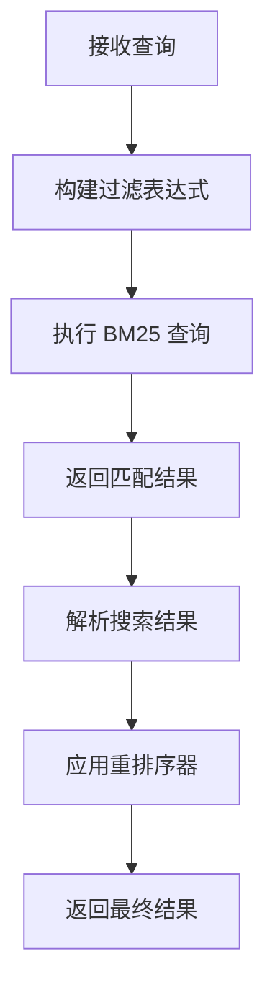
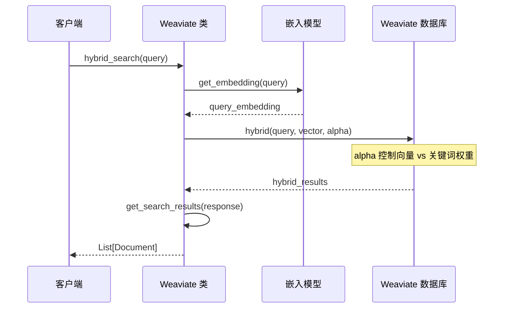
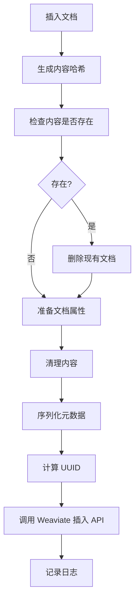
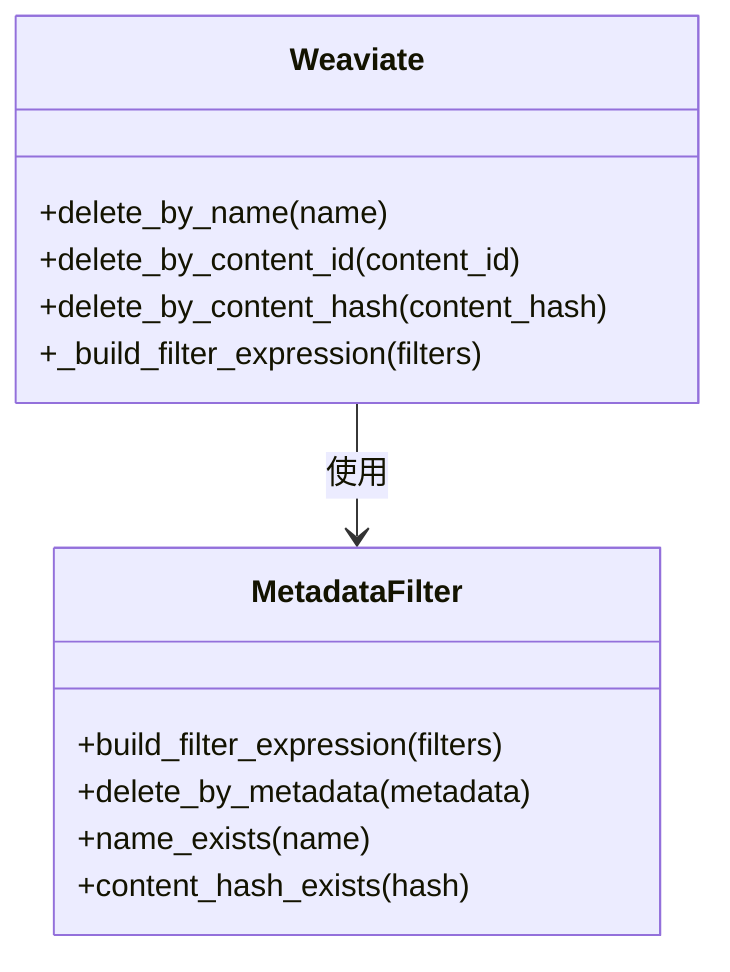
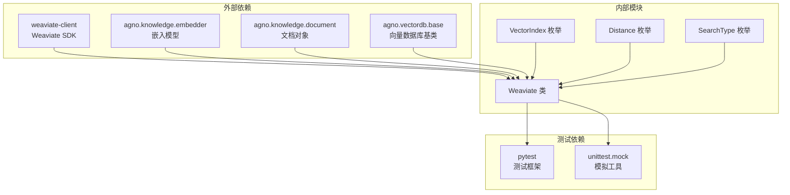

# Weaviate 向量数据库集成文档

<cite>
**本文档引用的文件**
- [weaviate.py](file://libs/agno/agno/vectordb/weaviate/weaviate.py)
- [index.py](file://libs/agno/agno/vectordb/weaviate/index.py)
- [__init__.py](file://libs/agno/agno/vectordb/weaviate/__init__.py)
- [test_weaviatedb.py](file://libs/agno/tests/unit/vectordb/test_weaviatedb.py)
- [weaviate_db_upsert.py](file://cookbook/knowledge/vector_db/weaviate_db/weaviate_db_upsert.py)
- [weaviate_db_hybrid_search.py](file://cookbook/knowledge/vector_db/weaviate_db/weaviate_db_hybrid_search.py)
- [async_weaviate_db.py](file://cookbook/knowledge/vector_db/weaviate_db/async_weaviate_db.py)
- [filtering_weaviate.py](file://cookbook/knowledge/filters/vector_dbs/filtering_weaviate.py)
- [run_weaviate.sh](file://cookbook/scripts/run_weaviate.sh)
</cite>

## 目录
1. [简介](#简介)
2. [项目结构](#项目结构)
3. [核心组件](#核心组件)
4. [架构概览](#架构概览)
5. [详细组件分析](#详细组件分析)
6. [依赖关系分析](#依赖关系分析)
7. [性能考虑](#性能考虑)
8. [故障排除指南](#故障排除指南)
9. [结论](#结论)

## 简介

Weaviate 是一个现代化的向量数据库，专为 AI 应用程序设计。在 Agno 框架中，Weaviate 被用作强大的向量存储解决方案，支持混合搜索（向量相似度搜索和关键词搜索）、结构化数据存储以及灵活的元数据过滤功能。

Weaviate 的主要特性包括：
- **向量存储**：支持高维向量的高效存储和检索
- **混合搜索**：结合向量相似度和关键词搜索的优势
- **结构化数据**：支持文本、元数据等结构化信息存储
- **模块化架构**：可插拔的嵌入模型支持
- **GraphQL 接口**：强大的查询语言支持复杂查询
- **集群部署**：支持分布式部署和扩展

## 项目结构

Weaviate 集成在 Agno 项目中的组织结构如下：



**图表来源**
- [weaviate.py](file://libs/agno/agno/vectordb/weaviate/weaviate.py#L1-L50)
- [index.py](file://libs/agno/agno/vectordb/weaviate/index.py#L1-L16)

**章节来源**
- [weaviate.py](file://libs/agno/agno/vectordb/weaviate/weaviate.py#L1-L935)
- [index.py](file://libs/agno/agno/vectordb/weaviate/index.py#L1-L16)

## 核心组件

### Weaviate 类

Weaviate 类是整个集成的核心，继承自 VectorDb 基类，提供了完整的向量数据库操作功能。

```python
class Weaviate(VectorDb):
    """
    Weaviate 类用于管理与 Weaviate 向量数据库的向量操作（v4 客户端）。
    """
```

### 关键参数配置

Weaviate 配置包含多个关键参数：

- **连接参数**：
  - `wcd_url`: Weaviate Cloud Deployment URL
  - `wcd_api_key`: Weaviate Cloud API 密钥
  - `client`: 自定义 Weaviate 客户端实例
  - `local`: 是否使用本地实例

- **集合参数**：
  - `collection`: 数据集名称，默认为 "default"
  - `vector_index`: 向量索引类型（HNSW、FLAT、DYNAMIC）
  - `distance`: 距离度量方式（COSINE、DOT、L2_SQUARED）

- **搜索参数**：
  - `search_type`: 搜索类型（vector、keyword、hybrid）
  - `reranker`: 重排序器
  - `hybrid_search_alpha`: 混合搜索权重（0.0-1.0）

**章节来源**
- [weaviate.py](file://libs/agno/agno/vectordb/weaviate/weaviate.py#L29-L69)

## 架构概览

Weaviate 在 Agno 中的架构采用分层设计，确保了良好的可扩展性和维护性：



**图表来源**
- [weaviate.py](file://libs/agno/agno/vectordb/weaviate/weaviate.py#L29-L148)

## 详细组件分析

### 向量索引配置

Weaviate 支持多种向量索引类型，每种都有不同的性能特征：



**图表来源**
- [index.py](file://libs/agno/agno/vectordb/weaviate/index.py#L3-L15)
- [weaviate.py](file://libs/agno/agno/vectordb/weaviate/weaviate.py#L759-L775)

### 搜索功能实现

Weaviate 提供三种主要的搜索类型：

#### 1. 向量搜索（Vector Search）



**图表来源**
- [weaviate.py](file://libs/agno/agno/vectordb/weaviate/weaviate.py#L433-L470)

#### 2. 关键词搜索（Keyword Search）

关键词搜索使用 BM25 算法进行文本匹配：



**图表来源**
- [weaviate.py](file://libs/agno/agno/vectordb/weaviate/weaviate.py#L520-L555)

#### 3. 混合搜索（Hybrid Search）

混合搜索结合向量和关键词搜索的优势：



**图表来源**
- [weaviate.py](file://libs/agno/agno/vectordb/weaviate/weaviate.py#L600-L635)

**章节来源**
- [weaviate.py](file://libs/agno/agno/vectordb/weaviate/weaviate.py#L433-L635)

### 数据操作功能

Weaviate 提供了完整的 CRUD 操作：

#### 文档插入和更新



**图表来源**
- [weaviate.py](file://libs/agno/agno/vectordb/weaviate/weaviate.py#L220-L270)

#### 异步操作支持

Weaviate 完全支持异步操作，提高并发性能：

```python
async def async_insert(self, content_hash: str, documents: List[Document], filters: Optional[Dict[str, Any]] = None):
    """异步插入文档到 Weaviate"""
    # 并行处理文档嵌入
    embed_tasks = [document.async_embed(embedder=self.embedder) for document in documents]
    await asyncio.gather(*embed_tasks, return_exceptions=True)
    
    # 批量插入文档
    for document in documents:
        # 处理每个文档...
        await collection.data.insert(properties=properties, vector=document.embedding, uuid=doc_uuid)
```

**章节来源**
- [weaviate.py](file://libs/agno/agno/vectordb/weaviate/weaviate.py#L220-L320)

### 元数据过滤系统

Weaviate 支持强大的元数据过滤功能：



**图表来源**
- [weaviate.py](file://libs/agno/agno/vectordb/weaviate/weaviate.py#L370-L420)

**章节来源**
- [weaviate.py](file://libs/agno/agno/vectordb/weaviate/weaviate.py#L370-L420)

## 依赖关系分析

Weaviate 集成的依赖关系图展示了各组件之间的交互：



**图表来源**
- [weaviate.py](file://libs/agno/agno/vectordb/weaviate/weaviate.py#L1-L25)

**章节来源**
- [weaviate.py](file://libs/agno/agno/vectordb/weaviate/weaviate.py#L1-L25)

## 性能考虑

### 向量索引优化

Weaviate 提供多种向量索引类型以适应不同的性能需求：

- **HNSW（Hierarchical Navigable Small World）**：
  - 适用于大多数场景
  - 支持动态调整参数
  - 内存占用适中

- **FLAT**：
  - 精确搜索
  - 无近似误差
  - 内存占用较高

- **DYNAMIC**：
  - 自动选择最佳索引类型
  - 适合不确定的使用场景

### 搜索性能优化

1. **混合搜索权重调节**：
   ```python
   # 调整向量 vs 关键词搜索的平衡
   hybrid_search_alpha=0.6  # 60% 向量搜索，40% 关键词搜索
   ```

2. **批量操作**：
   - 使用异步操作提高并发性能
   - 批量插入减少网络开销

3. **连接池管理**：
   - 单例模式管理客户端连接
   - 自动重连机制

## 故障排除指南

### 常见问题及解决方案

#### 1. 连接问题

**问题**：无法连接到 Weaviate 实例
**解决方案**：
```python
# 检查环境变量
export WCD_URL="your-cluster-url"
export WCD_API_KEY="your-api-key"

# 或者直接在代码中指定
vector_db = Weaviate(
    wcd_url="your-cluster-url",
    wcd_api_key="your-api-key",
    local=False
)
```

#### 2. 向量维度不匹配

**问题**：嵌入向量维度与索引配置不匹配
**解决方案**：
```python
# 确保嵌入模型输出维度与索引配置一致
from agno.knowledge.embedder.openai import OpenAIEmbedder
embedder = OpenAIEmbedder(dimensions=1536)  # 根据需要调整
```

#### 3. 搜索结果为空

**问题**：搜索返回空结果
**解决方案**：
- 检查文档是否正确插入
- 验证嵌入模型是否正常工作
- 调整搜索阈值或增加搜索范围

**章节来源**
- [weaviate.py](file://libs/agno/agno/vectordb/weaviate/weaviate.py#L70-L148)

## 结论

Weaviate 在 Agno 框架中的集成提供了强大而灵活的向量数据库解决方案。通过支持混合搜索、结构化数据存储和元数据过滤，Weaviate 能够满足各种 AI 应用场景的需求。

### 主要优势

1. **功能完整**：支持向量搜索、关键词搜索和混合搜索
2. **易于使用**：简洁的 API 设计和丰富的示例
3. **高性能**：支持异步操作和多种索引类型
4. **可扩展**：支持集群部署和水平扩展
5. **灵活配置**：丰富的配置选项适应不同需求

### 最佳实践建议

1. **选择合适的索引类型**：根据数据规模和查询需求选择 HNSW、FLAT 或 DYNAMIC
2. **合理设置混合搜索权重**：根据应用场景调整向量和关键词搜索的平衡
3. **使用异步操作**：在高并发场景下使用异步 API 提高性能
4. **定期监控和优化**：关注查询性能和资源使用情况
5. **备份重要数据**：定期备份知识库内容

Weaviate 的模块化架构和 GraphQL 接口使其成为现代 AI 应用的理想选择，特别是在需要同时处理向量数据和结构化数据的场景中。