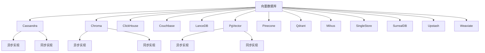
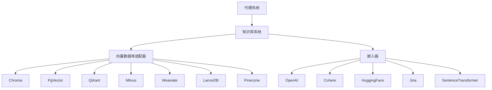
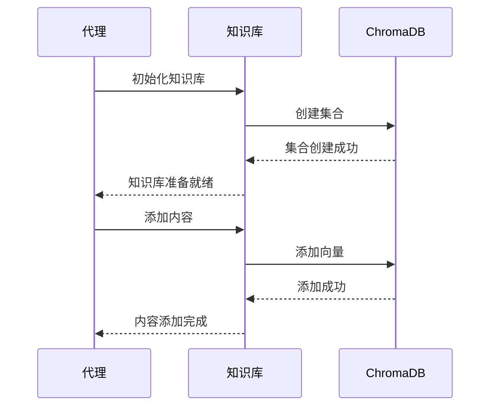
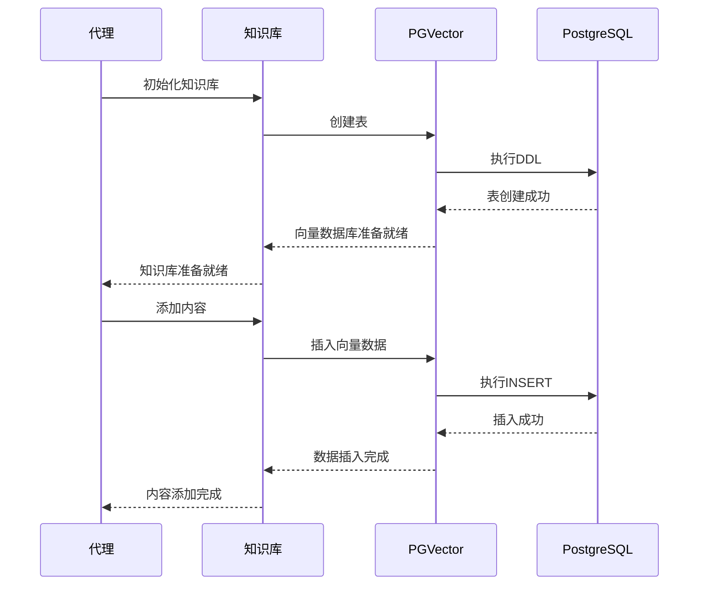
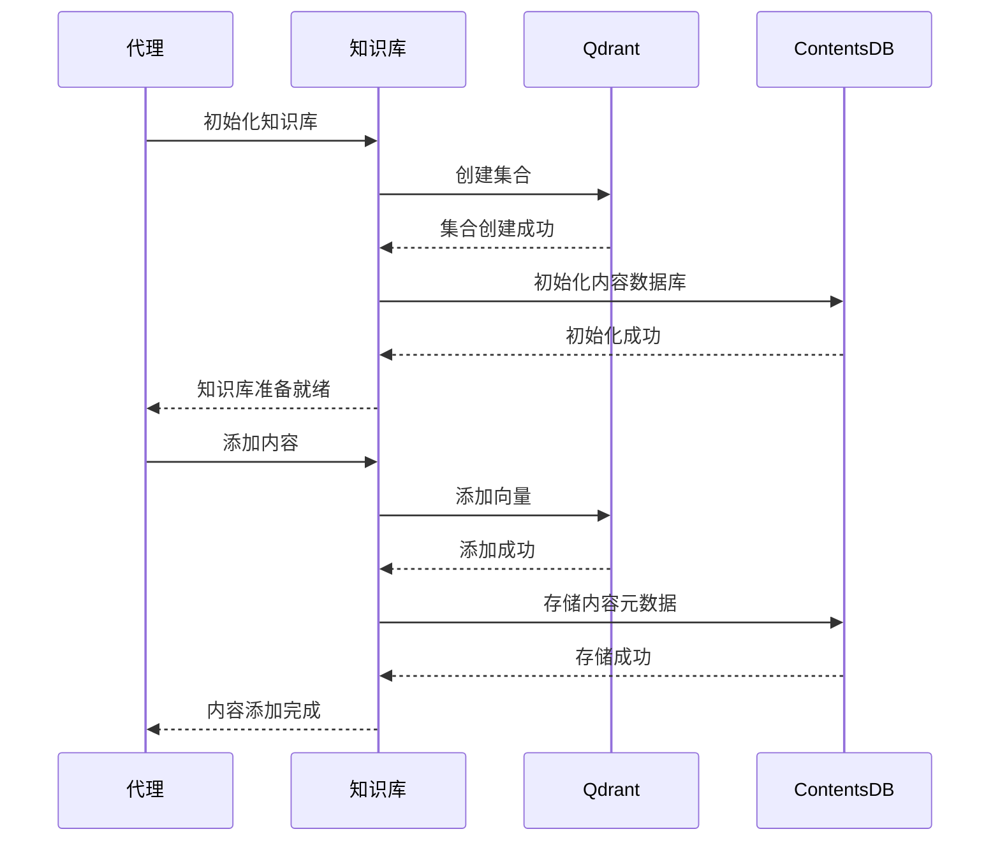
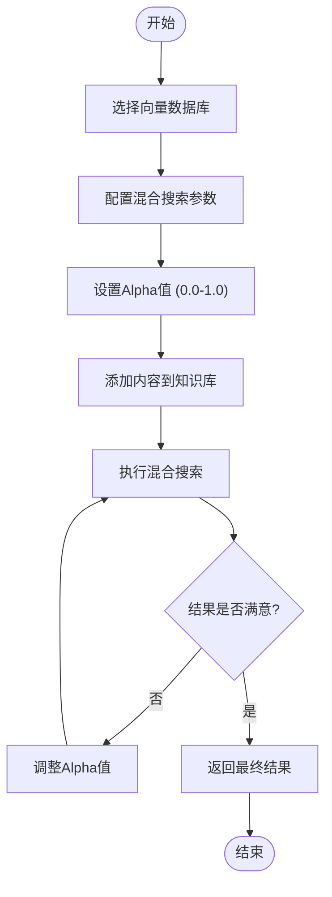
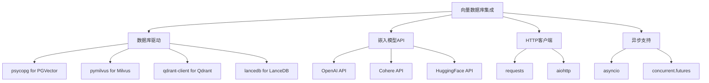

# 向量数据库

<cite>
**本文档中引用的文件**
- [chroma_db.py](file://cookbook/knowledge/vector_db/chroma_db/chroma_db.py)
- [pgvector_db.py](file://cookbook/knowledge/vector_db/pgvector/pgvector_db.py)
- [async_pg_vector.py](file://cookbook/knowledge/vector_db/pgvector/async_pg_vector.py)
- [qdrant_db.py](file://cookbook/knowledge/vector_db/qdrant_db/qdrant_db.py)
- [milvus_db_hybrid_search.py](file://cookbook/knowledge/vector_db/milvus_db/milvus_db_hybrid_search.py)
- [lance_db_hybrid_search.py](file://cookbook/knowledge/vector_db/lance_db/lance_db_hybrid_search.py)
- [weaviate_db_hybrid_search.py](file://cookbook/knowledge/vector_db/weaviate_db/weaviate_db_hybrid_search.py)
- [pgvector_hybrid_search.py](file://cookbook/knowledge/vector_db/pgvector/pgvector_hybrid_search.py)
- [agentic_rag_pgvector.py](file://cookbook/agents/rag/agentic_rag_pgvector.py)
- [agentic_rag_lancedb.py](file://cookbook/agents/rag/agentic_rag_lancedb.py)
- [openai_embedder.py](file://cookbook/knowledge/embedders/openai_embedder.py)
- [README.md](file://cookbook/knowledge/vector_db/README.md)
</cite>

## 目录
1. [简介](#简介)
2. [项目结构](#项目结构)
3. [核心组件](#核心组件)
4. [架构概述](#架构概述)
5. [详细组件分析](#详细组件分析)
6. [依赖分析](#依赖分析)
7. [性能考虑](#性能考虑)
8. [故障排除指南](#故障排除指南)
9. [结论](#结论)

## 简介
向量数据库是现代人工智能系统的关键组成部分，用于存储嵌入向量并支持相似性搜索，从而实现知识检索、语义搜索和检索增强生成（RAG）等场景。本项目展示了如何集成多种向量数据库系统，包括Chroma、Pinecone、Weaviate、Qdrant、Milvus、LanceDB、SingleStore、Cassandra、ClickHouse、Couchbase、SurrealDB、Upstash和PGVector。这些数据库通过统一的接口与Agno框架集成，支持从本地嵌入式数据库到云托管解决方案的各种部署需求。

## 项目结构
本项目在`cookbook/knowledge/vector_db`目录下组织了各种向量数据库的实现。每个数据库都有独立的子目录，包含同步和异步实现示例。这种结构化的组织方式使得开发者可以轻松找到特定数据库的集成示例。

**图示来源**
- [README.md](file://cookbook/knowledge/vector_db/README.md)

**本节来源**
- [README.md](file://cookbook/knowledge/vector_db/README.md)

## 核心组件
向量数据库集成的核心组件包括知识库（Knowledge）系统、向量数据库适配器和嵌入器（Embedder）。知识库系统作为统一接口，将向量数据库与代理（Agent）连接起来。每个向量数据库都有对应的适配器实现，如`Pgvecto`r、`ChromaDb`、`Qdrant`等。嵌入器负责将文本转换为向量表示，支持多种模型提供商，如OpenAI、Cohere、HuggingFace等。

**本节来源**
- [README.md](file://cookbook/knowledge/vector_db/README.md)
- [openai_embedder.py](file://cookbook/knowledge/embedders/openai_embedder.py)

## 架构概述
向量数据库集成架构采用分层设计，上层是代理系统，中间是知识库抽象层，底层是具体的向量数据库实现。这种架构支持多种搜索模式，包括纯向量搜索、混合搜索（结合关键词和向量搜索）等。系统还支持同步和异步操作，满足不同应用场景的性能需求。

**图示来源**
- [README.md](file://cookbook/knowledge/vector_db/README.md)
- [agentic_rag_pgvector.py](file://cookbook/agents/rag/agentic_rag_pgvector.py)

## 详细组件分析
### ChromaDB集成分析
ChromaDB是一个轻量级的嵌入式向量数据库，适合本地开发和原型设计。它支持持久化客户端，可以将数据保存到本地文件系统。

**图示来源**
- [chroma_db.py](file://cookbook/knowledge/vector_db/chroma_db/chroma_db.py)

**本节来源**
- [chroma_db.py](file://cookbook/knowledge/vector_db/chroma_db/chroma_db.py)

### PGVector集成分析
PGVector是PostgreSQL的扩展，将向量搜索功能集成到关系型数据库中。这种集成方式特别适合已经使用PostgreSQL的应用，无需引入新的数据库系统。

**图示来源**
- [pgvector_db.py](file://cookbook/knowledge/vector_db/pgvector/pgvector_db.py)
- [async_pg_vector.py](file://cookbook/knowledge/vector_db/pgvector/async_pg_vector.py)

**本节来源**
- [pgvector_db.py](file://cookbook/knowledge/vector_db/pgvector/pgvector_db.py)
- [async_pg_vector.py](file://cookbook/knowledge/vector_db/pgvector/async_pg_vector.py)

### Qdrant集成分析
Qdrant是一个高性能的向量搜索引擎，支持分布式部署。它提供了丰富的API和灵活的配置选项，适合大规模生产环境。

**图示来源**
- [qdrant_db.py](file://cookbook/knowledge/vector_db/qdrant_db/qdrant_db.py)

**本节来源**
- [qdrant_db.py](file://cookbook/knowledge/vector_db/qdrant_db/qdrant_db.py)

### 混合搜索分析
混合搜索结合了关键词搜索和向量搜索的优势，通过调整alpha参数来平衡两种搜索方式的权重。当alpha为0时，是纯关键词搜索；当alpha为1时，是纯向量搜索。

**图示来源**
- [milvus_db_hybrid_search.py](file://cookbook/knowledge/vector_db/milvus_db/milvus_db_hybrid_search.py)
- [lance_db_hybrid_search.py](file://cookbook/knowledge/vector_db/lance_db/lance_db_hybrid_search.py)
- [weaviate_db_hybrid_search.py](file://cookbook/knowledge/vector_db/weaviate_db/weaviate_db_hybrid_search.py)
- [pgvector_hybrid_search.py](file://cookbook/knowledge/vector_db/pgvector/pgvector_hybrid_search.py)

**本节来源**
- [milvus_db_hybrid_search.py](file://cookbook/knowledge/vector_db/milvus_db/milvus_db_hybrid_search.py)
- [lance_db_hybrid_search.py](file://cookbook/knowledge/vector_db/lance_db/lance_db_hybrid_search.py)
- [weaviate_db_hybrid_search.py](file://cookbook/knowledge/vector_db/weaviate_db/weaviate_db_hybrid_search.py)
- [pgvector_hybrid_search.py](file://cookbook/knowledge/vector_db/pgvector/pgvector_hybrid_search.py)

## 依赖分析
向量数据库集成依赖于多个外部库和系统。每个数据库都有特定的依赖要求，如PGVector需要PostgreSQL和psycopg库，Qdrant需要HTTP客户端库等。系统通过抽象层隔离这些依赖，使得应用代码不需要直接处理底层数据库的复杂性。

**图示来源**
- [README.md](file://cookbook/knowledge/vector_db/README.md)
- [agentic_rag_pgvector.py](file://cookbook/agents/rag/agentic_rag_pgvector.py)
- [agentic_rag_lancedb.py](file://cookbook/agents/rag/agentic_rag_lancedb.py)

**本节来源**
- [README.md](file://cookbook/knowledge/vector_db/README.md)
- [agentic_rag_pgvector.py](file://cookbook/agents/rag/agentic_rag_pgvector.py)
- [agentic_rag_lancedb.py](file://cookbook/agents/rag/agentic_rag_lancedb.py)

## 性能考虑
向量数据库的性能受多种因素影响，包括索引类型、距离度量、向量维度和硬件资源。对于大规模数据集，建议使用专门的向量数据库如Milvus或Pinecone，它们针对向量搜索进行了优化。对于小规模数据集，嵌入式解决方案如Chroma或LanceDB可能更合适，因为它们减少了系统复杂性。

- **索引类型**: HNSW、IVF等索引类型对搜索性能有显著影响
- **距离度量**: 余弦距离、欧几里得距离等不同度量方式适用于不同场景
- **向量维度**: 更高的维度通常意味着更好的语义表示，但会增加存储和计算成本
- **批量操作**: 使用批量插入和查询可以显著提高吞吐量
- **异步处理**: 对于高并发场景，异步API可以更好地利用系统资源

## 故障排除指南
### 连接问题
当遇到数据库连接问题时，首先检查连接字符串和网络配置。对于云托管的数据库，确保API密钥和端点配置正确。

**本节来源**
- [pgvector_db.py](file://cookbook/knowledge/vector_db/pgvector/pgvector_db.py)
- [qdrant_db.py](file://cookbook/knowledge/vector_db/qdrant_db/qdrant_db.py)

### 混合搜索效果不佳
如果混合搜索结果不理想，尝试调整alpha参数。从0.5开始，根据结果质量逐步调整。同时检查关键词搜索和向量搜索的单独效果，确保两者都正常工作。

**本节来源**
- [weaviate_db_hybrid_search.py](file://cookbook/knowledge/vector_db/weaviate_db/weaviate_db_hybrid_search.py)
- [pgvector_hybrid_search.py](file://cookbook/knowledge/vector_db/pgvector/pgvector_hybrid_search.py)

### 向量维度不匹配
确保嵌入器生成的向量维度与数据库表的定义一致。不同嵌入模型可能生成不同维度的向量，需要相应调整数据库模式。

**本节来源**
- [openai_embedder.py](file://cookbook/knowledge/embedders/openai_embedder.py)
- [pgvector_db.py](file://cookbook/knowledge/vector_db/pgvector/pgvector_db.py)

## 结论
本项目展示了如何集成多种向量数据库系统，为知识检索、语义搜索和RAG场景提供了灵活的解决方案。通过统一的API和模块化设计，开发者可以轻松在不同数据库之间切换，根据具体需求选择最适合的解决方案。混合搜索功能进一步增强了系统的灵活性和搜索质量。未来的工作可以包括更多数据库的集成、性能优化和更高级的搜索功能。