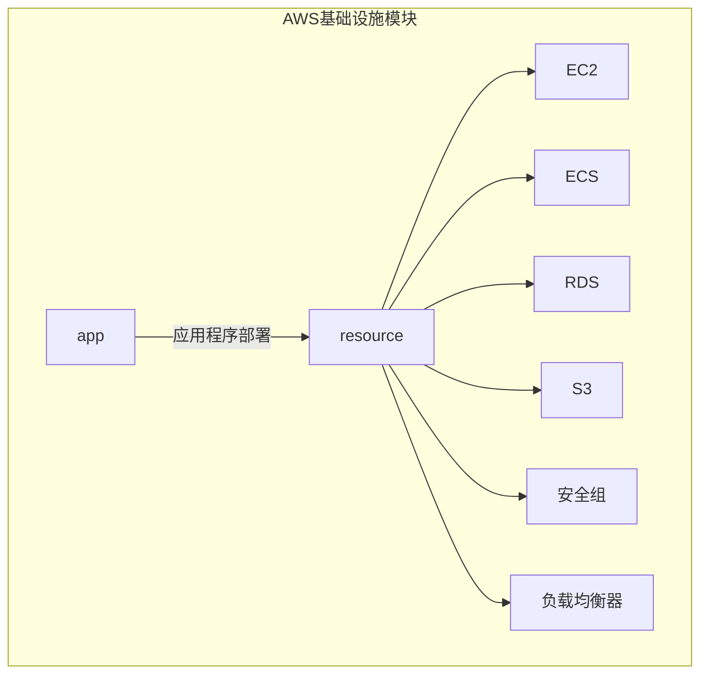
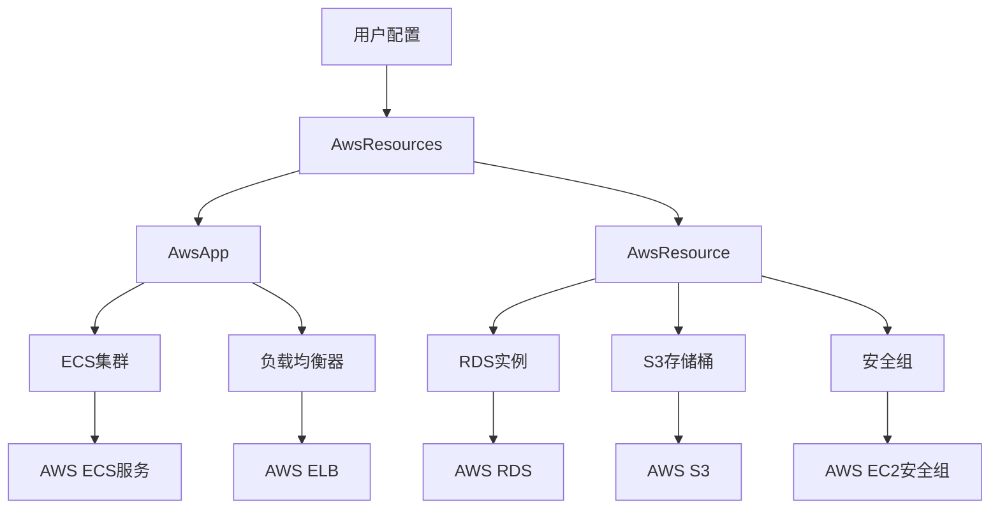
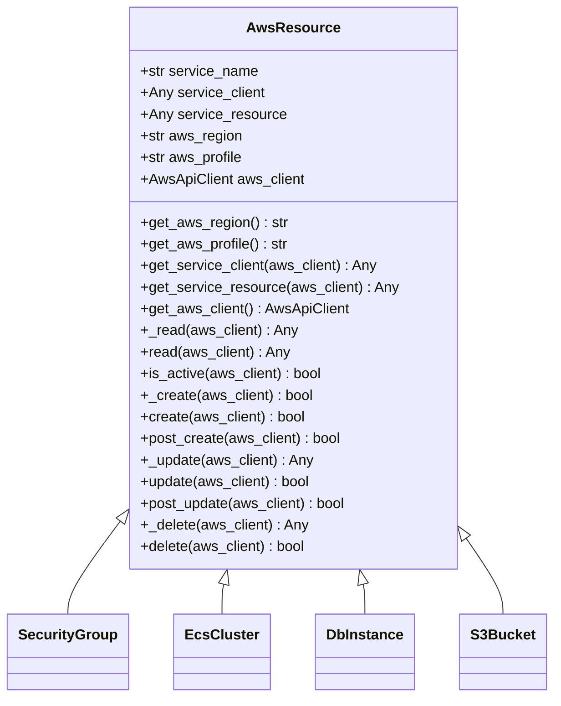
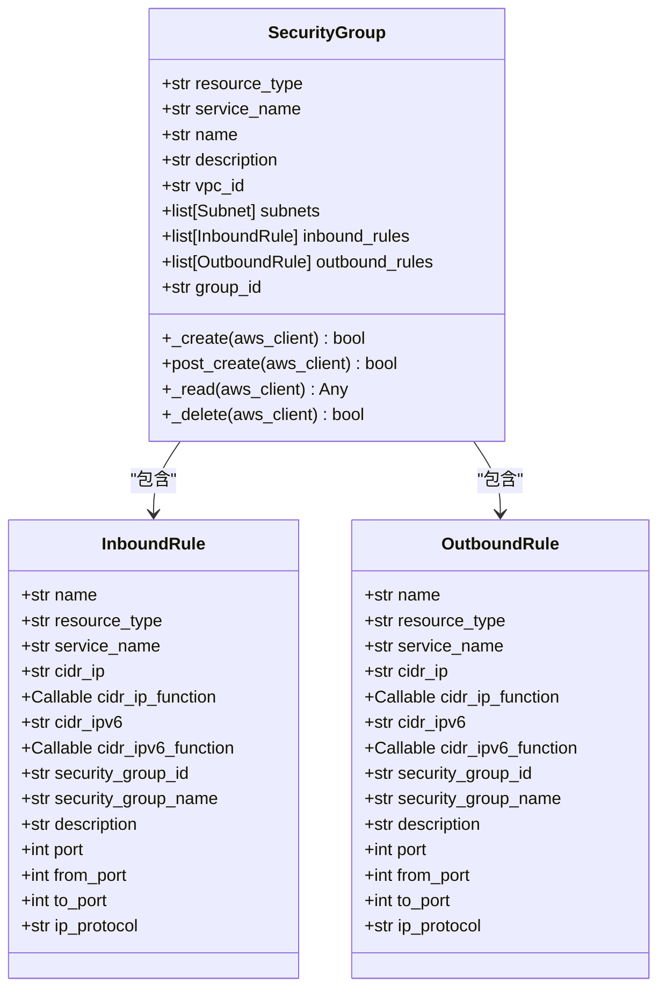
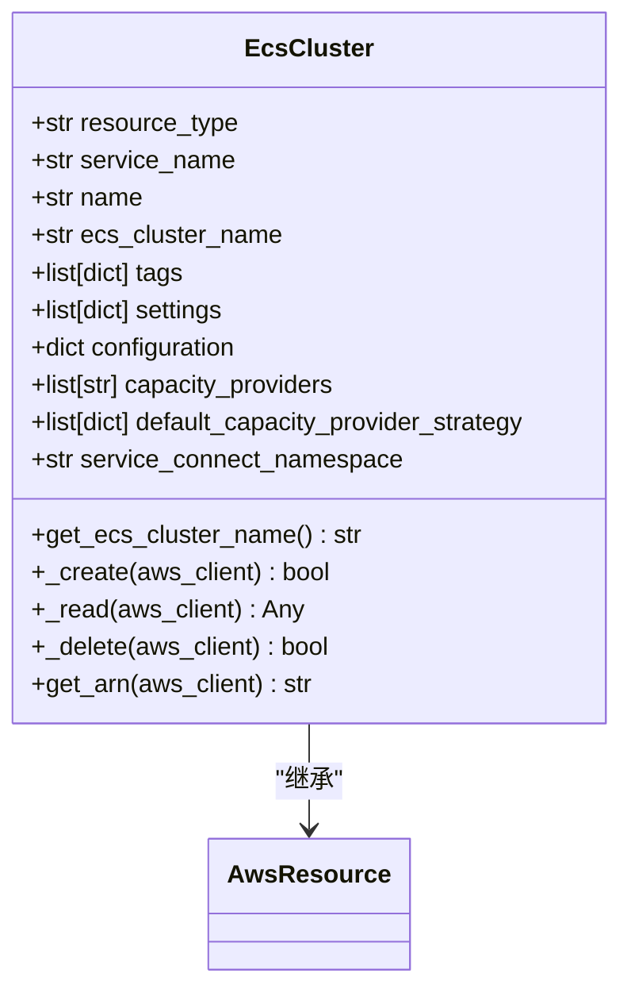
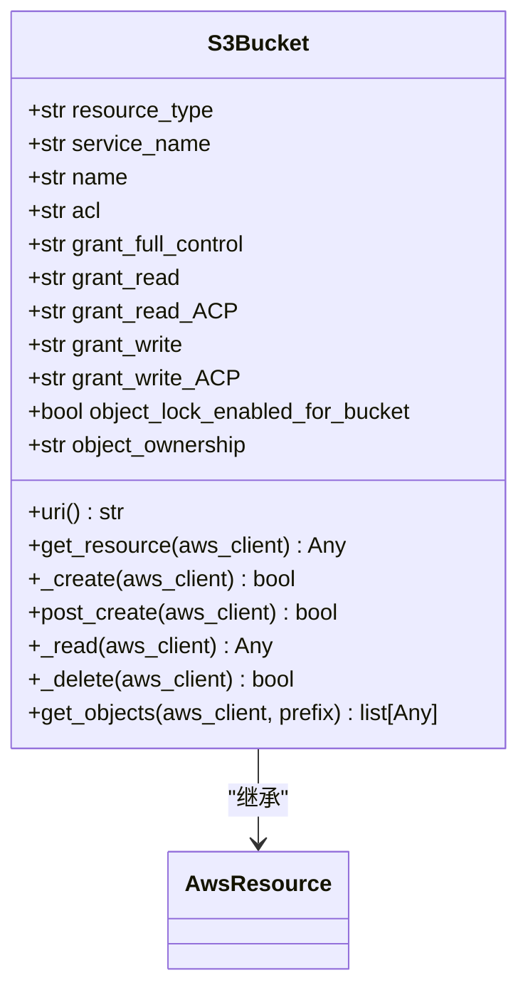
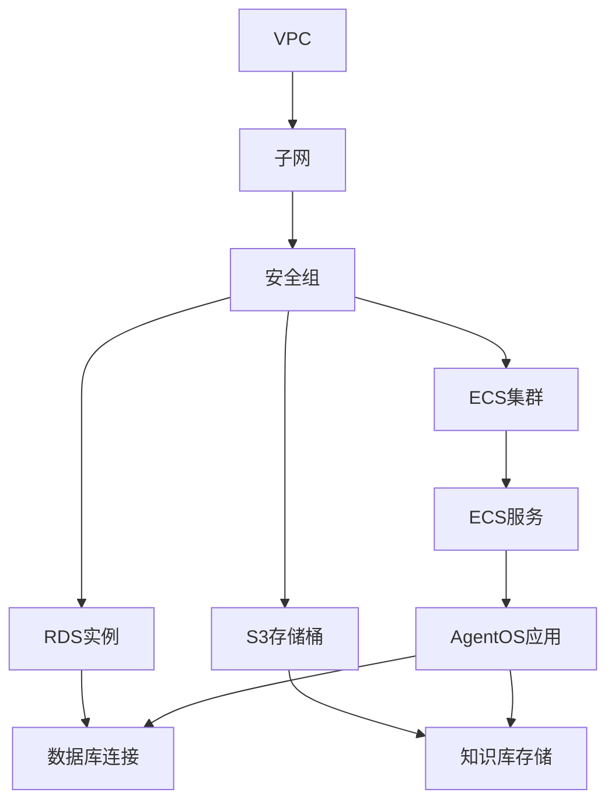

# AWS部署

<cite>
**本文档中引用的文件**  
- [resources.py](file://libs/agno_infra/agno/aws/resources.py)
- [base.py](file://libs/agno_infra/agno/aws/app/base.py)
- [aws_client.py](file://libs/agno_infra/agno/aws/api_client.py)
- [security_group.py](file://libs/agno_infra/agno/aws/resource/ec2/security_group.py)
- [cluster.py](file://libs/agno_infra/agno/aws/resource/ecs/cluster.py)
- [db_instance.py](file://libs/agno_infra/agno/aws/resource/rds/db_instance.py)
- [bucket.py](file://libs/agno_infra/agno/aws/resource/s3/bucket.py)
- [infra_cli.py](file://libs/agno_infra/agno/cli/infra_cli.py)
- [README.md](file://libs/agno_infra/README.md)
</cite>

## 目录
1. [简介](#简介)
2. [项目结构](#项目结构)
3. [核心组件](#核心组件)
4. [架构概述](#架构概述)
5. [详细组件分析](#详细组件分析)
6. [依赖分析](#依赖分析)
7. [性能考虑](#性能考虑)
8. [故障排除指南](#故障排除指南)
9. [结论](#结论)

## 简介
本文档提供了在AWS上部署Agno的详细指南。我们将介绍如何使用`libs/agno_infra/agno/aws`中的基础设施代码自动化部署Agno环境。该框架支持通过IaC（基础设施即代码）方法配置EC2实例或ECS集群来运行AgentOS，设置RDS数据库实例，配置S3用于知识库存储，以及通过IAM、安全组和VPC实现安全隔离。

**Section sources**
- [README.md](file://libs/agno_infra/README.md#L1-L140)

## 项目结构
Agno的AWS基础设施代码位于`libs/agno_infra/agno/aws`目录下，采用模块化设计，包含计算、存储、数据库和网络等核心服务的抽象。该结构支持通过代码定义和管理完整的云基础设施。

**Diagram sources**
- [resources.py](file://libs/agno_infra/agno/aws/resources.py#L1-L546)
- [base.py](file://libs/agno_infra/agno/aws/app/base.py#L1-L741)

**Section sources**
- [resources.py](file://libs/agno_infra/agno/aws/resources.py#L1-L546)

## 核心组件
Agno的AWS基础设施框架包含多个核心组件，用于管理云资源的生命周期。这些组件包括AWS资源基类、应用程序抽象、API客户端和资源管理器，共同构成了一个完整的基础设施即代码解决方案。

**Section sources**
- [resources.py](file://libs/agno_infra/agno/aws/resources.py#L1-L546)
- [base.py](file://libs/agno_infra/agno/aws/app/base.py#L1-L741)
- [aws_client.py](file://libs/agno_infra/agno/aws/api_client.py#L1-L44)

## 架构概述
Agno的AWS部署架构采用分层设计，通过抽象层将基础设施配置与AWS服务API解耦。该架构支持声明式资源配置，允许开发者通过Python代码定义和管理云资源，实现基础设施的版本控制和自动化部署。

**Diagram sources**
- [resources.py](file://libs/agno_infra/agno/aws/resources.py#L1-L546)
- [base.py](file://libs/agno_infra/agno/aws/app/base.py#L1-L741)

## 详细组件分析

### AWS资源管理分析
Agno的AWS资源管理基于面向对象的设计模式，每个AWS服务都有对应的资源类。这些类继承自`AwsResource`基类，实现了创建、读取、更新和删除（CRUD）操作的标准化接口。

#### 资源基类分析

**Diagram sources**
- [base.py](file://libs/agno_infra/agno/aws/resource/base.py#L1-L209)

**Section sources**
- [base.py](file://libs/agno_infra/agno/aws/resource/base.py#L1-L209)

### 安全组配置分析
安全组是AWS网络隔离的核心组件。Agno提供了灵活的安全组配置，支持入站和出站规则的精细控制，确保部署环境的安全性。

#### 安全组类分析

**Diagram sources**
- [security_group.py](file://libs/agno_infra/agno/aws/resource/ec2/security_group.py#L1-L589)

**Section sources**
- [security_group.py](file://libs/agno_infra/agno/aws/resource/ec2/security_group.py#L1-L589)

### ECS集群部署分析
ECS（Elastic Container Service）是运行AgentOS的核心计算服务。Agno提供了完整的ECS集群管理功能，包括集群创建、任务定义和服务部署。

#### ECS集群类分析

**Diagram sources**
- [cluster.py](file://libs/agno_infra/agno/aws/resource/ecs/cluster.py#L1-L148)

**Section sources**
- [cluster.py](file://libs/agno_infra/agno/aws/resource/ecs/cluster.py#L1-L148)

### RDS数据库配置分析
RDS（Relational Database Service）用于持久化存储AgentOS的结构化数据。Agno支持多种数据库引擎和配置选项，确保数据的高可用性和安全性。

#### RDS实例类分析

```mermaid
classDiagram
class DbInstance {
+str resource_type
+str service_name
+str name
+str engine
+str engine_version
+str db_instance_class
+str db_name
+str db_instance_identifier
+int allocated_storage
+str db_parameter_group_name
+int port
+str master_username
+str master_user_password
+Path secrets_file
+SecretsManager aws_secret
+str availability_zone
+str db_subnet_group_name
+DbSubnetGroup db_subnet_group
+bool publicly_accessible
+str db_cluster_identifier
+str storage_type
+int iops
+list[str] vpc_security_group_ids
+CloudFormationStack vpc_stack
+list[SecurityGroup] db_security_groups
+int backup_retention_period
+str character_set_name
+str preferred_backup_window
+str preferred_maintenance_window
+bool multi_az
+bool auto_minor_version_upgrade
+str license_model
+str option_group_name
+str nchar_character_set_name
+list[dict] tags
+str tde_credential_arn
+str tde_credential_password
+bool storage_encrypted
+str kms_key_id
+str domain
+bool copy_tags_to_snapshot
+int monitoring_interval
+str monitoring_role_arn
+str domain_iam_role_name
+int promotion_tier
+str timezone
+bool enable_iam_database_authentication
+bool enable_performance_insights
+str performance_insights_kms_key_id
+int performance_insights_retention_period
+list[str] enable_cloudwatch_logs_exports
+list[dict] processor_features
+bool deletion_protection
+int max_allocated_storage
+bool enable_customer_owned_ip
+str custom_iam_instance_profile
+str backup_target
+str network_type
+int storage_throughput
+str ca_certificate_identifier
+str db_system_id
+bool dedicated_log_volume
+bool manage_master_user_password
+str master_user_secret_kms_key_id
+bool skip_final_snapshot
+str final_db_snapshot_identifier
+bool delete_automated_backups
+bool apply_immediately
+bool allow_major_version_upgrade
+str new_db_instance_identifier
+int db_port_number
+dict cloudwatch_logs_export_configuration
+bool use_default_processor_features
+bool certificate_rotation_restart
+str replica_mode
+str aws_backup_recovery_point_arn
+str automation_mode
+int resume_full_automation_mode_minutes
+bool rotate_master_user_password
}
DbInstance --> AwsResource : "继承"
```

**Diagram sources**
- [db_instance.py](file://libs/agno_infra/agno/aws/resource/rds/db_instance.py#L1-L743)

**Section sources**
- [db_instance.py](file://libs/agno_infra/agno/aws/resource/rds/db_instance.py#L1-L743)

### S3存储桶配置分析
S3（Simple Storage Service）用于存储Agno的知识库和其他非结构化数据。Agno提供了完整的S3存储桶管理功能，支持访问控制和对象管理。

#### S3存储桶类分析

**Diagram sources**
- [bucket.py](file://libs/agno_infra/agno/aws/resource/s3/bucket.py#L1-L197)

**Section sources**
- [bucket.py](file://libs/agno_infra/agno/aws/resource/s3/bucket.py#L1-L197)

## 依赖分析
Agno的AWS基础设施组件之间存在明确的依赖关系。这些依赖关系确保了资源按正确的顺序创建和销毁，避免了部署过程中的资源冲突和依赖问题。

**Diagram sources**
- [resources.py](file://libs/agno_infra/agno/aws/resources.py#L1-L546)
- [base.py](file://libs/agno_infra/agno/aws/app/base.py#L1-L741)

**Section sources**
- [resources.py](file://libs/agno_infra/agno/aws/resources.py#L1-L546)

## 性能考虑
在AWS上部署Agno时，需要考虑多个性能优化因素。这些包括计算资源的适当配置、数据库性能调优、存储访问优化以及网络延迟最小化。通过合理配置ECS任务的CPU和内存参数、使用适当的RDS实例类型以及优化S3访问模式，可以显著提升Agno系统的整体性能。

## 故障排除指南
在部署Agno时可能遇到各种问题，包括AWS凭据配置错误、资源配额不足、网络连接问题等。建议首先检查AWS CLI配置是否正确，然后验证IAM权限是否足够，最后检查VPC和安全组配置是否允许必要的网络流量。

**Section sources**
- [aws_client.py](file://libs/agno_infra/agno/aws/api_client.py#L1-L44)
- [resources.py](file://libs/agno_infra