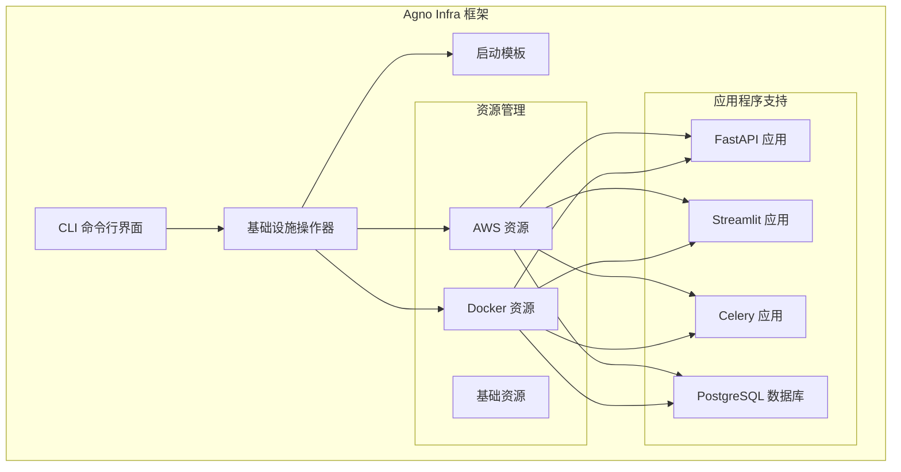
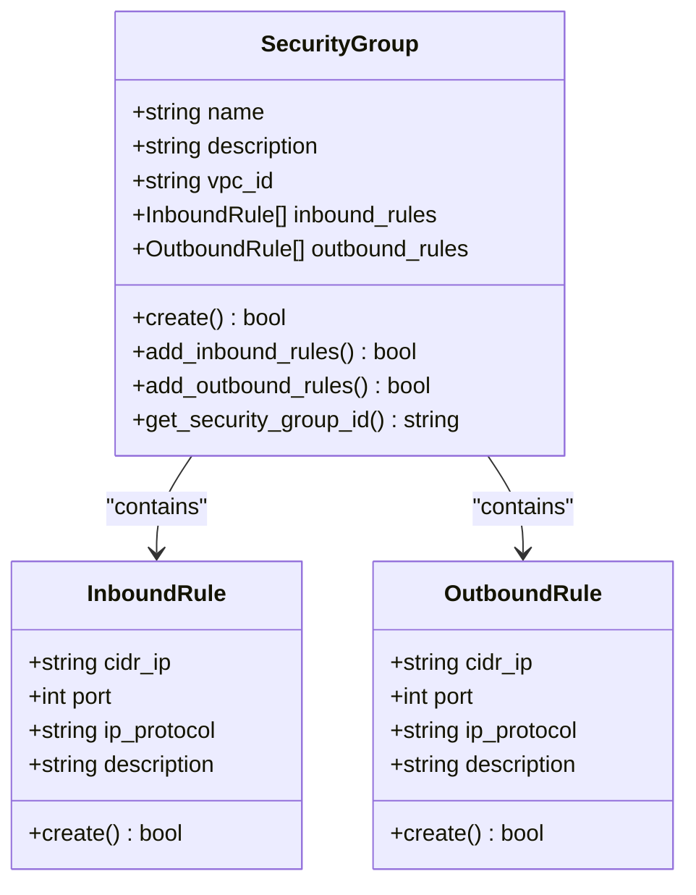
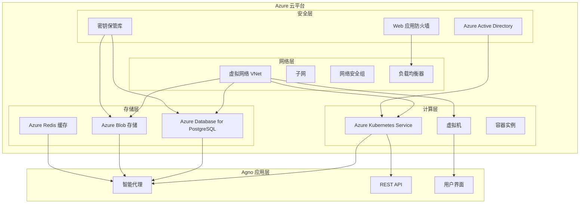
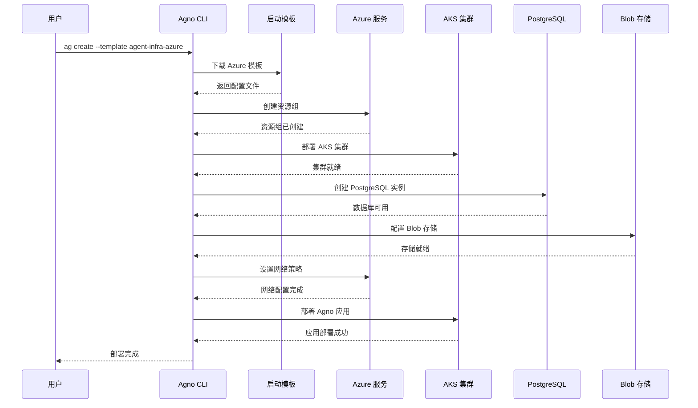

# Azure 部署指南

<cite>
**本文档中引用的文件**
- [README.md](file://libs/agno_infra/README.md)
- [operator.py](file://libs/agno_infra/agno/infra/operator.py)
- [enums.py](file://libs/agno_infra/agno/infra/enums.py)
- [base.py](file://libs/agno_infra/agno/aws/resource/base.py)
- [security_group.py](file://libs/agno_infra/agno/aws/resource/ec2/security_group.py)
- [db_instance.py](file://libs/agno_infra/agno/aws/resource/rds/db_instance.py)
- [service.py](file://libs/agno_infra/agno/aws/resource/ecs/service.py)
- [fastapi.py](file://libs/agno_infra/agno/aws/app/fastapi/fastapi.py)
- [entrypoint.py](file://libs/agno_infra/agno/cli/entrypoint.py)
- [infra_cli.py](file://libs/agno_infra/agno/cli/infra_cli.py)
- [resource.py](file://libs/agno_infra/agno/base/resource.py)
</cite>

## 目录
1. [简介](#简介)
2. [项目架构概览](#项目架构概览)
3. [核心组件分析](#核心组件分析)
4. [Azure 部署架构](#azure-部署架构)
5. [详细部署步骤](#详细部署步骤)
6. [Azure 特定配置](#azure-特定配置)
7. [安全最佳实践](#安全最佳实践)
8. [监控和日志记录](#监控和日志记录)
9. [故障排除指南](#故障排除指南)
10. [总结](#总结)

## 简介

Agno 是一个强大的智能代理框架，支持多种云平台的基础设施管理。本指南专门介绍如何使用 `agno-infra` 框架在 Azure 上部署 Agno 智能代理系统。该框架提供了统一的接口来管理跨多个平台的基础设施，包括 AWS、Docker 和本地环境，使部署 AI 代理及其支持服务变得简单高效。

## 项目架构概览

Agno Infra 框架采用模块化设计，支持多平台基础设施管理：



**图表来源**
- [README.md](file://libs/agno_infra/README.md#L1-L140)
- [operator.py](file://libs/agno_infra/agno/infra/operator.py#L1-L50)

**章节来源**
- [README.md](file://libs/agno_infra/README.md#L1-L140)
- [operator.py](file://libs/agno_infra/agno/infra/operator.py#L1-L100)

## 核心组件分析

### 基础资源类

所有基础设施资源都继承自 `InfraResource` 基类，提供统一的生命周期管理：

```python
class InfraResource(InfraBase):
    """基础设施资源的基础类"""
    
    # 资源名称（必需）
    name: str
    # 资源类型
    resource_type: Optional[str] = None
    # 缓存的数据
    active_resource: Optional[Any] = None
    resource_created: bool = False
    resource_updated: bool = False
    resource_deleted: bool = False
```

### AWS 资源基类

AWS 资源继承自 `AwsResource`，提供 AWS 特定的功能：

```python
class AwsResource(InfraResource):
    """AWS 资源的基础类"""
    
    service_name: str
    service_client: Optional[Any] = None
    aws_region: Optional[str] = None
    aws_profile: Optional[str] = None
    aws_client: Optional[AwsApiClient] = None
```

### 安全组管理

安全组是 Azure 部署中的关键组件，用于控制网络访问：



**图表来源**
- [security_group.py](file://libs/agno_infra/agno/aws/resource/ec2/security_group.py#L1-L100)

**章节来源**
- [base.py](file://libs/agno_infra/agno/aws/resource/base.py#L1-L209)
- [security_group.py](file://libs/agno_infra/agno/aws/resource/ec2/security_group.py#L1-L589)

## Azure 部署架构

### 整体架构设计



### 组件关系图



**图表来源**
- [operator.py](file://libs/agno_infra/agno/infra/operator.py#L20-L80)
- [enums.py](file://libs/agno_infra/agno/infra/enums.py#L1-L5)

## 详细部署步骤

### 步骤 1：安装 Agno Infra

首先需要安装 Agno Infra 框架：

```bash
# 使用 pip 安装
pip install agno-infra

# 安装 Azure 支持（如果需要）
pip install agno-infra[azure]

# 开发环境安装
pip install agno-infra[dev]
```

### 步骤 2：创建 Azure 部署项目

使用 Azure 模板创建新的部署项目：

```bash
# 创建新的 Azure 部署项目
ag create agno-azure-deploy --template agent-infra-azure

# 进入项目目录
cd agno-azure-deploy
```

### 步骤 3：配置 Azure 认证

设置 Azure 认证凭据：

```bash
# 方法 1：使用 Azure CLI
az login

# 方法 2：设置环境变量
export AZURE_SUBSCRIPTION_ID="your-subscription-id"
export AZURE_CLIENT_ID="your-client-id"
export AZURE_CLIENT_SECRET="your-client-secret"
export AZURE_TENANT_ID="your-tenant-id"
```

### 步骤 4：配置基础设施参数

编辑 `infra/settings.yaml` 文件：

```yaml
# Azure 基础设施配置
azure:
  subscription_id: "${AZURE_SUBSCRIPTION_ID}"
  resource_group: "agno-rg"
  location: "eastus"
  vnet_cidr: "10.0.0.0/16"
  
# 应用程序配置
app:
  name: "agno-agent"
  image: "agnohq/fastapi:latest"
  replicas: 3
  cpu: "1"
  memory: "2Gi"
  
# 数据库配置
database:
  engine: "postgres"
  version: "15"
  instance_type: "Standard_B2s"
  storage_gb: 32
  
# 存储配置
storage:
  blob_account: "agnoaccount"
  container: "agno-data"
```

### 步骤 5：部署基础设施

```bash
# 部署基础设施
ag infra up

# 查看部署状态
ag infra status

# 验证部署
kubectl get pods
```

### 步骤 6：部署 Agno 应用

```bash
# 部署 Agno 应用
kubectl apply -f k8s/deployment.yaml

# 查看应用状态
kubectl get deployments
kubectl get services
```

**章节来源**
- [operator.py](file://libs/agno_infra/agno/infra/operator.py#L20-L100)
- [infra_cli.py](file://libs/agno_infra/agno/cli/infra_cli.py#L20-L100)

## Azure 特定配置

### AKS 集群配置

Azure Kubernetes Service (AKS) 是部署 Agno 应用的理想选择：

```yaml
# k8s/aks-cluster.yaml
apiVersion: containerservice.k8s.io/v1
kind: ManagedCluster
metadata:
  name: agno-cluster
spec:
  dnsPrefix: agno
  nodeResourceGroup: agno-nodes
  agentPoolProfiles:
  - name: nodepool1
    count: 3
    vmSize: Standard_DS2_v2
    osType: Linux
    mode: System
  addonProfiles:
    omsagent:
      enabled: true
      config:
        logAnalyticsWorkspaceResourceID: "/subscriptions/${SUBSCRIPTION_ID}/resourceGroups/${RESOURCE_GROUP}/providers/Microsoft.OperationalInsights/workspaces/${WORKSPACE_NAME}"
```

### PostgreSQL 配置

使用 Azure Database for PostgreSQL：

```yaml
# k8s/postgres-service.yaml
apiVersion: v1
kind: Service
metadata:
  name: postgres-service
spec:
  selector:
    app: postgres
  ports:
  - port: 5432
    targetPort: 5432
---
apiVersion: apps/v1
kind: Deployment
metadata:
  name: postgres-deployment
spec:
  replicas: 1
  selector:
    matchLabels:
      app: postgres
  template:
    metadata:
      labels:
        app: postgres
    spec:
      containers:
      - name: postgres
        image: postgres:15
        env:
        - name: POSTGRES_DB
          value: "agno"
        - name: POSTGRES_USER
          value: "agno"
        - name: POSTGRES_PASSWORD
          valueFrom:
            secretKeyRef:
              name: postgres-secret
              key: password
        ports:
        - containerPort: 5432
```

### Blob 存储配置

```yaml
# k8s/blob-storage.yaml
apiVersion: v1
kind: ConfigMap
metadata:
  name: blob-config
data:
  connection-string: "${BLOB_CONNECTION_STRING}"
---
apiVersion: apps/v1
kind: Deployment
metadata:
  name: agno-app
spec:
  template:
    spec:
      containers:
      - name: agno-container
        env:
        - name: BLOB_CONNECTION_STRING
          valueFrom:
            configMapKeyRef:
              name: blob-config
              key: connection-string
```

### 网络配置

```yaml
# k8s/network-policy.yaml
apiVersion: networking.k8s.io/v1
kind: NetworkPolicy
metadata:
  name: agno-network-policy
spec:
  podSelector:
    matchLabels:
      app: agno
  policyTypes:
  - Ingress
  - Egress
  ingress:
  - from:
    - podSelector:
        matchLabels:
          app: nginx
    ports:
    - protocol: TCP
      port: 80
  egress:
  - to:
    - podSelector:
        matchLabels:
          app: postgres
    ports:
    - protocol: TCP
      port: 5432
```

## 安全最佳实践

### Azure Active Directory 集成

```yaml
# k8s/azure-ad-auth.yaml
apiVersion: v1
kind: ConfigMap
metadata:
  name: auth-config
data:
  client-id: "${AZURE_AD_CLIENT_ID}"
  tenant-id: "${AZURE_AD_TENANT_ID}"
---
apiVersion: apps/v1
kind: Deployment
metadata:
  name: agno-app
spec:
  template:
    spec:
      containers:
      - name: agno-container
        env:
        - name: AUTH_AZURE_AD_CLIENT_ID
          valueFrom:
            configMapKeyRef:
              name: auth-config
              key: client-id
        - name: AUTH_AZURE_AD_TENANT_ID
          valueFrom:
            configMapKeyRef:
              name: auth-config
              key: tenant-id
```

### 密钥管理

```yaml
# k8s/secrets.yaml
apiVersion: v1
kind: Secret
metadata:
  name: agno-secrets
type: Opaque
data:
  postgres-password: ${POSTGRES_PASSWORD_BASE64}
  blob-connection-string: ${BLOB_CONNECTION_STRING_BASE64}
---
apiVersion: apps/v1
kind: Deployment
metadata:
  name: agno-app
spec:
  template:
    spec:
      containers:
      - name: agno-container
        envFrom:
        - secretRef:
            name: agno-secrets
```

### 网络安全组配置

```yaml
# k8s/nsg-rules.yaml
apiVersion: networking.k8s.io/v1
kind: NetworkPolicy
metadata:
  name: agno-nsg-rules
spec:
  podSelector:
    matchLabels:
      app: agno
  policyTypes:
  - Ingress
  ingress:
  - from:
    - ipBlock:
        cidr: 10.0.0.0/16
    ports:
    - protocol: TCP
      port: 8000
  - from:
    - namespaceSelector:
        matchLabels:
          name: kube-system
    ports:
    - protocol: TCP
      port: 8000
```

### 监控和日志记录

```yaml
# k8s/monitoring.yaml
apiVersion: v1
kind: ConfigMap
metadata:
  name: prometheus-config
data:
  prometheus.yml: |
    global:
      scrape_interval: 15s
    scrape_configs:
    - job_name: 'agno'
      static_configs:
      - targets: ['agno-service:8000']
---
apiVersion: apps/v1
kind: Deployment
metadata:
  name: prometheus
spec:
  template:
    spec:
      containers:
      - name: prometheus
        image: prom/prometheus
        args:
        - '--config.file=/etc/prometheus/prometheus.yml'
        - '--storage.tsdb.path=/prometheus/'
        ports:
        - containerPort: 9090
```

## 监控和日志记录

### 应用监控

```yaml
# k8s/metrics-service.yaml
apiVersion: v1
kind: Service
metadata:
  name: agno-metrics
  labels:
    app: agno
spec:
  ports:
  - port: 8000
    targetPort: 8000
    name: http
  selector:
    app: agno
---
apiVersion: v1
kind: ServiceMonitor
metadata:
  name: agno-service-monitor
spec:
  selector:
    matchLabels:
      app: agno
  endpoints:
  - port: http
    interval: 30s
```

### 日志聚合

```yaml
# k8s/logging.yaml
apiVersion: v1
kind: ConfigMap
metadata:
  name: fluent-bit-config
data:
  fluent-bit.conf: |
    [INPUT]
        Name              tail
        Path              /var/log/containers/agno*.log
        Parser            docker
        Tag               kube.*
        Refresh_Interval  5
    [OUTPUT]
        Name  azure
        Match *
        Customer_ID ${LOG_ANALYTICS_WORKSPACE_ID}
        Shared_Key ${LOG_ANALYTICS_WORKSPACE_KEY}
```

## 故障排除指南

### 常见问题诊断

1. **AKS 集群连接问题**

```bash
# 检查 AKS 集群状态
az aks show --name agno-cluster --resource-group agno-rg

# 获取集群凭证
az aks get-credentials --name agno-cluster --resource-group agno-rg

# 检查节点状态
kubectl get nodes
```

2. **Pod 启动失败**

```bash
# 查看 Pod 事件
kubectl describe pod agno-pod-name

# 查看 Pod 日志
kubectl logs agno-pod-name

# 检查资源配置
kubectl get pods -o wide
```

3. **网络连接问题**

```bash
# 测试网络连通性
kubectl exec -it agno-pod-name -- ping postgres-service

# 检查网络策略
kubectl get networkpolicy

# 查看服务端点
kubectl get endpoints
```

### 性能优化

```yaml
# k8s/autoscaler.yaml
apiVersion: autoscaling/v2
kind: HorizontalPodAutoscaler
metadata:
  name: agno-hpa
spec:
  scaleTargetRef:
    apiVersion: apps/v1
    kind: Deployment
    name: agno-deployment
  minReplicas: 2
  maxReplicas: 10
  metrics:
  - type: Resource
    resource:
      name: cpu
      target:
        type: Utilization
        averageUtilization: 70
  - type: Resource
    resource:
      name: memory
      target:
        type: Utilization
        averageUtilization: 80
```

### 备份和恢复

```yaml
# k8s/backup-job.yaml
apiVersion: batch/v1
kind: CronJob
metadata:
  name: agno-backup
spec:
  schedule: "0 2 * * *"  # 每天凌晨2点执行
  jobTemplate:
    spec:
      template:
        spec:
          containers:
          - name: backup
            image: postgres:15
            command:
            - /bin/bash
            - -c
            - |
              pg_dump -h postgres-service -U agno agno > /backup/agno-$(date +%Y%m%d).sql
              az storage blob upload \
                --file /backup/agno-$(date +%Y%m%d).sql \
                --container-name backups \
                --name agno-$(date +%Y%m%d).sql \
                --connection-string ${BLOB_CONNECTION_STRING}
            volumeMounts:
            - name: backup-volume
              mountPath: /backup
          volumes:
          - name: backup-volume
            emptyDir: {}
          restartPolicy: OnFailure
```

**章节来源**
- [db_instance.py](file://libs/agno_infra/agno/aws/resource/rds/db_instance.py#L1-L200)
- [service.py](file://libs/agno_infra/agno/aws/resource/ecs/service.py#L1-L200)

## 总结

本指南详细介绍了如何使用 Agno Infra 框架在 Azure 上部署智能代理系统。通过使用 `agno-infra` 提供的统一接口，可以轻松地在 Azure 上部署包括 AKS 集群、PostgreSQL 数据库、Blob 存储等在内的完整基础设施。

关键要点：
- 使用 Agno Infra 框架简化 Azure 部署流程
- 利用模板快速创建标准化的基础设施配置
- 实施安全最佳实践，包括 Azure AD 集成和网络策略
- 配置完整的监控和日志记录解决方案
- 提供故障排除和性能优化指导

通过遵循本指南，您可以构建一个高可用、安全且可扩展的 Azure 托管 Agno 智能代理系统。