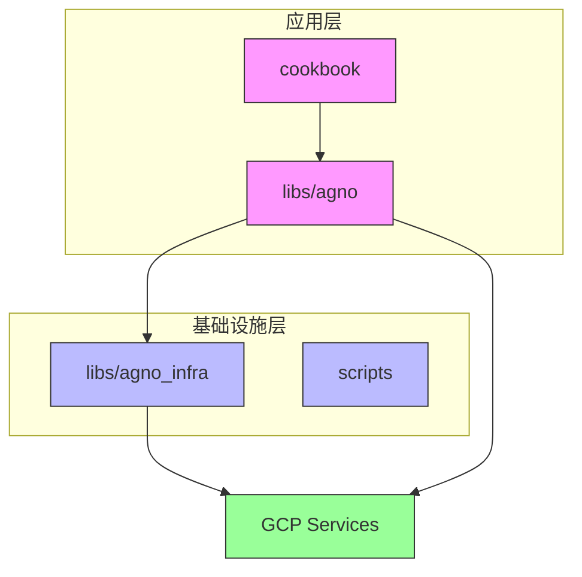
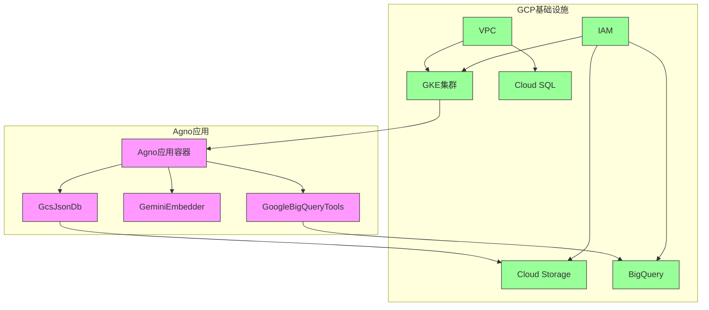
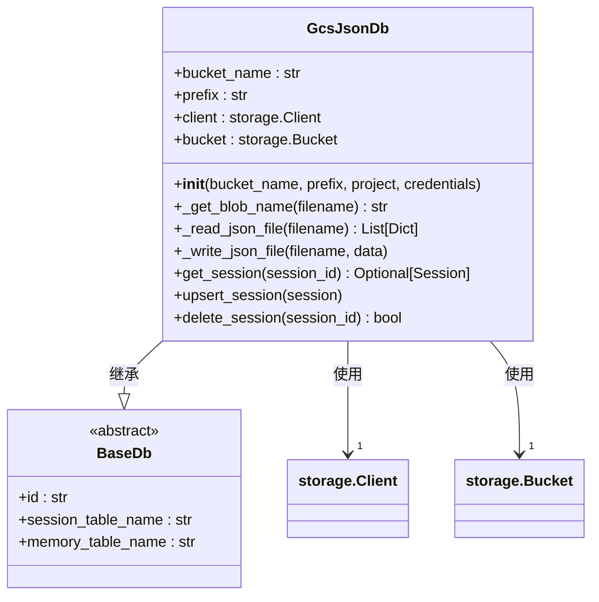
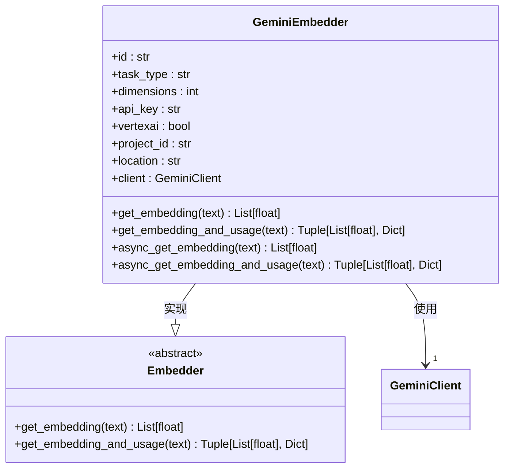
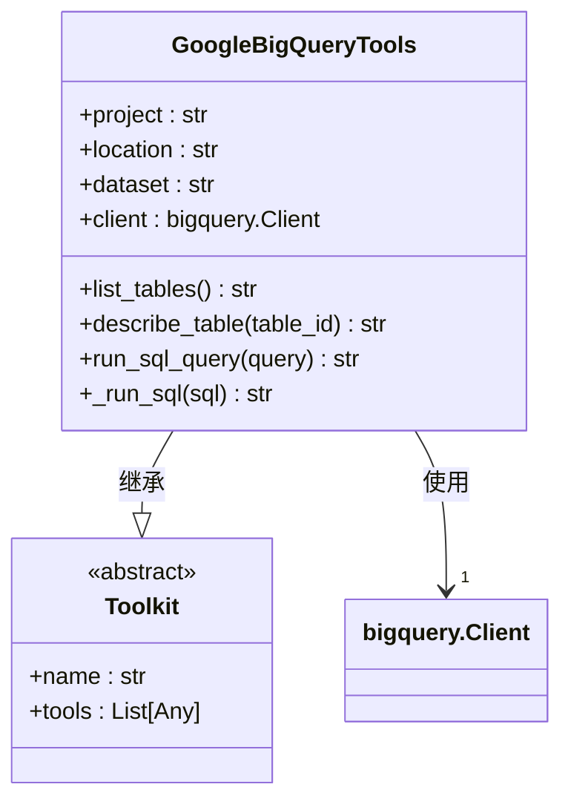
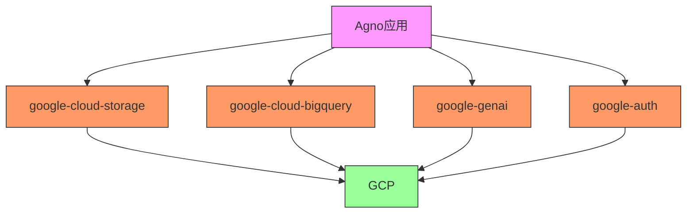

# GCP部署

<cite>
**本文档中引用的文件**
- [gcs_json_db.py](file://libs/agno/agno/db/gcs_json/gcs_json_db.py)
- [google.py](file://libs/agno/agno/knowledge/embedder/google.py)
- [google_bigquery.py](file://libs/agno/agno/tools/google_bigquery.py)
- [gcs_json_for_agent.py](file://cookbook/db/gcs/gcs_json_for_agent.py)
- [README.md](file://libs/agno_infra/README.md)
</cite>

## 目录
1. [简介](#简介)
2. [项目结构](#项目结构)
3. [核心组件](#核心组件)
4. [架构概述](#架构概述)
5. [详细组件分析](#详细组件分析)
6. [依赖分析](#依赖分析)
7. [性能考虑](#性能考虑)
8. [故障排除指南](#故障排除指南)
9. [结论](#结论)
10. [附录](#附录)（如有必要）

## 简介
本文档提供了在Google Cloud Platform (GCP) 上部署Agno应用的详细指南。文档重点介绍如何使用`libs/agno_infra`中的基础设施定义来自动化部署Agno应用。虽然当前的`agno_infra`框架主要支持AWS和Docker部署，但项目中包含了与GCP服务集成的关键组件，特别是Google Cloud Storage (GCS)、Google BigQuery和Google Gemini等服务。本文将指导您如何利用这些组件在GCP上构建和部署Agno应用。

## 项目结构
Agno项目的结构清晰地分离了应用逻辑和基础设施定义。`libs/agno_infra`目录包含了基础设施即代码(IaC)的实现，支持通过CLI进行部署管理。`libs/agno`目录包含了核心应用逻辑，其中包含了与GCP服务集成的模块。`cookbook`目录提供了丰富的使用示例。

**Diagram sources**
- [README.md](file://libs/agno_infra/README.md)

**Section sources**
- [README.md](file://libs/agno_infra/README.md)

## 核心组件
Agno在GCP上的部署核心在于其与GCP服务的集成能力。主要组件包括：
- **GcsJsonDb**: 用于将Google Cloud Storage作为持久化存储后端
- **GeminiEmbedder**: 用于与Google的生成式AI模型集成
- **GoogleBigQueryTools**: 用于与BigQuery数据仓库集成
- **agno_infra CLI**: 用于基础设施管理的命令行工具

这些组件共同构成了在GCP上部署和运行Agno应用的基础。

**Section sources**
- [gcs_json_db.py](file://libs/agno/agno/db/gcs_json/gcs_json_db.py)
- [google.py](file://libs/agno/agno/knowledge/embedder/google.py)
- [google_bigquery.py](file://libs/agno/agno/tools/google_bigquery.py)

## 架构概述
Agno在GCP上的部署架构采用分层设计，将应用逻辑与基础设施分离。应用层通过预定义的接口与GCP服务交互，基础设施层负责资源的创建和管理。

**Diagram sources**
- [gcs_json_db.py](file://libs/agno/agno/db/gcs_json/gcs_json_db.py)
- [google.py](file://libs/agno/agno/knowledge/embedder/google.py)
- [google_bigquery.py](file://libs/agno/agno/tools/google_bigquery.py)

## 详细组件分析

### GCS JSON数据库分析
GcsJsonDb组件提供了将Google Cloud Storage用作数据库的功能，通过JSON文件存储会话、记忆和其他数据。

**Diagram sources**
- [gcs_json_db.py](file://libs/agno/agno/db/gcs_json/gcs_json_db.py)

**Section sources**
- [gcs_json_db.py](file://libs/agno/agno/db/gcs_json/gcs_json_db.py)

### Google AI集成分析
GeminiEmbedder组件提供了与Google的生成式AI模型集成的能力，支持文本嵌入和向量生成。

**Diagram sources**
- [google.py](file://libs/agno/agno/knowledge/embedder/google.py)

**Section sources**
- [google.py](file://libs/agno/agno/knowledge/embedder/google.py)

### BigQuery工具分析
GoogleBigQueryTools组件提供了与BigQuery数据仓库集成的能力，支持查询和数据分析。

**Diagram sources**
- [google_bigquery.py](file://libs/agno/agno/tools/google_bigquery.py)

**Section sources**
- [google_bigquery.py](file://libs/agno/agno/tools/google_bigquery.py)

## 依赖分析
Agno与GCP服务的集成依赖于多个Python包和GCP服务。主要依赖关系如下：

**Diagram sources**
- [gcs_json_db.py](file://libs/agno/agno/db/gcs_json/gcs_json_db.py)
- [google.py](file://libs/agno/agno/knowledge/embedder/google.py)
- [google_bigquery.py](file://libs/agno/agno/tools/google_bigquery.py)

**Section sources**
- [gcs_json_db.py](file://libs/agno/agno/db/gcs_json/gcs_json_db.py)
- [google.py](file://libs/agno/agno/knowledge/embedder/google.py)
- [google_bigquery.py](file://libs/agno/agno/tools/google_bigquery.py)

## 性能考虑
在GCP上部署Agno应用时，需要考虑以下性能因素：
- **存储性能**: GCS的读写性能受网络延迟和请求频率影响，建议使用适当的缓存策略
- **计算性能**: Gemini API的响应时间受模型大小和输入长度影响，需要合理设置超时
- **数据传输**: 大量数据在GCP服务间传输会产生网络费用和延迟
- **并发处理**: 需要根据应用负载合理配置GKE集群的节点数量和Pod副本数

## 故障排除指南
在部署和运行Agno应用时可能遇到的常见问题及解决方案：

**Section sources**
- [gcs_json_db.py](file://libs/agno/agno/db/gcs_json/gcs_json_db.py)
- [google.py](file://libs/agno/agno/knowledge/embedder/google.py)
- [google_bigquery.py](file://libs/agno/agno/tools/google_bigquery.py)

## 结论
尽管`agno_infra`框架目前主要支持AWS和Docker部署，但Agno项目已经具备了与GCP服务深度集成的能力。通过GcsJsonDb、GeminiEmbedder和GoogleBigQueryTools等组件，可以构建在GCP上运行的Agno应用。未来可以扩展`agno_infra`框架以直接支持GCP Deployment Manager或Terraform，实现完整的GCP基础设施自动化部署。

## 附录
### GCP部署步骤概要
1. 设置GCP项目和认证
2. 创建GCS存储桶用于数据持久化
3. 配置BigQuery数据仓库（如需要）
4. 部署GKE集群
5. 配置IAM角色和权限
6. 设置VPC和防火墙规则
7. 部署Agno应用容器
8. 配置监控和日志服务